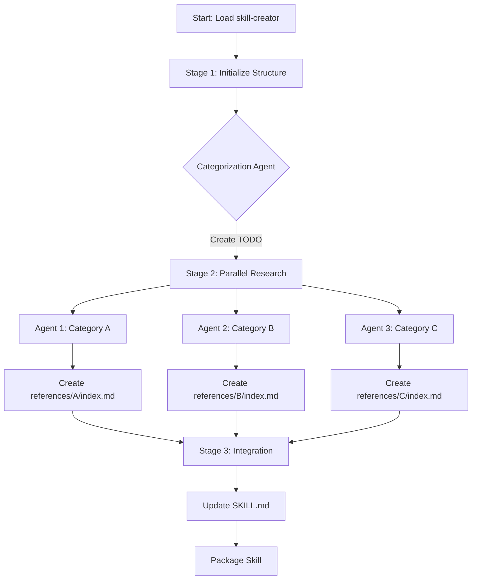

# Research Skills Process

## Overview

This document describes a systematic, scalable approach for building comprehensive Claude Code skills using parallel research agents. This process is particularly effective for skills that require extensive documentation gathering from official sources.

## Process Workflow



### Stage 1: Initialize Skill Structure

**Objective**: Create the base skill directory and identify documentation categories.

**Steps**:

1.  **Load the skill-creator skill first!**
2.  **Initialize the skill directory**:
    ```bash
    skill-creator/scripts/init_skill.py <skill-name> --path <output-directory>
    ```
3.  **Launch categorization agent**:
    - Use `@agent-technical-researcher` to explore official documentation.
    - Agent should create `{skill-name}.TODO.md` with a categorized checklist.

**Agent Prompt Template for Categorization**:

```markdown
## Identity
You are a Technical Architect specializing in knowledge base organization.

## Task Directive
Explore the official [TOOL/LIBRARY] documentation and create a comprehensive categorized list of documentation topics for building a complete knowledge base.

**Required Output**: Create a file at `./{skill-name}/{skill-name}.TODO.md` containing:
- Markdown checklist of documentation categories.
- Each category representing a major area of [TOOL/LIBRARY] functionality.

**Constraints**:
- Ensure categories are distinct and non-overlapping.
- Make each category specific enough to guide a focused research agent.

## Reference Context
**About [TOOL/LIBRARY]**: [Brief description]

**Research Sources**:
- Use Ref MCP: `mcp__Ref__ref_search_documentation` and `mcp__Ref__ref_read_url`
- Use Context7 MCP: `mcp__context7__resolve-library-id` and `mcp__context7__get-library-docs`
- Use Exa MCP: `mcp__exa__get_code_context_exa`

**Strategy**: Use these MCP tools concurrently alongside WebFetch for comprehensive coverage. Start by finding the official documentation, then analyze its structure to identify logical categories.
```

### Stage 2: Parallel Category Research

**Objective**: Launch concurrent research agents, one per category, to build comprehensive reference documentation.

**Steps**:

1.  **Read the TODO categories** from `{skill-name}.TODO.md`.
2.  **Launch concurrent researcher agents** (one per category).
3.  **Provide each agent with**:
    - Instruction to activate skill-creator skill first.
    - Instruction to read `./CLAUDE.md`.
    - Assigned category and output directory: `./{skill-name}/references/{category}/`.

**Agent Prompt Template for Category Research**:

```markdown
## Identity
You are a Technical Researcher responsible for documenting [CATEGORY NAME] of [TOOL/LIBRARY].

## Pre-Task Requirements
1. Activate skill-creator: `Skill(command: "example-skills:skill-creator")`
2. Read `./CLAUDE.md` for local development guidelines.

## Task Directive
Research and document the **[CATEGORY NAME]** aspect of [TOOL/LIBRARY] for the {skill-name} skill.

**Output Requirements**:
1. Create files in: `./{skill-name}/references/{category}/`
2. Create `index.md` (lowercase) in that directory.
   **Reason**: Ensures consistent navigation structure across all categories.
   - Include overview and markdown links to all reference files.
   - Use `./` relative path syntax: `[Description](./filename.md)`.
3. Create detailed reference files (`.md`) covering all topics.

**Success Criteria**:
- All topics in the assigned category are documented.
- `index.md` contains working links to all created files.
- Reference files are comprehensive and authoritative.

## Reference Context
**Category Topics**: [List specific topics]

**Research Sources**:
- Use Ref MCP, Context7 MCP, Exa MCP, and WebFetch concurrently.
- Focus on authoritative, official documentation.
```

### Stage 3: Integration

**Objective**: Update the `./{skill-name}/SKILL.md` with links to category indexes and finalize metadata.

**Steps**:

1.  **Update `./{skill-name}/SKILL.md`**:
    - Add links to each category's `index.md` using `./references/{category}/index.md` syntax.
2.  **Verify structure**:
    - Check all markdown links use `./` relative paths.
    - Validate progressive disclosure - follow the guidence in the enabled skill called `skill-creator` by Anthropic.

## Key Principles

### Progressive Disclosure

- {skill-name}/SKILL.md: Metadata + workflow guidance (~5k words max).
- {skill-name}/references/\*\*: Detailed documentation (unlimited).
- **Reason**: Keeps the main context window clean while allowing deep dives when needed.

### Parallel Execution

- Launch multiple research agents concurrently.
- **Reason**: Significantly reduces total research time by parallelizing independent tasks.

### Proper Context Loading

- All agents must activate skill-creator skill and read `./CLAUDE.md`.
- **Reason**: Ensures consistent patterns and tool access across all generated content.

### Link Conventions

- Use: `[Category Name](./references/{category}/index.md) - Category Description about what can be found at this document`
- **Reason**: Relative paths ensure portability and correct linking in the final package.

## MCP Tool Usage

Use the right tool for the right level of fidelity.

| Tool         | Purpose                | Fidelity          | Use When...                                                                                                                     |
| :----------- | :--------------------- | :---------------- | :------------------------------------------------------------------------------------------------------------------------------ |
| **WebFetch** | **Scoping & Overview** | Low (Summarized)  | You need to know _what_ something is or get a high-level summary of a page. **NEVER** use for technical implementation details. |
| **Exa**      | **Content Extraction** | Medium (Markdown) | You need to read documentation, see code snippets, or extract specific content from a page.                                     |
| **Ref**      | **Deep Reading**       | High (Detailed)   | You need authoritative, verbatim documentation or deep technical specs.                                                         |

**Critical Rule**: If you need to see _how_ something works, file structures, or specific code comments, you **MUST** use `Exa` or `Ref`. `WebFetch` will hallucinate or omit these details.

## Agent Type Selection

| Agent Type                        | Best For                              | Strengths                           |
| :-------------------------------- | :------------------------------------ | :---------------------------------- |
| `@agent-comprehensive-researcher` | Official docs, multi-source research  | Verification, balanced perspectives |
| `@agent-technical-researcher`     | Implementation details, code analysis | Repository analysis, code examples  |
| `@agent-github-project-manager`   | Repository exploration, examples      | Issue analysis, community plugins   |

## Success Checklist

Before finalizing the skill, verify:

- [ ] **Skill Activation**: Research agents activated `skill-creator`.
- [ ] **Local Guidelines**: Agents read `./CLAUDE.md`.
- [ ] **Relative Paths**: All links use `./` prefix (e.g., `./file.md`).
- [ ] **Distinct Categories**: No overlap between research areas.
- [ ] **Lean SKILL.md**: Details are moved to `references/`.
- [ ] **Diverse Sources**: Used Ref, Context7, and Exa MCPs alongside WebFetch.
- [ ] **Correct Indexing**: Category navigation files are named `index.md` (lowercase).
- [ ] **Link Verification**: All `index.md` files contain working links.

## Workflow Summary

1.  `init_skill.py` → Create base structure.
2.  Launch categorization agent → Create `{skill-name}.TODO.md`.
3.  Launch parallel research agents → Populate `references/{category}/`.
4.  Update `SKILL.md` → Add category index links.
5.  `package_skill.py` → Validate and package.
