# **:material-robot-industrial-outline: DAIV** : Async SWE's Agent

Software engineers spend countless hours on repetitive tasks: responding to code reviews, fixing broken builds, and manually implementing feature requests. DAIV changes this by bringing async SWE AI agents directly to their existing Git workflow. It's like having a pair programming assistant directly in your Platform.

**DAIV is an open-source async SWE AI Agent that automates development tasks.** It integrates with your repositories to handle routine work, letting you focus on creative problem-solving.

## 🎯 What DAIV Does

DAIV automates three key software engineering activities:

- 🚀 **Issue Resolution** - Converts issue descriptions into working code automatically
- 🔄 **Code Review Response** - Addresses reviewer feedback and updates merge requests
- 🔍 **Pipeline Repair** - Repairs CI/CD failures and applies fixes after human approval

---

## 🛠️ How DAIV Works

**DAIV integrates directly with Git platforms using webhooks.** No separate interface required. You continue using your existing workflow while DAIV handles automation in the background.

### Workflow Overview

DAIV responds to repository events with specialized workflows for each feature (Issue Addressor, Code Review Response, Slash Commands):

```mermaid
graph TD
    A["🔔 Git Platform Webhooks<br/>(GitLab / GitHub)"] --> B["🤖 DAIV"]

    B --> C["📝 Issue Created/Updated<br/>(title: 'DAIV: ...')"]
    B --> D["💬 Comment on Issue/MR/PR<br/>(review feedback or @daiv command)"]
    B --> F["📤 Code Push<br/>(repository updates)"]

    C --> G["🚀 Issue Addressor<br/>Plan → Confirm → Execute"]
    D --> H["🔍 Comment Analysis"]
    F --> J["🗂️ Clear cache"]

    H --> K["💬 Code Review Response<br/>(changes or answers)"]
    H --> L["⚡ Slash Command<br/>(help, clone commands)"]

    G --> M["📤 Creates Merge/Pull Request"]
    K --> N["📝 Updates Code or Replies"]
    L --> P["💬 Execute command and Response"]

    style A fill:#e3f2fd
    style G fill:#e8f5e8
    style K fill:#fff3e0
    style L fill:#f3e5f5
```

## 🔌 Supported Platforms

DAIV integrates with major Git platforms to automate your development workflow:

- [:simple-gitlab: **GitLab**](https://gitlab.com) - Full feature support (GitLab.com and self-hosted)
- [:simple-github: **GitHub**](https://github.com) - Full feature support (GitHub.com and GitHub Enterprise)

Both platforms support all core features including Issue Addressing, Code Review Response, and Slash Commands.

---

## ⏭️ Get Started

### **Step 1: Installation**
- **[Set up DAIV](getting-started/up-and-running.md)** - Install and configure DAIV in your environment
- **[Connect your repository](getting-started/configuration.md)** - Link DAIV to your GitLab or GitHub repository

### **Step 2: Try DAIV**
- **Create a test issue** - Write "Add a hello world function" and watch DAIV generate a plan
- **Approve the plan** - Reply to the plan comment with `@daiv proceed` to see DAIV create a pull request with working code

### **Step 3: Customize**
- **[Configure agents](ai-agents/overview.md)** - Adjust how DAIV's AI agents behave for your codebase
- **[Advanced settings](configuration/yaml-config.md)** - Fine-tune DAIV for your team's needs

### **Step 4: Learn More**
- **[Join discussions](https://github.com/srtab/daiv/discussions)** - Ask questions and share experiences
- **[Report bugs](https://github.com/srtab/daiv/issues)** - Help improve DAIV

---

## 💡 Quick Example

Here's what a typical DAIV interaction looks like:

1. **Developer creates issue:** "Add rate limiting to the API endpoints"
2. **DAIV generates plan:** Analyzes codebase and posts detailed implementation steps
3. **Developer approves:** Comments "@daiv proceed"
4. **DAIV implements:** Creates merge request with rate limiting code, tests, and documentation
5. **Reviewer requests changes:** "@daiv use Redis instead of in-memory storage"
6. **DAIV updates code:** Automatically modifies the implementation to use Redis

**Result:** Feature implemented in minutes, not hours.
