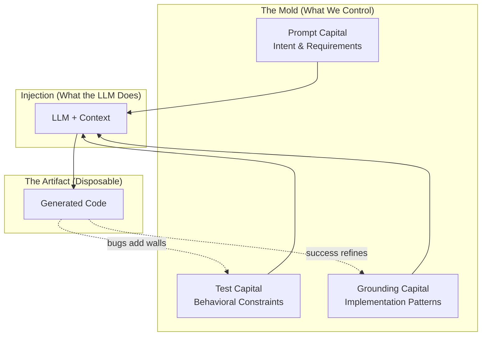

# Prompt‑Driven Development Doctrine

A concise set of principles for building and maintaining software where prompts are the primary artifact, regeneration is the default, and synchronization across code, examples, and tests is non‑negotiable.

## Why This Doctrine
- **Maintenance reality:** 80–90% of cost is post‑creation. Patching accretes complexity; regeneration preserves integrity.
- **Intent over implementation:** Prompts capture the "why"; code captures one "how." We version the former and regenerate the latter.
- **Batch leverage:** Modern LLMs and batch economics make full‑module regeneration practical, reliable, and cost‑effective.

## The Mold Paradigm

To understand why PDD represents a fundamental shift—not just a new tool—consider an analogy from manufacturing: the transition from wood carving to injection molding.

### The Economic Inversion

**The Wood Era (Hand‑Written Code)**

In the pre‑industrial era, craftsmen worked directly with wood:
- Materials were relatively cheap; labor was expensive
- Each piece was hand‑carved, unique
- Modifications meant carefully chipping away at existing work
- The artifact accumulated the history of every cut
- Skill resided in the craftsman's hands
- Value lived in the object itself

This mirrors traditional software development:
- Compute is cheap; developer time is expensive
- Each codebase is hand‑written, unique
- Bug fixes mean surgically editing existing lines
- Code accumulates layers of patches, workarounds, "temporary" fixes
- Skill is measured by navigating legacy complexity
- Value is perceived to live in the code

**The Plastic Era (Generated Code)**

When injection molding emerged, it didn't just make production "faster." It triggered a **value migration**:
- Tooling (molds) became expensive upfront
- Per‑unit cost approached zero
- The object became disposable—you could produce infinite identical copies
- Modifications meant changing the mold, not the object
- Skill shifted to mold design
- Value migrated to the mold (the specification)

This mirrors PDD:
- Prompt and test design requires thought (the "expensive" part)
- Each regeneration costs nearly nothing
- Code is disposable—regenerate at will
- Modifications mean changing the prompt, not the code
- Skill shifts to specification design
- Value lives in the prompt and tests

*Note: "Cheap generation" doesn't mean "no effort." Good prompts, comprehensive tests, and careful verification all require work. PDD shifts **where** effort is invested (specification and constraints) rather than **whether** effort is required.*

**The Key Insight**

When plastic emerged, early adopters made a category error: "Now we can make cheaper wood‑like things!" They focused on the output rather than recognizing the paradigm shift.

Similarly, many view AI coding tools as "faster typing"—using LLMs to patch code, treating prompts as ephemeral instructions. They're making "cheaper wood."

The real insight: **value has migrated from the artifact to the specification**. The prompt + tests are the mold; code is just what comes out.

### The Three Capitals

PDD success depends on three types of accumulated "capital," each playing a distinct role:

**1. Test Capital: The Mold Walls**

Tests define the **negative space**—what the generated code *cannot* violate:

```
┌─────────────────────────────────────────────────────────────┐
│                        THE MOLD                             │
│  ┌───────────────────────────────────────────────────────┐  │
│  │ TEST: null input returns None                         │  │ ← wall
│  ├───────────────────────────────────────────────────────┤  │
│  │ TEST: empty string returns ""                         │  │ ← wall
│  ├───────────────────────────────────────────────────────┤  │
│  │ TEST: handles unicode correctly                       │  │ ← wall
│  ├───────────────────────────────────────────────────────┤  │
│  │                                                       │  │
│  │            [space where code is generated]            │  │
│  │                                                       │  │
│  ├───────────────────────────────────────────────────────┤  │
│  │ TEST: performance < 100ms for 10k items               │  │ ← wall
│  └───────────────────────────────────────────────────────┘  │
└─────────────────────────────────────────────────────────────┘
```

Each test is a wall. Each bug discovered adds a wall. The more walls, the more constrained the shape, the more consistent regenerations become. This connects to the principle of **Test Accumulation**.

**The Precision Trade‑off: 3D Printing vs Injection Molding**

Consider two manufacturing approaches:

| Approach | How It Works | Precision Required |
|----------|--------------|-------------------|
| **3D Printing** | Deposits material precisely, layer by layer, with no mold | Extremely high—every point must be specified |
| **Injection Molding** | Injects material into a pre‑existing mold | Lower—material flows until it hits walls |

This maps directly to PDD:

| PDD Scenario | Equivalent | Prompt Precision Needed |
|--------------|------------|------------------------|
| Few tests | 3D printing | High—prompt must specify every behavior |
| Many tests | Injection molding | Lower—tests constrain the output |

The inverse relationship is fundamental: **as test coverage increases, prompt precision requirements decrease**. Each test you add is a wall the generated code cannot violate. With enough walls, the prompt only needs to specify intent—the tests handle the rest.

This is why test accumulation matters: it's not just about catching regressions, it's about making prompts simpler and regeneration more reliable over time.

> More tests, less prompt. The mold does the precision work.

**2. Prompt Capital: The Injection Point**

The prompt directs **what fills the mold**—the intent, contracts, and requirements:

```python
# The prompt doesn't define the shape (tests do that)
# It defines WHAT you're asking for and WHY

"Create a function that parses user IDs..."
"Must handle untrusted input..."
"Return None on failure, never throw..."
```

The prompt is the injection specification—not the mold walls, but instructions for what gets injected and how. It answers "what do we want?" while tests answer "what must it satisfy?"

**3. Grounding Capital: Material Science**

Grounding determines the **properties of the "material"** being injected:

```
Same prompt + different grounding = different implementation patterns

Grounding from OOP module    → generates classes
Grounding from functional    → generates pure functions
Grounding from your success  → matches your established style
```

Just as plastic manufacturers must understand their material's properties, PDD practitioners benefit from understanding how grounding shapes generation.

**How They Work Together**



### Tests as Specification, Not Just Verification

This represents a subtle but profound shift in how tests function:

**Old Paradigm: Tests Verify**
```
Developer writes code
        ↓
Tests check if code works
        ↓
(Tests are after‑the‑fact QC)
```

Tests ask: "Did you build it right?"

**PDD Paradigm: Tests Specify**
```
Tests exist (the mold walls)
        ↓
Code is generated to pass them
        ↓
(Tests are before‑the‑fact constraints)
```

Tests tell the LLM: "Here are walls you must not cross."

When you run `pdd generate` after adding a test, the LLM sees that test as context. The generated code is **constrained to pass it**—the test acts as a specification, not just a verification.

**Building on TDD's Foundation**

This insight isn't new—TDD practitioners have understood "tests as specification" for decades. What's new is that **generation makes specification‑first practical at scale**.

TDD required discipline: write the test first, resist the urge to jump into implementation. Many developers found this unnatural. PDD inverts the pressure: you *can't* jump into implementation because you're not writing the code—the LLM is. Writing tests first becomes the natural workflow because tests are how you constrain what gets generated.

If you're already a TDD practitioner, PDD is a natural evolution. Your test‑first instincts become your primary tool for shaping generated output.

### The Compound Interest of Molds

Here's where the economics become compelling:

**In Manufacturing**

| Investment | Returns |
|------------|---------|
| Design mold once | Produce millions of units |
| Refine mold after defect | ALL future units improve |
| Parameterize mold | Variants at near‑zero cost |

The mold has **compound returns**. Each improvement multiplies across all future production.

**In PDD**

| Investment | Returns |
|------------|---------|
| Write tests once | Constrain all future generations |
| Add test for bug | Bug can NEVER recur |
| Improve prompt | ALL future regenerations improve |
| Grounding accumulates | Similar modules benefit automatically |

**Contrast with Patching**

| Approach | Returns on Bug Fix |
|----------|-------------------|
| **Patch** | Fixes ONE instance; similar bugs can recur elsewhere |
| **Mold refinement** | Adds permanent wall; bug is impossible in all future generations |

The patch has no compound returns. The test (mold wall) has infinite compound returns. This is why the **Market Effects Matter** principle states that examples and patterns compound.

**The Ratchet Effect**

Each bug discovered → test added → wall becomes permanent → mold is more precise → regeneration is safer → more bugs found → more walls added...

The system gets **more constrained over time**, not less. Unlike patched codebases that accumulate complexity, PDD codebases accumulate *constraints* while the code itself stays clean (because it's regenerated fresh each time).

### Bug Workflow as Mold Refinement

In manufacturing, when a molded part has a flaw:
1. You don't hand‑fix each defective unit
2. You **refine the mold**
3. All future units are correct

The PDD bug workflow mirrors this exactly:

**Mold Refinement Workflow (PDD)**
```
Bug discovered
      ↓
Add failing test (add mold wall)
      ↓
Regenerate (re‑inject)
      ↓
New code conforms to refined mold
      ↓
Bug can NEVER recur (wall is permanent)
```

**Compare to Patch Workflow**
```
Bug discovered
      ↓
Hand‑carve fix into code
      ↓
Hope you carved correctly
      ↓
Hope you didn't weaken the structure
      ↓
Similar bug appears elsewhere (code has no memory)
```

### The Skill Evolution

The wood‑to‑plastic transition didn't eliminate craftsmen—it elevated their role. Mold designers needed *deeper* understanding of materials and physics than woodcarvers. PDD represents a similar elevation.

**For Developers: Same Skills, Higher Abstraction**

| Core Skill | Traditional Application | PDD Application |
|------------|------------------------|-----------------|
| Understanding code | Writing implementations | Designing tests that constrain generation |
| Debugging | Line‑by‑line tracing | Verifying generated output, refining prompts |
| Refactoring | Manual code restructuring | Prompt refinement, test reorganization |
| System thinking | Architecture design | Specification architecture, dependency mapping |
| Edge case awareness | Writing defensive code | Writing comprehensive test cases |

Your existing skills aren't declining—they're being applied at a higher level of abstraction. Instead of *writing* the defensive code, you *specify* what defensive behavior looks like (via tests). Instead of *implementing* the architecture, you *describe* the contracts and constraints.

The shift: **From implementation craft to specification craft.**

**For New Users: The Mental Model**

If you're new to PDD, the key shift is:
- You're not writing code—you're designing molds
- Quality comes from the mold, not the operator
- A junior developer with a good prompt produces the same code as a senior
- Your job is to make the mold precise enough that regeneration is reliable

**For Decision Makers: The Economics**

| Traditional | PDD |
|-------------|-----|
| Senior devs required for complex code | Good prompts + tests = consistent output regardless of operator |
| Knowledge siloed in individuals | Knowledge encoded in prompts and tests |
| Bug fixes don't compound | Bug fixes (tests) permanently prevent recurrence |
| Onboarding = learning the codebase | Onboarding = learning the prompts |

The ROI of prompt and test investment compounds over time. Each improvement benefits all future work.

### The Resistance Pattern

Both the wood→plastic and code→prompt transitions face similar resistance:

| Wood → Plastic | Code → Prompt |
|----------------|---------------|
| "Mass‑produced items have no soul" | "Generated code has no elegance" |
| "Can't replace the craftsman's touch" | "Can't replace developer expertise" |
| "Plastic is for toys, not furniture" | "AI is for boilerplate, not real engineering" |
| Craftsmen guilds resist | Developer culture resists |

This resistance comes from legitimate sources:
1. **Sunk cost in existing skills** — Years of expertise feel devalued
2. **Identity tied to the craft** — "I'm a coder" vs "I design specifications"
3. **Early‑stage quality issues** — Early plastic was cheap; early AI code has flaws
4. **Misunderstanding the value shift** — Focusing on artifact quality rather than specification power

The resistance fades as:
- Generation quality improves (it is improving rapidly)
- Tooling matures (grounding, test accumulation, verification)
- Success stories accumulate (teams that adopt see compounding benefits)
- The economic reality becomes undeniable

**Acknowledging Legitimate Concerns**

Not all resistance is misguided:
- Generated code does need review (that's what tests and verification are for)
- Some domains genuinely require human expertise (safety‑critical, novel algorithms)
- The transition has real costs (learning new workflows, tooling investment)

PDD doesn't claim generation is perfect—it claims that **specification + constraints + regeneration** is a better maintenance model than **accumulating patches** once generation quality crosses a threshold. For many domains, we're past that threshold.

### The Complete Analogy Map

For reference, here's the full mapping between injection molding and PDD:

| Injection Molding | PDD |
|-------------------|-----|
| Mold | Tests + Prompt |
| Mold walls | Individual test cases |
| Mold cavity | The behavioral space allowed |
| Injection point | Prompt requirements |
| Plastic material | LLM capability |
| Material formulation | Grounding (few‑shot examples) |
| Molded object | Generated code |
| Production run | `pdd generate` |
| Mold refinement | Adding tests after bugs |
| New mold | New prompt for new module |
| Parameterized mold | Prompt templating / shared preambles |
| QC inspection | `pdd verify` / `pdd test` |
| Mold library | Grounding database (cloud) |
| Discarding defective units | Regenerating instead of patching |
| Material science | Understanding how grounding affects generation |

**The Core Insight, Restated**

> In wood carving, value lives in the artifact.
> In injection molding, value lives in the mold.
> In traditional coding, value lives in the code.
> In PDD, value lives in the prompt and tests.

The prompt encodes intent. The tests preserve behavior. Regeneration sustains integrity. Together, they convert maintenance from an endless patchwork into a compounding system of leverage.

## The Context Window Advantage

Modern LLMs operate within a fixed context window—a bounded "working memory" that holds everything the model can attend to during generation. How this window is allocated fundamentally affects generation quality.

### The Agentic Overhead Problem

Interactive agentic tools (Claude Code, Cursor, etc.) must dedicate significant context to operational overhead:

| Overhead Type | Purpose | Typical Cost |
|---------------|---------|--------------|
| System prompts | Agent behavior, safety, persona | 2,000–5,000 tokens |
| Tool definitions | Bash, Read, Edit, Write, etc. | 3,000–8,000 tokens |
| MCP server configs | External integrations | 1,000–5,000 tokens |
| Chat history | Conversation continuity | Grows unbounded |
| Agentic loop instructions | Planning, reflection, error recovery | 1,000–3,000 tokens |

This overhead competes directly with developer-provided context. As the conversation progresses and history accumulates, less of the window remains for the actual task.

### Attention Degradation

LLMs exhibit measurable attention degradation as context grows:
- **"Lost in the middle"** effects where mid-context information is underweighted
- **Reduced coherence** as the model tracks more threads
- **Increased hallucination** as relevant context gets pushed further from attention

The result: **The more you use an agentic tool in a session, the less effective each subsequent generation becomes.**

### PDD: Full Context for Generation

PDD's batch architecture eliminates operational overhead entirely:

```
┌─────────────────────────────────────────────────────────────┐
│                    CONTEXT WINDOW                           │
├─────────────────────────────────────────────────────────────┤
│  AGENTIC TOOL ALLOCATION                                    │
│  ┌──────────┬──────────┬──────────┬────────────────────┐   │
│  │ System   │ Tools    │ MCP      │ Chat History       │   │
│  │ Prompts  │ Defs     │ Configs  │ (grows over time)  │   │
│  └──────────┴──────────┴──────────┴────────────────────┘   │
│  ┌─────────────────────────────────────────────────────┐   │
│  │         Developer's Actual Task (what remains)      │   │
│  └─────────────────────────────────────────────────────┘   │
├─────────────────────────────────────────────────────────────┤
│  PDD ALLOCATION                                             │
│  ┌─────────────────────────────────────────────────────┐   │
│  │                                                     │   │
│  │   Prompt  │  Grounding  │  Tests  │  Dependencies  │   │
│  │                                                     │   │
│  │            100% for Generation Task                 │   │
│  │                                                     │   │
│  └─────────────────────────────────────────────────────┘   │
└─────────────────────────────────────────────────────────────┘
```

Every token in the PDD context window serves generation:
- **Prompt**: Requirements, constraints, intent
- **Grounding**: Proven implementation patterns (few‑shot)
- **Tests**: Behavioral constraints (the mold walls)
- **Dependencies**: Interface definitions

No tokens are wasted on tool definitions, chat history, or agent orchestration.

### Why This Matters for Hard Problems

Simple tasks tolerate context inefficiency. Hard problems don't.

When tackling complex generation—intricate algorithms, multi-system integrations, nuanced business logic—you need:
- Comprehensive requirements
- Extensive grounding examples
- Thorough test constraints
- Precise interface definitions

If 30–50% of your context window is consumed by agentic overhead, these hard problems become intractable. PDD's full-context architecture makes them accessible.

### The Mold Metaphor Extended

In injection molding, the press applies its full force to the material—none is wasted operating the machine. The machine's complexity exists, but it operates *outside* the molding process itself.

Similarly, PDD's batch architecture keeps operational complexity outside the context window. The model receives a clean, focused specification and produces code. The "machine" (PDD tooling, cloud grounding, test discovery) operates externally, not within the precious context.

> When every token serves your intent, generation quality scales with problem complexity rather than degrading against operational overhead.

## Core Principles
- **Prompts As Source of Truth:** Versioned prompts define behavior and constraints. Code, examples, tests, infra, and docs are generated artifacts.
- **Regenerate, Don’t Patch:** Change the prompt, then regenerate affected surfaces. Avoid local edits that drift intent from implementation.
- **Synchronization Loop:** Always back‑propagate implementation learnings to prompts. Keep prompts, code, examples, and tests in continuous sync.
- **Test Accumulation:** Never discard passing tests after regeneration. Grow a regression net that preserves behavior as the system evolves.
- **Modular Prompt Graph:** Model systems as composable prompt modules linked via minimal usage examples that act as clear interfaces.
- **Intent First:** Capture goals (e.g., “Black Friday scale,” “HIPAA”), not just resource settings. Generation maps intent → implementation.
- **Batch‑First Workflow:** Prefer deterministic, scriptable batch generation over interactive patching. Optimize for reproducibility and cost. (This also maximizes context available for generation—see "The Context Window Advantage.")
- **Sharp Knives, Safe Defaults:** Provide powerful generation flows with sensible conventions (naming, structure, tests) to prevent foot‑guns.
- **Conceptual Compression:** Consolidate requirements, rationale, and constraints inside prompts to reduce scattered context across tickets and docs.
- **Progress Over Stasis:** Evolve prompts and regenerate even if code diffs are large. Preserve behavior with tests, not line‑level inertia.
- **Market Effects Matter:** Few‑shot examples and patterns compound. Treat examples as assets that improve quality and reduce cost over time.
- **Security & Compliance Built‑In:** Express compliance and threat models in prompts; verify via tests and infra policies on every regeneration.

## The PDD Workflow (At A Glance)
- **Define:** Draft or refine the prompt and select relevant few‑shot examples (auto‑deps, marketplace).
- **Generate:** Produce code, infra, and interfaces from prompts.
- **Crash/Verify:** Resolve runtime errors, then validate functional behavior against intent.
- **Test:** Generate/augment unit and integration tests; codify non‑functional requirements where feasible.
- **Fix:** Iterate until tests pass reliably.
- **Update:** Back‑propagate learnings into prompts and parent specs; keep examples current.

## What “Good” Looks Like
- **One Truth:** A reader can understand a module’s purpose and constraints by reading the prompt and its example.
- **Reproducible:** A clean regen reproduces functionally equivalent behavior; tests confirm it.
- **Small Surfaces:** Prompts are scoped, examples are minimal, interfaces are explicit.
- **Traceable:** Each fix yields a prompt update with rationale captured concisely.
- **Deterministic Enough:** Batch runs are stable; variance is constrained by prompts, examples, and tests.

## Anti‑Patterns
- **Prompt Drift:** Fixing code without updating prompts or tests.
- **Spec Sprawl:** Requirements scattered across chats, tickets, and READMEs instead of consolidated in prompts.
- **Interactive Dependence:** Relying on chat patches for structural changes that should be regenerated.
- **Test Reset:** Throwing away prior tests after regeneration.
- **Mega‑Prompts:** Unbounded prompts that do too much; prefer split and composition.

## Doctrine → Practice (This Repo)
- **Structure:**
  - Frontend in `frontend/` (Next.js App Router, TypeScript)
  - Backend in `backend/functions/` (Python 3.12, Firebase Functions)
  - Next.js hosting function in `nextjs-server-function/`
  - Prompts, seeds, and context in `prompts/` and `context/`
- **Conventions:**
  - TypeScript: 2‑space indent, Prettier single quotes/trailing commas; components in `src/components/` (PascalCase); `@/*` alias.
  - Python: 4‑space indent, snake_case modules, explicit imports; business logic under `models/` and `utils/`.
- **Commands:**
  - Setup: `make setup`
  - Dev: `make dev` (or `make run-backend` and `cd frontend && npm run dev`)
  - Tests: `make test`, `make test-backend`, `make test-frontend`
  - Lint/format: `cd frontend && npm run lint && npm run format`
- **Testing:**
  - Backend: `backend/tests/test_*.py` with pytest; preserve and expand coverage when regenerating backend modules.
  - Frontend: Jest/Vitest colocated tests; keep server/client boundaries explicit and tested.
- **Security & Config:**
  - No secrets in git. Frontend vars in `frontend/.env.local` (`NEXT_PUBLIC_*` to expose). Backend secrets in GSM; local in `backend/functions/.env`.
- **Regeneration Discipline:**
  - Update prompts in `prompts/` first; run batch generation; fix; then `update` prompts with learnings.
  - Treat examples as interfaces; keep them runnable and minimal.

## Authoring Prompts
- **Be Declarative:** State goals, constraints, and non‑functional requirements explicitly.
- **State Interfaces:** Describe inputs/outputs and example usage; keep examples short but executable.
- **Context Wisely:** Include only relevant examples; prefer curated few‑shot over dumping repos.
- **Encode Policies:** Compliance, security, performance SLOs belong in prompts and tests.
- **Version Clearly:** Commit prompt changes with rationale (“why” first), link to affected modules/tests.

## Working With Examples & Patterns
- **Examples As Interfaces:** Each module has a minimal example that compiles/runs and demonstrates intended use.
- **Pattern Reuse:** Prefer proven few‑shot examples from our library/marketplace over ad‑hoc hand‑holding.
- **Auto‑Submit:** Where applicable, allow successful examples to contribute back to the pattern library.

## Quality Bar
- **Functional Equivalence Over Textual Diff:** Large diffs are acceptable; unchanged behavior is required.
- **Green Tests Before Merge:** Regenerated code must pass existing tests plus any new ones.
- **Observability:** Add logging/metrics via prompts; verify with smoke tests.
- **Docs From Prompts:** Public‑facing docs are generated from the same sources of truth.

## Governance & Collaboration
- **PR Discipline:** Summarize prompt changes, regeneration scope, and test deltas. Attach screenshots for UI, note emulator/config changes.
- **Review Mindset:** Review prompts and examples first, then generated code for unsafe or leaky abstractions.
- **Rollbacks:** Prefer regenerating from the prior prompt version over reverting code patches.

## When To Patch
- **Local, Low‑Risk Hotfixes:** Trivial typos, comments, and non‑behavioral changes may be patched directly—but follow with an `update` to keep prompts in sync.
- **Everything Else:** Regenerate.

## North Star
Prompts encode intent. Tests preserve behavior. Regeneration sustains integrity. Together, they convert maintenance from an endless patchwork into a compounding system of leverage.

