# Refresh Token Flow Template

OAuth 2.0 Refresh Token Grant for obtaining new access tokens without user interaction.

## When to Use
- Access token has expired
- Extending session without re-authentication
- Background token renewal
- Any scenario requiring long-lived access

## Mermaid Template

```mermaid
%%{init: {'theme': 'base', 'themeVariables': {
  'actorBkg': '#ddd6fe',
  'actorTextColor': '#1f2937',
  'actorBorder': '#6d28d9',
  'signalColor': '#334155',
  'signalTextColor': '#1f2937',
  'noteBkgColor': '#f8fafc',
  'noteTextColor': '#1f2937',
  'noteBorderColor': '#334155'
}}}%%
sequenceDiagram
    autonumber

    box rgba(221,214,254,0.3) CLIENT APPLICATION
        participant A as 🖥️ Application
    end

    box rgba(167,243,208,0.3) SALESFORCE
        participant SF as ☁️ Salesforce<br/>Authorization Server
        participant API as 📊 Salesforce<br/>REST API
    end

    Note over A,API: Refresh Token Flow (RFC 6749 Section 6)

    A->>API: 1. API Request with Access Token
    Note over A,API: Authorization: Bearer ACCESS_TOKEN

    API->>A: 2. 401 Unauthorized
    Note over API,A: {<br/>  "errorCode": "INVALID_SESSION_ID",<br/>  "message": "Session expired"<br/>}

    A->>A: 3. Detect Token Expiration

    A->>SF: 4. POST /services/oauth2/token
    Note over A,SF: grant_type=refresh_token<br/>client_id=CONSUMER_KEY<br/>client_secret=CONSUMER_SECRET<br/>refresh_token=REFRESH_TOKEN

    SF->>SF: 5. Validate Refresh Token
    Note over SF: • Token not revoked<br/>• Client matches original<br/>• Scopes still valid

    SF->>SF: 6. Generate New Access Token
    Note over SF: May also rotate<br/>refresh token

    SF->>A: 7. Return New Tokens
    Note over SF,A: {<br/>  "access_token": "NEW_TOKEN...",<br/>  "refresh_token": "ROTATED...",<br/>  "instance_url": "https://...",<br/>  "token_type": "Bearer",<br/>  "issued_at": "..."<br/>}

    A->>A: 8. Update Stored Tokens
    Note over A: Replace old tokens<br/>with new ones

    A->>API: 9. Retry API Request
    Note over A,API: Authorization: Bearer NEW_ACCESS_TOKEN

    API->>A: 10. ✅ Successful Response
```



## ASCII Fallback Template

```
┌───────────────────────┐     ┌────────────────────┐
│     Application       │     │     Salesforce     │
│   (stored tokens)     │     │   (Auth Server)    │
└───────────┬───────────┘     └─────────┬──────────┘
            │                           │
            │  1. API Request           │
            │     (old access_token)    │
            │──────────────────────────>│
            │                           │
            │  2. 401 Unauthorized      │
            │     (session expired)     │
            │<──────────────────────────│
            │                           │
            │  3. POST /token           │
            │     grant_type=           │
            │       refresh_token       │
            │     refresh_token=XXX     │
            │──────────────────────────>│
            │                           │
            │           4. Validate     │
            │              refresh token│
            │                           │
            │           5. Generate new │
            │              access token │
            │                           │
            │  6. New Tokens            │
            │     - access_token (new)  │
            │     - refresh_token       │
            │       (possibly rotated)  │
            │<──────────────────────────│
            │                           │
            │  7. Retry API Request     │
            │     (new access_token)    │
            │──────────────────────────>│
            │                           │
            │  8. Success ✅            │
            │<──────────────────────────│
```

## Token Request

```bash
curl -X POST https://login.salesforce.com/services/oauth2/token \
  -d "grant_type=refresh_token" \
  -d "client_id=YOUR_CONSUMER_KEY" \
  -d "client_secret=YOUR_CONSUMER_SECRET" \
  -d "refresh_token=YOUR_REFRESH_TOKEN"
```

## Response Example

```json
{
  "access_token": "00D5g000001ABC...!ARcAQNlBrLGj...",
  "refresh_token": "5Aep8617...",
  "instance_url": "https://mycompany.my.salesforce.com",
  "token_type": "Bearer",
  "issued_at": "1702123456789",
  "signature": "..."
}
```

## Code Example with Auto-Refresh

```python
import requests
from functools import wraps

class SalesforceClient:
    def __init__(self, client_id, client_secret, tokens):
        self.client_id = client_id
        self.client_secret = client_secret
        self.access_token = tokens['access_token']
        self.refresh_token = tokens['refresh_token']
        self.instance_url = tokens['instance_url']

    def refresh_access_token(self):
        """Refresh the access token using the refresh token."""
        response = requests.post(
            'https://login.salesforce.com/services/oauth2/token',
            data={
                'grant_type': 'refresh_token',
                'client_id': self.client_id,
                'client_secret': self.client_secret,
                'refresh_token': self.refresh_token
            }
        )

        if response.status_code == 200:
            tokens = response.json()
            self.access_token = tokens['access_token']
            # Handle potential refresh token rotation
            if 'refresh_token' in tokens:
                self.refresh_token = tokens['refresh_token']
            return True
        return False

    def api_request(self, endpoint, method='GET', **kwargs):
        """Make an API request with automatic token refresh."""
        url = f"{self.instance_url}/services/data/v59.0/{endpoint}"
        headers = {
            'Authorization': f'Bearer {self.access_token}',
            'Content-Type': 'application/json'
        }

        response = requests.request(method, url, headers=headers, **kwargs)

        # If token expired, refresh and retry
        if response.status_code == 401:
            if self.refresh_access_token():
                headers['Authorization'] = f'Bearer {self.access_token}'
                response = requests.request(method, url, headers=headers, **kwargs)

        return response

# Usage
client = SalesforceClient(
    client_id='YOUR_CONSUMER_KEY',
    client_secret='YOUR_CONSUMER_SECRET',
    tokens={
        'access_token': 'initial_access_token',
        'refresh_token': 'initial_refresh_token',
        'instance_url': 'https://mycompany.my.salesforce.com'
    }
)

# Automatic refresh on 401
response = client.api_request('sobjects/Account')
```

## Refresh Token Policies

### Connected App Settings

| Policy | Description |
|--------|-------------|
| `Refresh token is valid until revoked` | Never expires (default) |
| `Immediately expire refresh token` | Single use |
| `Expire refresh token if not used for N` | Idle timeout |
| `Expire refresh token after N` | Absolute timeout |

### Token Rotation

When configured, Salesforce may return a **new refresh token** with each refresh. Always check for and store the new refresh token:

```python
if 'refresh_token' in response:
    # New refresh token issued - old one is now invalid!
    stored_refresh_token = response['refresh_token']
```

## Error Responses

| Error | Cause | Solution |
|-------|-------|----------|
| `invalid_grant` | Refresh token revoked or expired | Re-authenticate user |
| `invalid_client` | Client credentials invalid | Check client_id/secret |
| `invalid_request` | Missing required parameter | Check request format |

## Key Characteristics

| Aspect | Value |
|--------|-------|
| User Interaction | None required |
| Token Rotation | May occur (check response) |
| Best Practice | Refresh proactively before expiration |
| Storage | Securely store refresh token |

## Proactive Refresh Strategy

```python
import time
import jwt

def should_refresh_token(access_token, buffer_seconds=300):
    """Check if token should be refreshed (5 min buffer)."""
    try:
        # Decode without verification to read exp claim
        decoded = jwt.decode(access_token, options={"verify_signature": False})
        exp_time = decoded.get('exp', 0)
        return time.time() > (exp_time - buffer_seconds)
    except:
        return True  # Refresh if we can't decode

# Proactive refresh before API call
if should_refresh_token(access_token):
    refresh_access_token()
```

## Security Considerations

1. **Store refresh tokens securely** - Encrypted storage, secure keychain
2. **Handle rotation** - Always update stored refresh token
3. **Implement revocation** - Revoke tokens on logout
4. **Monitor for abuse** - Track refresh token usage patterns
5. **Use HTTPS only** - Never send tokens over HTTP

## Revoking Tokens

When user logs out, revoke the refresh token:

```bash
curl -X POST https://login.salesforce.com/services/oauth2/revoke \
  -d "token=YOUR_REFRESH_TOKEN"
```

## Customization Points

Replace these placeholders:
- `CONSUMER_KEY` → Your Connected App's Consumer Key
- `CONSUMER_SECRET` → Your Connected App's Consumer Secret
- `REFRESH_TOKEN` → The refresh token from initial authorization
