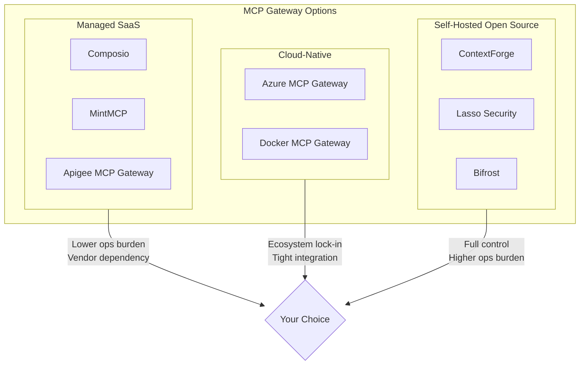
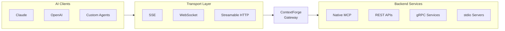
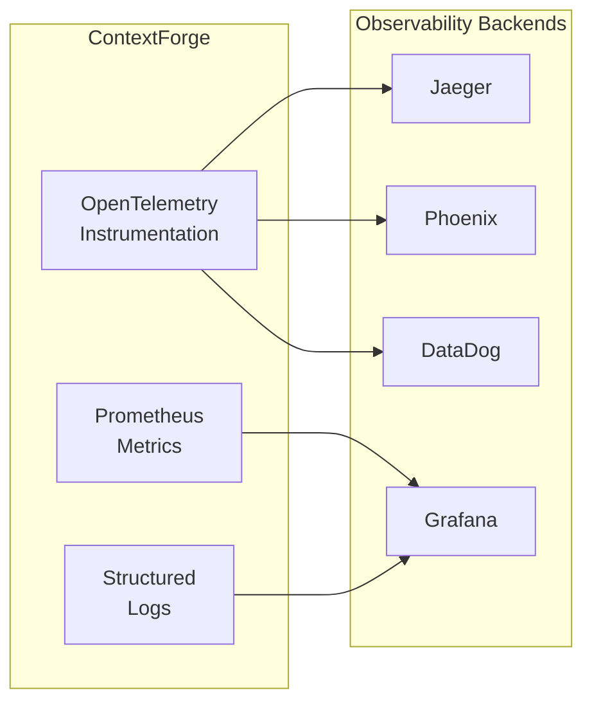
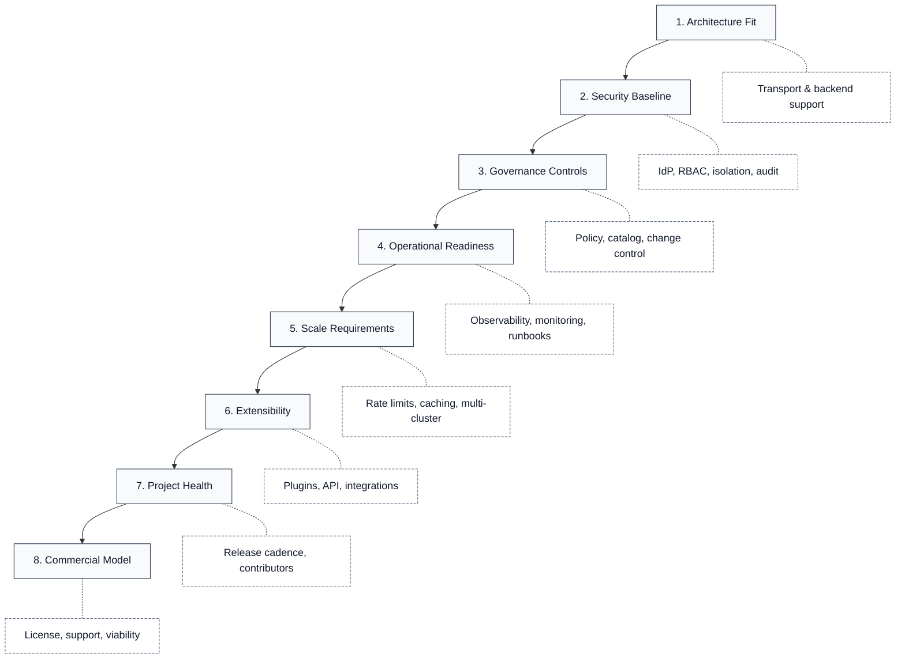

# How ContextForge Fits the Criteria for Selecting an Enterprise MCP Gateway

A practical framework for evaluating MCP gateways, and how ContextForge addresses each criterion.

---

## Why an MCP Gateway?

Organizations deploying AI agents face fragmented tool ecosystems, inconsistent security controls, and no centralized governance across agent interactions. An MCP gateway provides the unified control plane: federating tools, enforcing policy, and delivering visibility across your AI infrastructure.

This framework outlines what to evaluate and why each criterion matters.

---

## The MCP Gateway Landscape

The MCP gateway market has matured rapidly. Options range from managed SaaS platforms (Composio, MintMCP, Apigee MCP Gateway) to cloud-native solutions (Azure MCP Gateway, Docker MCP Gateway) to self-hosted open source (ContextForge, Lasso Security, Bifrost).

**Key market distinctions:**

- **Managed platforms** offer lower operational burden but introduce vendor dependency
- **Cloud-native solutions** integrate tightly with specific ecosystems (Azure, Docker)
- **Self-hosted open source** provides maximum control and customization

This framework applies regardless of which path you choose. ContextForge is used as a reference implementation to illustrate what "good" looks like for each criterion.

### About ContextForge

!!! info "Enterprise-Grade by Design"
    ContextForge was designed from the ground up for enterprise AI deployments, not retrofitted from a developer tool or proof-of-concept. Its architecture reflects lessons learned from operating AI infrastructure at scale within IBM, where it powers IBM Consulting Advantage serving 160,000+ users across regulated industries.

**Design principles:**

| Principle | Implementation |
|-----------|----------------|
| **Security-first** | Zero-trust architecture, defense-in-depth, no implicit trust between components |
| **Governance by default** | RBAC, audit trails, and policy enforcement enabled out of the box |
| **Observable** | OpenTelemetry instrumentation throughout, not bolted on afterward |
| **Scale-tested** | Rust-based HTTP server (Granian), connection pooling, multi-tier caching |
| **Air-gap ready** | No telemetry, bundled assets, runs fully disconnected |
| **Open standards** | MCP and A2A protocol compliance, no proprietary extensions |

??? note "Enterprise Validation"

    - Production-hardened through deployment in financial services, healthcare, and government contexts
    - Performance-optimized through iterative load testing (10k+ concurrent users)
    - Security-reviewed by IBM Security Research teams
    - Compliance-aligned with enterprise requirements (SOC2, HIPAA, FedRAMP patterns)

The criteria in this framework reflect what we've learned matters most when deploying MCP infrastructure at enterprise scale.

---

## Risk & Governance Models

!!! warning "Why MCP Security Differs from Traditional API Security"
    Unlike traditional protocols, MCP places LLMs at the center of execution decisions. The "continuous token stream" nature of LLM processing means untrusted input (tool responses, schema descriptions, resource content) can alter execution flow. This eliminates traditional control/data plane separation and requires fundamentally different threat modeling.

### Tiered Threat Model (CoSAI Framework)

The CoSAI OASIS framework organizes MCP threats into three tiers:

| Tier | Category | Example Threats |
|------|----------|-----------------|
| **Tier 1** | MCP-Specific | Tool poisoning, schema poisoning, typosquatting, shadow MCP servers, overreliance on LLM safety |
| **Tier 2** | MCP-Contextualized | Privilege escalation, consent fatigue, improper multitenancy, invisible agent activity |
| **Tier 3** | Conventional (Amplified) | Credential theft, replay attacks, command injection, data exfiltration, supply chain compromise |

### Agentic System Risk Categories

MCP gateways must address risk vectors across three domains: identity and access, supply chain integrity, and operational governance. Each category demands specific mitigations that traditional API gateways do not provide.

**Identity & Access Risks**

| Threat Vector | Attack Pattern | Gateway Mitigation |
|---------------|----------------|-------------------|
| Prompt Injection | Malicious instructions embedded in tool arguments or responses | Payload inspection with safety schema validation; argument sanitization |
| Credential Theft | Agents storing or leaking API keys and tokens | Zero-trust secret injection: gateway manages credentials, agents receive scoped ephemeral tokens |
| Privilege Escalation | Agents acquiring permissions beyond their scope | Task-Based Access Control (TBAC): permissions bound to specific workflows and contexts |
| Session Hijacking | Attackers intercepting agent-to-tool communication | Mutual TLS, signed requests, and session binding with proof-of-possession tokens |

**Supply Chain Risks**

| Threat Vector | Attack Pattern | Gateway Mitigation |
|---------------|----------------|-------------------|
| Tool Poisoning | Compromised tools returning malicious responses | Checksum verification, response validation, and behavioral anomaly detection |
| Tool Shadowing | Rogue tools impersonating legitimate ones | Centralized registry as single source of truth; agents discover only vetted tools |
| Dependency Confusion | Typosquatted or substituted tool packages | Package provenance verification, SBOM tracking, and namespace controls |
| Schema Manipulation | Altered tool schemas that change expected behavior | Schema pinning with cryptographic signatures and version control |

**Operational Risks**

| Threat Vector | Attack Pattern | Gateway Mitigation |
|---------------|----------------|-------------------|
| Server Sprawl | Unmanaged MCP servers proliferating across the organization | Lifecycle management with automated discovery and shadow server detection |
| Configuration Drift | Inconsistent security policies across deployments | Centralized policy enforcement with GitOps-driven configuration |
| Audit Gaps | Missing or incomplete logs of agent activities | Mandatory structured logging with correlation IDs across the execution chain |
| Quota Exhaustion | Runaway agents consuming excessive resources | Per-agent rate limiting, budget controls, and circuit breakers |

### The Triple Gate Security Pattern

Defense-in-depth architecture requiring controls at three layers:

```mermaid
flowchart LR
    subgraph gate1["Gate 1: AI Layer"]
        direction TB
        client["AI Client"]
        intent["Intent Classification"]
        filter["Prompt Filtering"]
    end

    subgraph gate2["Gate 2: MCP Layer"]
        direction TB
        gateway["MCP Gateway"]
        authz["Tool Authorization"]
        validate["Argument Validation"]
    end

    subgraph gate3["Gate 3: API Layer"]
        direction TB
        backend["Backend APIs"]
        rate["Rate Limiting"]
        mtls["mTLS / IP Allow-list"]
    end

    client --> intent --> filter
    filter --> gateway
    gateway --> authz --> validate
    validate --> backend
    backend --> rate --> mtls

```

| Gate | Layer | Focus | Controls |
|------|-------|-------|----------|
| **Gate 1** | AI Layer (Client) | Intent classification | Prompt filtering, malicious instruction prevention |
| **Gate 2** | MCP Layer (Gateway) | Tool authorization | "User A can call Tool B with Argument C" |
| **Gate 3** | API Layer (Backend) | Network security | Rate limiting, mTLS, IP allow-listing |

!!! success "ContextForge Addresses All Three Gates"

    - **Gate 1:** Guardrail plugins for content inspection before tool execution
    - **Gate 2:** Full RBAC with team/tool/server scoping and argument validation
    - **Gate 3:** Backend auth passthrough, rate limiting, and network policy support
    - **Human-in-the-Loop:** MCP elicitation pass-through for server-side user confirmation on risky actions

---

## 1. Architecture & Protocol Support

??? abstract "What to Evaluate"

    - Gateway role: proxy-only, registry, or full hosting capability
    - Transport support: HTTP, SSE, WebSocket, stdio, streamable HTTP
    - Protocol bridging: REST-to-MCP, gRPC-to-MCP translation
    - Session awareness and context propagation
    - Transport security: payload limits, mTLS, CORS/CSRF protections
    - Message integrity verification

!!! tip "Why It Matters"
    Enterprise environments have diverse backends: legacy REST APIs, gRPC services, and native MCP servers. A gateway that only proxies native MCP leaves significant integration work on the table.

**ContextForge delivers:**

- Full gateway/registry/proxy with tool hosting capabilities
- All major transports: HTTP, JSON-RPC, WebSocket, SSE, stdio, streamable HTTP
- Automatic REST-to-MCP virtualization with JSON Schema extraction
- gRPC-to-MCP translation via server reflection
- Session-aware routing with context propagation across multi-step workflows

---

## 2. Federation & Discovery

??? abstract "What to Evaluate"

    - Multi-server aggregation into unified catalog
    - Health monitoring and automatic failover
    - Cross-region/cluster federation
    - Tool, resource, and prompt discovery
    - Auto-discovery mechanisms (mDNS, service mesh)

!!! tip "Why It Matters"
    Large organizations run tools across teams, regions, and cloud providers. Without federation, each agent needs direct configuration to every backend, creating sprawl and configuration drift.

**ContextForge delivers:**

- Federation across multiple MCP and REST services into a single registry
- Health monitoring with automatic endpoint failover
- Redis-backed multi-cluster federation and caching
- Unified discovery API for tools, resources, and prompts
- Auto-discovery via mDNS for local deployments

---

## 3. Virtual Servers & Tool Composition

??? abstract "What to Evaluate"

    - Ability to create curated tool bundles from multiple backends
    - Per-server authentication and authorization
    - Schema generation and validation
    - Tagging and metadata support

!!! tip "Why It Matters"
    Not every agent needs every tool. Virtual servers enable least-privilege access, exposing only what a specific team, application, or agent requires.

**ContextForge delivers:**

- Virtual MCP servers composing tools from any registered backend
- Per-server custom authentication flows
- Automatic schema generation from composed tools
- Tag-based organization and filtering

---

## 4. Identity & Access Control

??? abstract "What to Evaluate"

    - Enterprise IdP integration (OIDC, SAML)
    - OAuth 2.0/2.1 support with PKCE
    - JWT authentication (symmetric and asymmetric)
    - Fine-grained RBAC: per tool, per server, per team
    - Service-to-service authentication
    - Dynamic Client Registration (DCR)
    - Token exchange (RFC 8693) vs token passthrough
    - Proof-of-possession mechanisms (RFC 9449) to prevent replay
    - End-to-end request traceability across execution chain

!!! tip "Why It Matters"
    Credential sprawl is a primary risk vector. Centralized authentication with proper scoping prevents unauthorized access and simplifies security audits.

**ContextForge delivers:**

- SSO integration: GitHub, Google, Microsoft Entra ID, Okta, Keycloak, generic OIDC
- OAuth 2.0 with Dynamic Client Registration (DCR) and PKCE
- On-Behalf-Of (OBO) token exchange support
- RFC 8707 OAuth Resource Indicators for A2A communication
- JWT authentication supporting HS256 and RS256
- Team-scoped RBAC with configurable role hierarchies
- API key management with scoped permissions
- Zero-trust secret injection: agents receive scoped tokens, never raw API keys
- Just-in-time (JIT) access and temporary privilege elevation (roadmap)

---

## 5. Multi-Tenancy & Isolation

??? abstract "What to Evaluate"

    - Tenant/team-scoped resources
    - Catalog isolation per tenant
    - Separate secrets and credential stores
    - External vault integration (HashiCorp Vault, Azure KeyVault, AWS Secrets Manager)
    - Quota and rate limit boundaries per tenant

!!! tip "Why It Matters"
    Platform teams serving multiple business units need strong isolation guarantees. Without it, one team's misconfiguration affects everyone.

**ContextForge delivers:**

- Full multi-tenant architecture with team scoping
- Isolated catalogs per team
- Tenant-scoped API keys and secrets
- Per-team rate limits and quota enforcement
- Resource visibility controls

---

## 6. AI Guardrails & Content Policy

??? abstract "What to Evaluate"

    - PII detection and redaction
    - Content filtering (deny lists, regex patterns)
    - Integration with moderation models
    - Policy engine for custom rules
    - Request/response inspection
    - Secrets detection in tool arguments
    - URL reputation checking

!!! tip "Why It Matters"
    AI agents interacting with tools can inadvertently expose or transmit sensitive data. Runtime guardrails provide defense-in-depth beyond model-level safety.

**ContextForge delivers:**

- PII detection with automatic redaction (SSN, credit cards, emails, medical data)
- Content deny lists and regex-based filters
- LlamaGuard and Granite Guardian integration
- OPA and Cedar policy engine integration
- Configurable request/response inspection hooks
- Plugin-based guardrail system for custom security logic
- Secrets detection plugin (AWS keys, API keys, tokens)
- URL reputation plugin (malicious URL detection, VirusTotal integration)

---

## 7. Security Logging & Audit

??? abstract "What to Evaluate"

    - Immutable audit trails (cryptographically verifiable)
    - What/who/when logging: AgentID, UserID, Tool, Params, Timestamp
    - Configurable redaction in logs (PII removal before persistence)
    - SIEM export compatibility
    - Compliance support (SOC2, GDPR)

!!! tip "Why It Matters"
    Incident response and compliance require knowing exactly what happened, when, and by whom. Gaps in audit logging create regulatory and operational risk.

**ContextForge delivers:**

- Structured audit logging with correlation IDs
- Full request/response logging with configurable redaction
- Identity attribution across all operations
- Export-ready for SIEM integration
- Retention policy support
- Compliance report generator for FedRAMP/HIPAA/SOC2 (roadmap)

!!! note "Compliance Considerations"
    Some managed gateways (e.g., MintMCP) hold SOC 2 Type II certification. Self-hosted solutions like ContextForge require organizations to manage their own compliance posture.

---

## 8. Reliability & Resiliency

??? abstract "What to Evaluate"

    - Retry policies per backend
    - Timeout configuration
    - Circuit breakers and bulkhead isolation
    - Rate limiting and burst control
    - Backpressure handling
    - Performance characteristics (latency overhead, RPS capacity)
    - Graceful degradation under partial availability
    - Chaos engineering validation

!!! tip "Why It Matters"
    Agent workflows can trigger tool storms. Without proper controls, one runaway agent can exhaust backend capacity or blow through API quotas.

**ContextForge delivers:**

- Configurable retry policies per gateway/backend
- Per-tool timeout settings
- Built-in rate limiting with burst control
- Request throttling per user/team/tool
- Connection pooling and backpressure handling
- Production-tested at scale (powers IBM Consulting Advantage serving 160,000+ users)

**Performance architecture:**

| Component | Implementation | Impact |
|-----------|----------------|--------|
| HTTP Server | Granian (Rust-based) | 10x latency reduction vs Gunicorn |
| JSON Serialization | orjson (Rust-based) | 5-6x faster message processing |
| Connection Pooling | PgBouncer compatible | Handles thundering herd scaling |
| Caching | L1 (memory) + L2 (Redis) | Sub-millisecond tool schema lookups |

!!! example "Benchmark Targets for Evaluation"
    | Metric | Enterprise Requirement |
    |--------|----------------------|
    | Gateway Latency | <10ms (p95) |
    | Throughput | >350 RPS per instance |
    | Concurrent Users | 10,000+ per deployment |

---

## 9. Observability

??? abstract "What to Evaluate"

    - Distributed tracing with W3C Trace Context propagation
    - Metrics export (Prometheus, OTLP)
    - LLM-specific metrics: token usage, prompt latency, tool error rates
    - Dashboard integration
    - Log aggregation with search
    - Health endpoints

!!! tip "Why It Matters"
    Agent-tool interactions are opaque without observability. Tracing and metrics convert black-box AI workflows into debuggable, optimizable systems.

**ContextForge delivers:**

- Native OpenTelemetry (OTLP) with W3C Trace Context propagation
- Backend support: Phoenix (LLM-focused), Jaeger, Zipkin, Arize, DataDog
- LLM metrics: token usage, prompt latency, tool error rates
- Prometheus metrics export with Grafana dashboard templates
- Structured logging with correlation IDs
- Real-time log viewer in Admin UI
- Health and readiness endpoints

---

## 10. Extensibility

??? abstract "What to Evaluate"

    - Plugin architecture for custom logic
    - Hooks for auth, transforms, policy, telemetry
    - Hot-reload capability
    - SDK/API for programmatic management

!!! tip "Why It Matters"
    Every enterprise has unique requirements. A closed system forces workarounds; an extensible one adapts to existing infrastructure.

**ContextForge delivers:**

- Production-ready plugin framework
- Extensible hooks: caching, compliance, guardrails, middleware
- Hot-reload for plugin updates without restart
- Full REST API with OpenAPI documentation
- CLI tooling for automation
- Webhook plugin for event delivery with retry logic and HMAC signatures
- Tool versioning with history and rollback support
- Configuration versioning and rollback

---

## 11. Semantic Discovery & AI-Assisted Operations

??? abstract "What to Evaluate"

    - Semantic tool search beyond keyword matching
    - AI-assisted tool recommendations
    - Natural language tool discovery
    - Tool usage analytics for relevance ranking

!!! tip "Why It Matters"
    As tool catalogs grow to hundreds or thousands of tools, keyword search becomes inadequate. Semantic discovery helps agents and operators find the right tools efficiently.

!!! info "ContextForge Roadmap"

    - Tool embedding index and semantic search service
    - Conversational tool discovery interface
    - Tool recommendation engine based on usage patterns
    - Natural language direct tool execution
    - Tool usage analytics for search ranking optimization
    - Tool chain templates and workflow automation

---

## 12. Agent-to-Agent (A2A) Integration

??? abstract "What to Evaluate"

    - Support for external AI agent integration
    - Agent orchestration capabilities
    - Cross-agent workflow support
    - Agent capability discovery

!!! tip "Why It Matters"
    Multi-agent architectures are becoming standard for complex workflows. A gateway that only handles tools misses the broader orchestration picture.

**ContextForge delivers:**

- A2A protocol support for external AI agents
- Integration with OpenAI, Anthropic, and custom agents
- Agent registration and discovery
- Multi-agent workflow orchestration

---

## 13. Deployment Flexibility

??? abstract "What to Evaluate"

    - Local/container deployment options
    - Kubernetes native support (Helm, HPA)
    - Cloud provider compatibility
    - Serverless deployment options
    - Database flexibility (SQLite, PostgreSQL)
    - Air-gapped deployment support
    - Sandboxing beyond containers (gVisor, Kata Containers, SELinux)
    - Trusted Execution Environment (TEE) support (Intel TDX, AMD-SEV/SNP)

!!! tip "Why It Matters"
    Infrastructure requirements vary. A gateway locked to one deployment model creates friction with existing platform standards.

**ContextForge delivers:**

=== "Container & Local"

    - Run via PyPI, Docker, or Podman
    - Multi-architecture containers: amd64, arm64, s390x, ppc64le
    - Red Hat UBI 10 base image with regular security updates
    - Full air-gapped deployment with bundled UI assets

=== "Kubernetes"

    - Helm charts with HPA autoscaling
    - OpenShift and ArgoCD GitOps support
    - Kubernetes Operator (Helm-based Operator SDK - roadmap)
    - Session affinity for stateful MCP workflows

=== "Cloud & Serverless"

    - AWS, Azure, GCP, IBM Cloud compatibility
    - Serverless on Fargate, Cloud Run, Code Engine, Fly.io
    - SQLite for development, PostgreSQL for production

---

## 14. Developer Experience

??? abstract "What to Evaluate"

    - API documentation quality
    - Admin UI for management
    - Local development ergonomics
    - CLI tools and SDKs
    - Testing and sandbox support

!!! tip "Why It Matters"
    Adoption depends on developer friction. Complex setup or poor documentation kills platform adoption regardless of capability.

**ContextForge delivers:**

- OpenAPI-documented REST API with interactive Swagger UI
- Built-in Admin UI (HTMX + Alpine.js) for visual management
- One-command local startup (`uvx --from mcp-contextforge-gateway mcpgateway`)
- Docker Compose configurations for local development with Redis, PostgreSQL, and observability stack
- CLI tools for token generation, server management, and stdio-to-HTTP translation
- MCP Inspector compatibility for interactive testing and debugging
- [Desktop application](https://github.com/contextforge-org/contextforge-desktop) (React + Electron) for local gateway management
- TypeScript SDK auto-generation via @hey-api/openapi-ts
- Comprehensive documentation site with tutorials and API reference
- Internationalization framework (i18n - roadmap)

---

## 15. Privacy & Telemetry

??? abstract "What to Evaluate"

    - Data collection practices
    - Phone-home behavior
    - Air-gapped operation capability
    - Data residency requirements

!!! tip "Why It Matters"
    Enterprises in regulated industries need confidence that gateway software doesn't transmit sensitive data externally.

!!! success "ContextForge Privacy Commitment"

    - **No telemetry**: zero phone-home or data collection
    - Designed for fully air-gapped operation
    - All data stays within your infrastructure
    - If analytics are ever added, commitment to opt-in only

---

## 16. MCP Server Security Posture & Supply Chain

??? abstract "What to Evaluate"

    - Pre-deployment security scanning
    - Container vulnerability assessment
    - SBOM generation and tracking
    - Supply chain attack detection
    - Trust tiers and curation
    - Code signing and binary authorization
    - Dependency pinning with hash verification
    - Shadow server detection
    - Forced upgrades for vulnerable servers

!!! tip "Why It Matters"
    MCP servers execute code on behalf of agents. The CoSAI framework emphasizes that supply chain governance must span acquisition, deployment, maintenance, and operations phases.

**ContextForge delivers (current + roadmap):**

- Container vulnerability scanning (Trivy/Grype integration)
- SBOM generation (CycloneDX/SPDX format)
- Source code scanning (Semgrep/Bandit integration)
- Supply chain attack detection (typosquatting, dependency confusion)
- Curated secure MCP server catalog with trust tiers
- MCP-specific security rules (custom Semgrep/CodeQL patterns)
- Centralized inventory of deployed servers
- Automated shadow deployment detection
- Version tracking with deprecation policies

---

## 17. Project Health & Sustainability

??? abstract "What to Evaluate"

    - Codebase size and quality
    - Test coverage
    - Release cadence
    - Contributor diversity
    - Backing organization
    - Long-term viability

!!! tip "Why It Matters"
    Betting on unmaintained or under-resourced projects creates technical debt. Project health signals long-term supportability.

**ContextForge project health:**

| Metric | Value |
|--------|-------|
| [GitHub Stars](https://github.com/IBM/mcp-context-forge/stargazers) | 3,100+ |
| [Forks](https://github.com/IBM/mcp-context-forge/forks) | 480+ |
| [Contributors](https://github.com/IBM/mcp-context-forge/graphs/contributors) | 109+ |
| Lines of Code | 700,000+ |
| Test Functions | 6,100+ across 400+ test files |
| Source Files | 1,946 |
| [CI Checks](https://github.com/IBM/mcp-context-forge/actions) | 50+ (build, test, security, lint, deploy) |
| [GitHub Community Health](https://github.com/IBM/mcp-context-forge/community) | 100% |
| [Releases](https://github.com/IBM/mcp-context-forge/releases) | Monthly (v0.7.0 → v0.8.0 → v0.9.0 → v1.0.0-BETA) |
| [Helm Charts](https://github.com/IBM/mcp-context-forge/tree/main/charts) | Production-ready with HPA, ingress, and RBAC |
| [Container Images](https://github.com/IBM/mcp-context-forge/pkgs/container/mcp-context-forge) | Multi-arch: amd64, arm64, s390x, ppc64le |
| MCP Protocol Support | 2024-11-05 through 2025-03-26 |
| Python Version | 3.11+ (3.12 recommended) |

!!! info "Enterprise Backing"
    Developed by teams at IBM Technology, Consulting, and Security Research. Powers IBM Consulting Advantage (160,000+ users).

??? note "Quality Assurance Practices"

    - Doctest coverage for core transport modules (documentation examples are executable tests)
    - Pre-commit hooks enforcing code quality standards
    - Security scanning via Bandit, CodeQL, and dependency review
    - Continuous integration with 14 automated workflows

---

## 18. Licensing & Commercial Model

??? abstract "What to Evaluate"

    - License type and restrictions
    - "Open core" limitations (if any)
    - Commercial support availability
    - Pricing model (if applicable)
    - Vendor lock-in risk

!!! tip "Why It Matters"
    Lock-in risk is real. Understanding the commercial model upfront prevents surprises.

**ContextForge licensing:**

| Aspect | Details |
|--------|---------|
| License | Apache 2.0 |
| Open Core? | No. Fully functional, no feature paywalls |
| Commercial Features | None held back; commercial offerings are extensions, not restrictions |
| Telemetry | None |

**Commercial support options:**

| Option | Description |
|--------|-------------|
| Community Support | GitHub Issues, Discussions, Discord (best effort response) |
| IBM Elite Support | Professional support for v1.0.0-GA+ with SLAs ([details](https://www.ibm.com/docs/en/esfmcf)) |
| Consulting Services | Custom integrations, architecture reviews, deployment assistance |
| Product Inclusion | ContextForge included in IBM products with respective support terms |

!!! note "Support Policy"

    - Only the latest release is supported (no backports to older versions)
    - Active dependency updates and security patching on latest release
    - Upgrade path documentation provided for major versions

??? success "Open Source Philosophy"

    - The open source project is fully functional, not a limited "community edition"
    - Core features are not held back or paywalled
    - Community and commercial users share the same codebase
    - Any differentiated commercial offerings are provided as extensions, not limitations

---

## Managed vs. Self-Hosted Trade-offs

| Factor | Managed (SaaS) | Self-Hosted |
|--------|----------------|-------------|
| Operational burden | Lower | Higher |
| Customization | Limited | Full |
| Data residency | Vendor-dependent | Your control |
| Compliance certification | Vendor provides | You manage |
| Cost model | Subscription/usage | Infrastructure only |
| Vendor dependency | Higher | Lower |
| Time to production | Faster | Slower |

=== "When Managed Makes Sense"

    - Rapid prototyping and MVPs
    - Teams without infrastructure expertise
    - Compliance requirements satisfied by vendor certifications

=== "When Self-Hosted Makes Sense"

    - Data sovereignty requirements
    - Deep customization needs
    - Cost optimization at scale
    - Air-gapped environments
    - Multi-cloud or hybrid deployments

---

## Evaluation Checklist

Use this sequence when evaluating gateways:

1. **Architecture fit:** Does it support your transports and backend types?
2. **Security baseline:** IdP integration, RBAC, tenant isolation, audit logging
3. **Governance controls:** Policy enforcement, catalog management, change control
4. **Operational readiness:** Observability stack, health monitoring, runbooks
5. **Scale requirements:** Rate limits, caching, quotas, multi-cluster support
6. **Extensibility:** Plugin support, API completeness, integration options
7. **Project health:** Release cadence, contributor base, backing organization
8. **Commercial model:** License terms, support options, long-term viability

---

## Additional Resources

!!! abstract "ContextForge Resources"

    - [Documentation](https://ibm.github.io/mcp-context-forge/)
    - [GitHub Repository](https://github.com/IBM/mcp-context-forge)
    - [Support Options (Issue #2504)](https://github.com/IBM/mcp-context-forge/issues/2504)
    - [Quick Start (Issue #2503)](https://github.com/IBM/mcp-context-forge/issues/2503)
    - [Architecting Secure Enterprise AI Agents with MCP](https://ibm.biz/enterprise-ai-with-mcp)

!!! abstract "Industry Resources"

    - [MCP Protocol Specification](https://modelcontextprotocol.io)
    - [CoSAI OASIS: MCP Security Framework](https://github.com/cosai-oasis/ws4-secure-design-agentic-systems/blob/mcp/model-context-protocol-security.md)
