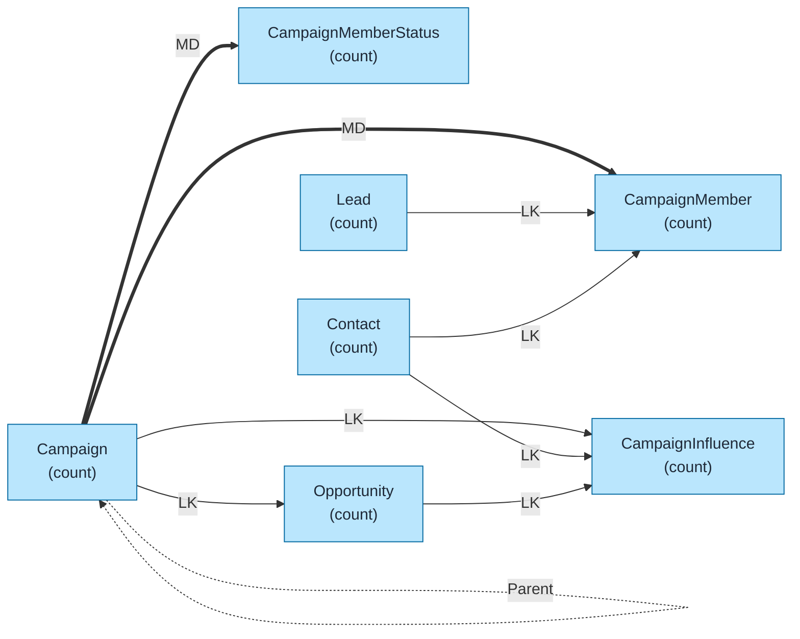
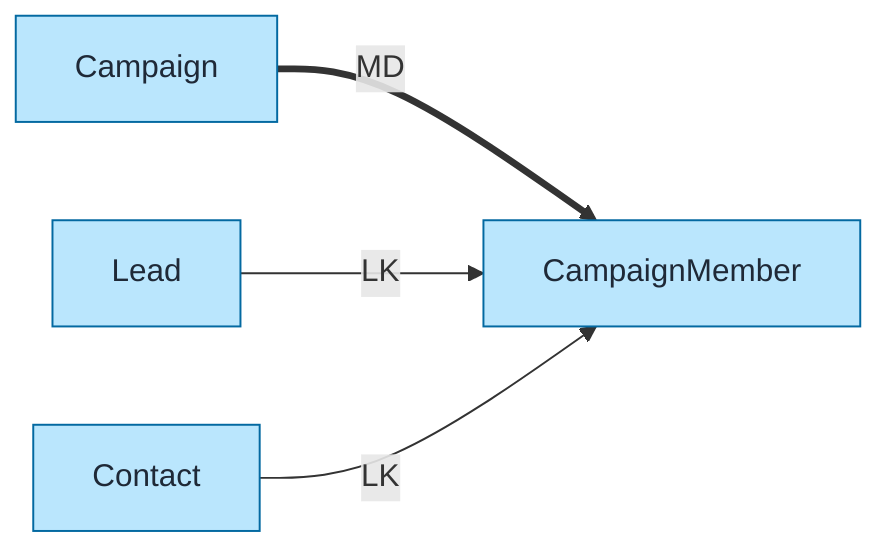

# Campaigns Data Model Template

Pre-built data model for Salesforce Campaigns using `flowchart LR` format with color coding and relationship indicators.

## Objects Included

| Object | Type | Description |
|--------|------|-------------|
| Campaign | STD | Marketing campaigns |
| CampaignMember | STD | Campaign responses (Lead/Contact) |
| CampaignMemberStatus | STD | Status values per campaign |
| CampaignInfluence | STD | Attribution to opportunities |
| Lead | STD | Potential customers |
| Contact | STD | Existing contacts |
| Opportunity | STD | Influenced deals |

---

## Query Org Metadata (Recommended)

Enrich diagram with live org data:

```bash
python3 ~/.claude/plugins/marketplaces/sf-skills/sf-diagram-mermaid/scripts/query-org-metadata.py \
    --objects Campaign,CampaignMember,CampaignInfluence,Lead,Contact,Opportunity \
    --target-org myorg
```

---

## Mermaid Template (Preferred)

Left-to-right flowchart with color coding.



---

## Key Concepts

### Campaign Hierarchy
- Campaigns support **Parent Campaign** self-lookup
- Enables rollup reporting across campaign groups
- Max hierarchy depth: 5 levels

### CampaignMember Polymorphism
- CampaignMember links to **either** Lead OR Contact (not both)
- Uses `LeadId` or `ContactId` lookup fields
- Status tracked via CampaignMemberStatus

### Campaign Influence Models
| Model | Description |
|-------|-------------|
| **Primary Campaign Source** | First-touch attribution (Opportunity.CampaignId) |
| **Campaign Influence 1.0** | Manual influence records |
| **Customizable Campaign Influence** | Multi-touch with weighted attribution |

---

## Simplified Version (Core Objects Only)

For presentations focusing on core campaign flow:



---

## ASCII Fallback

```
┌─────────────────────────────────────────────────────────────────────────────┐
│  CAMPAIGNS DATA MODEL (L→R)                                                  │
│  Legend: LK = Lookup (-->), MD = Master-Detail (==>)                        │
└─────────────────────────────────────────────────────────────────────────────┘

                              ┌─────────────────────┐
                         ┌───>│ CAMPAIGN_MEMBER     │<─── LK ──┬──────────────┐
                         │ MD │     (count)         │          │              │
                         │    └─────────────────────┘          │              │
┌──────────────┐         │                                ┌────┴─────┐   ┌────┴─────┐
│   CAMPAIGN   │─────────┤                                │   LEAD   │   │ CONTACT  │
│   (count)    │         │    ┌─────────────────────┐     │ (count)  │   │ (count)  │
└──────┬───────┘         └───>│ CAMPAIGN_MEMBER_    │     └──────────┘   └────┬─────┘
       │                   MD │ STATUS (count)      │                         │
       │ Parent               └─────────────────────┘                         │
       ▼                                                                      │
┌──────────────┐              ┌─────────────────────┐                         │
│   CAMPAIGN   │── LK ───────>│ CAMPAIGN_INFLUENCE  │<──── LK ────────────────┤
│   (parent)   │              │     (count)         │                         │
└──────────────┘              └──────────┬──────────┘                         │
                                         │                                    │
                                         │ LK                                 │
                                         ▼                                    │
                              ┌─────────────────────┐                         │
                              │    OPPORTUNITY      │                         │
                              │      (count)        │                         │
                              └─────────────────────┘
```

---

## Key Relationships Summary

| Parent | Child | Type | Behavior |
|--------|-------|------|----------|
| Campaign | CampaignMember | MD | Cascade delete |
| Campaign | CampaignMemberStatus | MD | Cascade delete |
| Lead | CampaignMember | LK | Optional (polymorphic) |
| Contact | CampaignMember | LK | Optional (polymorphic) |
| Campaign | CampaignInfluence | LK | Attribution link |
| Campaign | Opportunity | LK | Primary Campaign Source |
| Campaign | Campaign | LK | Parent Campaign (hierarchy) |

---

## Limits & Considerations

| Limit | Value |
|-------|-------|
| Campaign hierarchy depth | 5 levels |
| CampaignMembers per campaign | No hard limit (LDV consideration) |
| CampaignInfluence records | Depends on attribution model |

---

## Best Practices

1. **Use `flowchart LR`** - Left-to-right flow for readability
2. **Keep objects simple** - Name + record count only
3. **Replace `(count)` placeholders** - With actual counts from query
4. **Add LDV indicator** - For objects >2M records: `LDV[~4M]`
5. **Color code object types** - Blue=Standard, Orange=Custom, Green=External
