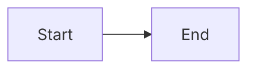
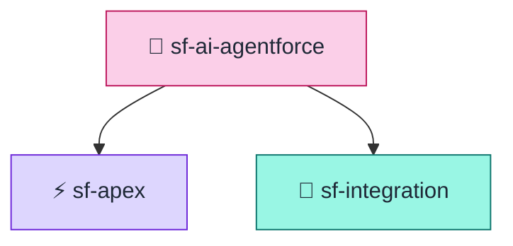
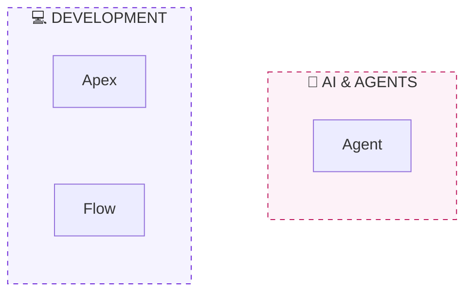
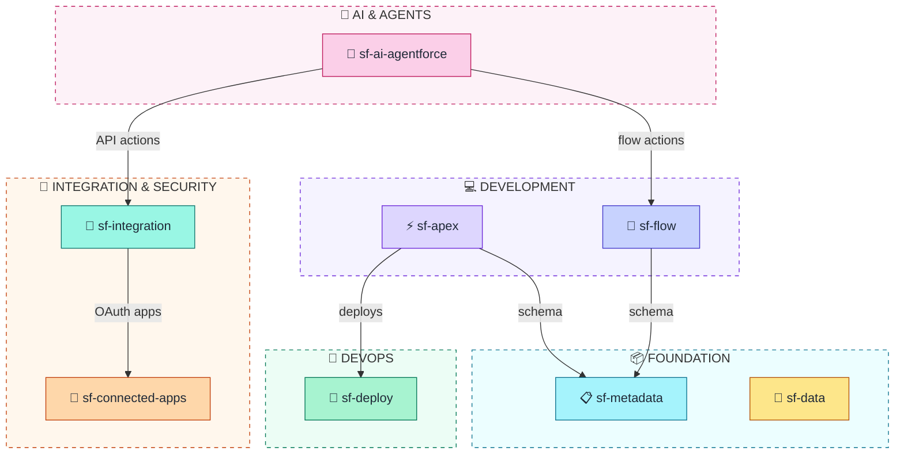

# sf-diagram Color Palette

Soft pastel color palette (Tailwind 200-level) with dark borders for clear definition.

## Primary Palette (Tailwind 200 + Dark Borders)

```
┌─────────────────────────────────────────────────────────────────────────────┐
│  COMPONENT                │  FILL (200)  │  STROKE (700+) │  TEXT COLOR    │
├───────────────────────────┼──────────────┼────────────────┼────────────────┤
│  AI & Agents              │  #fbcfe8     │  #be185d       │  #1f2937       │
│  Integration (Orange)     │  #fed7aa     │  #c2410c       │  #1f2937       │
│  Integration (Teal)       │  #99f6e4     │  #0f766e       │  #1f2937       │
│  Diagrams (Sky)           │  #bae6fd     │  #0369a1       │  #1f2937       │
│  Apex/Development         │  #ddd6fe     │  #6d28d9       │  #1f2937       │
│  Flow/Automation          │  #c7d2fe     │  #4338ca       │  #1f2937       │
│  Metadata (Cyan)          │  #a5f3fc     │  #0e7490       │  #1f2937       │
│  Data (Amber)             │  #fde68a     │  #b45309       │  #1f2937       │
│  Deploy (Green)           │  #a7f3d0     │  #047857       │  #1f2937       │
│  Tooling (Slate)          │  #e2e8f0     │  #334155       │  #1f2937       │
└───────────────────────────┴──────────────┴────────────────┴────────────────┘
```

## Subgraph Background Colors (Tailwind 50-level)

```
┌─────────────────────────────────────────────────────────────────────────────┐
│  SUBGRAPH                 │  FILL (50)   │  STROKE (700+) │  STYLE         │
├───────────────────────────┼──────────────┼────────────────┼────────────────┤
│  AI & Agents              │  #fdf2f8     │  #be185d       │  dashed        │
│  Integration & Security   │  #fff7ed     │  #c2410c       │  dashed        │
│  Development              │  #f5f3ff     │  #6d28d9       │  dashed        │
│  Foundation               │  #ecfeff     │  #0e7490       │  dashed        │
│  DevOps                   │  #ecfdf5     │  #047857       │  dashed        │
│  Tooling                  │  #f8fafc     │  #334155       │  dashed        │
└───────────────────────────┴──────────────┴────────────────┴────────────────┘
```

**Design Philosophy**:
- **Node fills**: Tailwind 200-level for visible but soft pastels
- **Subgraph fills**: Tailwind 50-level for subtle background grouping
- **Dark strokes**: Tailwind 700-800 level for clear definition
- **Dark text**: `#1f2937` ensures readability

## Salesforce-Specific Colors

```
┌─────────────────────────────────────────────────────────────────────────────┐
│  SALESFORCE COMPONENT     │  FILL (200)  │  STROKE (700+) │  TEXT COLOR    │
├───────────────────────────┼──────────────┼────────────────┼────────────────┤
│  Salesforce Platform      │  #bae6fd     │  #0369a1       │  #1f2937       │
│  Connected Apps/OAuth     │  #fed7aa     │  #c2410c       │  #1f2937       │
│  External Systems         │  #a7f3d0     │  #047857       │  #1f2937       │
│  Users/Actors             │  #ddd6fe     │  #6d28d9       │  #1f2937       │
│  Platform Events          │  #99f6e4     │  #0f766e       │  #1f2937       │
│  Named Credentials        │  #fed7aa     │  #c2410c       │  #1f2937       │
└───────────────────────────┴──────────────┴────────────────┴────────────────┘
```

## ERD Object Type Colors

Color coding for data model diagrams by object type:

```
┌─────────────────────────────────────────────────────────────────────────────┐
│  OBJECT TYPE              │  FILL (200)  │  STROKE (700+) │  TEXT COLOR    │
├───────────────────────────┼──────────────┼────────────────┼────────────────┤
│  Standard Objects [STD]   │  #bae6fd     │  #0369a1       │  #1f2937       │
│  Custom Objects [CUST]    │  #fed7aa     │  #c2410c       │  #1f2937       │
│  External Objects [EXT]   │  #a7f3d0     │  #047857       │  #1f2937       │
└───────────────────────────┴──────────────┴────────────────┴────────────────┘

┌─────────────────────────────────────────────────────────────────────────────┐
│  ERD SUBGRAPH             │  FILL (50)   │  STROKE (700+) │  STYLE         │
├───────────────────────────┼──────────────┼────────────────┼────────────────┤
│  Standard Group           │  #f0f9ff     │  #0369a1       │  dashed        │
│  Custom Group             │  #fff7ed     │  #c2410c       │  dashed        │
│  External Group           │  #ecfdf5     │  #047857       │  dashed        │
│  Legend                   │  #f8fafc     │  #334155       │  dashed        │
└───────────────────────────┴──────────────┴────────────────┴────────────────┘
```

### ERD Style Declarations

```mermaid
%% Standard Object - Sky Blue
style Account fill:#bae6fd,stroke:#0369a1,color:#1f2937

%% Custom Object - Orange
style Invoice__c fill:#fed7aa,stroke:#c2410c,color:#1f2937

%% External Object - Green
style SAP_Product__x fill:#a7f3d0,stroke:#047857,color:#1f2937

%% Subgraph - Standard group
style std fill:#f0f9ff,stroke:#0369a1,stroke-dasharray:5

%% Subgraph - Custom group
style cust fill:#fff7ed,stroke:#c2410c,stroke-dasharray:5

%% Subgraph - External group
style ext fill:#ecfdf5,stroke:#047857,stroke-dasharray:5
```

### Relationship Arrow Colors

| Relationship | Style | Notes |
|--------------|-------|-------|
| Lookup | `-->` (default) | Single-line arrow |
| Master-Detail | `==>` | Thick double-line arrow |

**Note**: Mermaid does not support individual line coloring in erDiagram. Use thick arrows (`==>`) for Master-Detail distinction in flowchart format.

## Status Colors

```
┌─────────────────────────────────────────────────────────────────────────────┐
│  STATUS                   │  FILL (200)  │  STROKE (700+) │  ICON          │
├───────────────────────────┼──────────────┼────────────────┼────────────────┤
│  Success                  │  #a7f3d0     │  #047857       │  ✅            │
│  Error/Failure            │  #fecaca     │  #b91c1c       │  ❌            │
│  Warning                  │  #fde68a     │  #b45309       │  ⚠️            │
│  Info/Neutral             │  #e2e8f0     │  #334155       │  ℹ️            │
│  In Progress              │  #bfdbfe     │  #1d4ed8       │  ⏳            │
└───────────────────────────┴──────────────┴────────────────┴────────────────┘
```

---

## Font Family Options

Mermaid supports custom fonts via `%%{init}`:

```
%%{init: { "fontFamily": "Inter, sans-serif", "fontSize": "14px" }}%%
```

### Available Font Options

| Font | Configuration | Best For |
|------|---------------|----------|
| **Default** | `"trebuchet ms", verdana, arial` | General use (Mermaid default) |
| **Modern** | `"Inter", sans-serif` | Clean, professional diagrams |
| **System** | `-apple-system, "Segoe UI", sans-serif` | Native OS appearance |
| **Monospace** | `"Fira Code", "Consolas", monospace` | Code-focused diagrams |
| **Serif** | `"Georgia", serif` | Document-style diagrams |

### Usage Example



**⚠️ Limitation**: GitHub and VS Code may override custom fonts with their platform defaults.

---

## Spacing Configuration

Control diagram density with `%%{init}` configuration:

```mermaid
%%{init: {"flowchart": {"nodeSpacing": 80, "rankSpacing": 70}} }%%
```

### Available Spacing Options

| Option | Default | Recommended | Effect |
|--------|---------|-------------|--------|
| `nodeSpacing` | 50 | 80 | Horizontal gap between nodes |
| `rankSpacing` | 50 | 70 | Vertical gap between levels |
| `diagramPadding` | 20 | 20-30 | Padding around entire diagram |
| `padding` | 15 | 15 | Padding between label and shape |

### Curve Styles

| Style | Effect | Best For |
|-------|--------|----------|
| `"basis"` | Smooth curves (default) | Organic, flowing diagrams |
| `"linear"` | Straight lines | Technical, clean diagrams |
| `"stepBefore"` | Step/staircase lines | Very structured diagrams |

### Recommended Configuration

For clean, readable diagrams:

```
%%{init: {"flowchart": {"nodeSpacing": 80, "rankSpacing": 70}} }%%
```

**Why these values?**
- **nodeSpacing: 80** — 60% more horizontal space than default
- **rankSpacing: 70** — 40% more vertical space than default
- **curve: basis** — Default smooth curves (omit to use default)

**⚠️ Limitation**: Subgraphs may not fully inherit spacing settings due to a [known Mermaid issue](https://github.com/mermaid-js/mermaid/issues/5178).

---

## Mermaid Styling Approach

### Preferred: Individual Node Styling

Use `style` declarations with 200-level fills and dark strokes:



### Subgraph Styling

Use 50-level backgrounds with dark dashed borders:



---

## Node Label Patterns

### Simple Label (Recommended)

```
["🤖 sf-ai-agentforce"]
```

Keep labels short for consistent rendering.

### Database/Cylinder

```
[(💾 Database)]
```

---

## Complete Style Template

Copy this template for consistent diagrams with the finalized color scheme:



### Label Guidelines

| ✅ DO | ❌ DON'T |
|-------|---------|
| `["🤖 sf-ai-agentforce"]` | `["🤖 sf-ai-agentforce<br/><small>Agent Script</small>"]` |
| `["⚡ sf-apex"]` | `["⚡ sf-apex<br/>Triggers, Services"]` |
| Short edge labels: `"schema"` | Long labels: `"queries schema for validation"` |

**Why?** Multi-line labels with `<br/>` and `<small>` tags render inconsistently across GitHub, VS Code, and other Mermaid viewers, often causing text cutoff.

---

## Text Casing Conventions

### Recommendation Summary

| Context | Casing | Example |
|---------|--------|---------|
| **Node Labels** | lowercase | `sf-apex`, `sf-flow` |
| **Subgraph Titles** | UPPERCASE | `AI & AGENTS`, `INTEGRATION & SECURITY` |
| **Edge Labels** | lowercase | `schema`, `deploys`, `flow actions` |
| **ASCII Diagrams** | UPPERCASE | `SALESFORCE PLATFORM`, `EXTERNAL SYSTEMS` |

### Detailed Guidelines

#### Node Labels: lowercase (Recommended)
```
["🤖 sf-ai-agentforce"]    ✅ Preferred
["🤖 SF-AI-AGENTFORCE"]    ❌ Avoid
["🤖 Sf-Ai-Agentforce"]    ❌ Avoid
```

**Why lowercase?**
- Matches the actual skill/package naming convention
- Cleaner, more modern aesthetic
- Consistent with CLI tool naming (npm, pip, etc.)
- Easier to read in compact diagram nodes

#### Subgraph Titles: UPPERCASE
```
subgraph ai["🤖 AI & AGENTS"]           ✅ UPPERCASE
subgraph ai["🤖 ai & agents"]           ❌ lowercase
subgraph ai["🤖 Ai & Agents"]           ❌ Title Case
```

**Why UPPERCASE?**
- Creates strong visual hierarchy with lowercase node labels
- Subgraphs represent major categories/groups
- Consistent with ASCII diagram headers
- Maximum contrast between group titles and contents

#### Edge Labels: lowercase
```
-->|"schema"|              ✅ lowercase
-->|"Schema"|              ❌ Title Case
-->|"SCHEMA"|              ❌ ALL CAPS
```

**Why lowercase?**
- Edge labels describe relationships/actions
- Should be subtle, not prominent
- Consistent with node label style

#### ASCII Diagrams: UPPERCASE for Headers
```
┌─────────────────────────────────────┐
│         SYSTEM LANDSCAPE            │   ✅ UPPERCASE header
└─────────────────────────────────────┘

│  ☁️ SALESFORCE PLATFORM             │   ✅ UPPERCASE section
```

**Why UPPERCASE for ASCII?**
- ASCII has limited styling options (no bold, color)
- UPPERCASE creates visual hierarchy
- Traditional technical documentation style

### Special Cases

| Element | Convention | Example |
|---------|------------|---------|
| Salesforce products | Official casing | `Sales Cloud`, `Service Cloud` |
| Acronyms in nodes | lowercase | `sf-ai-agentforce` (not `SF-AI`) |
| Acronyms in subgraphs | UPPERCASE | `AI & Agents`, `API Gateway` |
| Technical terms | lowercase | `apex`, `flow`, `metadata` |

---

## Icon Reference

| Category | Icon | Unicode | Usage |
|----------|------|---------|-------|
| AI/Agents | 🤖 | U+1F916 | Agentforce, AI features |
| Apex | ⚡ | U+26A1 | Code, triggers, services |
| Flow | 🔄 | U+1F504 | Automation, flows |
| Metadata | 📋 | U+1F4CB | Objects, fields |
| Data | 💾 | U+1F4BE | SOQL, records |
| Deploy | 🚀 | U+1F680 | CI/CD, deployment |
| Connected Apps | 🔐 | U+1F510 | OAuth, security |
| Integration | 🔗 | U+1F517 | Named Creds, callouts |
| Diagram | 📊 | U+1F4CA | Documentation |
| Tooling | 🛠️ | U+1F6E0 | Utilities |
| User | 👤 | U+1F464 | End users |
| Browser | 🌐 | U+1F310 | Web apps |
| Cloud | ☁️ | U+2601 | Salesforce platform |
| External | 🏭 | U+1F3ED | External systems |
| Database | 💾 | U+1F4BE | Data storage |

---

## Color Blind Accessibility

This palette maintains distinguishability for common color blindness:

| Condition | Our Approach |
|-----------|--------------|
| Protanopia | Pink vs Teal have different luminance |
| Deuteranopia | Orange vs Cyan are well separated |
| Tritanopia | Icons + dark text supplement colors |

### Key Principles

1. **Icons supplement colors** - Every node has an icon
2. **High contrast text** - Dark text (`#1f2937`) on pastel backgrounds
3. **Dark stroke differentiation** - Bold borders add definition
4. **Dashed subgraphs** - Pattern, not just color

---

## Light/Dark Mode Support

The pastel style works best on **light backgrounds**. For dark mode contexts:
- 200-level fills remain visible
- Dark strokes provide clear definition
- 50-level subgraph fills adapt reasonably

---

## References

- [Tailwind CSS Color Palette](https://tailwindcss.com/docs/colors)
- [Salesforce Lightning Design System](https://www.lightningdesignsystem.com/)
- [CloudSundial Diagrams](https://cloudsundial.com/diagrams-of-identity-flows-in-context)
- [Mermaid Theme Configuration](https://mermaid.js.org/config/theming.html)
