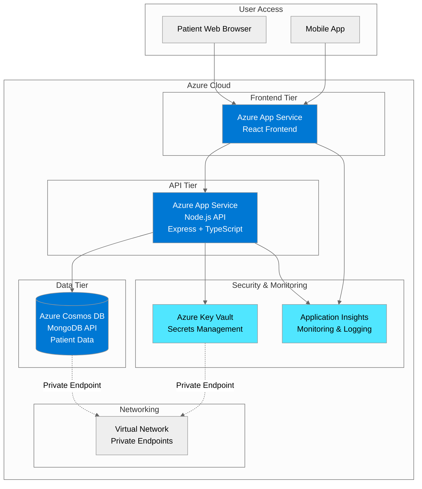
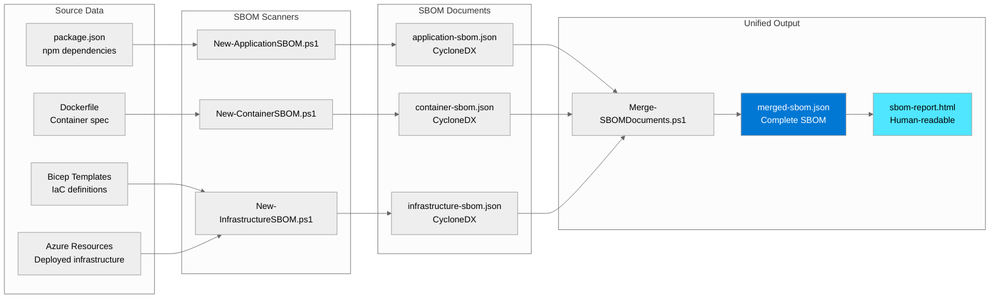

# Application Architecture: HealthTech Patient Portal

## System Overview

The HealthTech Patient Portal is a modern, cloud-native application built for scalability, security, and compliance with healthcare regulations (HIPAA, HITRUST). This document describes the architecture and component inventory that will be captured in the SBOM.

## High-Level Architecture



## SBOM Scope

The Software Bill of Materials will capture three layers:

### Layer 1: Application Dependencies

**Frontend (React Web App)**:

- React 18.x
- React Router
- Axios (HTTP client)
- TypeScript compiler (devDependency)
- Webpack (bundler)
- ESLint (linting)
- ~15 total npm packages

**Backend (Node.js API)**:

- Express 4.x (web framework)
- Mongoose 8.x (MongoDB ODM)
- @azure/cosmos (Cosmos DB SDK)
- @azure/identity (authentication)
- @azure/keyvault-secrets (Key Vault SDK)
- applicationinsights (Application Insights SDK)
- TypeScript 4.x
- Jest (testing framework)
- ESLint (linting)
- ~25 total npm packages

### Layer 2: Container Components

**Docker Base Image**: `node:20-alpine`

**Alpine Linux Components**:

- Alpine Linux 3.19
- musl libc (C standard library)
- OpenSSL 3.x
- ca-certificates
- ~50 OS packages

**Node.js Runtime**:

- Node.js 20.x LTS
- npm package manager
- V8 JavaScript engine

**Container Layers**:

- Base OS layer
- Node.js runtime layer
- Application code layer
- npm dependencies layer

### Layer 3: Azure Infrastructure

**Compute**:

- **Azure App Service** (Web tier)
  - SKU: P1v3 (Premium tier)
  - OS: Linux
  - Runtime: Node 20 LTS
  - API Version: 2023-12-01
  
- **Azure App Service** (API tier)
  - SKU: P1v3 (Premium tier)
  - OS: Linux
  - Runtime: Node 20 LTS
  - API Version: 2023-12-01

**Data**:

- **Azure Cosmos DB**
  - API: MongoDB 4.2
  - Consistency: Session
  - Throughput: Autoscale (400-4000 RU/s)
  - API Version: 2023-11-15

**Security**:

- **Azure Key Vault**
  - SKU: Standard
  - Soft delete enabled
  - Purge protection enabled
  - API Version: 2023-07-01

**Monitoring**:

- **Application Insights**
  - Workspace-based
  - Retention: 90 days
  - API Version: 2020-02-02

**Networking**:

- **Virtual Network**
  - Address space: 10.0.0.0/16
  - Subnets: App (10.0.1.0/24), Data (10.0.2.0/24)
  - API Version: 2023-09-01

- **Private Endpoints**
  - Cosmos DB private endpoint
  - Key Vault private endpoint

## Component Inventory

### Critical Components (for SBOM)

| Component | Type | Version | License | Purpose |
|-----------|------|---------|---------|---------|
| **express** | npm | 4.21.2 | MIT | Web framework |
| **mongoose** | npm | 8.9.5 | MIT | Database ODM |
| **@azure/cosmos** | npm | 4.4.1 | MIT | Cosmos DB SDK |
| **@azure/identity** | npm | 4.2.1 | MIT | Azure authentication |
| **@azure/keyvault-secrets** | npm | 4.7.0 | MIT | Key Vault SDK |
| **applicationinsights** | npm | 2.5.1 | MIT | Monitoring |
| **typescript** | npm | 4.7.3 | Apache-2.0 | Type system |
| **node:20-alpine** | container | 20.x | MIT | Runtime base image |
| **Alpine Linux** | OS | 3.19 | Multiple | Container OS |
| **Azure App Service** | cloud | 2023-12-01 | N/A | Web hosting |
| **Azure Cosmos DB** | cloud | 2023-11-15 | N/A | Database |
| **Azure Key Vault** | cloud | 2023-07-01 | N/A | Secrets |

### Dependency Tree

```mermaid
%%{init: {'theme':'neutral'}}%%
graph TB
    App[Patient Portal Application]
    
    subgraph "Application Layer"
        API[Node.js API]
        Web[React Frontend]
    end
    
    subgraph "Framework Dependencies"
        Express[express 4.21.2]
        Mongoose[mongoose 8.9.5]
        React[react 18.x]
    end
    
    subgraph "Azure SDKs"
        CosmosSDK[@azure/cosmos 4.4.1]
        IdentitySDK[@azure/identity 4.2.1]
        KeyVaultSDK[@azure/keyvault-secrets 4.7.0]
        AppInsightsSDK[applicationinsights 2.5.1]
    end
    
    subgraph "Runtime"
        Node[Node.js 20.x]
        Alpine[Alpine Linux 3.19]
    end
    
    App --> API
    App --> Web
    API --> Express
    API --> Mongoose
    API --> CosmosSDK
    API --> IdentitySDK
    API --> KeyVaultSDK
    API --> AppInsightsSDK
    Web --> React
    Express --> Node
    Mongoose --> Node
    CosmosSDK --> Node
    Node --> Alpine
    
    style App fill:#0078D4,color:#fff
    style API fill:#0078D4,color:#fff
    style Node fill:#50E6FF,color:#000
    style Alpine fill:#50E6FF,color:#000
```

## Security Considerations for SBOM

### Sensitive Information to Exclude

The SBOM will **NOT** include:

- ❌ Secrets, passwords, connection strings
- ❌ API keys or authentication tokens
- ❌ Internal IP addresses or hostnames
- ❌ Customer data or PHI
- ❌ Proprietary business logic
- ❌ Configuration values with security implications

### Information to Include

The SBOM **WILL** include:

- ✅ Component names and versions
- ✅ License information (MIT, Apache, etc.)
- ✅ Package URLs (PURLs) for identification
- ✅ Component types (library, framework, application)
- ✅ Relationships and dependencies
- ✅ Azure resource types and API versions
- ✅ Base image information (public images only)

## Data Flow for SBOM Generation



## SBOM Use Cases

### 1. Vulnerability Management

**Scenario**: Log4j vulnerability (CVE-2021-44228) disclosed

**Without SBOM**:

- Manual review of all applications (3 days)
- Check each package.json file
- Search for "log4j" (but it's Java, not Node.js)
- Still uncertain about nested dependencies

**With SBOM**:

```powershell
# Query all SBOMs for vulnerable component
Get-ChildItem -Recurse -Filter "*-sbom.json" | 
    Select-String "log4j" | 
    Select-Object -Property Path
```

- Result in 15 minutes
- Confirm Node.js app not affected
- Provide evidence to customers same day

### 2. License Compliance

**Scenario**: Legal review for M&A due diligence

**Required**: Identify all GPL-licensed components (copyleft implications)

**SBOM Query**:

```powershell
# Extract all components with GPL licenses
$sbom = Get-Content merged-sbom.json | ConvertFrom-Json
$sbom.components | Where-Object { $_.licenses -like "*GPL*" } | 
    Select-Object name, version, @{N='License';E={$_.licenses.license.id}}
```

**Output**: Clear list of GPL components for legal review

### 3. Customer Security Questionnaire

**Question**: "Provide a list of all third-party software components and their versions"

**Response**: Attach `sbom-report.html` (professional, comprehensive, generated in minutes)

**Customer Confidence**: Demonstrates mature software supply chain management

### 4. Regulatory Audit (SOC2, HITRUST)

**Auditor Request**: "Show evidence of component tracking and vulnerability management"

**Evidence Package**:

- Quarterly SBOMs (version controlled in Git)
- Comparison reports (component changes over time)
- Vulnerability scan results linked to SBOM
- Remediation tracking (patched components)

**Audit Result**: No findings (control meets requirements)

## Architecture Benefits for SBOM

1. **Cloud-Native**: Azure Resource Graph provides infrastructure inventory API
2. **Containerized**: Docker layer inspection captures OS dependencies
3. **Modern Stack**: Node.js/npm has excellent SBOM tooling support
4. **Azure SDKs**: Official Microsoft packages with clear versioning
5. **Infrastructure as Code**: Bicep templates document intended state
6. **Monitoring**: Application Insights tracks deployed versions

## Component Update Frequency

| Layer | Update Frequency | SBOM Impact |
|-------|------------------|-------------|
| **npm packages** | Monthly (security patches) | High - regenerate SBOM |
| **Container base image** | Quarterly (Node.js LTS) | Medium - new OS packages |
| **Azure resources** | Rarely (SKU changes) | Low - stable API versions |
| **Application code** | Weekly (feature releases) | None - not in SBOM |

**Recommendation**: Generate SBOM on every production deployment (CI/CD integration)

---

## SBOM Metadata

When generating the SBOM, include these metadata fields:

**Organization**:

- Name: HealthTech Solutions Inc.
- URL: https://healthtechsolutions.example.com
- Contact: security@healthtechsolutions.example.com

**Application**:

- Name: Patient Portal
- Version: From Git tag (e.g., v2.5.1)
- Description: Healthcare patient engagement platform

**Timestamp**: ISO 8601 format (e.g., 2025-11-18T10:30:00Z)

**Tools Used**:

- Generator: Custom PowerShell scripts with GitHub Copilot
- Format: CycloneDX 1.5
- Specification: https://cyclonedx.org/specification/overview/

---

**Document Owner**: Architecture Team  
**Contributors**: Security, DevOps, Compliance  
**Last Updated**: November 18, 2025  
**Review Cycle**: Quarterly or when major architecture changes occur
