# S04 Service Validation - Architecture

## Logical Architecture

## Application Architecture

### Request Flow

### API Endpoints

## Security Architecture

### Authentication Flow

### Security Controls

## Validation & Testing Architecture

### Testing Workflow

### Load Testing Flow

## CI/CD Integration

### Pipeline Architecture

```mermaid
%%{init: {'theme':'neutral'}}%%
graph TB
    subgraph "Source Control"
        GIT[GitHub Repository]
    end

    subgraph "Build Stage"
        BUILD_API[Build API Container]
        BUILD_WEB[Build Web Container]
        SCAN[Security Scan<br/>Trivy/Checkov]
    end

    subgraph "Deploy Stage"
        DEPLOY_INFRA[Deploy Bicep]
        DEPLOY_APP[Deploy Containers]
    end

    subgraph "Validation Stage"
        API_VAL[API Validation]
        LOAD_VAL[Load Testing]
        REPORT_VAL[Report Generation]
    end

    subgraph "Notification"
        SUCCESS[✅ Success<br/>Slack/Email]
        FAIL[❌ Failure<br/>Slack/Email]
    end

    GIT --> BUILD_API
    GIT --> BUILD_WEB
    BUILD_API --> SCAN
    BUILD_WEB --> SCAN
    SCAN --> DEPLOY_INFRA
    DEPLOY_INFRA --> DEPLOY_APP
    DEPLOY_APP --> API_VAL
    API_VAL --> LOAD_VAL
    LOAD_VAL --> REPORT_VAL
    REPORT_VAL -->|Pass| SUCCESS
    REPORT_VAL -->|Fail| FAIL

    style GIT fill:#24292E,stroke:#000,color:#fff
    style BUILD_API fill:#845EF7,stroke:#5F3DC4,color:#fff
    style BUILD_WEB fill:#845EF7,stroke:#5F3DC4,color:#fff
    style SCAN fill:#FFA94D,stroke:#F76707,color:#000
    style DEPLOY_INFRA fill:#00BCF2,stroke:#0078D4,color:#000
    style DEPLOY_APP fill:#4ECDC4,stroke:#2C7873,color:#000
    style API_VAL fill:#FFD43B,stroke:#F59F00,color:#000
    style LOAD_VAL fill:#FFD43B,stroke:#F59F00,color:#000
    style REPORT_VAL fill:#51CF66,stroke:#2F9E44,color:#000
    style SUCCESS fill:#51CF66,stroke:#2F9E44,color:#000
    style FAIL fill:#FF6B6B,stroke:#C92A2A,color:#fff
```

## Resource Topology

### Resource Hierarchy

## Deployment Validation

### Post-Deployment Checks

## Monitoring & Observability

### Telemetry Flow

### Key Metrics

## Cost Projection

### Monthly Infrastructure Costs (Sweden Central)

| Resource                 | SKU/Tier       | Quantity | Unit Cost | Monthly Cost       |
| ------------------------ | -------------- | -------- | --------- | ------------------ |
| **App Service Plan**     | Premium P1v3   | 1        | ~$120     | **$120.00**        |
| **SQL Database**         | Basic (5 DTU)  | 1        | ~$5       | **$5.00**          |
| **SQL Server**           | Logical Server | 1        | $0        | **$0.00**          |
| **Container Registry**   | Premium        | 1        | ~$50      | **$50.00**         |
| **Log Analytics**        | Pay-as-you-go  | 5 GB     | $2.30/GB  | **$11.50**         |
| **Application Insights** | Enterprise     | Included | $0        | **$0.00**          |
| **Total**                | -              | -        | -         | **~$186.50/month** |

> **Cost Optimization Tips**:
>
> - Use **Basic SQL tier** for demos (reduces to $5/month)
> - Downgrade **ACR to Basic** tier for non-prod (reduces to $5/month)
> - Use **Standard App Service Plan** if zone redundancy not required (reduces to $75/month)
> - **Optimized Demo Cost**: ~$85/month

## Compliance Mapping

### Azure Infrastructure Specialization - Module B Control 4.1

| Control Requirement     | Implementation         | Evidence                   |
| ----------------------- | ---------------------- | -------------------------- |
| **Service Validation**  | Automated load testing | quick-load-test.sh results |
| **Performance Testing** | Baseline establishment | Performance reports        |
| **API Testing**         | Endpoint validation    | Test execution logs        |
| **Audit Evidence**      | Timestamped logs       | Exported test reports      |
| **Repeatability**       | CI/CD integration      | Pipeline configurations    |

### Security Compliance

| Standard                     | Requirement         | Implementation           |
| ---------------------------- | ------------------- | ------------------------ |
| **GDPR**                     | Data residency      | Sweden Central (EU)      |
| **HIPAA**                    | Encryption          | TLS 1.2, AES-256 at rest |
| **SOC 2**                    | Access control      | RBAC, Managed Identity   |
| **Azure Security Benchmark** | Identity-based auth | No connection strings    |

## Data Flow

### Read Operation

### Write Operation (Future)

---

## Architecture Highlights

- 🔒 **Zero Secrets**: Managed Identity for all authentication (no connection strings)
- 📊 **Observable**: Application Insights + Log Analytics for full telemetry
- ✅ **Validated**: Automated load testing with performance baselines
- 🚀 **Scalable**: Premium App Service Plan with zone redundancy
- 💰 **Cost-Effective**: ~$186/month (optimized to ~$85/month for demo)
- 🛡️ **Secure**: Entra ID-only SQL auth, HTTPS enforcement, TLS 1.2+
- 📋 **Audit-Ready**: Complete evidence trail for Module B Control 4.1

[🏠 Back to Requirements](./requirements.md) | [📚 Back to Demo README](../README.md)
