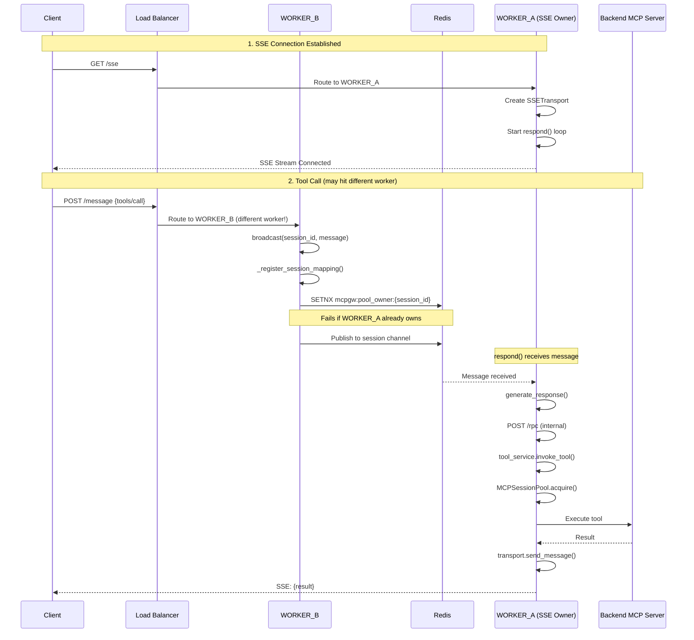
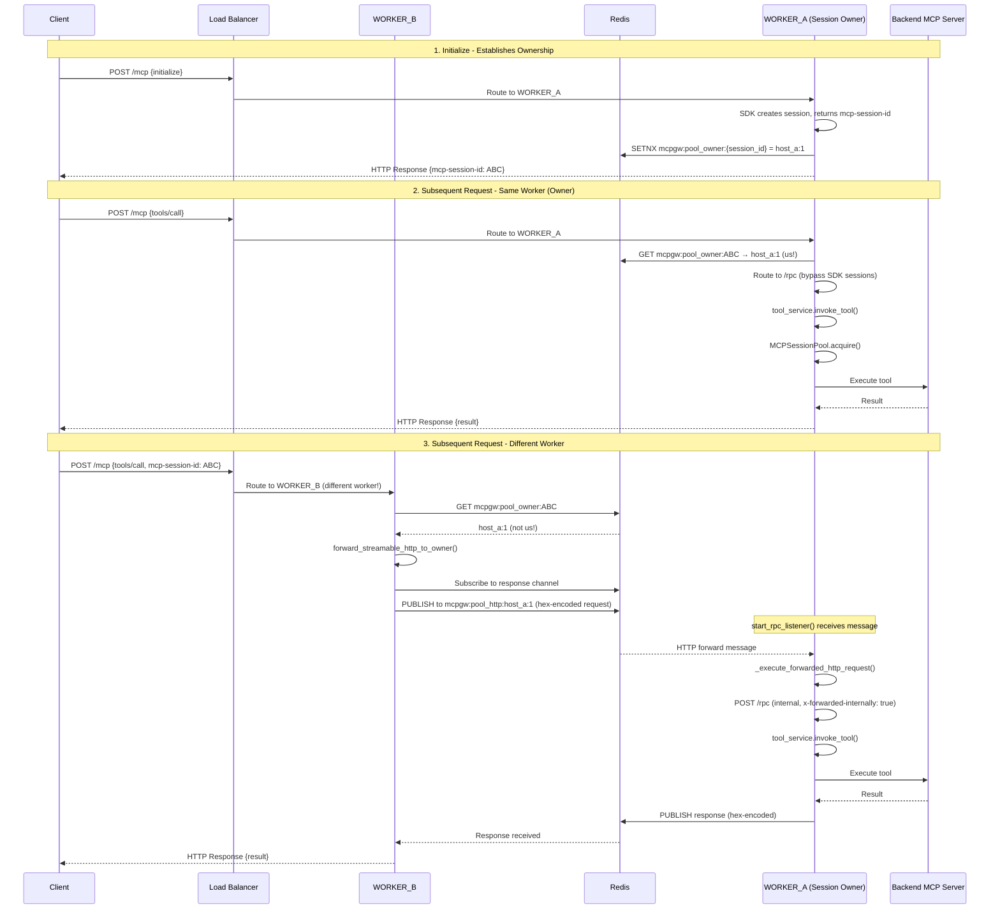

# ADR-038: Multi-Worker Session Affinity for SSE and Streamable HTTP

- *Status:* Accepted
- *Date:* 2025-01-31
- *Deciders:* Platform Team

## Context

MCP Gateway supports horizontal scaling with multiple worker processes (e.g., `gunicorn -w 4`). When clients connect via SSE or Streamable HTTP, the gateway maintains pooled sessions to backend MCP servers for efficiency (see ADR-032).

**The Problem:** In a multi-worker deployment, a client's requests may hit different workers. If each worker creates its own upstream MCP session, we lose:
1. **Connection efficiency** - Multiple sessions to the same backend instead of one
2. **Session state** - Some backends maintain state per session
3. **Resource waste** - Each session consumes memory and connections

**The Goal:** Route all requests from the same client to the same upstream MCP session, regardless of which worker receives the HTTP request.

## Decision

Implement **unified session affinity** using Redis Pub/Sub for cross-worker coordination:

1. **SSE Transport**: Uses Redis Pub/Sub for JSON-RPC message routing via `broadcast()` → `respond()` pattern
2. **Streamable HTTP Transport**: Uses Redis Pub/Sub for full HTTP request forwarding via `forward_streamable_http_to_owner()` pattern

Both transports share the core session pool (`MCPSessionPool`), ownership registration (`register_session_mapping()`), and **Redis Pub/Sub communication mechanism**. The only difference is the payload format (JSON-RPC messages vs full HTTP requests).

## Architecture Overview

```
┌─────────────────────────────────────────────────────────────────────────────────┐
│                     MULTI-WORKER SESSION AFFINITY                               │
├─────────────────────────────────────────────────────────────────────────────────┤
│                                                                                 │
│  ┌─────────────┐    ┌─────────────┐    ┌─────────────┐                         │
│  │  WORKER_A   │    │  WORKER_B   │    │  WORKER_C   │                         │
│  │             │    │             │    │             │                         │
│  │ ┌─────────┐ │    │ ┌─────────┐ │    │ ┌─────────┐ │                         │
│  │ │ Session │ │    │ │ Session │ │    │ │ Session │ │   MCPSessionPool        │
│  │ │  Pool   │ │    │ │  Pool   │ │    │ │  Pool   │ │   (per worker)          │
│  │ └─────────┘ │    │ └─────────┘ │    │ └─────────┘ │                         │
│  └──────┬──────┘    └──────┬──────┘    └──────┬──────┘                         │
│         │                  │                  │                                 │
│         └──────────────────┼──────────────────┘                                 │
│                            │                                                    │
│                     ┌──────▼──────┐                                             │
│                     │    Redis    │  Ownership Registry:                        │
│                     │             │  mcpgw:pool_owner:{session_id} → WORKER_ID  │
│                     │  - Pub/Sub  │  Session Mapping:                           │
│                     │  - Keys     │  mcpgw:session_mapping:{...} → pool_key     │
│                     └─────────────┘                                             │
│                                                                                 │
└─────────────────────────────────────────────────────────────────────────────────┘
```

## SSE Transport Flow

SSE uses a **persistent connection** from client to gateway. Only one worker owns the SSE stream, so all responses MUST go through that worker.

### Key Components

| Component | Location | Purpose |
|-----------|----------|---------|
| `SessionRegistry` | `mcpgateway/cache/session_registry.py` | Manages SSE sessions and message routing |
| `SSETransport` | `mcpgateway/transports/sse_transport.py` | Handles SSE stream I/O |
| `broadcast()` | `session_registry.py:961` | Routes messages to session owner via Redis/DB |
| `respond()` | `session_registry.py:1119` | Listens for messages and processes them |
| `generate_response()` | `session_registry.py:1863` | Executes requests via internal `/rpc` call |
| `_register_session_mapping()` | `session_registry.py:900` | Registers session ownership in pool |

### Sequence Diagram



### Detailed Flow

```
┌─────────────────────────────────────────────────────────────────────────────────┐
│                           SSE SESSION AFFINITY FLOW                             │
├─────────────────────────────────────────────────────────────────────────────────┤
│                                                                                 │
│  CLIENT                                                                         │
│    │                                                                            │
│    │ GET /sse                                                                   │
│    ▼                                                                            │
│  WORKER_A (receives SSE connection)                                             │
│    │                                                                            │
│    ├─► session_registry.add_session(session_id, transport)                      │
│    │                                                                            │
│    └─► asyncio.create_task(session_registry.respond(...))                       │
│          │                                                                      │
│          └─► Listens on Redis channel: {session_id}                             │
│                                                                                 │
│  ─────────────────────────────────────────────────────────────────────────────  │
│                                                                                 │
│  CLIENT                                                                         │
│    │                                                                            │
│    │ POST /message {"method": "tools/call", "params": {"name": "my_tool"}}      │
│    ▼                                                                            │
│  WORKER_B (receives HTTP request - different worker!)                           │
│    │                                                                            │
│    ├─► session_registry.broadcast(session_id, message)                          │
│    │     │                                                                      │
│    │     ├─► _register_session_mapping(session_id, message, user_email)         │
│    │     │     │                                                                │
│    │     │     ├─► tool_lookup_cache.get(tool_name)                             │
│    │     │     │     └─► Returns: {gateway: {url, id, transport}}               │
│    │     │     │                                                                │
│    │     │     └─► pool.register_session_mapping(session_id, url, ...)          │
│    │     │           │                                                          │
│    │     │           ├─► Redis SETNX mcpgw:pool_owner:{session_id} = WORKER_B   │
│    │     │           │     └─► Returns False (WORKER_A already owns)            │
│    │     │           │                                                          │
│    │     │           └─► Ownership NOT changed (atomic SETNX)                   │
│    │     │                                                                      │
│    │     └─► Redis PUBLISH {session_id} {message}                               │
│    │                                                                            │
│    └─► Return HTTP 202 Accepted                                                 │
│                                                                                 │
│  ─────────────────────────────────────────────────────────────────────────────  │
│                                                                                 │
│  WORKER_A (respond() loop receives message)                                     │
│    │                                                                            │
│    ├─► pubsub.get_message() returns the broadcast message                       │
│    │                                                                            │
│    └─► generate_response(message, transport, ...)                               │
│          │                                                                      │
│          ├─► POST http://127.0.0.1:{port}/rpc (internal call)                   │
│          │     │                                                                │
│          │     └─► /rpc handler                                                 │
│          │           │                                                          │
│          │           ├─► Check x-forwarded-internally header                    │
│          │           │                                                          │
│          │           └─► tool_service.invoke_tool()                             │
│          │                 │                                                    │
│          │                 └─► MCPSessionPool.acquire()                         │
│          │                       │                                              │
│          │                       └─► Use pooled session to backend              │
│          │                                                                      │
│          └─► transport.send_message(response)                                   │
│                │                                                                │
│                └─► SSE Stream ──────────────────────────────────────► CLIENT    │
│                                                                                 │
└─────────────────────────────────────────────────────────────────────────────────┘
```

## Streamable HTTP Transport Flow

Streamable HTTP uses **independent HTTP request/response cycles**. Any worker can respond to the client, so we use **Redis Pub/Sub forwarding** to route requests to the session owner, which then executes them via internal `/rpc` routing.

### Why Redis Pub/Sub Instead of HTTP Forwarding?

An earlier implementation attempted HTTP-based forwarding using the worker's hostname extracted from `WORKER_ID` (format: `hostname:pid`). This approach **failed for single-host multi-worker deployments** because:

- All workers share the same hostname (e.g., gunicorn with 4 workers on one server)
- Worker IDs: `myserver:1234`, `myserver:5678`, `myserver:9012`
- Extracting hostname → `myserver` for all workers
- HTTP forwarding to `http://myserver:4444/mcp` routes to load balancer, not specific worker PID
- Result: Random worker receives request, session not found, error

**Redis Pub/Sub solution** works universally:
- Each worker listens on unique channel: `mcpgw:pool_http:{worker_id}`
- Direct worker-to-worker messaging without hostname routing
- Works identically for single-host and multi-host deployments

### Why Not Use SDK's Session Manager?

The MCP SDK's `StreamableHTTPSessionManager` stores sessions in an in-memory `_server_instances` dictionary. This is problematic because:

1. **Sessions are per-worker** - Not shared across workers
2. **Sessions get cleaned up** - SDK clears `_server_instances` between requests
3. **RedisEventStore only handles events** - It stores events for resumability, not session routing

Our solution: **bypass the SDK for request routing** and use `/rpc` endpoint directly, which leverages `MCPSessionPool` for upstream connections.

### Key Components

| Component | Location | Purpose |
|-----------|----------|---------|
| `handle_streamable_http()` | `streamablehttp_transport.py:1252` | ASGI handler with affinity routing |
| `forward_streamable_http_to_owner()` | `mcp_session_pool.py:1651` | Redis Pub/Sub forwarding to owner worker |
| `_execute_forwarded_http_request()` | `mcp_session_pool.py:1554` | Executes forwarded HTTP requests on owner |
| `get_streamable_http_session_owner()` | `mcp_session_pool.py:1545` | Checks Redis for session ownership |
| `start_rpc_listener()` | `mcp_session_pool.py:1438` | Listens on both RPC and HTTP Redis channels |
| `/rpc` endpoint | `main.py:5259` | Unified request handler for all methods |
| `register_session_mapping()` | `mcp_session_pool.py:545` | Registers session ownership atomically |
| `WORKER_ID` | `mcp_session_pool.py:61` | Unique identifier: `{hostname}:{pid}` |

### Sequence Diagram



### Detailed Flow

```
┌─────────────────────────────────────────────────────────────────────────────────┐
│                     STREAMABLE HTTP SESSION AFFINITY FLOW                       │
├─────────────────────────────────────────────────────────────────────────────────┤
│                                                                                 │
│  CLIENT                                                                         │
│    │                                                                            │
│    │ POST /mcp                                                                  │
│    │ Headers: mcp-session-id: ABC123                                            │
│    │ Body: {"method": "tools/call", "params": {"name": "my_tool"}}              │
│    ▼                                                                            │
│  WORKER_B (receives HTTP request) - hostname:pid = "host_b:1"                   │
│    │                                                                            │
│    └─► handle_streamable_http(scope, receive, send)                             │
│          │                                                                      │
│          ├─► Extract mcp_session_id from headers                                │
│          │     (checks both "mcp-session-id" and "x-mcp-session-id")            │
│          │                                                                      │
│          ├─► pool.get_streamable_http_session_owner(mcp_session_id)             │
│          │     │                                                                │
│          │     └─► Redis GET mcpgw:pool_owner:{session_id}                      │
│          │           └─► Returns: "host_a:1" (WORKER_A owns it)                 │
│          │                                                                      │
│          ├─► owner != WORKER_ID → Forward HTTP request                          │
│          │                                                                      │
│          └─► pool.forward_streamable_http_to_owner(...)                         │
│                │                                                                │
│                ├─► Generate unique response channel UUID                        │
│                │     response_channel = mcpgw:pool_http_response:{uuid}        │
│                │                                                                │
│                ├─► Serialize HTTP request for Redis:                           │
│                │     {                                                          │
│                │       "type": "http_forward",                                 │
│                │       "response_channel": response_channel,                   │
│                │       "method": "POST",                                       │
│                │       "path": "/mcp",                                         │
│                │       "headers": {...},                                       │
│                │       "body": "..." (hex-encoded),                            │
│                │       "original_worker": "host_b:1"                           │
│                │     }                                                          │
│                │                                                                │
│                ├─► Subscribe to response channel (prevent race)                 │
│                │                                                                │
│                ├─► Redis PUBLISH to mcpgw:pool_http:host_a:1                   │
│                │                                                                │
│                ├─► Wait for response on response_channel (with timeout)         │
│                │                                                                │
│                :     (see WORKER_A processing below)                            │
│                :                                                                │
│                ▼                                                                │
│              Response received from Redis                                       │
│                │                                                                │
│                ├─► Decode hex body back to bytes                                │
│                │                                                                │
│                └─► Forward response to client ──────────────────────► CLIENT    │
│                                                                                 │
│  ─────────────────────────────────────────────────────────────────────────────  │
│                                                                                 │
│  WORKER_A (start_rpc_listener receives Redis message) - hostname:pid = "host_a:1" │
│    │                                                                            │
│    └─► start_rpc_listener() loop                                                │
│          │                                                                      │
│          ├─► Redis message received on mcpgw:pool_http:host_a:1                │
│          │     type = "http_forward"                                           │
│          │                                                                      │
│          └─► _execute_forwarded_http_request(request, redis)                    │
│                │                                                                │
│                ├─► Deserialize HTTP request from Redis message                  │
│                │                                                                │
│                ├─► Decode hex body back to bytes                                │
│                │                                                                │
│                ├─► Add x-forwarded-internally: true header                      │
│                │                                                                │
│                ├─► HTTP POST http://127.0.0.1:4444/mcp                          │
│                │     Headers:                                                   │
│                │       x-forwarded-internally: true                             │
│                │       x-original-worker: host_b:1                              │
│                │       mcp-session-id: ABC123                                   │
│                │       (+ all original headers)                                 │
│                │                                                                │
│                └─► /rpc handler (main.py)                                       │
│                      │                                                          │
│                      ├─► Sees x-forwarded-internally: true                      │
│                      │     └─► Skip session affinity check (no loops)           │
│                      │                                                          │
│                      └─► tool_service.invoke_tool()                             │
│                            │                                                    │
│                            ├─► Normalize session ID from headers                │
│                            │     (both mcp-session-id and x-mcp-session-id)     │
│                            │                                                    │
│                            └─► MCPSessionPool.acquire()                         │
│                                  │                                              │
│                                  ├─► Reuse pooled connection to backend         │
│                                  │                                              │
│                                  └─► Execute tool on upstream server            │
│                                        │                                        │
│                                        └─► Response returned to _execute...()   │
│                                              │                                  │
│                                              ├─► Hex-encode response body       │
│                                              │                                  │
│                                              └─► Redis PUBLISH to response_channel │
│                                                                                 │
│  ─────────────────────────────────────────────────────────────────────────────  │
│                                                                                 │
│  ALTERNATE: WORKER_A is the owner AND receives request directly                 │
│    │                                                                            │
│    └─► handle_streamable_http(scope, receive, send)                             │
│          │                                                                      │
│          ├─► is_internally_forwarded = False                                    │
│          │                                                                      │
│          ├─► pool.get_streamable_http_session_owner(mcp_session_id)             │
│          │     └─► Returns: "host_a:1" (that's us!)                             │
│          │                                                                      │
│          ├─► owner == WORKER_ID → We own it, but DON'T use SDK                  │
│          │     (SDK's _server_instances is empty between requests)              │
│          │                                                                      │
│          └─► Route to /rpc (same path as forwarded requests)                    │
│                │                                                                │
│                └─► tool_service.invoke_tool() → MCPSessionPool → Backend        │
│                                                                                 │
└─────────────────────────────────────────────────────────────────────────────────┘
```

### Why Route to /rpc Instead of SDK?

The MCP SDK's `StreamableHTTPSessionManager` has a fundamental issue:

```python
# SDK stores sessions in memory
self._server_instances: dict[str, ServerInstance] = {}
```

**Problem:** This dictionary is cleared between requests, causing "Session not found" errors.

**Solution:** Route ALL requests with session IDs to `/rpc`, which:
1. Uses `MCPSessionPool` for upstream connections (Redis-backed)
2. Doesn't depend on SDK's in-memory session storage
3. Works identically for forwarded and local requests

## Comparison: SSE vs Streamable HTTP

| Aspect | SSE | Streamable HTTP |
|--------|-----|-----------------|
| **Client Connection** | Persistent SSE stream | Independent HTTP requests |
| **Response Path** | Via SSE stream on owner worker | Via HTTP on any worker (forwarded if needed) |
| **Routing Mechanism** | `broadcast()` → Redis Pub/Sub → `respond()` | Redis Pub/Sub → `_execute_forwarded_http_request()` |
| **Message Format** | JSON-RPC message only | Full HTTP request (method, headers, body) |
| **Message Storage** | Redis/DB (persistent until consumed) | Redis Pub/Sub only (synchronous) |
| **Latency** | Higher (message queue + polling) | Lower (direct pub/sub) |
| **SDK Dependency** | Uses SDK for SSE streaming | Bypasses SDK for session routing |
| **Hex Encoding** | Not needed (JSON only) | Required (binary HTTP bodies) |

### Why Same Mechanism, Different Payloads?

**Both transports now use Redis Pub/Sub** for consistency and reliability:

**SSE Transport:**
- Forwards JSON-RPC messages via `mcpgw:pool_rpc:{worker_id}`
- Owner worker's `respond()` loop processes messages
- Responses sent via persistent SSE stream back to client

**Streamable HTTP Transport:**
- Forwards full HTTP requests via `mcpgw:pool_http:{worker_id}`
- Owner worker's `_execute_forwarded_http_request()` executes locally
- Responses returned via Redis Pub/Sub to requesting worker
- Requesting worker sends HTTP response to client

**Benefits of unified approach:**
- Works in ALL deployment scenarios (single-host, multi-host, containers)
- No dependency on hostname-based routing
- Consistent debugging and monitoring
- Same timeout and error handling logic

## Redis Keys

| Key Pattern | Purpose | TTL |
|-------------|---------|-----|
| `mcpgw:pool_owner:{session_id}` | Worker ID that owns the session (e.g., `host_a:1`) | Configurable (default 5min) |
| `mcpgw:session_mapping:{session_id}:{url}:{transport}:{gateway_id}` | Pool key for session | Configurable |
| `mcpgw:pool_rpc:{worker_id}` | Pub/sub channel for SSE JSON-RPC forwards | N/A (pub/sub) |
| `mcpgw:pool_rpc_response:{uuid}` | Pub/sub channel for SSE responses | N/A (pub/sub) |
| `mcpgw:pool_http:{worker_id}` | Pub/sub channel for Streamable HTTP forwards | N/A (pub/sub) |
| `mcpgw:pool_http_response:{uuid}` | Pub/sub channel for HTTP responses | N/A (pub/sub) |
| `mcpgw:eventstore:{stream_id}:events` | Sorted set for event storage (resumability) | Configurable |
| `mcpgw:eventstore:{stream_id}:meta` | Hash for stream metadata | Configurable |
| `mcpgw:eventstore:event_index` | Hash mapping event_id to stream | Configurable |

**Note:** Both SSE and Streamable HTTP use Redis Pub/Sub for worker-to-worker communication. The difference is payload format: JSON-RPC messages for SSE, full HTTP requests for Streamable HTTP.

## Configuration

Session affinity requires Redis for cross-worker coordination. The following environment variables must be configured:

```bash
# REQUIRED: Enable Redis client (session affinity depends on Redis)
CACHE_TYPE=redis
REDIS_URL=redis://localhost:6379/0

# REQUIRED: Enable stateful sessions for Streamable HTTP transport
USE_STATEFUL_SESSIONS=true

# REQUIRED: Enable session affinity for multi-worker deployments
MCPGATEWAY_SESSION_AFFINITY_ENABLED=true

# OPTIONAL: Session ownership TTL (seconds, default: 300)
MCPGATEWAY_SESSION_AFFINITY_TTL=300

# OPTIONAL: Forwarded request timeout (seconds, default: 30)
MCPGATEWAY_POOL_RPC_FORWARD_TIMEOUT=30
```

**Important Notes**:
- `CACHE_TYPE=redis` is **required** - the Redis client will not initialize without it
- Session affinity works independently of session pooling - the MCP session pool will be initialized automatically when `MCPGATEWAY_SESSION_AFFINITY_ENABLED=true`, even if `MCP_SESSION_POOL_ENABLED=false`
- Redis must be accessible at the configured `REDIS_URL` before starting the application

## Atomic Ownership with SETNX

Ownership is registered atomically using Redis `SETNX` (SET if Not eXists):

```python
# In register_session_mapping()
owner_key = f"mcpgw:pool_owner:{mcp_session_id}"
was_set = await redis.setnx(owner_key, WORKER_ID)

if was_set:
    # We claimed it - set TTL
    await redis.expire(owner_key, ttl)
else:
    # Another worker already owns it
    existing_owner = await redis.get(owner_key)
```

This ensures:
1. **First worker wins** - Only one worker can claim ownership
2. **No race conditions** - SETNX is atomic
3. **Subsequent calls respect ownership** - SETNX fails, existing owner returned

## Worker Identification

Each worker has a unique `WORKER_ID` using the format `{hostname}:{pid}`:

```python
# In mcp_session_pool.py
import socket
import os
WORKER_ID = f"{socket.gethostname()}:{os.getpid()}"
# Example: "gateway-container-abc:1"
```

**Why hostname:pid?**
- In Docker, each container has PID 1 for the main process
- Using PID alone would cause collisions (`1` vs `1`)
- Hostname is unique per container (container ID or configured hostname)
- Combined format ensures uniqueness across containers and processes

**Important Note on Single-Host Deployments:**
While `hostname:pid` provides unique worker identification, it **cannot be used for HTTP routing** in single-host multi-worker scenarios. All workers on the same host share the same hostname, making hostname-based HTTP forwarding fail. This is why Redis Pub/Sub is used instead - each worker listens on a unique Redis channel based on the full `WORKER_ID` (including PID), enabling direct worker-to-worker communication without hostname routing.

## Deployment Compatibility

| Deployment Type | Hostname Uniqueness | Worker ID Example | Compatibility |
|----------------|---------------------|-------------------|---------------|
| Kubernetes StatefulSet | ✅ Unique per pod | `mcpgateway-0:1`, `mcpgateway-1:1` | ✅ Fully compatible |
| Docker Compose (multi-container) | ✅ Unique per container | `gateway-1:1`, `gateway-2:1` | ✅ Fully compatible |
| Kubernetes Deployment (replicas) | ✅ Unique per pod | `mcpgateway-abc123:1`, `mcpgateway-def456:1` | ✅ Fully compatible |
| **Gunicorn multi-worker (single host)** | ❌ Shared hostname | `myserver:1234`, `myserver:5678` | ✅ Fixed with Redis Pub/Sub |
| **Docker single container + gunicorn** | ❌ Shared hostname | `container:1`, `container:2` | ✅ Fixed with Redis Pub/Sub |
| **Traditional server + gunicorn** | ❌ Shared hostname | `prod-server:1234`, `prod-server:5678` | ✅ Fixed with Redis Pub/Sub |

**Key Insight:** Redis Pub/Sub channels use the full `WORKER_ID` (including PID), so even when hostnames are identical, each worker listens on a unique channel. This makes the solution work universally across all deployment scenarios.

## Binary Data Encoding

Since Redis Pub/Sub transports messages as strings (JSON), binary HTTP request/response bodies must be encoded:

```python
# In forward_streamable_http_to_owner() - encoding request
forward_data = {
    "type": "http_forward",
    "body": body.hex() if body else "",  # bytes → hex string
    ...
}

# In _execute_forwarded_http_request() - decoding request
body = bytes.fromhex(body_hex) if body_hex else b""

# In _execute_forwarded_http_request() - encoding response
response_data = {
    "body": response.content.hex(),  # bytes → hex string
    ...
}

# In forward_streamable_http_to_owner() - decoding response
response_data["body"] = bytes.fromhex(body_hex) if body_hex else b""
```

**Performance Impact:**
- Hex encoding doubles payload size (each byte → 2 hex chars)
- Negligible for typical JSON-RPC requests (<10KB)
- Redis default message limit is ~512MB (sufficient for MCP use cases)
- Encoding/decoding is fast (built-in Python operations)

## Loop Prevention

When forwarding requests, we prevent infinite loops with the `x-forwarded-internally` header:

```python
# In _execute_forwarded_http_request() when making internal call
internal_headers["x-forwarded-internally"] = "true"
internal_headers["x-original-worker"] = request.get("original_worker", "unknown")

# In handle_streamable_http() when receiving
is_internally_forwarded = headers.get("x-forwarded-internally") == "true"
if is_internally_forwarded:
    # Route to /rpc, don't check affinity again

# In /rpc handler (main.py)
if is_internally_forwarded and mcp_session_id:
    # Execute locally - don't forward again
```

This prevents the following loop:
1. WORKER_B receives request for session owned by WORKER_A
2. WORKER_B forwards via Redis to WORKER_A
3. WORKER_A's `_execute_forwarded_http_request()` adds `x-forwarded-internally: true`
4. WORKER_A makes internal HTTP call to `127.0.0.1:4444/mcp`
5. Load balancer routes to... WORKER_A (with header set)
6. WORKER_A sees header, skips affinity check, executes locally ✓

## Startup Initialization

The RPC/HTTP listener must be started during application startup:

```python
# In main.py lifespan
if settings.mcpgateway_session_affinity_enabled:
    pool = get_mcp_session_pool()
    pool._rpc_listener_task = asyncio.create_task(pool.start_rpc_listener())
```

The `start_rpc_listener()` subscribes to both channels:
- `mcpgw:pool_rpc:{WORKER_ID}` - for SSE JSON-RPC forwards
- `mcpgw:pool_http:{WORKER_ID}` - for Streamable HTTP request forwards

Messages are routed based on the `type` field:
- `"rpc_forward"` → `_execute_forwarded_request()` (SSE)
- `"http_forward"` → `_execute_forwarded_http_request()` (Streamable HTTP)

## Consequences

### Positive
- Enables horizontal scaling with session affinity
- Reuses upstream MCP sessions efficiently via `MCPSessionPool`
- Works transparently for both SSE and Streamable HTTP
- Atomic ownership prevents race conditions (SETNX)
- Bypasses SDK session issues for reliable operation
- **Universal deployment compatibility** - works for single-host and multi-host deployments
- **Consistent communication mechanism** - both transports use Redis Pub/Sub
- **No hostname routing dependency** - eliminates single-host multi-worker failures

### Negative
- Requires Redis for multi-worker deployments
- Adds latency for cross-worker requests (~1-2ms Redis roundtrip)
- More complex debugging (requests may span workers via Redis)
- SDK is partially bypassed, requiring maintenance of parallel path
- Binary data requires hex encoding (2x payload size in Redis)

### Neutral
- Unified Redis Pub/Sub approach for both transports (different payload formats)
- Streamable HTTP routing could be simplified further by eliminating SDK dependency entirely

## Future Improvements

The current implementation works around SDK limitations. A cleaner approach would be:

1. **Remove SDK session manager** for Streamable HTTP entirely
2. **Parse JSON-RPC directly** in `handle_streamable_http()`
3. **Route all requests to `/rpc`** from the start
4. **Handle SSE streaming** separately without SDK session state

This would eliminate the SDK dependency for session routing while keeping it only for protocol compliance (JSON-RPC formatting, SSE streaming).

## Troubleshooting

### Redis Client Returns None

**Symptoms**: Logs show `[REDIS_DEBUG] Redis client is None, cannot register session ownership`

**Cause**: Redis client is not initialized because `CACHE_TYPE` is not set to `redis`.

**Solution**:
```bash
# Add to .env
CACHE_TYPE=redis
REDIS_URL=redis://localhost:6379/0
```

Verify Redis is running:
```bash
redis-cli ping  # Should return "PONG"
```

### MCP Session Pool Not Initialized

**Symptoms**: Error message `MCP session pool not initialized. Call init_mcp_session_pool() first.`

**Cause**: Session pool initialization was skipped because both `MCP_SESSION_POOL_ENABLED=false` and `MCPGATEWAY_SESSION_AFFINITY_ENABLED=false`.

**Solution**: The session pool is automatically initialized when session affinity is enabled. Ensure:
```bash
MCPGATEWAY_SESSION_AFFINITY_ENABLED=true
```

The pool will initialize even if `MCP_SESSION_POOL_ENABLED=false` (affinity needs the ownership registry but not the full pooling functionality).

### Session Affinity Not Working (No "Owner from Redis" in Logs)

**Symptoms**: Requests fail with "No valid session ID provided" or session state is lost between requests.

**Root Cause Checklist**:
1. ✅ `CACHE_TYPE=redis` - Redis client must be enabled
2. ✅ `USE_STATEFUL_SESSIONS=true` - Required for Streamable HTTP stateful sessions
3. ✅ `MCPGATEWAY_SESSION_AFFINITY_ENABLED=true` - Enables session affinity
4. ✅ Redis is accessible at `REDIS_URL`
5. ✅ Server restarted after changing `.env`

**Debug Logging**: Look for these log messages during startup:
```
Redis client initialized: parser=AsyncHiredisParser, pool_size=10...
MCP session pool initialized
Multi-worker session affinity RPC listener started
```

During requests:
```
[HTTP_AFFINITY_SDK] Worker hostname:pid | Session abc12345... | Registered ownership after SDK handling
[HTTP_AFFINITY_CHECK] Worker hostname:pid | Session abc12345... | Owner from Redis: hostname:pid
```

## References

- [ADR-032: MCP Session Pool](./032-mcp-session-pool.md)
- [Redis SETNX Documentation](https://redis.io/commands/setnx/)
- [MCP Protocol Specification](https://modelcontextprotocol.io/)
