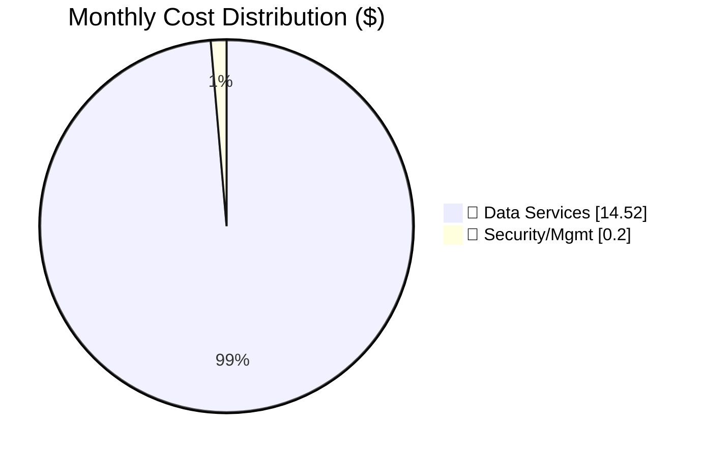

# Azure Cost Estimate: static-webapp-test

**Generated**: 2026-01-12
**Region**: swedencentral (Sweden Central)
**Environment**: Development
**MCP Tools Used**: azure_price_search
**Architecture Reference**: [Architecture Assessment](./02-architecture-assessment.md)

---

## 💰 Cost At-a-Glance

> **Monthly Total: ~$15** | Annual: ~$180
>
> ```
> Budget: $50/month (soft) | Utilization: 30% (~$15 of $50)
> ```
>
> | Status            | Indicator                             |
> | ----------------- | ------------------------------------- |
> | Cost Trend        | ➡️ Stable                             |
> | Savings Available | 💰 $0/year (already using free tiers) |
> | Compliance        | ✅ None (internal tool)               |

---

## ✅ Decision Summary

- ✅ Approved: Single-region, cost-optimized dev/test workload; keep SWA/Functions on free tiers
- ⏳ Deferred: Private endpoints, multi-region DR, dedicated always-warm compute
- 🔁 Redesign Trigger: If this becomes production-critical or traffic increases materially, SQL tier and SWA tier change

**Confidence**: Medium | **Expected Variance**: ±25% (SQL tier/usage and logs are the primary uncertainty)

---

## 🔁 Requirements → Cost Mapping

| Requirement                    | Architecture Decision            | Cost Impact  | Mandatory |
| ------------------------------ | -------------------------------- | ------------ | --------- |
| Internal tool, low criticality | Single region                    | Baseline     | Yes       |
| ~$50/month soft budget         | SWA Free + Functions Consumption | -$9/month 📉 | Yes       |
| Basic availability target      | SQL S0 baseline + alerts         | Baseline     | Yes       |

## 📊 Top 5 Cost Drivers

| Rank | Resource                                     | Monthly Cost | % of Total | Trend |
| ---- | -------------------------------------------- | ------------ | ---------- | ----- |
| 1️⃣   | Azure SQL Database (S0)                      | $14.52       | 99%        | ➡️    |
| 2️⃣   | Azure Monitor alert rules (x2)               | $0.20        | 1%         | ➡️    |
| 3️⃣   | Azure Static Web Apps (Free)                 | $0.00        | 0%         | ➡️    |
| 4️⃣   | Azure Functions (Consumption, integrated)    | $0.00        | 0%         | ➡️    |
| 5️⃣   | Application Insights / Log Analytics (<5 GB) | $0.00        | 0%         | ➡️    |

> 💡 **Quick Win**: If usage is sporadic, evaluate Azure SQL serverless to reduce idle-time spend.

---

## Summary

| Metric              | Value                         |
| ------------------- | ----------------------------- |
| 💵 Monthly Estimate | $15 - $18                     |
| 📅 Annual Estimate  | $180 - $216                   |
| 🌍 Primary Region   | swedencentral                 |
| 💳 Pricing Type     | List Price (PAYG)             |
| ⭐ WAF Score        | 7.2/10 (avg of pillar scores) |
| 🎯 Target Users     | 10 concurrent                 |

### Business Context

This workload is an internal tool for workflow validation testing.
The architecture intentionally optimizes for cost while meeting the stated 99.9% availability target for a
non-critical internal app.

---

## Architecture Overview

### Cost Distribution



### Key Design Decisions Affecting Cost

| Decision                  | Cost Impact        | Business Rationale                            | Status   |
| ------------------------- | ------------------ | --------------------------------------------- | -------- |
| Static Web Apps Free tier | -$9/month 📉       | Stay within $50 budget for dev/test           | Required |
| SQL Database S0 (10 DTU)  | Baseline           | Lowest managed SQL tier for light usage       | Required |
| No private endpoints      | -$7.30/endpoint 📉 | Public endpoints acceptable for internal tool | Accepted |
| Single region deployment  | Baseline           | DR not required; cost-optimized               | Required |

---

## 🧾 What We Are Not Paying For (Yet)

- Multi-region DR (active-active or warm standby)
- Private endpoints for PaaS services
- Dedicated always-warm compute for Functions
- Higher SQL tier for sustained throughput

---

## ⚠️ Cost Risk Indicators

| Resource              | Risk Level | Issue                                   | Mitigation                           |
| --------------------- | ---------- | --------------------------------------- | ------------------------------------ |
| Azure SQL Database S0 | 🟡 Medium  | DTU saturation may require tier upgrade | Alert on DTU > 80%, review monthly   |
| Log ingestion         | 🟡 Medium  | Exceeding free ingestion increases cost | Cap verbosity; set retention targets |
| Data egress           | 🟢 Low     | Low expected egress for internal users  | Monitor monthly egress               |

> **⚠️ Watch Item**: If transactions/day grows beyond projections, SQL tier upgrades become the primary cost driver.

---

## 🎯 Quick Decision Matrix

_"If you need X, expect to pay Y more"_

| Requirement                     | Additional Cost    | SKU Change                        | Notes                                 |
| ------------------------------- | ------------------ | --------------------------------- | ------------------------------------- |
| Production-ready SWA features   | +$9/month          | Static Web Apps: Free -> Standard | Staging/enterprise features           |
| Higher DB throughput            | +$15/month (est.)  | SQL: S0 -> S1                     | Use when DTU is consistently high     |
| Dedicated / always-warm compute | +$120/month (est.) | Functions: Consumption -> Premium | Avoid for this budget unless required |

---

## 🧩 Change Control

| Change Request                        | Delta              | Notes                                       |
| ------------------------------------- | ------------------ | ------------------------------------------- |
| Promote to production (SWA Standard)  | +$9/month          | Enables production SWA features             |
| Upgrade DB tier (S0 -> S1)            | +$15/month (est.)  | Triggered by sustained DTU saturation       |
| Dedicated compute (Functions Premium) | +$120/month (est.) | Only if strict latency/always-warm required |

---

## 💰 Savings Opportunities

> ### Total Potential Savings: $0/year
>
> This design already uses free/lowest tiers aligned to the requirements.

### Additional Optimization Strategies

| Strategy                                | Potential Savings | Effort    | Notes                                          |
| --------------------------------------- | ----------------- | --------- | ---------------------------------------------- |
| Keep SWA on Free for dev/test           | $9/month          | 🟢 Low    | Upgrade only if production features are needed |
| Reduce log ingestion                    | Variable          | 🟡 Medium | Avoid verbose logs; tune sampling              |
| Evaluate SQL serverless (if idle-heavy) | Variable          | 🟡 Medium | Only beneficial if workload is frequently idle |

---

## Detailed Cost Breakdown

### 💻 Compute Services

| Resource        | SKU         | Qty | $/Hour | $/Month | Notes                                                      |
| --------------- | ----------- | --- | ------ | ------- | ---------------------------------------------------------- |
| Static Web Apps | Free        | 1   | -      | $0.00   | Pricing not returned for Free tier via MCP query           |
| Azure Functions | Consumption | 1   | -      | $0.00   | Integrated with SWA; usage expected to stay in free grants |

**💻 Compute Subtotal**: ~$0.00/month

### 💾 Data Services

| Resource           | SKU         | Config    | $/Unit      | $/Month | Notes                    |
| ------------------ | ----------- | --------- | ----------- | ------- | ------------------------ |
| Azure SQL Database | S0 (10 DTU) | Single DB | $0.4839/day | $14.52  | $0.4839 \* 30 days (MCP) |

**💾 Data Subtotal**: ~$14.52/month

### 🔐 Security/Management

| Resource      | SKU    | Config  | $/Unit      | $/Month | Notes                                                      |
| ------------- | ------ | ------- | ----------- | ------- | ---------------------------------------------------------- |
| Azure Monitor | Alerts | 2 rules | $0.10/month | $0.20   | MCP shows multiple alert prices; using $0.10/rule estimate |

**🔐 Security/Management Subtotal**: ~$0.20/month

---

## 📋 Monthly Cost Summary

| Category         | Monthly Cost | % of Total | Trend |
| ---------------- | ------------ | ---------- | ----- |
| 💻 Compute       | $0.00        | 0%         | ➡️    |
| 💾 Data Services | $14.52       | 99%        | ➡️    |
| 🔐 Security/Mgmt | $0.20        | 1%         | ➡️    |
| **Total**        | **~$14.72**  | 100%       |       |

```
Cost Distribution:
💾 Data         ████████████████████████████████████████░░ 99%
🔐 Sec/Mgmt     █░░░░░░░░░░░░░░░░░░░░░░░░░░░░░░░░░░░░░░░░  1%
💻 Compute      ░░░░░░░░░░░░░░░░░░░░░░░░░░░░░░░░░░░░░░░░░  0%
```

---

## 🧮 Base Run Cost vs Growth-Variable Cost

| Cost Type       | Drivers     | Examples               | How It Scales                |
| --------------- | ----------- | ---------------------- | ---------------------------- |
| Base run        | fixed SKUs  | SQL S0                 | step-changes (tier upgrades) |
| Growth-variable | usage-based | logs, alerting, egress | increases with users/traffic |

---

## 🌍 Regional Comparison

| Region             | SQL S0 Cost | vs. Primary | Data Residency   | Recommendation                   |
| ------------------ | ----------- | ----------- | ---------------- | -------------------------------- |
| swedencentral      | $14.52/mo   | Baseline    | EU (Sweden) ✅   | **Selected**                     |
| germanywestcentral | $14.52/mo   | +0.0%       | EU (Germany)     | Alternative EU option            |
| westeurope         | $14.52/mo   | +0.0%       | EU (Netherlands) | Alternative EU option            |
| eastus             | $14.52/mo   | +0.0%       | US               | Lowest-latency for US-only users |

> 💡 **Decision**: swedencentral selected for EU preference and default region standards.

---

## 🔧 Environment Strategy (FinOps)

- Production: Not applicable (design is dev/test).
- Non-prod: Keep SWA/Functions on free tiers; only upgrade SQL tier when DTU saturation persists.

---

## 🔄 Environment Cost Comparison

| Environment              | Monthly Cost | vs. Dev  | Notes                                       |
| ------------------------ | ------------ | -------- | ------------------------------------------- |
| Development              | $14.72       | Baseline | Free/lowest tiers                           |
| Staging                  | $14.72       | 0%       | Same footprint (single environment pattern) |
| Production (if upgraded) | ~$23.72      | +61%     | SWA Standard (+$9)                          |

---

## 🛡️ Cost Guardrails

| Guardrail           | Threshold         | Action                                      |
| ------------------- | ----------------- | ------------------------------------------- |
| Budget alert        | 80% / 100% of $50 | Notify / require approval to upgrade tiers  |
| SQL DTU utilization | >80% sustained    | Evaluate S0 -> S1 or serverless             |
| Log ingestion       | >1 GB/week        | Tune verbosity, sampling, and retention     |
| Data egress         | >50 GB/month      | Investigate caching/CDN and traffic sources |

---

## 📝 Testable Assumptions

| Assumption         | Why It Matters             | How to Measure      | Threshold / Trigger |
| ------------------ | -------------------------- | ------------------- | ------------------- |
| Logs <= 5 GB/month | avoids ingestion costs     | Log Analytics usage | >5 GB/month         |
| SQL S0 sufficient  | prevents tier upgrade      | SQL DTU metrics     | >80% sustained      |
| Low egress         | keeps networking costs low | Azure Cost Mgmt     | >50 GB/month        |

---

## 📝 Assumptions

- **SQL billing basis**: $0.4839/day for SQL Database S0 in swedencentral (MCP) x 30 days
- **Alerting**: 2 alert rules at ~$0.10/month each (estimate; MCP returned multiple alert prices)
- **Logs**: assumed <= 5 GB/month to stay within common free grants
- **Usage**: 730 hours/month for always-on services
- **Prices queried**: 2026-01-12 via Azure Pricing MCP
- **Pricing**: Azure retail list prices (pay-as-you-go)

---

## 📊 Pricing Data Accuracy

> **📊 Data Source**: Prices retrieved from Azure Retail Prices API via Azure Pricing MCP
>
> ✅ **Included**: Retail list prices (PAYG)
>
> ❌ **Not Included**: EA discounts, CSP pricing, negotiated rates, Azure Hybrid Benefit
>
> 💡 For official quotes, validate with the Azure Pricing Calculator

---

## 🔗 References

- [Azure Pricing Calculator](https://azure.microsoft.com/pricing/calculator/)
- [Azure Retail Prices API](https://learn.microsoft.com/en-us/rest/api/cost-management/retail-prices/azure-retail-prices)
- [Architecture Assessment](./02-architecture-assessment.md)
