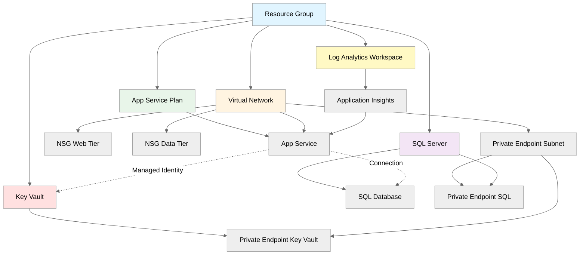

# Introduction

This plan provides a comprehensive implementation guide for deploying a HIPAA-compliant Azure infrastructure supporting Contoso Healthcare's patient portal. The architecture uses Azure App Service (Standard S1) for the web tier, Azure SQL Database (Standard S2) for data persistence, Azure Key Vault for secrets management, Application Insights for monitoring, and private endpoints for secure network isolation. The design prioritizes security, reliability, and cost-effectiveness while meeting stringent healthcare compliance requirements.

## Resources

### resourceGroup

```yaml
name: rg-contoso-patient-portal
kind: Raw
type: Microsoft.Resources/resourceGroups@2021-04-01

purpose: Foundation resource group for all patient portal resources
dependsOn: []

parameters:
  required:
    - name: location
      type: string
      description: Azure region for deployment
      example: 'eastus2'
    - name: resourceGroupName
      type: string
      description: Resource group name
      example: 'rg-contoso-patient-portal-prod'
  optional:
    - name: tags
      type: object
      description: Resource tags for governance
      default: { Environment: 'prod', ManagedBy: 'Bicep', Project: 'PatientPortal', CostCenter: 'Healthcare-IT', Compliance: 'HIPAA' }

outputs:
  - name: resourceGroupId
    type: string
    description: Resource group resource ID
  - name: resourceGroupName
    type: string
    description: Resource group name

estimatedCost:
  sku: N/A
  monthlyRange: "$0"
  costDrivers: ["No direct cost for resource group"]

references:
  docs: https://learn.microsoft.com/en-us/azure/azure-resource-manager/management/manage-resource-groups-portal
```

### virtualNetwork

```yaml
name: vnet-contoso-patient-portal
kind: AVM
avmModule: br/public:avm/res/network/virtual-network:0.7.1

purpose: Network isolation for patient portal resources with dedicated subnets
dependsOn: [resourceGroup]

parameters:
  required:
    - name: name
      type: string
      description: Virtual network name
      example: 'vnet-contoso-patient-portal-prod-eastus2'
    - name: addressPrefix
      type: string
      description: VNet address space
      example: '10.0.0.0/16'
    - name: subnets
      type: array
      description: Subnet definitions for web, data, and private endpoints
      example:
        - { name: 'snet-web-prod', addressPrefix: '10.0.1.0/24' }
        - { name: 'snet-data-prod', addressPrefix: '10.0.2.0/24' }
        - { name: 'snet-privateendpoints-prod', addressPrefix: '10.0.3.0/24', privateEndpointNetworkPolicies: 'Disabled' }
  optional:
    - name: location
      type: string
      description: Azure region
      default: 'eastus2'
    - name: tags
      type: object
      description: Resource tags
      default: { Environment: 'prod', ManagedBy: 'Bicep', Project: 'PatientPortal' }

outputs:
  - name: virtualNetworkId
    type: string
    description: VNet resource ID
  - name: subnetIds
    type: object
    description: Map of subnet names to resource IDs
  - name: virtualNetworkName
    type: string
    description: VNet name

estimatedCost:
  sku: Standard
  monthlyRange: "$0 - $5"
  costDrivers: ["Minimal cost for VNet", "Data transfer charges may apply"]

references:
  docs: https://learn.microsoft.com/en-us/azure/virtual-network/virtual-networks-overview
  avm: https://github.com/Azure/bicep-registry-modules/tree/avm/res/network/virtual-network/0.7.1
```

### networkSecurityGroupWeb

```yaml
name: nsg-web-prod
kind: AVM
avmModule: br/public:avm/res/network/network-security-group:0.5.2

purpose: Network security rules for web tier allowing HTTPS traffic
dependsOn: [virtualNetwork]

parameters:
  required:
    - name: name
      type: string
      description: NSG name for web subnet
      example: 'nsg-web-prod'
    - name: securityRules
      type: array
      description: Security rules for web tier
      example:
        - { name: 'AllowHTTPS', priority: 100, direction: 'Inbound', access: 'Allow', protocol: 'Tcp', sourceAddressPrefix: '*', sourcePortRange: '*', destinationAddressPrefix: '10.0.1.0/24', destinationPortRange: '443' }
        - { name: 'DenyAllInbound', priority: 4096, direction: 'Inbound', access: 'Deny', protocol: '*', sourceAddressPrefix: '*', sourcePortRange: '*', destinationAddressPrefix: '*', destinationPortRange: '*' }
  optional:
    - name: location
      type: string
      description: Azure region
      default: 'eastus2'

outputs:
  - name: nsgId
    type: string
    description: NSG resource ID
  - name: nsgName
    type: string
    description: NSG name

estimatedCost:
  sku: Standard
  monthlyRange: "$0"
  costDrivers: ["No direct cost for NSG"]

references:
  docs: https://learn.microsoft.com/en-us/azure/virtual-network/network-security-groups-overview
  avm: https://github.com/Azure/bicep-registry-modules/tree/avm/res/network/network-security-group/0.5.2
```

### networkSecurityGroupData

```yaml
name: nsg-data-prod
kind: AVM
avmModule: br/public:avm/res/network/network-security-group:0.5.2

purpose: Network security rules for data tier restricting access to web subnet only
dependsOn: [virtualNetwork]

parameters:
  required:
    - name: name
      type: string
      description: NSG name for data subnet
      example: 'nsg-data-prod'
    - name: securityRules
      type: array
      description: Security rules for data tier
      example:
        - { name: 'AllowWebToSQL', priority: 100, direction: 'Inbound', access: 'Allow', protocol: 'Tcp', sourceAddressPrefix: '10.0.1.0/24', sourcePortRange: '*', destinationAddressPrefix: '10.0.2.0/24', destinationPortRange: '1433' }
        - { name: 'DenyAllInbound', priority: 4096, direction: 'Inbound', access: 'Deny', protocol: '*', sourceAddressPrefix: '*', sourcePortRange: '*', destinationAddressPrefix: '*', destinationPortRange: '*' }
  optional:
    - name: location
      type: string
      description: Azure region
      default: 'eastus2'

outputs:
  - name: nsgId
    type: string
    description: NSG resource ID

estimatedCost:
  sku: Standard
  monthlyRange: "$0"
  costDrivers: ["No direct cost for NSG"]

references:
  docs: https://learn.microsoft.com/en-us/azure/virtual-network/network-security-groups-overview
  avm: https://github.com/Azure/bicep-registry-modules/tree/avm/res/network/network-security-group/0.5.2
```

### appServicePlan

```yaml
name: asp-contoso-patient-portal
kind: AVM
avmModule: br/public:avm/res/web/serverfarm:0.5.0

purpose: Compute capacity for patient portal web application with zone redundancy
dependsOn: [resourceGroup]

parameters:
  required:
    - name: name
      type: string
      description: App Service Plan name
      example: 'asp-contoso-patient-portal-prod'
    - name: sku
      type: object
      description: SKU definition for Standard S1
      example: { name: 'S1', tier: 'Standard', capacity: 2 }
  optional:
    - name: location
      type: string
      description: Azure region
      default: 'eastus2'
    - name: zoneRedundant
      type: bool
      description: Enable zone redundancy for HA
      default: true
    - name: tags
      type: object
      description: Resource tags
      default: { Environment: 'prod', ManagedBy: 'Bicep', Project: 'PatientPortal' }

outputs:
  - name: appServicePlanId
    type: string
    description: App Service Plan resource ID
  - name: appServicePlanName
    type: string
    description: App Service Plan name

estimatedCost:
  sku: Standard S1 (2 instances)
  monthlyRange: "$146"
  costDrivers:
    - "2x S1 instances: $73/instance/month"
    - "Zone redundancy included"
    - "100 GB storage included"

references:
  docs: https://learn.microsoft.com/en-us/azure/app-service/overview-hosting-plans
  avm: https://github.com/Azure/bicep-registry-modules/tree/avm/res/web/serverfarm/0.5.0
```

### appService

```yaml
name: app-contoso-patient-portal
kind: AVM
avmModule: br/public:avm/res/web/site:0.19.4

purpose: Patient portal web application with HTTPS-only and managed identity
dependsOn: [appServicePlan, virtualNetwork, applicationInsights]

parameters:
  required:
    - name: name
      type: string
      description: App Service name
      example: 'app-contoso-patient-portal-prod'
    - name: serverFarmResourceId
      type: string
      description: App Service Plan resource ID
      example: '/subscriptions/.../Microsoft.Web/serverfarms/asp-contoso-patient-portal-prod'
    - name: siteConfig
      type: object
      description: App configuration
      example:
        {
          httpsOnly: true,
          minTlsVersion: '1.2',
          ftpsState: 'Disabled',
          alwaysOn: true,
          http20Enabled: true
        }
  optional:
    - name: kind
      type: string
      description: App kind
      default: 'app'
    - name: managedIdentities
      type: object
      description: Managed identity configuration
      default: { systemAssigned: true }
    - name: virtualNetworkSubnetId
      type: string
      description: VNet integration subnet ID
      default: ''
    - name: publicNetworkAccess
      type: string
      description: Public access control
      default: 'Enabled'

outputs:
  - name: appServiceId
    type: string
    description: App Service resource ID
  - name: appServiceName
    type: string
    description: App Service name
  - name: defaultHostName
    type: string
    description: Default hostname
  - name: principalId
    type: string
    description: Managed identity principal ID

estimatedCost:
  sku: Included in App Service Plan
  monthlyRange: "$0"
  costDrivers: ["Cost included in App Service Plan", "No additional charges"]

references:
  docs: https://learn.microsoft.com/en-us/azure/app-service/overview
  avm: https://github.com/Azure/bicep-registry-modules/tree/avm/res/web/site/0.19.4
```

### sqlServer

```yaml
name: sql-contoso-patient-portal
kind: AVM
avmModule: br/public:avm/res/sql/server:0.21.0

purpose: SQL Server logical server with Microsoft Entra authentication
dependsOn: [resourceGroup]

parameters:
  required:
    - name: name
      type: string
      description: SQL Server name (globally unique)
      example: 'sql-contoso-patient-portal-prod'
    - name: administratorLogin
      type: string
      description: SQL administrator username
      example: 'sqladmin'
    - name: administratorLoginPassword
      type: securestring
      description: SQL administrator password
      example: '<secure-password>'
  optional:
    - name: location
      type: string
      description: Azure region
      default: 'eastus2'
    - name: minimalTlsVersion
      type: string
      description: Minimum TLS version
      default: '1.2'
    - name: publicNetworkAccess
      type: string
      description: Public access control
      default: 'Disabled'
    - name: administrators
      type: object
      description: Entra ID administrators
      default: {}

outputs:
  - name: sqlServerId
    type: string
    description: SQL Server resource ID
  - name: sqlServerName
    type: string
    description: SQL Server name
  - name: fullyQualifiedDomainName
    type: string
    description: SQL Server FQDN

estimatedCost:
  sku: No cost for logical server
  monthlyRange: "$0"
  costDrivers: ["Logical server has no cost", "Database costs apply"]

references:
  docs: https://learn.microsoft.com/en-us/azure/azure-sql/database/logical-servers
  avm: https://github.com/Azure/bicep-registry-modules/tree/avm/res/sql/server/0.21.0
```

### sqlDatabase

```yaml
name: sqldb-patients-prod
kind: AVM
avmModule: br/public:avm/res/sql/server/database:0.2.0

purpose: Patient data database with TDE encryption and Standard S2 performance
dependsOn: [sqlServer]

parameters:
  required:
    - name: name
      type: string
      description: Database name
      example: 'sqldb-patients-prod'
    - name: serverName
      type: string
      description: Parent SQL Server name
      example: 'sql-contoso-patient-portal-prod'
    - name: sku
      type: object
      description: Database SKU
      example: { name: 'S2', tier: 'Standard', capacity: 50 }
  optional:
    - name: maxSizeBytes
      type: int
      description: Maximum database size
      default: 268435456000
    - name: zoneRedundant
      type: bool
      description: Enable zone redundancy
      default: false
    - name: transparentDataEncryption
      type: object
      description: TDE configuration
      default: { state: 'Enabled' }
    - name: backupRetentionDays
      type: int
      description: Backup retention period
      default: 35

outputs:
  - name: databaseId
    type: string
    description: Database resource ID
  - name: databaseName
    type: string
    description: Database name

estimatedCost:
  sku: Standard S2 (50 DTUs)
  monthlyRange: "$150"
  costDrivers:
    - "50 DTUs: ~$150/month"
    - "250 GB max size included"
    - "TDE included at no cost"
    - "35-day backup retention: +$5-10/month"

references:
  docs: https://learn.microsoft.com/en-us/azure/azure-sql/database/sql-database-paas-overview
  avm: https://github.com/Azure/bicep-registry-modules/tree/avm/res/sql/server/database/0.2.0
```

### keyVault

```yaml
name: kv-contoso-patient
kind: AVM
avmModule: br/public:avm/res/key-vault/vault:0.13.3

purpose: Secure storage for database connection strings and application secrets
dependsOn: [resourceGroup]

parameters:
  required:
    - name: name
      type: string
      description: Key Vault name (globally unique)
      example: 'kv-contoso-patient-prod'
    - name: sku
      type: string
      description: Key Vault SKU
      example: 'standard'
  optional:
    - name: location
      type: string
      description: Azure region
      default: 'eastus2'
    - name: enableRbacAuthorization
      type: bool
      description: Use RBAC instead of access policies
      default: true
    - name: enableSoftDelete
      type: bool
      description: Enable soft delete
      default: true
    - name: softDeleteRetentionInDays
      type: int
      description: Soft delete retention period
      default: 90
    - name: enablePurgeProtection
      type: bool
      description: Enable purge protection
      default: true
    - name: publicNetworkAccess
      type: string
      description: Public access control
      default: 'Disabled'
    - name: networkAcls
      type: object
      description: Network ACL rules
      default: { bypass: 'AzureServices', defaultAction: 'Deny' }

outputs:
  - name: keyVaultId
    type: string
    description: Key Vault resource ID
  - name: keyVaultName
    type: string
    description: Key Vault name
  - name: keyVaultUri
    type: string
    description: Key Vault URI

estimatedCost:
  sku: Standard
  monthlyRange: "$3"
  costDrivers:
    - "Standard tier: $0.03 per 10,000 operations"
    - "Estimated 100k operations/month: ~$3"
    - "Soft delete and purge protection: no additional cost"

references:
  docs: https://learn.microsoft.com/en-us/azure/key-vault/general/overview
  avm: https://github.com/Azure/bicep-registry-modules/tree/avm/res/key-vault/vault/0.13.3
```

### privateEndpointKeyVault

```yaml
name: pe-keyvault-prod
kind: AVM
avmModule: br/public:avm/res/network/private-endpoint:0.11.1

purpose: Private endpoint for secure Key Vault access from VNet
dependsOn: [keyVault, virtualNetwork]

parameters:
  required:
    - name: name
      type: string
      description: Private endpoint name
      example: 'pe-keyvault-prod'
    - name: subnetResourceId
      type: string
      description: Private endpoint subnet ID
      example: '/subscriptions/.../subnets/snet-privateendpoints-prod'
    - name: privateLinkServiceConnections
      type: array
      description: Private link service connections
      example:
        - {
            name: 'pe-keyvault-connection',
            properties: {
              privateLinkServiceId: '<keyVaultId>',
              groupIds: ['vault']
            }
          }
  optional:
    - name: location
      type: string
      description: Azure region
      default: 'eastus2'
    - name: privateDnsZoneGroup
      type: object
      description: Private DNS zone configuration
      default: { privateDnsZoneConfigs: [{ name: 'privatelink-vaultcore-azure-net', privateDnsZoneId: '<privateDnsZoneId>' }] }

outputs:
  - name: privateEndpointId
    type: string
    description: Private endpoint resource ID
  - name: privateEndpointName
    type: string
    description: Private endpoint name

estimatedCost:
  sku: Standard
  monthlyRange: "$7"
  costDrivers:
    - "Private endpoint: $7.30/month"
    - "Data processing: $0.01/GB (minimal for Key Vault)"

references:
  docs: https://learn.microsoft.com/en-us/azure/private-link/private-endpoint-overview
  avm: https://github.com/Azure/bicep-registry-modules/tree/avm/res/network/private-endpoint/0.11.1
```

### privateEndpointSqlServer

```yaml
name: pe-sqlserver-prod
kind: AVM
avmModule: br/public:avm/res/network/private-endpoint:0.11.1

purpose: Private endpoint for secure SQL Server access from VNet
dependsOn: [sqlServer, virtualNetwork]

parameters:
  required:
    - name: name
      type: string
      description: Private endpoint name
      example: 'pe-sqlserver-prod'
    - name: subnetResourceId
      type: string
      description: Private endpoint subnet ID
      example: '/subscriptions/.../subnets/snet-privateendpoints-prod'
    - name: privateLinkServiceConnections
      type: array
      description: Private link service connections
      example:
        - {
            name: 'pe-sqlserver-connection',
            properties: {
              privateLinkServiceId: '<sqlServerId>',
              groupIds: ['sqlServer']
            }
          }
  optional:
    - name: location
      type: string
      description: Azure region
      default: 'eastus2'

outputs:
  - name: privateEndpointId
    type: string
    description: Private endpoint resource ID

estimatedCost:
  sku: Standard
  monthlyRange: "$7"
  costDrivers:
    - "Private endpoint: $7.30/month"
    - "Data processing: $0.01/GB"

references:
  docs: https://learn.microsoft.com/en-us/azure/private-link/private-endpoint-overview
  avm: https://github.com/Azure/bicep-registry-modules/tree/avm/res/network/private-endpoint/0.11.1
```

### logAnalyticsWorkspace

```yaml
name: log-contoso-patient-portal
kind: AVM
avmModule: br/public:avm/res/operational-insights/workspace:0.12.0

purpose: Centralized logging and monitoring workspace for Application Insights
dependsOn: [resourceGroup]

parameters:
  required:
    - name: name
      type: string
      description: Log Analytics workspace name
      example: 'log-contoso-patient-portal-prod'
    - name: sku
      type: string
      description: Pricing tier
      example: 'PerGB2018'
  optional:
    - name: location
      type: string
      description: Azure region
      default: 'eastus2'
    - name: retentionInDays
      type: int
      description: Data retention period
      default: 90
    - name: dailyQuotaGb
      type: int
      description: Daily ingestion cap (GB)
      default: 5

outputs:
  - name: workspaceId
    type: string
    description: Workspace resource ID
  - name: workspaceName
    type: string
    description: Workspace name
  - name: workspaceKey
    type: securestring
    description: Workspace primary key

estimatedCost:
  sku: Pay-as-you-go
  monthlyRange: "$15 - $30"
  costDrivers:
    - "Data ingestion: $2.76/GB"
    - "Estimated 5-10 GB/month: $15-30"
    - "90-day retention included"
    - "Extended retention: $0.12/GB/month"

references:
  docs: https://learn.microsoft.com/en-us/azure/azure-monitor/logs/log-analytics-workspace-overview
  avm: https://github.com/Azure/bicep-registry-modules/tree/avm/res/operational-insights/workspace/0.12.0
```

### applicationInsights

```yaml
name: appi-contoso-patient-portal
kind: AVM
avmModule: br/public:avm/res/insights/component:0.7.0

purpose: Application performance monitoring and diagnostics
dependsOn: [logAnalyticsWorkspace]

parameters:
  required:
    - name: name
      type: string
      description: Application Insights name
      example: 'appi-contoso-patient-portal-prod'
    - name: applicationType
      type: string
      description: Application type
      example: 'web'
    - name: workspaceResourceId
      type: string
      description: Log Analytics workspace ID
      example: '/subscriptions/.../Microsoft.OperationalInsights/workspaces/log-contoso-patient-portal-prod'
  optional:
    - name: location
      type: string
      description: Azure region
      default: 'eastus2'
    - name: kind
      type: string
      description: Component kind
      default: 'web'
    - name: publicNetworkAccessForIngestion
      type: string
      description: Public ingestion access
      default: 'Enabled'
    - name: publicNetworkAccessForQuery
      type: string
      description: Public query access
      default: 'Disabled'

outputs:
  - name: applicationInsightsId
    type: string
    description: Application Insights resource ID
  - name: instrumentationKey
    type: securestring
    description: Instrumentation key
  - name: connectionString
    type: securestring
    description: Connection string

estimatedCost:
  sku: Workspace-based (included in Log Analytics)
  monthlyRange: "$0"
  costDrivers:
    - "Ingestion costs via Log Analytics workspace"
    - "No separate Application Insights billing"

references:
  docs: https://learn.microsoft.com/en-us/azure/azure-monitor/app/app-insights-overview
  avm: https://github.com/Azure/bicep-registry-modules/tree/avm/res/insights/component/0.7.0
```

# Cost Estimation

## Monthly Cost Breakdown

| Resource | SKU/Tier | Quantity | Unit Cost | Monthly Cost |
|----------|----------|----------|-----------|--------------|
| App Service Plan | Standard S1 | 2 instances | $73/instance | $146 |
| SQL Database | Standard S2 | 1 | $150 | $150 |
| Key Vault | Standard | 1 | ~100k ops | $3 |
| Private Endpoints | Standard | 2 | $7.30/endpoint | $15 |
| Log Analytics | Pay-as-you-go | 5-10 GB | $2.76/GB | $15-30 |
| Application Insights | Workspace-based | Included | $0 | $0 |
| Virtual Network | Standard | 1 | Minimal | $2 |
| Network Security Groups | Standard | 2 | $0 | $0 |
| **Total** | | | | **$331 - $346** |

**Cost Optimization Opportunities:**

- **Azure Reservations**: Commit to 1-year or 3-year App Service Plan reservation for 30-40% savings (~$50/month)
- **SQL Database**: Consider Serverless tier during low-usage periods (potential $50-100/month savings)
- **Log Analytics**: Implement 100 GB/day commitment tier if usage exceeds 100 GB/month ($30-50/month savings)
- **Right-sizing**: Monitor App Service Plan usage and adjust instance count based on demand

**Cost Assumptions:**

- Region: East US 2 (consistent pricing across most US regions)
- Usage patterns:
  - Web traffic: ~10,000 users/month, typical SaaS pattern
  - Database: 50 DTU sustained usage (~70% of Standard S2 capacity)
  - Log ingestion: 5-10 GB/month (Application Insights + platform logs)
- Data transfer: Minimal egress (most traffic within Azure)
- Reservation discounts: Not included (could save 30-50% with 1-3 year reservations)
- Azure Hybrid Benefit: Not applicable (PaaS services)

# Resource Dependencies

## Dependency Diagram



**Deployment Order:**

1. **Phase 1 - Foundation (Resource Group, Networking)**
   - Resource Group
   - Virtual Network with subnets
   - Network Security Groups

2. **Phase 2 - Platform Services (Compute, Data, Monitoring)**
   - App Service Plan
   - SQL Server (logical server)
   - Key Vault
   - Log Analytics Workspace
   - Application Insights

3. **Phase 3 - Security & Integration (App, Database, Private Endpoints)**
   - SQL Database
   - Private Endpoints (Key Vault, SQL Server)
   - App Service (with VNet integration and managed identity)

4. **Phase 4 - Configuration (RBAC, Secrets, Settings)**
   - Key Vault RBAC assignments
   - Database connection strings in Key Vault
   - App Service configuration (connection strings, app settings)

# Implementation Plan

This implementation follows a phased approach to ensure each foundational component is deployed and validated before dependent resources are created. The plan prioritizes security configurations and ensures HIPAA compliance requirements are met at each stage.

## Phase 1 — Foundation & Networking

**Objective:** Establish core networking infrastructure with security controls and network isolation

**IMPLEMENT-GOAL-001:** Deploy resource group and virtual network with segmented subnets for web, data, and private endpoints

| Task | Description | Action |
|------|-------------|--------|
| TASK-001 | Create resource group | Deploy rg-contoso-patient-portal-prod in East US 2 |
| TASK-002 | Deploy virtual network | Create VNet with 10.0.0.0/16 address space |
| TASK-003 | Configure web tier subnet | Deploy snet-web-prod (10.0.1.0/24) for App Service VNet integration |
| TASK-004 | Configure data tier subnet | Deploy snet-data-prod (10.0.2.0/24) for database private endpoint |
| TASK-005 | Configure private endpoint subnet | Deploy snet-privateendpoints-prod (10.0.3.0/24) with private endpoint policies disabled |
| TASK-006 | Deploy web tier NSG | Create NSG with HTTPS allow rule (priority 100) and deny-all rule (priority 4096) |
| TASK-007 | Deploy data tier NSG | Create NSG with web-to-SQL allow rule and deny-all default |
| TASK-008 | Associate NSGs to subnets | Link NSGs to respective subnets for traffic filtering |

## Phase 2 — Platform Services

**Objective:** Deploy core platform services including compute, database, secrets management, and monitoring

**IMPLEMENT-GOAL-002:** Provision App Service Plan, SQL Server, Key Vault, and monitoring infrastructure

| Task | Description | Action |
|------|-------------|--------|
| TASK-001 | Deploy App Service Plan | Create Standard S1 plan with 2 instances and zone redundancy |
| TASK-002 | Deploy SQL Server | Create logical SQL Server with TLS 1.2 minimum and public access disabled |
| TASK-003 | Configure SQL admin credentials | Store SQL admin password in deployment parameter (to be moved to Key Vault) |
| TASK-004 | Deploy Key Vault | Create Key Vault with soft delete (90 days), purge protection, and RBAC enabled |
| TASK-005 | Configure Key Vault network | Set Key Vault to deny public access and allow Azure services bypass |
| TASK-006 | Deploy Log Analytics Workspace | Create workspace with pay-as-you-go pricing and 90-day retention |
| TASK-007 | Set Log Analytics daily cap | Configure 5 GB/day cap to control costs |
| TASK-008 | Deploy Application Insights | Create workspace-based Application Insights linked to Log Analytics |

## Phase 3 — Security & Application Deployment

**Objective:** Implement private endpoints, deploy application, and configure secure database access

**IMPLEMENT-GOAL-003:** Deploy SQL Database, establish private connectivity, and configure App Service with managed identity

| Task | Description | Action |
|------|-------------|--------|
| TASK-001 | Deploy SQL Database | Create Standard S2 database (50 DTUs) with TDE enabled and 35-day backup retention |
| TASK-002 | Deploy Key Vault private endpoint | Create private endpoint in snet-privateendpoints-prod subnet |
| TASK-003 | Configure Key Vault DNS | Set up Private DNS zone (privatelink.vaultcore.azure.net) and DNS zone group |
| TASK-004 | Deploy SQL Server private endpoint | Create private endpoint for SQL Server in private endpoint subnet |
| TASK-005 | Configure SQL DNS | Set up Private DNS zone (privatelink.database.windows.net) |
| TASK-006 | Deploy App Service | Create App Service with system-assigned managed identity |
| TASK-007 | Configure App Service security | Enable HTTPS-only, TLS 1.2 minimum, disable FTP, enable Always On |
| TASK-008 | Configure VNet integration | Integrate App Service with snet-web-prod subnet |
| TASK-009 | Link Application Insights | Configure Application Insights instrumentation via connection string |

## Phase 4 — Configuration & Access Management

**Objective:** Configure RBAC permissions, store secrets, and finalize application configuration

**IMPLEMENT-GOAL-004:** Assign RBAC roles, populate Key Vault secrets, and configure application settings

| Task | Description | Action |
|------|-------------|--------|
| TASK-001 | Assign Key Vault RBAC role | Grant 'Key Vault Secrets User' role to App Service managed identity |
| TASK-002 | Store SQL connection string | Add database connection string to Key Vault as secret |
| TASK-003 | Store Application Insights key | Add instrumentation key to Key Vault |
| TASK-004 | Configure App Service settings | Add Key Vault references for connection strings using @Microsoft.KeyVault syntax |
| TASK-005 | Configure diagnostic settings | Enable diagnostic logs for App Service to Log Analytics |
| TASK-006 | Configure SQL diagnostic settings | Enable database logs and metrics to Log Analytics |
| TASK-007 | Configure Key Vault logging | Enable audit logs to Log Analytics for compliance |
| TASK-008 | Configure NSG flow logs | Enable NSG flow logs to Log Analytics (optional, for enhanced monitoring) |
| TASK-009 | Validate managed identity access | Test App Service can retrieve secrets from Key Vault |
| TASK-010 | Validate database connectivity | Test App Service can connect to SQL Database via private endpoint |

# Testing Strategy

## Validation Steps

| Phase | Validation Method | Success Criteria | Tools |
|-------|-------------------|------------------|-------|
| Pre-deployment | Bicep build & lint | No errors, warnings reviewed and addressed | `bicep build`, `bicep lint`, `az bicep build` |
| Pre-deployment | What-if analysis | Expected changes match implementation plan | `az deployment group what-if` |
| Phase 1 | Network connectivity | VNet and subnets created, NSGs applied correctly | Azure Portal, `az network vnet show`, `az network nsg show` |
| Phase 1 | NSG rule validation | HTTPS allowed to web tier, SQL port 1433 allowed from web to data | `az network nsg rule list`, NSG effective rules in portal |
| Phase 2 | App Service Plan capacity | 2 instances provisioned, zone redundancy enabled | `az appservice plan show`, portal metrics |
| Phase 2 | SQL Server configuration | TLS 1.2 enforced, public access disabled | `az sql server show`, server properties |
| Phase 2 | Key Vault security | Soft delete enabled, purge protection on, RBAC enabled | `az keyvault show`, portal security settings |
| Phase 2 | Log Analytics workspace | Workspace operational, daily cap configured | `az monitor log-analytics workspace show`, usage metrics |
| Phase 3 | SQL Database encryption | TDE enabled, backups encrypted | `az sql db show`, encryption status |
| Phase 3 | Private endpoint connectivity | Private IPs assigned, DNS resolution working | `nslookup <keyvault>.vault.azure.net`, `nslookup <sqlserver>.database.windows.net` |
| Phase 3 | App Service managed identity | System-assigned identity created, principal ID available | `az webapp identity show` |
| Phase 3 | VNet integration | App Service integrated with web subnet | `az webapp vnet-integration list` |
| Phase 4 | RBAC assignments | App Service identity has Key Vault Secrets User role | `az role assignment list` |
| Phase 4 | Key Vault secret retrieval | App Service can read secrets via managed identity | App Service configuration test, application logs |
| Phase 4 | Database connectivity | App Service can connect to SQL via private endpoint | Application test, SQL query execution, connection logs |
| Phase 4 | Application Insights telemetry | Telemetry flowing to workspace, live metrics visible | Application Insights portal, Log Analytics queries |
| Post-deployment | Cost validation | Actual costs align with estimates ($331-346/month) | Azure Cost Management, billing portal |
| Post-deployment | Compliance audit | HIPAA controls verified (encryption, logging, access) | Azure Policy compliance, Security Center |

## Rollback Strategy

**If deployment fails at any phase:**

1. **Identify failed resource from error message**
   - Review deployment error output from Azure CLI or portal
   - Check activity log for specific resource failure

2. **Check dependencies are deployed correctly**
   - Verify parent resources exist (e.g., VNet before subnets, SQL Server before database)
   - Confirm resource IDs match expected values

3. **Review parameter values for errors**
   - Validate naming conventions (lowercase, no special chars except hyphens)
   - Confirm resource names are globally unique where required (Key Vault, SQL Server)
   - Check SKU/tier compatibility with subscription and region

4. **Delete failed resources**
   - **Development/Test**: Delete entire resource group and redeploy
   - **Production**: Delete specific failed resource and retry deployment

5. **Fix issue in Bicep template or parameters**
   - Update template with correct values
   - Re-run `bicep build` and `what-if` analysis

6. **Re-run deployment from failed phase**
   - Use incremental deployment mode to avoid recreating successful resources
   - Monitor deployment progress in portal

**Rollback Commands:**

```powershell
# Delete entire resource group (dev/test only - DESTRUCTIVE)
az group delete --name rg-contoso-patient-portal-prod --yes --no-wait

# Delete specific resource (production - selective)
az resource delete --ids /subscriptions/<subscription-id>/resourceGroups/rg-contoso-patient-portal-prod/providers/Microsoft.Web/sites/app-contoso-patient-portal-prod

# Re-validate template before re-deployment
az deployment group validate `
  --resource-group rg-contoso-patient-portal-prod `
  --template-file main.bicep `
  --parameters main.bicepparam

# Re-deploy with what-if check
az deployment group create `
  --resource-group rg-contoso-patient-portal-prod `
  --template-file main.bicep `
  --parameters main.bicepparam `
  --what-if

# Remove --what-if flag to execute deployment
az deployment group create `
  --resource-group rg-contoso-patient-portal-prod `
  --template-file main.bicep `
  --parameters main.bicepparam
```

**Phase-Specific Rollback Considerations:**

- **Phase 1 (Networking)**: Deleting VNet requires first removing all dependent resources (private endpoints, VNet-integrated apps)
- **Phase 2 (Platform Services)**: Key Vault soft delete means deleted vaults remain reserved for 90 days - use `--force-purge` only in dev/test
- **Phase 3 (Security)**: Private endpoints must be deleted before associated service resources (Key Vault, SQL Server)
- **Phase 4 (Configuration)**: RBAC role assignments and Key Vault secrets can be safely deleted and recreated without service impact

# High-level design

## Architecture Overview

The Contoso Healthcare patient portal uses a **secure, zone-redundant, HIPAA-compliant architecture** deployed in Azure East US 2. The design follows a three-tier approach with network segmentation, private connectivity, and centralized monitoring.

**Key Design Principles:**

1. **Security by Default**: All data at rest encrypted (TDE for SQL, Key Vault for secrets), HTTPS-only communication, TLS 1.2 minimum
2. **Network Isolation**: Private endpoints for data-tier services (Key Vault, SQL Database), VNet integration for App Service
3. **High Availability**: Zone-redundant App Service Plan (2 instances across availability zones), SQL Database Standard tier with geo-redundant backups
4. **Compliance**: HIPAA BAA automatically included, audit logging to Log Analytics, managed identities for passwordless authentication
5. **Cost Optimization**: Right-sized resources ($331-346/month), commitment tier opportunities for 30-50% savings

**Architecture Diagram:**

```

┌─────────────────────────────────────────────────────────────────────────┐
│                          Internet / Users                                │
└────────────────────────────┬────────────────────────────────────────────┘
                             │ HTTPS (443)
                             ▼
                    ┌────────────────────┐
                    │  Azure Front Door   │ (Optional - Phase 2)
                    │   - WAF enabled     │
                    │   - CDN caching     │
                    └──────────┬──────────┘
                               │
                               ▼
┌──────────────────────────────────────────────────────────────────────────┐
│                    Virtual Network (10.0.0.0/16)                         │
│  ┌────────────────────────────────────────────────────────────────────┐  │
│  │          Web Tier Subnet (10.0.1.0/24)                             │  │
│  │  ┌──────────────────────────────────────────────────────────┐      │  │
│  │  │  App Service Plan (Standard S1, 2 instances)            │      │  │
│  │  │  ┌────────────────────────────────────────────┐         │      │  │
│  │  │  │  App Service (Patient Portal Web App)      │         │      │  │
│  │  │  │  - HTTPS Only, TLS 1.2                     │         │      │  │
│  │  │  │  - Managed Identity                        │         │      │  │
│  │  │  │  - VNet Integrated                         │         │      │  │
│  │  │  │  - Application Insights Instrumented       │         │      │  │
│  │  │  └────────────────────────────────────────────┘         │      │  │
│  │  └──────────────────────────────────────────────────────────┘      │  │
│  │              │                           │                          │  │
│  │              │ (Managed Identity)        │ (Private Connection)     │  │
│  │              ▼                           ▼                          │  │
│  └──────────────────────────────────────────────────────────────────────┘  │
│                                                                             │
│  ┌────────────────────────────────────────────────────────────────────┐  │
│  │     Private Endpoint Subnet (10.0.3.0/24)                          │  │
│  │  ┌────────────────────┐      ┌────────────────────┐                │  │
│  │  │  Private Endpoint  │      │  Private Endpoint  │                │  │
│  │  │    (Key Vault)     │      │   (SQL Server)     │                │  │
│  │  └─────────┬──────────┘      └─────────┬──────────┘                │  │
│  └────────────┼─────────────────────────────┼──────────────────────────┘  │
│               │                             │                             │
│               ▼                             ▼                             │
│  ┌────────────────────────┐   ┌────────────────────────────────┐        │
│  │  Azure Key Vault       │   │  Azure SQL Server             │        │
│  │  - Soft Delete (90d)   │   │  - TLS 1.2 minimum            │        │
│  │  - Purge Protection    │   │  - Public access disabled     │        │
│  │  - RBAC enabled        │   │  - Entra ID auth              │        │
│  │  - Public access off   │   │  ┌─────────────────────────┐  │        │
│  └────────────────────────┘   │  │  SQL Database (S2, 50   │  │        │
│                                │  │  DTUs) - TDE enabled    │  │        │
│                                │  │  - 35-day retention     │  │        │
│                                │  └─────────────────────────┘  │        │
│                                └────────────────────────────────┘        │
└──────────────────────────────────────────────────────────────────────────┘
                                      │
                                      │ Diagnostic Logs
                                      ▼
                    ┌────────────────────────────────────┐
                    │  Log Analytics Workspace           │
                    │  - 90-day retention                │
                    │  - 5 GB/day cap                    │
                    │  ┌──────────────────────────────┐  │
                    │  │  Application Insights        │  │
                    │  │  - Live metrics              │  │
                    │  │  - Performance monitoring     │  │
                    │  └──────────────────────────────┘  │
                    └────────────────────────────────────┘

```

**Data Flow:**

1. **User Request**: Patient accesses portal via HTTPS → App Service (port 443)
2. **Application Layer**: App Service processes request, authenticates via managed identity
3. **Secret Retrieval**: App Service fetches connection strings from Key Vault via managed identity (no passwords stored in app)
4. **Database Query**: App Service queries SQL Database via private endpoint (no internet exposure)
5. **Monitoring**: Application Insights captures telemetry, logs flow to Log Analytics
6. **Audit Trail**: All resource operations logged to Log Analytics for HIPAA compliance

**Security Boundaries:**

- **Perimeter**: NSGs on all subnets with deny-all default rules
- **Data-tier Isolation**: Key Vault and SQL Server accessible only via private endpoints
- **Identity**: Managed identities eliminate password-based authentication
- **Encryption**: TLS 1.2 in transit, TDE at rest for SQL, Key Vault for secrets
- **Monitoring**: Centralized audit logging for compliance verification

**Compliance Mapping (HIPAA):**

- **Administrative Safeguards**: RBAC for access control, audit logs for accountability
- **Physical Safeguards**: Azure datacenter compliance (SOC 2, ISO 27001, HIPAA BAA)
- **Technical Safeguards**: Encryption at rest/transit, private endpoints, managed identities, diagnostic logging
- **Breach Notification**: Activity logs + Log Analytics enable breach detection and reporting

**Scalability & Performance:**

- **Compute**: App Service Plan can scale to 10 instances (Standard S1 limit)
- **Database**: SQL Standard S2 supports 50 DTUs (~60 concurrent connections)
- **Caching**: Application-level caching recommended for read-heavy workloads
- **CDN**: Azure Front Door (Phase 2) for global content delivery

**High Availability:**

- **App Service**: Zone-redundant deployment (2 instances across 3 zones = 99.95% SLA)
- **SQL Database**: Zone-redundant option available (upgrade to Premium for 99.995% SLA)
- **Composite SLA**: 99.95% (App Service) × 99.99% (SQL Standard) = **99.94% availability**
- **Backup**: SQL automated backups (35 days), geo-redundant storage available

**Future Enhancements:**

- **Phase 2**: Azure Front Door with WAF for global availability and DDoS protection
- **Phase 3**: Entra ID B2C for patient authentication and multi-factor authentication
- **Phase 4**: Azure API Management for REST API gateway and rate limiting
- **Phase 5**: Azure Cache for Redis for session state and caching (performance optimization)
