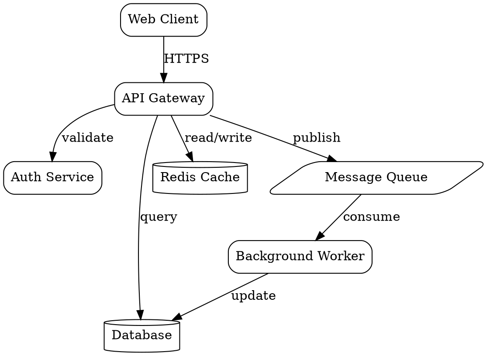
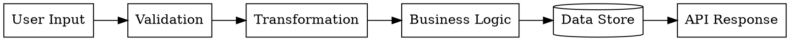
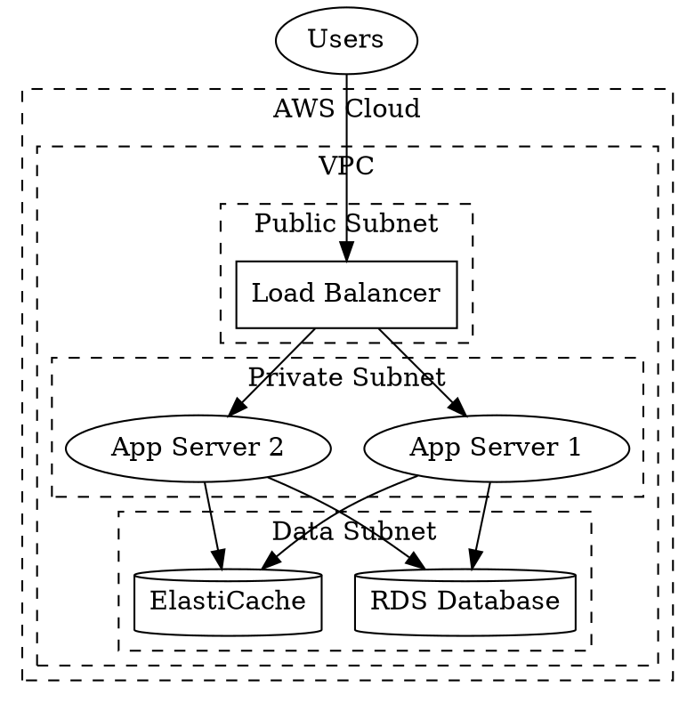
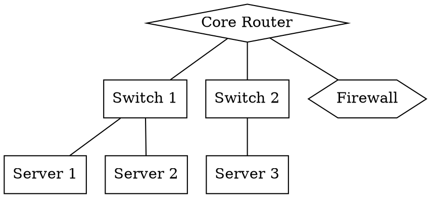

# Graphviz/DOT Diagram Patterns

## Architecture Diagrams

Use directed graphs with subgraphs for system architecture:

## Data Flow Diagrams

Use directed graphs with clear flow:

## Deployment Diagrams

Use clusters for infrastructure grouping:

## Network Topology

Use undirected graphs for network diagrams:

## Best Practices

- Use `rankdir` to control layout direction (TB, LR, BT, RL)
- Use clusters (subgraphs) to group related components
- Choose appropriate shapes: box, cylinder, diamond, ellipse, parallelogram
- Use edge labels to show protocols or data types
- Use `compound=true` for edges between clusters
- Apply styling with colors and line styles for emphasis
