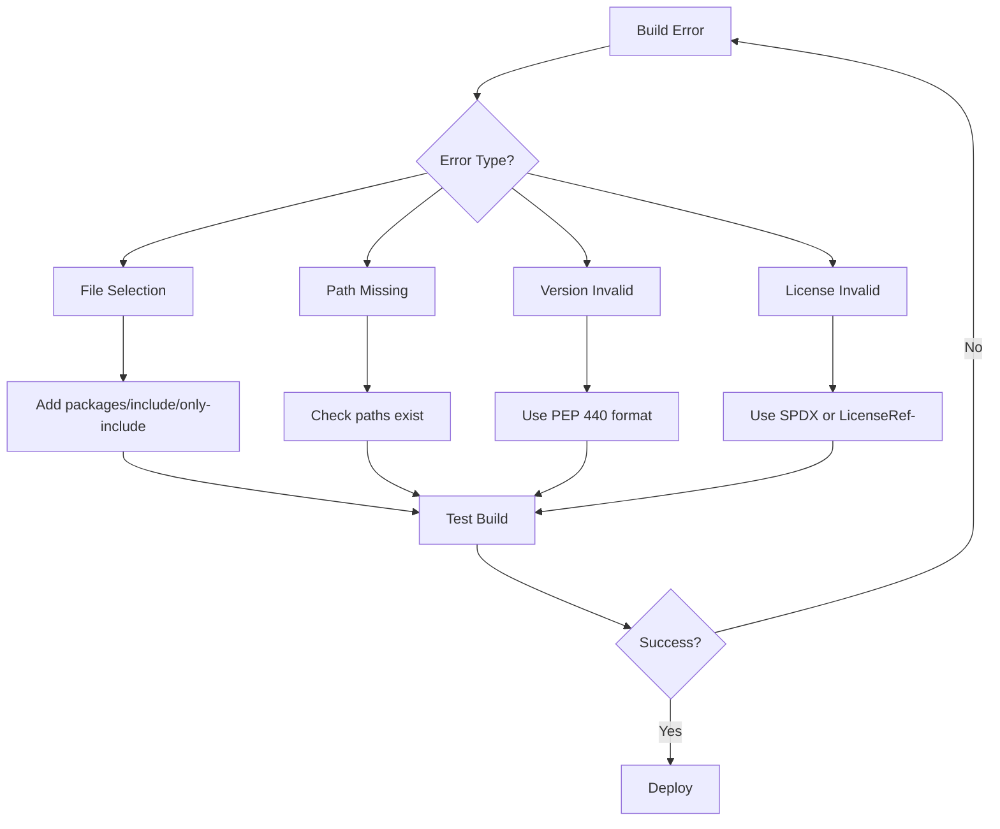

# Hatchling Error Handling & Validation Reference

## Overview

This comprehensive reference is designed to help you assist users with Hatchling build issues. It documents error handling, validation mechanisms, and resolution strategies in Hatchling, the modern Python packaging build backend. Use this reference when helping users understand common errors, validation rules, and best practices for robust package building.

## Documentation Structure

### Core Error Categories

1. **[Path Validation](./path-validation.md)**

   - Force-include path existence validation
   - Path normalization and case sensitivity
   - URI formatting and space escaping
   - Symlink resolution in dev mode

2. **[Wheel File Selection Errors](./wheel-file-selection.md)**

   - "At least one file selection option must be defined" error
   - File selection options (packages, include, only-include)
   - Default heuristics and when they fail
   - Bypass selection for metadata-only wheels

3. **[Version Validation & Bumping](./version-validation.md)**

   - PEP 440 version format validation
   - Standard version scheme and bumping
   - Version epoch handling
   - Dynamic version configuration

4. **[SPDX License Validation](./spdx-validation.md)**

   - SPDX expression validation
   - LicenseRef custom identifiers
   - PEP 639 compliance
   - License file configuration

5. **[Core Metadata Compatibility](./metadata-compatibility.md)**

   - Metadata version 2.1-2.4 compatibility
   - Field mapping across versions
   - PEP 517/660 compliance
   - Backward compatibility strategies

6. **[Heuristic Failure Handling](./heuristic-failures.md)**

   - Default detection mechanisms
   - Common heuristic failures
   - Package name normalization
   - Namespace package detection

7. **[Build-Time Validation](./build-validation.md)**
   - Build hook validation
   - Artifact validation
   - Metadata field validation
   - Output content validation

## Quick Error Resolution Guide

### Common Errors and Quick Fixes

| Error                                                | Quick Fix                                | Documentation                                     |
| ---------------------------------------------------- | ---------------------------------------- | ------------------------------------------------- |
| `At least one file selection option must be defined` | Add `packages = ["src/mypackage"]`       | [Wheel File Selection](./wheel-file-selection.md) |
| `Force-included path does not exist`                 | Ensure path exists or remove from config | [Path Validation](./path-validation.md)           |
| `Invalid version: x.y.z`                             | Use PEP 440 format: `1.0.0`              | [Version Validation](./version-validation.md)     |
| `Unknown license: [id]`                              | Use SPDX identifier or `LicenseRef-`     | [SPDX Validation](./spdx-validation.md)           |
| `Invalid classifier`                                 | Check against PyPI classifiers           | [Build Validation](./build-validation.md)         |

## Version Compatibility Matrix

| Hatchling | Python | Metadata | Key Features                    |
| --------- | ------ | -------- | ------------------------------- |
| 1.27.0+   | 3.8+   | 2.4      | Latest license fields           |
| 1.26.0+   | 3.8+   | 2.3      | Any LicenseRef- pattern         |
| 1.22.0+   | 3.8+   | 2.2      | Dependencies method             |
| 1.19.0+   | 3.8+   | 2.1      | Path validation, file selection |
| 1.18.0+   | 3.8+   | 2.1      | Dropped Python 3.7              |

## Essential Configuration Examples

### Minimal Working Configuration

```toml
[build-system]
requires = ["hatchling"]
build-backend = "hatchling.build"

[project]
name = "my-package"
version = "1.0.0"
description = "A simple package"
license = "MIT"
requires-python = ">=3.8"

[tool.hatch.build.targets.wheel]
packages = ["src/my_package"]
```

### Comprehensive Error-Preventing Configuration

```toml
[build-system]
requires = ["hatchling>=1.19.0"]
build-backend = "hatchling.build"

[project]
name = "robust-package"
dynamic = ["version"]
description = "Package with comprehensive validation"
license = "MIT OR Apache-2.0"
license-files = ["LICENSE*"]
requires-python = ">=3.8"
dependencies = [
    "requests>=2.28.0",
    "click>=8.0.0"
]

[tool.hatch.version]
path = "src/robust_package/__about__.py"
scheme = "standard"
validate-bump = true

[tool.hatch.build.targets.wheel]
packages = ["src/robust_package"]
exclude = ["**/__pycache__", "**/*.pyc"]

[tool.hatch.build.targets.wheel.force-include]
"README.md" = "robust_package/README.md"

[tool.hatch.metadata]
allow-direct-references = false
```

## Validation Scripts

### Pre-Build Validation

```python
#!/usr/bin/env python3
"""validate_project.py - Run before building."""

import sys
from pathlib import Path
import tomllib

def validate_all():
    """Run all validations."""
    errors = []

    # Load config
    with open("pyproject.toml", "rb") as f:
        config = tomllib.load(f)

    # Check required fields
    project = config.get("project", {})
    if not project.get("name"):
        errors.append("Missing project.name")

    # Check build config
    wheel = (config.get("tool", {})
             .get("hatch", {})
             .get("build", {})
             .get("targets", {})
             .get("wheel", {}))

    if not any([wheel.get(k) for k in
                ["packages", "include", "only-include", "bypass-selection"]]):
        errors.append("No file selection configured")

    # Check paths exist
    for package in wheel.get("packages", []):
        if not Path(package).exists():
            errors.append(f"Package directory not found: {package}")

    if errors:
        print("Validation errors found:")
        for error in errors:
            print(f"  ✗ {error}")
        sys.exit(1)

    print("✓ All validations passed")

if __name__ == "__main__":
    validate_all()
```

## Migration Guides

### From setuptools to Hatchling

```python
# setup.py (old)
from setuptools import setup, find_packages

setup(
    name="my-package",
    version="1.0.0",
    packages=find_packages(where="src"),
    package_dir={"": "src"},
    install_requires=["requests>=2.28.0"],
    license="MIT",
)
```

```toml
# pyproject.toml (new)
[build-system]
requires = ["hatchling"]
build-backend = "hatchling.build"

[project]
name = "my-package"
version = "1.0.0"
dependencies = ["requests>=2.28.0"]
license = "MIT"

[tool.hatch.build.targets.wheel]
packages = ["src/my_package"]
```

## Best Practices Summary

1. **Always specify file selection** explicitly for wheels
2. **Use PEP 440** version formats
3. **Validate paths** before building
4. **Use SPDX identifiers** for licenses
5. **Test builds** in CI/CD
6. **Pin Hatchling version** for stability
7. **Document non-standard** layouts
8. **Automate validation** checks

## Troubleshooting Workflow



## Additional Resources

### Official Documentation

- [Hatch Documentation](https://hatch.pypa.io/)
- [Python Packaging Guide](https://packaging.python.org/)
- [PEP 517](https://peps.python.org/pep-0517/) - Build System Interface
- [PEP 621](https://peps.python.org/pep-0621/) - Project Metadata
- [PEP 639](https://peps.python.org/pep-0639/) - License Metadata

### Specifications

- [Core Metadata Specifications](https://packaging.python.org/specifications/core-metadata/)
- [SPDX License List](https://spdx.org/licenses/)
- [PEP 440](https://peps.python.org/pep-0440/) - Version Identification

### Tools

- [validate-pyproject](https://github.com/abravalheri/validate-pyproject) - Validation tool
- [twine](https://twine.readthedocs.io/) - Package validation and upload
- [check-wheel-contents](https://github.com/jwodder/check-wheel-contents) - Wheel validation

## Contributing

To contribute to this documentation:

1. Follow the existing format and structure
2. Include version information for features
3. Provide working code examples
4. Test all examples with current Hatchling
5. Update the index when adding new documents

## Version

This documentation is current as of Hatchling v1.27.0 (November 2024).

## License

This documentation is provided under the same license as the parent project.
