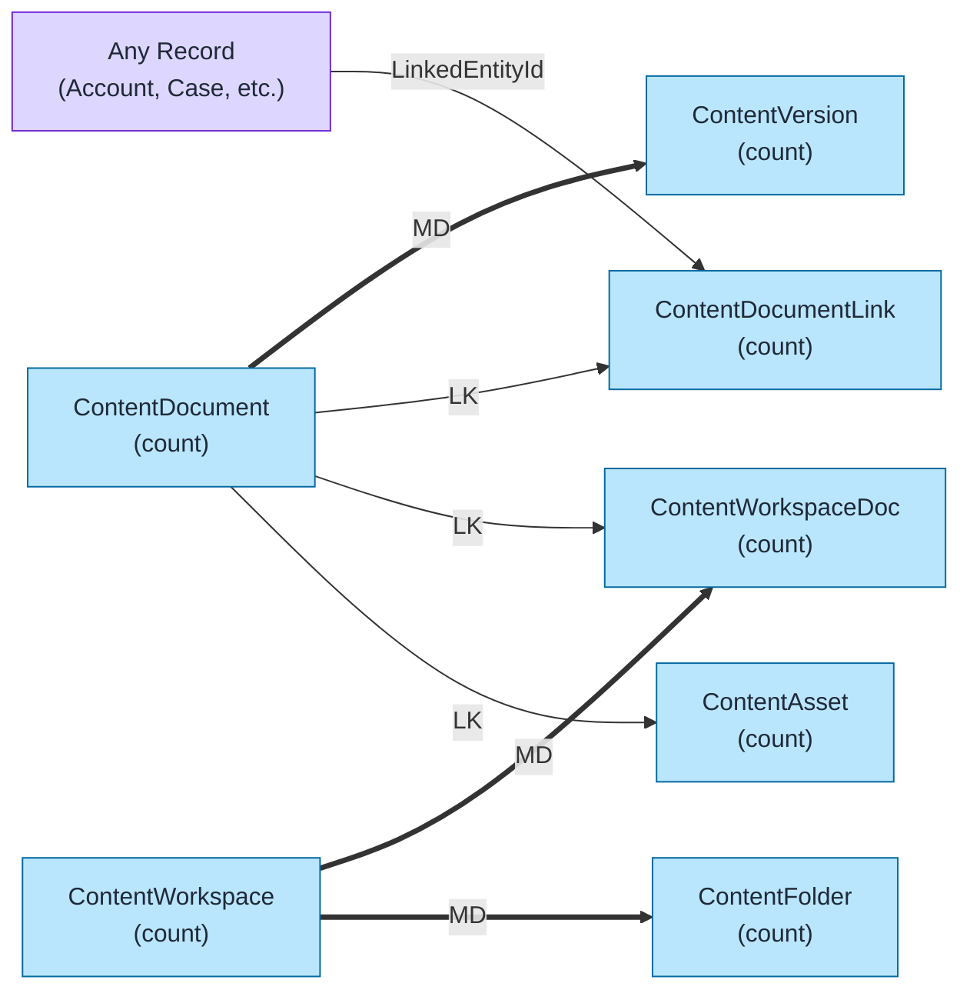
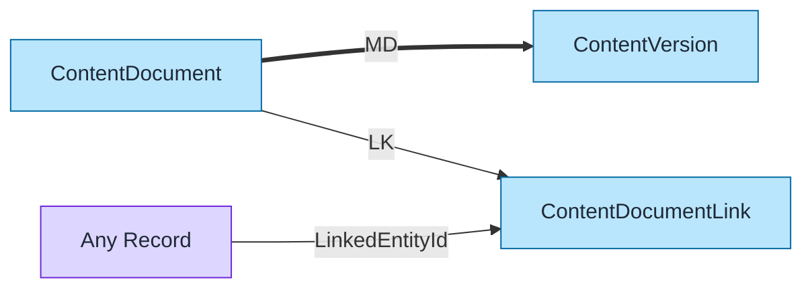
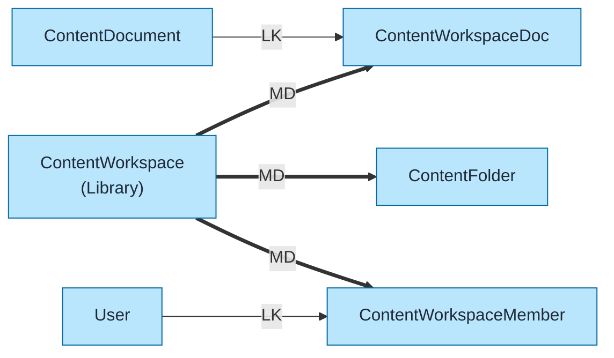

# Salesforce Files Data Model Template

Pre-built data model for Salesforce Files (Content) using `flowchart LR` format with color coding and relationship indicators.

## Objects Included

| Object | Type | Description |
|--------|------|-------------|
| ContentDocument | STD | File container |
| ContentVersion | STD | File versions |
| ContentDocumentLink | STD | Links files to records |
| ContentWorkspace | STD | Content libraries |
| ContentWorkspaceDoc | STD | Library membership |
| ContentFolder | STD | Folder structure |
| ContentAsset | STD | Asset files |

---

## Query Org Metadata (Recommended)

Enrich diagram with live org data:

```bash
python3 ~/.claude/plugins/marketplaces/sf-skills/sf-diagram-mermaid/scripts/query-org-metadata.py \
    --objects ContentDocument,ContentVersion,ContentDocumentLink,ContentWorkspace \
    --target-org myorg
```

---

## Mermaid Template (Preferred)

Left-to-right flowchart with color coding.



---

## Key Concepts

### Content Architecture
```
ContentDocument (Container)
    ├── ContentVersion (Current + History)
    ├── ContentDocumentLink (Sharing to Records)
    └── ContentWorkspaceDoc (Library Membership)
```

### ContentDocument vs ContentVersion
| Object | Purpose |
|--------|---------|
| ContentDocument | File metadata container (one per file) |
| ContentVersion | Actual file data + versions |

**Key**: Always query ContentVersion for file data. ContentDocument is just the container.

### ContentDocumentLink (CDL)
- Links ContentDocument to **any Salesforce record**
- `LinkedEntityId` is polymorphic (Account, Case, User, etc.)
- Controls visibility/sharing

| ShareType | Visibility |
|-----------|------------|
| V | Viewer |
| C | Collaborator |
| I | Inferred |

### File Visibility
| Visibility | Access |
|------------|--------|
| AllUsers | All internal users |
| InternalUsers | Users with record access |
| SharedUsers | Explicitly shared users |

---

## Simplified Version (Core Objects Only)

For presentations focusing on core file structure:



---

## Content Libraries Model

For file library organization:



---

## ASCII Fallback

```
┌─────────────────────────────────────────────────────────────────────────────┐
│  SALESFORCE FILES DATA MODEL (L→R)                                           │
│  Legend: LK = Lookup (-->), MD = Master-Detail (==>)                        │
└─────────────────────────────────────────────────────────────────────────────┘

                              FILE STRUCTURE
┌──────────────────┐         ┌──────────────────┐
│ CONTENT_DOCUMENT │═══ MD ═>│ CONTENT_VERSION  │
│     (count)      │         │    (count)       │
└────────┬─────────┘         └──────────────────┘
         │
         │ LK
         ▼
┌──────────────────────┐         ┌──────────────────┐
│CONTENT_DOCUMENT_LINK │<── LK ──│    ANY RECORD    │
│      (count)         │         │ (Account, Case)  │
└──────────────────────┘         └──────────────────┘

                           LIBRARY STRUCTURE
┌──────────────────┐         ┌──────────────────────┐
│ CONTENT_WORKSPACE│═══ MD ═>│CONTENT_WORKSPACE_DOC │
│    (Library)     │         │      (count)         │
└────────┬─────────┘         └──────────┬───────────┘
         │                              │
         │ MD                           │ LK
         ▼                              ▼
┌──────────────────┐         ┌──────────────────────┐
│  CONTENT_FOLDER  │         │   CONTENT_DOCUMENT   │
│     (count)      │         │      (count)         │
└──────────────────┘         └──────────────────────┘
```

---

## Key Relationships Summary

| Parent | Child | Type | Behavior |
|--------|-------|------|----------|
| ContentDocument | ContentVersion | MD | Cascade delete |
| ContentDocument | ContentDocumentLink | LK | Sharing links |
| ContentWorkspace | ContentWorkspaceDoc | MD | Library files |
| ContentWorkspace | ContentFolder | MD | Library folders |
| ContentWorkspace | ContentWorkspaceMember | MD | Library members |
| ContentDocument | ContentWorkspaceDoc | LK | File in library |
| ContentDocument | ContentAsset | LK | Asset reference |

---

## Limits & Considerations

| Limit | Value |
|-------|-------|
| File size | 2 GB (max) |
| Versions per file | 20 (default, configurable) |
| Libraries per org | Varies by edition |
| CDL per file | No hard limit (LDV) |
| Files storage | Org storage limit |

---

## Common Queries

### Files attached to a record
```sql
SELECT ContentDocumentId, ContentDocument.Title
FROM ContentDocumentLink
WHERE LinkedEntityId = '001xxx'
```

### Latest version of a file
```sql
SELECT Id, Title, VersionData
FROM ContentVersion
WHERE ContentDocumentId = '069xxx'
AND IsLatest = true
```

---

## Best Practices

1. **Use `flowchart LR`** - Left-to-right flow for readability
2. **Keep objects simple** - Name + record count only
3. **Replace `(count)` placeholders** - With actual counts from query
4. **Add LDV indicator** - For objects >2M records: `LDV[~4M]`
5. **Color code object types** - Blue=Standard, Orange=Custom, Green=External
