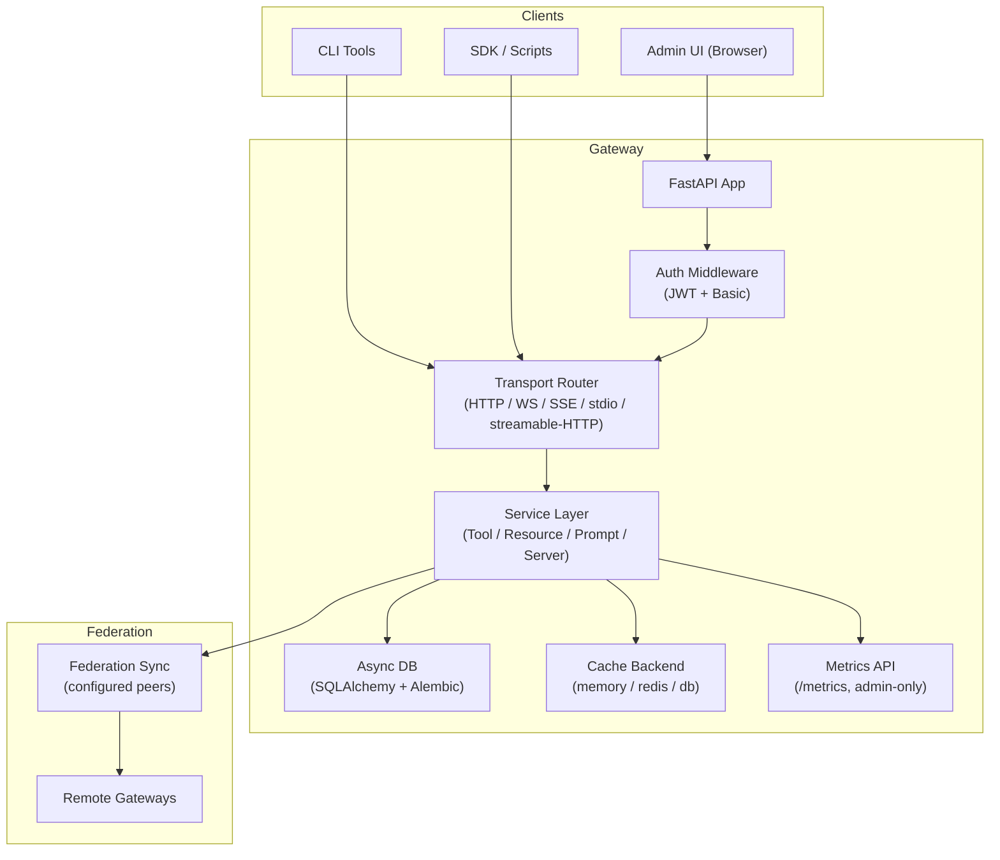

# Architecture Overview

The **MCP Gateway** (ContextForge) is a production-grade gateway, proxy, and registry for Model Context Protocol (MCP) servers and A2A Agents. It acts as a unified entry point for tools, resources, prompts, and servers, federating local and remote nodes into a coherent MCP-compliant interface.

## High-Level Architecture Summary

**MCP Gateway (ContextForge)** is a comprehensive production-grade gateway built on modern Python technologies with a performance-first approach. For a detailed visual diagram of the high-performance components (Rust-powered libraries, async patterns, caching layers, and Kubernetes scaling), see the [Performance Architecture Diagram](performance-architecture.md).

## Design Diagrams

The following diagrams are generated by `make docs` and provide a quick visual reference for the codebase structure:


### Core Technology Stack

**1. Python FastAPI Application with Modern Stack**

- Built with **FastAPI** (async web framework) for high-performance REST/JSON-RPC endpoints
- Uses **Pydantic 2.11+** for runtime validation and **Pydantic Settings** for environment-based configuration
- Requires **Python 3.11-3.13** with full async/await support throughout
- Deployed via **Uvicorn** (dev) or **Gunicorn** (production) ASGI servers

**2. Multi-Database ORM Layer with SQLAlchemy 2.0**

- **SQLAlchemy 2.0** ORM with async support for database operations
- Supports **PostgreSQL** (via psycopg3), **SQLite** (default, file-based), and **MariaDB/MySQL** (via pymysql)
- **Alembic** for schema migrations and version control
- Connection pooling with configurable pool sizes (200 default), overflow (10), and recycling (3600s)

**3. Multi-Transport Protocol Gateway**

- Native **MCP (Model Context Protocol)** server implementation supporting protocol version 2025-03-26
- Transport mechanisms: **HTTP/JSON-RPC**, **Server-Sent Events (SSE)** with keepalive, **WebSocket**, **stdio** (for CLI integration), and **streamable-HTTP**
- JSON-RPC 2.0 compliant message handling with bidirectional communication

**4. Federation & Registry Architecture**

- Acts as an **MCP Registry** that federates multiple peer gateways
- **Auto-discovery** via mDNS/Zeroconf or manual configuration
- **Redis-backed caching and federation** for multi-cluster deployments (optional, can use memory or database caching)
- Health checking with configurable intervals (60s default) and failure thresholds

**5. Virtual Server Composition System**

- Wraps non-MCP REST/gRPC services as **virtual MCP servers**
- Composes tools, prompts, and resources from multiple backends into unified virtual servers
- Supports REST-to-MCP tool adaptation with automatic JSON Schema extraction
- Tool, resource, and prompt registries with versioning and rollback capabilities

**6. Multi-Tenant RBAC & Authentication**

- **Email-based authentication** with **Argon2id** password hashing (time_cost=3, memory_cost=65536 KiB)
- **JWT authentication** (HS256/RS256) with configurable expiration and audience verification
- **SSO integration**: GitHub OAuth, Google OAuth, Microsoft Entra ID, IBM Security Verify, Okta, Keycloak, generic OIDC
- **OAuth 2.0 with Dynamic Client Registration (DCR)** per RFC 7591 and RFC 8414 discovery
- **Teams and RBAC**: Personal teams, team invitations, role-based permissions (global/team/personal scopes)

**7. Plugin Framework**

- Extensible plugin system with pre/post request/response hooks
- Built-in plugins: PII filter, deny filter, regex filter, resource filter
- Plugin configuration via YAML with hot-reload support
- CLI tools for plugin management (`mcpplugins` command)

**8. Admin UI & Observability**

- **HTMX + Alpine.js** web UI for real-time management and configuration
- Real-time log viewer with filtering, search, and export (in-memory buffer with 1MB default size)
- **OpenTelemetry observability** with support for Jaeger, Zipkin, Phoenix, and OTLP backends
- Support bundle generation for troubleshooting (logs, config, system stats - auto-sanitized)

**9. Agent-to-Agent (A2A) Integration**

- Integrates external AI agents (OpenAI, Anthropic, custom) as tools within virtual servers
- Auto-tool creation for associated A2A agents with invocation routing
- Comprehensive metrics collection for agent interactions
- Configurable timeouts (30s default), retries (3 max), and agent limits (100 max)

**10. Security & Rate Limiting**

- Configurable authentication schemes: Basic Auth, JWT Bearer, custom headers
- Rate limiting with configurable tool rate limits (100 req/min default) and concurrent limits (10)
- Security headers (HSTS, X-Frame-Options, CSP, X-Content-Type-Options, X-XSS-Protection, Referrer-Policy), CORS with domain whitelisting
- Input validation with JSON Schema, length limits, and dangerous pattern detection
- mTLS support for plugin client-server communication

**11. Resource & Content Management**

- URI-based resource access with MIME detection and content negotiation
- Resource caching (1000 items, 3600s TTL) with size limits (10MB default)
- Support for text, markdown, HTML, JSON, XML, images (PNG/JPEG/GIF)
- **Jinja2 template rendering** for prompts with multimodal support

**12. Development & Testing Infrastructure**

- Comprehensive test suite: unit, integration, e2e, security, fuzz, Playwright UI tests
- **VS Code Dev Container** support with pre-configured environment
- Hot-reload development mode with debug logging
- Extensive linting: Black, isort, Ruff, Flake8, Bandit, Pylint, mypy (strict mode)
- Coverage tracking with HTML reports and pytest-cov integration

**13. Deployment & Scalability**

- **Docker/Podman container images** with rootless support
- **Kubernetes-ready** with Redis-backed federation for multi-cluster deployments
- **IBM Cloud Code Engine** deployment automation via Makefile targets
- Environment-based configuration (`.env` files) with 100+ configurable parameters
- Production-ready logging (JSON/text formats) with rotation support

**14. Well-Known URI & Standards Compliance**

- Implements `.well-known/mcp` endpoint for MCP discovery
- Configurable `robots.txt`, `security.txt`, and custom well-known files
- Standards compliance: RFC 5424 (syslog), RFC 7591 (DCR), RFC 8414 (OAuth discovery), JSON-RPC 2.0

**15. MCP Server Catalog & Service Discovery**

- **MCP Server Catalog** feature for centralized server registry
- YAML-based catalog configuration with auto-health checking
- Pagination support (100 items/page default) with caching (3600s TTL)

### Performance-Optimized Foundation

ContextForge leverages cutting-edge Rust-powered components for maximum throughput and minimal latency:

- **orjson (Rust-Powered JSON Serialization)**: High-performance JSON parsing and serialization using Rust internals, delivering 5-6x faster serialization and 1.5-2x faster deserialization compared to Python's standard library, with 7% smaller output size. Enables sub-millisecond JSON-RPC responses even for large payloads.
- **Pydantic V2 (Rust-Core Validation)**: Runtime validation and data serialization powered by Pydantic 2.11+ with its Rust-based pydantic-core engine, providing 5-50x performance improvements over Pydantic V1 for schema validation, type coercion, and model serialization.
- **PyO3 Rust Plugins**: Extensible plugin framework supporting Rust modules via PyO3, enabling native-speed Python extensions for performance-critical operations. Rust plugins provide near-native performance for compute-intensive tasks while integrating seamlessly with the Python ecosystem.

This performance-first architecture enables ContextForge to handle high-throughput workloads while maintaining low latency for tool invocations, resource access, and federation operations.

### CI/CD Pipeline with GitHub Actions

**Automated Quality Assurance & Security**

The project maintains production-grade quality through comprehensive GitHub Actions workflows:

**Build & Package Workflows:**

- **Python Package Build** (`python-package.yml`): Multi-version builds (Python 3.10-3.12) with wheel/sdist creation, metadata validation (twine), manifest checking, and package quality assessment (pyroma)
- **Docker Release** (`docker-release.yml`): Automated container image releases to GitHub Container Registry (GHCR) with semantic versioning

**Testing & Coverage:**

- **Tests & Coverage** (`pytest.yml`): Comprehensive test suite across Python 3.11-3.12 with pytest, branch coverage measurement (80% threshold), doctest validation (40% threshold), and coverage reporting
- **Playwright UI Tests**: End-to-end browser automation testing for admin UI workflows

**Security Scanning:**

- **Bandit Security** (`bandit.yml`): Python static analysis for security vulnerabilities (MEDIUM+ severity, HIGH confidence), SARIF upload for GitHub Security tab, weekly scheduled scans
- **CodeQL Advanced** (`codeql.yml`): Multi-language analysis (JavaScript/TypeScript, Python, GitHub Actions), security vulnerability detection, code quality checks, weekly scheduled scans (Wednesday 21:15 UTC)
- **Dependency Review** (`dependency-review.yml`): Automated dependency vulnerability scanning on pull requests

**Container Security:**

- **Secure Docker Build** (`docker-image.yml`):

  - Dockerfile linting with **Hadolint** (SARIF reports)
  - Image linting with **Dockle** (SARIF reports)
  - SBOM generation with **Syft** (SPDX format)
  - Vulnerability scanning with **Trivy** and **Grype** (CRITICAL CVEs)
  - Image signing and attestation with **Cosign** (keyless OIDC)
  - BuildKit layer caching for faster rebuilds
  - Weekly scheduled scans (Tuesday 18:17 UTC)

**Code Quality & Linting:**

- **Lint & Static Analysis** (`lint.yml`): Comprehensive multi-tool linting matrix

  - **Syntax & Format**: yamllint, JSON validation (jq), TOML validation (tomlcheck)
  - **Python Analysis**: Flake8, Ruff, Unimport, Vulture (dead code), Pylint (errors-only), Interrogate (100% docstring coverage), Radon (complexity metrics)
  - **Web Assets**: HTML/CSS/JS linting (`lint-web.yml`)
  - Each linter runs in isolated matrix jobs for fast-fail visibility

**Deployment:**

- **IBM Cloud Code Engine** (`ibm-cloud-code-engine.yml`): Automated deployment to IBM Cloud with environment configuration and health checks

**Key CI/CD Features:**

- **SARIF Integration**: All security tools upload findings to GitHub Security tab for centralized vulnerability management
- **Artifact Management**: Build artifacts (wheels, coverage reports, SBOMs) uploaded and versioned
- **Fail-Safe Design**: Continue-on-error for non-blocking scans with final quality gates
- **Scheduled Scans**: Weekly security scans to catch newly disclosed CVEs
- **Multi-Version Testing**: Matrix builds across Python 3.10-3.13 to ensure compatibility
- **Cache Optimization**: Pip cache, BuildKit cache, and dependency caching for faster runs

This architecture supports both small single-instance deployments (SQLite + memory cache) and large-scale multi-cluster deployments (PostgreSQL + Redis + federation), making it suitable for development, staging, and production environments.

## Deployment Flexibility: Why Not Envoy/Istio?

ContextForge is architected for **maximum deployment flexibility**, from standalone Python modules to multi-regional container orchestration. This design philosophy fundamentally differs from service mesh architectures like Envoy/Istio.

### Modular Standalone Execution

The ContextForge ecosystem consists of **independently deployable modules** that can run standalone or be composed together:

**Core Gateway:**

- `mcp-contextforge-gateway-core` - FastAPI gateway with 33 services, 11 routers (~150K lines)
- `mcp-contextforge-gateway-ui` - HTMX + Alpine.js admin interface

**Independent Utilities (Zero Gateway Dependencies):**

- `mcp-contextforge-translate` - Protocol bridge: stdio ↔ SSE ↔ HTTP ↔ gRPC
- `mcp-contextforge-wrapper` - MCP client wrapper
- `mcp-contextforge-reverse-proxy` - NAT/firewall traversal proxy

**Plugin Ecosystem:**

- `mcp-contextforge-plugins-python` - 40+ Python plugins
- `mcp-contextforge-plugins-rust` - High-performance PyO3 plugins

**MCP Servers (Zero Gateway Dependencies):**

Sample servers:

- `mcp-contextforge-mcp-servers-python` - 4 Python servers
- `mcp-contextforge-mcp-servers-go` - 5 Go servers (static binaries, 5-15 MB)
- `mcp-contextforge-mcp-servers-rust` - Rust servers (static binaries, 3-10 MB)

**Agent Runtimes:**

Sample runtimes:

- `mcp-contextforge-agent-runtimes` - LangChain + future runtimes

**Infrastructure:**

- `mcp-contextforge-helm` - Kubernetes Helm charts (OCI registry)
- `mcp-contextforge-deployment-scripts` - Terraform, Ansible, Docker Compose

### Deployment Spectrum

**Standalone Execution:**

- Single Python module: `python -m mcpgateway`
- CLI tools: `mcptranslate`, `mcpwrapper`, `mcpreverseproxy`
- No external dependencies (SQLite + memory cache)
- Can be imported and embedded in other Python applications

**Serverless-Native:**

- **IBM Cloud Code Engine** (native deployment automation via Makefile)
- **AWS Lambda** (event-driven functions)
- **Google Cloud Run** (containerized serverless)
- **Azure Container Apps**

**Container Orchestration:**

- **Kubernetes** (vanilla, HPA, StatefulSets)
- **Red Hat OpenShift** (enterprise K8s)
- **Docker Compose** (local multi-container)
- **Podman** (rootless containers)
- Multi-arch container images (amd64, arm64, s390x, ppc64le)

**Multi-Regional Deployments:**

- Federation across geographic regions
- Redis Cluster for distributed caching
- PostgreSQL HA with replication
- Multi-cluster service mesh (optional)

### Why This Matters: Envoy/Istio Comparison

**Envoy/Istio Service Mesh Requires:**

- Container infrastructure (no standalone mode)
- Kubernetes control plane (overhead for simple deployments)
- Service mesh complexity (sidecar injection, mTLS configuration)
- External proxy layer (additional network hop, increased latency)
- Minimum resource overhead (sidecar per pod)

**ContextForge Provides:**

- **Built-in proxy/gateway capabilities** - No external proxy needed
- **Application-level MCP routing** - Protocol-aware, not just HTTP
- **Embedded observability** - OpenTelemetry, Prometheus built-in
- **Native compression and caching** - No sidecar required (Brotli/Zstd/GZip)
- **Zero-infrastructure dev mode** - SQLite + memory cache
- **Modular composition** - 14 independently deployable modules
- **Multi-format packaging** - PyPI packages, container images with multi-arch support, Helm charts, and binaries

### When to Use What

**Use Envoy/Istio When:**

- You need advanced service mesh features across ALL services (mutual TLS, canary deployments, complex traffic routing)
- You have existing service mesh infrastructure
- You're running polyglot microservices requiring unified traffic management
- Compliance requires external traffic control

**Use ContextForge Standalone When:**

- Lightweight MCP gateway without infrastructure overhead
- Development, testing, serverless deployments
- Edge deployments with minimal resources
- Embedded use cases (Python application integration)
- Single-node or small-scale deployments

**Use Both Together When:**

- Running in enterprise Kubernetes with service mesh requirements
- ContextForge modules handle MCP protocol concerns
- Envoy/Istio handle infrastructure concerns (mTLS, observability, traffic routing)
- Example: ContextForge gateway behind Istio ingress with mTLS between services

### Modular Composition with Envoy

Each ContextForge module can integrate with Envoy independently:

```yaml
# Example: ContextForge Translate + Envoy
apiVersion: v1
kind: Service
metadata:
  name: mcp-translate
spec:
  selector:
    app: mcp-translate
---
# Envoy handles external mTLS, rate limiting, load balancing
# ContextForge Translate handles MCP protocol bridging
```

The key architectural decision is **application-level intelligence** (MCP-aware routing, tool invocation, resource management) embedded in ContextForge modules, not delegated to infrastructure proxies. This enables:

1. **Protocol intelligence**: MCP-specific routing, federation, tool registry
2. **Deployment flexibility**: From `python -m mcpgateway` to multi-regional K8s
3. **Packaging options**: PyPI, containers, binaries, Helm charts
4. **Optional composition**: Works standalone OR with Envoy/Istio when needed

This architecture supports both small single-instance deployments (SQLite + memory cache) and large-scale multi-cluster deployments (PostgreSQL + Redis + federation), making it suitable for development, staging, and production environments.

## System Architecture



> Each service (ToolService, ResourceService, etc.) operates independently with unified auth/session/context layers.

## Additional Architecture Documentation

- [Export/Import System Architecture](export-import-architecture.md) - Technical design of configuration management system
- [Plugin Framework Specification](plugins.md) - Technical design of the gateway plugin system

## ADRs and Design Decisions

We maintain a formal set of [Architecture Decision Records](adr/index.md) documenting all major design tradeoffs and rationale.

📜 See the [full ADR Index →](adr/index.md)
