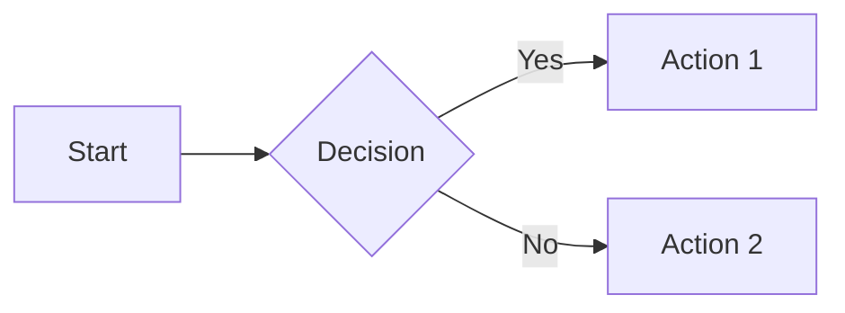

# MkDocs Feature Enhancements

This guide lists all the features that can be added to an MkDocs Material intelligent textbook. Each feature includes the required mkdocs.yml configuration and any additional setup steps.

## Quick Reference: Available Features

| Feature | Category | Complexity |
|---------|----------|------------|
| [Site Logo](#site-logo) | Branding | Easy |
| [Favicon](#favicon) | Branding | Easy |
| [Cover Image & Social Preview](#cover-image--social-preview) | Branding | Medium |
| [Math Equations](#math-equations) | Content | Easy |
| ↳ [KaTeX](#math-equations-katex) (recommended) | Content | Easy |
| ↳ [MathJax](#math-equations-mathjax) | Content | Easy |
| [Code Syntax Highlighting](#code-syntax-highlighting) | Content | Easy |
| [Code Copy Button](#code-copy-button) | Content | Easy |
| [Social Media Preview Cards](#social-media-preview-cards) | SEO | Medium |
| [Per-Page Social Image Override](#per-page-social-image-override) | SEO | Medium |
| [Custom Admonitions with Copy](#custom-admonitions-with-copy) | Content | Medium |
| [Interactive Quizzes](#interactive-quizzes) | Educational | Medium |
| [Simple Feedback (Thumbs)](#simple-feedback-thumbs-updown) | Engagement | Easy |
| [Detailed Comment Feedback (Giscus)](#detailed-comment-feedback-giscus) | Engagement | Medium |
| [Image Zoom on Click (GLightbox)](#image-zoom-on-click-glightbox) | Content | Easy |
| [Mermaid Diagrams](#mermaid-diagrams) | Content | Easy |
| [Content Tabs](#content-tabs) | Content | Easy |
| [Task Lists](#task-lists) | Content | Easy |
| [Abbreviations & Glossary Tooltips](#abbreviations--glossary-tooltips) | Content | Easy |
| [Table of Contents Sidebar](#table-of-contents-sidebar) | Navigation | Easy |
| [Search with Suggestions](#search-with-suggestions) | Navigation | Easy |
| [Tags & Categorization](#tags--categorization) | Organization | Medium |
| [Blog Support](#blog-support) | Content | Medium |
| [Privacy & Cookie Consent](#privacy--cookie-consent) | Legal | Easy |
| [Announcement Bar](#announcement-bar) | Engagement | Easy |

---

## Branding Features

### Site Logo

Add a custom logo to the upper-left corner of every page.

**Add to mkdocs.yml:**

```yaml
theme:
  name: material
  logo: img/logo.png
```

**File location:** `docs/img/logo.png` (recommended: 48x48 to 64x64 pixels, PNG with transparency)

**Alternative - Use Material Design Icon:**

```yaml
theme:
  name: material
  icon:
    logo: material/book-open-page-variant
```

Browse icons at: https://pictogrammers.com/library/mdi/

#### AI Prompt for Logo Generation

```
A minimalist [SUBJECT] logo icon, simple geometric shapes,
[PRIMARY COLOR] on transparent background, flat design,
suitable for small size display, professional, clean lines,
no text, centered composition, square format
```

**Example prompts by topic:**

- **Programming:** "A minimalist code brackets logo icon, angular < > symbols, indigo (#3F51B5) on transparent background, modern tech feel, clean vector style, no text"

- **Data Science:** "A minimalist neural network logo icon, three connected nodes in triangular arrangement, purple gradient (#7C4DFF to #536DFE), transparent background, flat design, no text"

- **Education:** "A minimalist open book logo icon, simple geometric book shape with pages fanning out, warm orange (#FF9800) on transparent background, flat design, no text"

- **Science:** "A minimalist atom logo icon, three orbital rings around central dot, cyan (#00BCD4) on transparent background, scientific feel, clean lines"

**Post-processing:** Generate at 512x512, resize to 64x64, ensure transparent background, save as PNG.

---

### Favicon

Add a favicon that appears in browser tabs and bookmarks.

**Add to mkdocs.yml:**

```yaml
theme:
  name: material
  favicon: img/favicon.ico
```

**File location:** `docs/img/favicon.ico` (multi-resolution) or `docs/img/favicon.png` (32x32)

#### AI Prompt for Favicon Generation

Favicons must be EXTREMELY simple - recognizable at 16x16 pixels!

```
An extremely minimalist [SINGLE SHAPE] icon, [ONE COLOR] on white
background, ultra-simple geometric form, must be recognizable at
16x16 pixels, no details, no gradients, bold single element,
favicon style, flat design
```

**Example prompts:**

- **Single Letter:** "An extremely minimalist letter 'A' favicon icon, bold sans-serif, deep blue (#1A237E) on white background, ultra-simple, geometric, must be clear at 16 pixels, no decoration"

- **Geometric Shape:** "An extremely minimalist hexagon favicon icon, solid teal (#009688), white background, simple flat shape, clear at 16x16 pixels"

- **Abstract Symbol:** "An extremely minimalist book favicon, simple open book silhouette, navy blue (#303F9F), white background, two rectangles at angle, ultra-simplified"

**Post-processing:**
1. Generate at 512x512
2. Simplify (remove any fine details)
3. Create multi-resolution .ico with: 16x16, 32x32, 48x48
4. Tools: https://realfavicongenerator.net/ or ImageMagick

---

### Cover Image & Social Preview

Add a professional cover image that appears on your home page and as the social media preview when links are shared.

**Aspect ratio:** 1.91:1 (wide landscape)
**Recommended size:** 1200x630 pixels

**Home page frontmatter (docs/index.md):**

```yaml
---
title: Your Book Title
description: A compelling description for social sharing
image: img/cover-social.png
---
```

**Create theme override (overrides/main.html):**

```html


  <meta property="og:image" content="{{ page.meta.image | default('img/cover-social.png') | url }}">
  <meta property="og:image:width" content="1200">
  <meta property="og:image:height" content="630">
  <meta name="twitter:card" content="summary_large_image">
  <meta name="twitter:image" content="{{ page.meta.image | default('img/cover-social.png') | url }}">

```

**Add to mkdocs.yml:**

```yaml
theme:
  name: material
  custom_dir: overrides
```

#### AI Prompt for Cover Image Generation

Style: Title centered with montage/collage of related images around edges.

```
A professional book cover image in wide landscape format (1.91:1 aspect ratio),
'[YOUR BOOK TITLE]' in large elegant typography centered on a [COLOR] gradient
background, surrounded by a subtle montage collage of [TOPIC ELEMENTS] arranged
around the edges, professional educational design, clean modern aesthetic,
social media preview style, high contrast text, 1200x630 pixels
```

**Example prompts:**

- **Programming:**
```
A professional book cover in wide 1.91:1 landscape format,
'Introduction to Python Programming' in bold white typography centered
on a deep blue (#1A237E) to purple (#4A148C) gradient background,
surrounded by a subtle montage of code snippets, terminal windows,
Python logo elements, circuit patterns, and geometric shapes around
the edges, modern tech aesthetic, clean professional design,
suitable for social media preview, 1200x630 pixels
```

- **Data Science:**
```
A professional educational book cover, 1.91:1 wide format,
'Data Science with R' in bold centered typography, white text on
teal (#00695C) to dark cyan (#006064) gradient,
montage border of scatter plots, bar charts, R logo elements,
data tables, statistical formulas, and flowing data streams,
clean modern infographic style, 1200x630 for social preview
```

- **Education:**
```
A professional textbook cover in wide 1.91:1 format,
'Designing Effective Learning Experiences' in warm white typography,
centered on sunset orange (#E65100) to deep red (#B71C1C) gradient,
montage border of open books, lightbulbs, brain icons, Bloom's pyramid,
classroom elements, and interconnected concept nodes,
warm educational feel, social media preview optimized
```

**Post-processing:**
1. Generate at 1200x630 or larger
2. Verify title is readable at small preview sizes
3. Test with social preview validators:
   - https://cards-dev.twitter.com/validator
   - https://www.linkedin.com/post-inspector/
4. Save as PNG (< 5MB)
5. Place in `docs/img/cover-social.png`

**Display on home page:**

```markdown
{ .cover-image }
```

**CSS for cover image (docs/css/extra.css):**

```css
.cover-image {
  width: 100%;
  max-width: 800px;
  border-radius: 8px;
  box-shadow: 0 4px 20px rgba(0,0,0,0.15);
  margin: 1rem auto 2rem;
  display: block;
}
```

---

## Content Features

### Math Equations

MkDocs Material supports two math rendering libraries: **KaTeX** and **MathJax**. Choose one based on your needs.

#### Comparison: KaTeX vs MathJax

| Aspect | KaTeX | MathJax |
|--------|-------|---------|
| **Speed** | Much faster (100x+) | Slower, especially with many equations |
| **LaTeX coverage** | Most common commands | More complete, handles edge cases |
| **File size** | Smaller | Larger |
| **Accessibility** | Good | Better (more mature) |
| **Server-side rendering** | Yes | Limited |

#### Recommendation

- **KaTeX (recommended for most textbooks)** - Fast rendering means pages with 50+ equations still load quickly. Handles standard math notation well.

- **MathJax** - Choose if you need obscure LaTeX commands (e.g., `\xleftarrow`, certain AMSmath environments, extensible arrows, or custom macros).

For intelligent textbooks, **KaTeX is usually the better choice** since fast page loads improve the learning experience.

---

### Math Equations (MathJax)

Add LaTeX math equation support using MathJax. Best for projects requiring complete LaTeX compatibility.

**Add to mkdocs.yml:**

```yaml
markdown_extensions:
  - pymdownx.arithmatex:
      generic: true

extra_javascript:
  - javascripts/mathjax.js
  - https://unpkg.com/mathjax@3/es5/tex-mml-chtml.js
```

**Create `docs/javascripts/mathjax.js`:**

```javascript
window.MathJax = {
  tex: {
    inlineMath: [["\\(", "\\)"]],
    displayMath: [["\\[", "\\]"]],
    processEscapes: true,
    processEnvironments: true
  },
  options: {
    ignoreHtmlClass: ".*|",
    processHtmlClass: "arithmatex"
  }
};

document$.subscribe(() => {
  MathJax.startup.output.clearCache()
  MathJax.typesetClear()
  MathJax.texReset()
  MathJax.typesetPromise()
})
```

**Usage in markdown:**

```markdown
Inline: \( E = mc^2 \)

Display:
\[
\int_0^\infty e^{-x^2} dx = \frac{\sqrt{\pi}}{2}
\]
```

---

### Math Equations (KaTeX)

**Recommended for most textbooks.** Faster alternative to MathJax with smaller file size.

!!! note "Currency-Safe Configuration"
    This configuration does NOT use single `$` for inline math, allowing you to write currency values like `$20` or `$1.99` without triggering math rendering. Use `\(...\)` for inline math instead.

**Syntax Summary:**

| Math Type | Syntax | Example |
|-----------|--------|---------|
| Inline math | `\(...\)` | `\(E = mc^2\)` renders as inline equation |
| Display math | `$$...$$` or `\[...\]` | `$$\int_0^\infty e^{-x^2} dx$$` renders as centered block |
| Currency | `$20` | Works as-is—no escaping needed |

**Add to mkdocs.yml:**

```yaml
markdown_extensions:
  # Enable KaTeX LaTeX equation rendering
  # Using \(...\) for inline math to avoid conflicts with currency $
  # Block math uses $$ or \[...\]
  - pymdownx.arithmatex:
      generic: true
      inline_syntax: ['round']
      block_syntax: ['dollar', 'square']

extra_javascript:
  - js/katex.js
  - https://cdn.jsdelivr.net/npm/katex@0.16.11/dist/katex.min.js
  - https://cdn.jsdelivr.net/npm/katex@0.16.11/dist/contrib/auto-render.min.js

extra_css:
  - https://cdn.jsdelivr.net/npm/katex@0.16.11/dist/katex.min.css
```

**Create `docs/js/katex.js`:**

```javascript
// KaTeX auto-render configuration
// Single $ is NOT used for math to allow currency notation like $20
// Use \(...\) for inline math and $$...$$ or \[...\] for display math
document.addEventListener("DOMContentLoaded", function() {
    renderMathInElement(document.body, {
        delimiters: [
            {left: "$$", right: "$$", display: true},
            {left: "\\[", right: "\\]", display: true},
            {left: "\\(", right: "\\)", display: false}
        ],
        throwOnError: false
    });
});
```

**Usage in markdown:**

```markdown
The product costs $25.99 plus tax.

The famous equation \(E = mc^2\) shows mass-energy equivalence.

For the integral:
$$
\int_0^\infty e^{-x^2} dx = \frac{\sqrt{\pi}}{2}
$$
```

---

### Code Syntax Highlighting

Enable syntax highlighting for code blocks with language support.

**Add to mkdocs.yml:**

```yaml
markdown_extensions:
  - pymdownx.highlight:
      anchor_linenums: true
      line_spans: __span
      pygments_lang_class: true
  - pymdownx.inlinehilite
  - pymdownx.snippets
  - pymdownx.superfences
```

**Usage:**

````markdown
```python
def hello_world():
    print("Hello, World!")
```
````

---

### Code Copy Button

Add a copy-to-clipboard button on all code blocks.

**Add to mkdocs.yml:**

```yaml
theme:
  name: material
  features:
    - content.code.copy
    - content.code.select
    - content.code.annotate
```

---

### Mermaid Diagrams

Enable Mermaid.js diagrams directly in markdown.

**Add to mkdocs.yml:**

```yaml
markdown_extensions:
  - pymdownx.superfences:
      custom_fences:
        - name: mermaid
          class: mermaid
          format: !!python/name:pymdownx.superfences.fence_code_format
```

**Usage:**

````markdown

````

---

### Content Tabs

Create tabbed content sections for organizing related information.

**Add to mkdocs.yml:**

```yaml
markdown_extensions:
  - pymdownx.superfences
  - pymdownx.tabbed:
      alternate_style: true
      slugify: !!python/object/apply:pymdownx.slugs.slugify
        kwds:
          case: lower
```

**Usage:**

```markdown
=== "Python"

    ```python
    print("Hello")
    ```

=== "JavaScript"

    ```javascript
    console.log("Hello");
    ```
```

---

### Task Lists

Enable GitHub-style task lists with checkboxes.

**Add to mkdocs.yml:**

```yaml
markdown_extensions:
  - pymdownx.tasklist:
      custom_checkbox: true
```

**Usage:**

```markdown
- [x] Completed task
- [ ] Incomplete task
- [ ] Another task
```

---

### Abbreviations & Glossary Tooltips

Define abbreviations that show tooltips on hover throughout your site.

**Add to mkdocs.yml:**

```yaml
markdown_extensions:
  - abbr
  - pymdownx.snippets:
      auto_append:
        - includes/abbreviations.md
```

**Create `docs/includes/abbreviations.md`:**

```markdown
*[HTML]: Hyper Text Markup Language
*[CSS]: Cascading Style Sheets
*[API]: Application Programming Interface
*[DAG]: Directed Acyclic Graph
```

Terms will automatically show tooltips when hovered anywhere in the documentation.

---

## Custom Admonitions with Copy

### Custom Admonitions with Copy

Create custom admonition types like "Prompt" with a copy button for easy copying of content.

**Add to mkdocs.yml:**

```yaml
markdown_extensions:
  - admonition
  - pymdownx.details
  - pymdownx.superfences

extra_css:
  - css/custom-admonitions.css

extra_javascript:
  - javascripts/copy-admonition.js
```

**Create `docs/css/custom-admonitions.css`:**

```css
/* Custom Prompt Admonition */
.md-typeset .admonition.prompt,
.md-typeset details.prompt {
  border-color: #7c4dff;
}

.md-typeset .prompt > .admonition-title,
.md-typeset .prompt > summary {
  background-color: rgba(124, 77, 255, 0.1);
}

.md-typeset .prompt > .admonition-title::before,
.md-typeset .prompt > summary::before {
  background-color: #7c4dff;
  -webkit-mask-image: var(--md-admonition-icon--prompt);
  mask-image: var(--md-admonition-icon--prompt);
}

:root {
  --md-admonition-icon--prompt: url('data:image/svg+xml;charset=utf-8,<svg xmlns="http://www.w3.org/2000/svg" viewBox="0 0 24 24"><path d="M20 2H4c-1.1 0-2 .9-2 2v12c0 1.1.9 2 2 2h14l4 4V4c0-1.1-.9-2-2-2zm-2 12H6v-2h12v2zm0-3H6V9h12v2zm0-3H6V6h12v2z"/></svg>');
}

/* Copy button styling */
.admonition-copy-btn {
  position: absolute;
  top: 8px;
  right: 8px;
  padding: 4px 8px;
  background: rgba(0,0,0,0.1);
  border: none;
  border-radius: 4px;
  cursor: pointer;
  font-size: 12px;
}

.admonition-copy-btn:hover {
  background: rgba(0,0,0,0.2);
}

.admonition.prompt {
  position: relative;
}
```

**Create `docs/javascripts/copy-admonition.js`:**

```javascript
document$.subscribe(function() {
  document.querySelectorAll('.admonition.prompt').forEach(function(admonition) {
    // Skip if already has a copy button
    if (admonition.querySelector('.admonition-copy-btn')) return;

    var btn = document.createElement('button');
    btn.className = 'admonition-copy-btn';
    btn.textContent = 'Copy';
    btn.onclick = function() {
      var content = admonition.querySelector('.admonition-title + p, .admonition-title ~ *:not(.admonition-copy-btn)');
      if (content) {
        navigator.clipboard.writeText(content.textContent.trim());
        btn.textContent = 'Copied!';
        setTimeout(function() { btn.textContent = 'Copy'; }, 2000);
      }
    };
    admonition.style.position = 'relative';
    admonition.appendChild(btn);
  });
});
```

**Usage:**

```markdown
!!! prompt "Example Prompt"

    Write a Python function that calculates the Fibonacci sequence
    up to n terms using recursion with memoization.
```

---

## Educational Features

### Interactive Quizzes

Add self-assessment quizzes using the mkdocs-quiz plugin or custom JavaScript.

**Option 1: Using custom JavaScript (no plugin required)**

**Add to mkdocs.yml:**

```yaml
extra_javascript:
  - javascripts/quiz.js

extra_css:
  - css/quiz.css
```

**Create `docs/javascripts/quiz.js`:**

```javascript
document$.subscribe(function() {
  document.querySelectorAll('.quiz-question').forEach(function(question) {
    var options = question.querySelectorAll('.quiz-option');
    var feedback = question.querySelector('.quiz-feedback');

    options.forEach(function(option) {
      option.addEventListener('click', function() {
        options.forEach(function(o) { o.classList.remove('selected'); });
        option.classList.add('selected');

        if (option.dataset.correct === 'true') {
          feedback.textContent = 'Correct!';
          feedback.className = 'quiz-feedback correct';
        } else {
          feedback.textContent = 'Try again!';
          feedback.className = 'quiz-feedback incorrect';
        }
        feedback.style.display = 'block';
      });
    });
  });
});
```

**Create `docs/css/quiz.css`:**

```css
.quiz-question {
  background: var(--md-code-bg-color);
  padding: 1rem;
  border-radius: 8px;
  margin: 1rem 0;
}

.quiz-option {
  display: block;
  padding: 0.5rem 1rem;
  margin: 0.5rem 0;
  background: var(--md-default-bg-color);
  border: 2px solid var(--md-default-fg-color--lighter);
  border-radius: 4px;
  cursor: pointer;
  transition: all 0.2s;
}

.quiz-option:hover {
  border-color: var(--md-accent-fg-color);
}

.quiz-option.selected {
  border-color: var(--md-accent-fg-color);
  background: rgba(var(--md-accent-fg-color--rgb), 0.1);
}

.quiz-feedback {
  display: none;
  padding: 0.5rem;
  margin-top: 0.5rem;
  border-radius: 4px;
  font-weight: bold;
}

.quiz-feedback.correct {
  background: rgba(0, 200, 83, 0.2);
  color: #00c853;
}

.quiz-feedback.incorrect {
  background: rgba(255, 82, 82, 0.2);
  color: #ff5252;
}
```

**Usage in markdown:**

```html
<div class="quiz-question">
  <p><strong>What is a Directed Acyclic Graph (DAG)?</strong></p>
  <div class="quiz-option" data-correct="false">A graph with cycles</div>
  <div class="quiz-option" data-correct="true">A directed graph with no cycles</div>
  <div class="quiz-option" data-correct="false">An undirected graph</div>
  <div class="quiz-option" data-correct="false">A tree structure only</div>
  <div class="quiz-feedback"></div>
</div>
```

---

## SEO Features

### Social Media Preview Cards

Automatically generate Open Graph and Twitter Card images for social sharing.

**Add to mkdocs.yml:**

```yaml
plugins:
  - social:
      cards_layout_options:
        background_color: "#4051b5"
        color: "#ffffff"
```

**Requirements:**
- Install dependencies: `pip install pillow cairosvg`
- On macOS: `brew install cairo pango gdk-pixbuf libffi`

---

### Per-Page Social Image Override

Override the auto-generated social card with a custom image for specific pages.

**Install the social_override plugin:**

**Create `plugins/social_override.py`:**

```python
from mkdocs.plugins import BasePlugin
from mkdocs.config import config_options

class SocialOverridePlugin(BasePlugin):
    config_scheme = (
        ('enabled', config_options.Type(bool, default=True)),
    )

    def on_page_context(self, context, page, config, nav):
        if page.meta.get('image'):
            image_path = page.meta['image']
            if not image_path.startswith(('http://', 'https://')):
                image_path = config['site_url'].rstrip('/') + '/' + image_path.lstrip('/')
            context['page'].meta['image'] = image_path
        return context
```

**Create `setup.py`:**

```python
from setuptools import setup

setup(
    name='mkdocs-social-override',
    version='1.0.0',
    packages=['plugins'],
    entry_points={
        'mkdocs.plugins': [
            'social_override = plugins.social_override:SocialOverridePlugin',
        ]
    }
)
```

**Install:** `pip install -e .`

**Add to mkdocs.yml:**

```yaml
plugins:
  - social_override
  - social
```

**Usage in page frontmatter:**

```yaml
---
title: My Special Page
image: img/custom-social-card.png
---
```

---

## Engagement Features

### Simple Feedback (Thumbs Up/Down)

Add simple page feedback with thumbs up/down buttons.

**Add to mkdocs.yml:**

```yaml
extra_javascript:
  - javascripts/feedback.js

extra_css:
  - css/feedback.css
```

**Create `docs/javascripts/feedback.js`:**

```javascript
document$.subscribe(function() {
  var feedback = document.createElement('div');
  feedback.className = 'page-feedback';
  feedback.innerHTML = `
    <p>Was this page helpful?</p>
    <button class="feedback-btn" data-value="yes">👍 Yes</button>
    <button class="feedback-btn" data-value="no">👎 No</button>
    <span class="feedback-thanks" style="display:none;">Thanks for your feedback!</span>
  `;

  var content = document.querySelector('.md-content__inner');
  if (content) {
    content.appendChild(feedback);
  }

  feedback.querySelectorAll('.feedback-btn').forEach(function(btn) {
    btn.addEventListener('click', function() {
      var value = this.dataset.value;
      // Send to analytics or backend
      console.log('Feedback:', value, 'Page:', window.location.pathname);

      // Optional: Send to Google Analytics
      if (typeof gtag !== 'undefined') {
        gtag('event', 'page_feedback', {
          'event_category': 'feedback',
          'event_label': window.location.pathname,
          'value': value === 'yes' ? 1 : 0
        });
      }

      feedback.querySelectorAll('.feedback-btn').forEach(function(b) { b.style.display = 'none'; });
      feedback.querySelector('.feedback-thanks').style.display = 'inline';
    });
  });
});
```

**Create `docs/css/feedback.css`:**

```css
.page-feedback {
  margin-top: 2rem;
  padding: 1rem;
  background: var(--md-code-bg-color);
  border-radius: 8px;
  text-align: center;
}

.feedback-btn {
  padding: 0.5rem 1rem;
  margin: 0 0.5rem;
  border: none;
  border-radius: 4px;
  cursor: pointer;
  font-size: 1rem;
  background: var(--md-primary-fg-color);
  color: var(--md-primary-bg-color);
}

.feedback-btn:hover {
  opacity: 0.8;
}

.feedback-thanks {
  color: var(--md-accent-fg-color);
  font-weight: bold;
}
```

---

### Detailed Comment Feedback (Giscus)

Enable GitHub Discussions-powered comments using Giscus.

**Prerequisites:**
1. Enable GitHub Discussions on your repository
2. Install Giscus app: https://github.com/apps/giscus
3. Configure at: https://giscus.app

**Add to mkdocs.yml:**

```yaml
extra:
  giscus:
    repo: "username/repo-name"
    repo_id: "R_xxxxx"
    category: "Announcements"
    category_id: "DIC_xxxxx"
    mapping: "pathname"
    reactions_enabled: "1"
    emit_metadata: "0"
    theme: "preferred_color_scheme"
    lang: "en"
```

**Create `docs/javascripts/giscus.js`:**

```javascript
document$.subscribe(function() {
  var container = document.createElement('div');
  container.className = 'giscus-container';

  var content = document.querySelector('.md-content__inner');
  if (content && !document.querySelector('.giscus')) {
    content.appendChild(container);

    var script = document.createElement('script');
    script.src = 'https://giscus.app/client.js';
    script.dataset.repo = '{{ config.extra.giscus.repo }}';
    script.dataset.repoId = '{{ config.extra.giscus.repo_id }}';
    script.dataset.category = '{{ config.extra.giscus.category }}';
    script.dataset.categoryId = '{{ config.extra.giscus.category_id }}';
    script.dataset.mapping = '{{ config.extra.giscus.mapping }}';
    script.dataset.reactionsEnabled = '{{ config.extra.giscus.reactions_enabled }}';
    script.dataset.emitMetadata = '{{ config.extra.giscus.emit_metadata }}';
    script.dataset.theme = '{{ config.extra.giscus.theme }}';
    script.dataset.lang = '{{ config.extra.giscus.lang }}';
    script.crossOrigin = 'anonymous';
    script.async = true;

    container.appendChild(script);
  }
});
```

**Add to mkdocs.yml:**

```yaml
extra_javascript:
  - javascripts/giscus.js
```

---

### Image Zoom on Click (GLightbox)

Enable lightbox zoom for images when clicked.

**Install:** `pip install mkdocs-glightbox`

**Add to mkdocs.yml:**

```yaml
plugins:
  - glightbox:
      touchNavigation: true
      loop: false
      effect: zoom
      slide_effect: slide
      width: 100%
      height: auto
      zoomable: true
      draggable: true
      auto_caption: false
      caption_position: bottom
```

All images will now be zoomable on click. To exclude specific images:

```markdown
{ .off-glb }
```

---

## Navigation Features

> **Important:** Do NOT use `navigation.tabs` or `navigation.tabs.sticky` in mkdocs.yml.
> These books are designed for wide landscape screens with ample side navigation space.
> If you see these settings in an existing mkdocs.yml, remove them.

### Table of Contents Sidebar

Configure the right-side table of contents.

**Add to mkdocs.yml:**

```yaml
theme:
  name: material
  features:
    - navigation.indexes
    - toc.follow
    - toc.integrate  # Integrate TOC into left sidebar

markdown_extensions:
  - toc:
      permalink: true
      toc_depth: 3
```

---

### Search with Suggestions

Enable advanced search with suggestions and highlighting.

**Add to mkdocs.yml:**

```yaml
plugins:
  - search:
      separator: '[\s\-,:!=\[\]()"/]+|(?!\b)(?=[A-Z][a-z])|\.(?!\d)|&[lg]t;'

theme:
  name: material
  features:
    - search.suggest
    - search.highlight
    - search.share
```

---

## Organization Features

### Tags & Categorization

Add tags to pages for categorization and filtering.

**Add to mkdocs.yml:**

```yaml
plugins:
  - tags:
      tags_file: tags.md

markdown_extensions:
  - meta
```

**Create `docs/tags.md`:**

```markdown
# Tags

[TAGS]
```

**Usage in page frontmatter:**

```yaml
---
tags:
  - learning-graph
  - educational
  - beginner
---
```

---

### Blog Support

Add a blog section to your documentation.

**Add to mkdocs.yml:**

```yaml
plugins:
  - blog:
      blog_dir: blog
      post_date_format: long
      archive_name: Archive
      categories_name: Categories
```

**Create `docs/blog/.authors.yml`:**

```yaml
authors:
  author_name:
    name: Author Name
    description: Author description
    avatar: https://github.com/username.png
```

---

## Legal & Compliance

### Privacy & Cookie Consent

Add GDPR-compliant cookie consent banner.

**Add to mkdocs.yml:**

```yaml
extra:
  consent:
    title: Cookie consent
    description: >-
      We use cookies to recognize your repeated visits and preferences, as well
      as to measure the effectiveness of our documentation and whether users
      find what they're searching for. With your consent, you're helping us to
      make our documentation better.
    actions:
      - accept
      - reject
      - manage
```

---

### Announcement Bar

Add a dismissible announcement banner at the top of pages.

**Add to mkdocs.yml:**

```yaml
theme:
  name: material
  custom_dir: overrides

extra:
  announcement: "🎉 New version 2.0 released! <a href='/changelog/'>See what's new</a>"
```

**Create `overrides/main.html`:**

```html



  {{ config.extra.announcement | safe }}

```

---

## How to Use This Guide

1. **Identify the feature** you want to add from the table above
2. **Read the prerequisites** - some features require pip packages
3. **Copy the mkdocs.yml configuration** to your project
4. **Create any required files** (JavaScript, CSS, templates)
5. **Test locally** with `mkdocs serve`
6. **Deploy** when satisfied

## Minimal to Full-Featured Workflow

If starting with a minimal mkdocs.yml, add features incrementally:

1. **Essential first:** Code highlighting, admonitions, math
2. **Navigation:** Search, TOC, tabs
3. **SEO:** Social cards, meta tags
4. **Engagement:** Feedback, comments
5. **Educational:** Quizzes, interactive elements

## Troubleshooting

### Remove navigation tabs if present

These intelligent textbooks use side navigation optimized for wide landscape screens. If you find `navigation.tabs` in mkdocs.yml, remove it:

```yaml
# REMOVE these lines if present:
theme:
  features:
    - navigation.tabs        # DELETE
    - navigation.tabs.sticky # DELETE
```

### Feature not working?

1. Check that all required extensions are listed in `markdown_extensions`
2. Verify JavaScript/CSS files are in correct locations
3. Clear browser cache and MkDocs cache (`mkdocs build --clean`)
4. Check browser console for JavaScript errors

### Plugin conflicts?

Order plugins carefully in mkdocs.yml - some plugins must come before others:
```yaml
plugins:
  - search  # Usually first
  - social_override  # Before social
  - social
  - tags
  - glightbox
```
