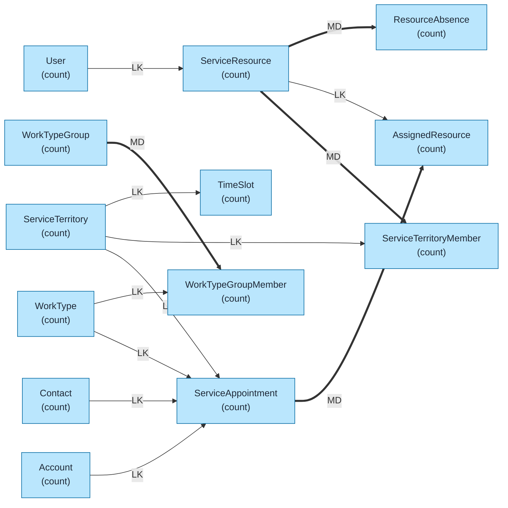
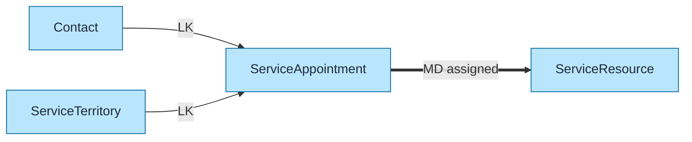
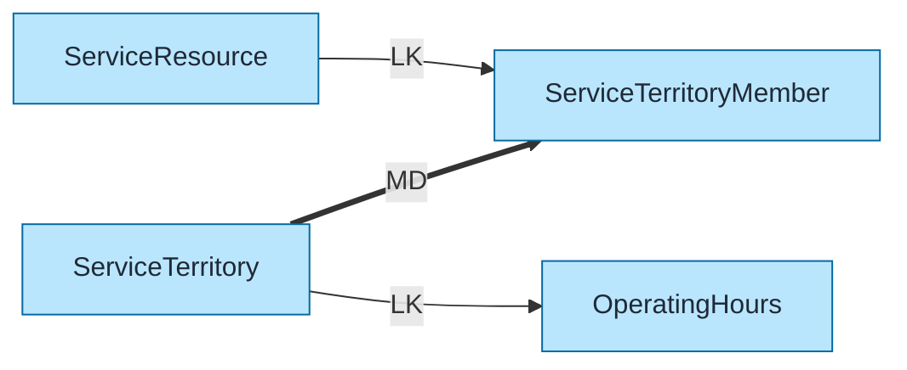

# Salesforce Scheduler Data Model Template

Pre-built data model for Salesforce Scheduler (Lightning Scheduler) using `flowchart LR` format with color coding and relationship indicators.

## Objects Included

| Object | Type | Description |
|--------|------|-------------|
| ServiceAppointment | STD | Scheduled appointments |
| ServiceResource | STD | People/equipment |
| ServiceTerritory | STD | Service locations |
| ServiceTerritoryMember | STD | Resource assignments |
| WorkType | STD | Service types |
| WorkTypeGroup | STD | Grouped work types |
| AssignedResource | STD | Appointment assignments |
| ResourceAbsence | STD | Time off/unavailability |
| TimeSlot | STD | Available time slots |

---

## Query Org Metadata (Recommended)

Enrich diagram with live org data:

```bash
python3 ~/.claude/plugins/marketplaces/sf-skills/sf-diagram-mermaid/scripts/query-org-metadata.py \
    --objects ServiceAppointment,ServiceResource,ServiceTerritory,WorkType \
    --target-org myorg
```

---

## Mermaid Template (Preferred)

Left-to-right flowchart with color coding.



---

## Key Concepts

### Scheduling Flow
```
Customer (Contact) → WorkType → ServiceAppointment ← ServiceResource
                                        ↓
                               ServiceTerritory
```

### Resource Availability
| Object | Purpose |
|--------|---------|
| OperatingHours | Business hours definition |
| TimeSlot | Available booking slots |
| ResourceAbsence | Time off, breaks |
| ServiceTerritoryMember | Territory assignment + hours |

### ServiceResource Types
| Type | Description |
|------|-------------|
| Technician | Field service worker |
| Dispatcher | Scheduling coordinator |
| Crew | Group of resources |
| Asset | Equipment, vehicles |

---

## Simplified Version (Core Objects Only)

For presentations focusing on core scheduling flow:



---

## Territory & Resource Model



---

## ASCII Fallback

```
┌─────────────────────────────────────────────────────────────────────────────┐
│  SALESFORCE SCHEDULER DATA MODEL (L→R)                                       │
│  Legend: LK = Lookup (-->), MD = Master-Detail (==>)                        │
└─────────────────────────────────────────────────────────────────────────────┘

┌──────────────┐                              ┌──────────────────────┐
│   ACCOUNT    │──────────── LK ─────────────>│ SERVICE_APPOINTMENT  │
│   (count)    │                              │       (count)        │
└──────────────┘                              └──────────┬───────────┘
                                                         │
┌──────────────┐                                         │ MD
│   CONTACT    │──────────── LK ─────────────────────────┤
│   (count)    │                                         ▼
└──────────────┘                              ┌──────────────────────┐
                                              │   ASSIGNED_RESOURCE  │
┌──────────────┐                              │       (count)        │
│  WORK_TYPE   │──────────── LK ──────────────│                      │
│   (count)    │                              └──────────┬───────────┘
└──────────────┘                                         │ LK
                                                         ▼
┌───────────────────┐         ┌────────────────────────────────────────┐
│ SERVICE_TERRITORY │═══ MD ═>│ SERVICE_TERRITORY_MEMBER               │
│     (count)       │         │            (count)                     │
└───────────────────┘         └────────────────────┬───────────────────┘
         │                                         │ LK
         │ LK                                      ▼
         └───────────────────────────────>┌──────────────────────┐
                                          │   SERVICE_RESOURCE   │
                                          │       (count)        │
                                          └──────────┬───────────┘
                                                     │ MD
                                                     ▼
                                          ┌──────────────────────┐
                                          │   RESOURCE_ABSENCE   │
                                          │       (count)        │
                                          └──────────────────────┘
```

---

## Key Relationships Summary

| Parent | Child | Type | Behavior |
|--------|-------|------|----------|
| ServiceTerritory | ServiceTerritoryMember | MD | Cascade delete |
| ServiceResource | ServiceTerritoryMember | LK | Resource reference |
| ServiceAppointment | AssignedResource | MD | Cascade delete |
| ServiceResource | AssignedResource | LK | Resource reference |
| ServiceResource | ResourceAbsence | MD | Cascade delete |
| WorkTypeGroup | WorkTypeGroupMember | MD | Cascade delete |
| WorkType | WorkTypeGroupMember | LK | Work type reference |
| Account | ServiceAppointment | LK | Customer |
| Contact | ServiceAppointment | LK | Contact person |
| ServiceTerritory | ServiceAppointment | LK | Service location |
| WorkType | ServiceAppointment | LK | Appointment type |

---

## Limits & Considerations

| Limit | Value |
|-------|-------|
| Resources per territory | Unlimited |
| Territories per resource | Unlimited |
| Appointments per day | Performance consideration |
| Operating hours slots | 24 per day max |
| Time slot duration | Configurable (minutes) |

---

## Scheduler vs Field Service

| Feature | Scheduler | Field Service |
|---------|-----------|---------------|
| Focus | Appointments | Work orders |
| Optimization | Basic | Advanced (FSL) |
| Gantt | No | Yes |
| Dispatch | Manual | Automated |
| Mobile | Standard app | FSL Mobile |

---

## Best Practices

1. **Use `flowchart LR`** - Left-to-right flow for readability
2. **Keep objects simple** - Name + record count only
3. **Replace `(count)` placeholders** - With actual counts from query
4. **Add LDV indicator** - For objects >2M records: `LDV[~4M]`
5. **Color code object types** - Blue=Standard, Orange=Custom, Green=External
