<!-- Threat Modeling Skill | Version 3.0.0 (20260201a) | https://github.com/fr33d3m0n/threat-modeling | License: BSD-3-Clause -->

# Phase 6: Risk Validation

**Type**: Verification
**Executor**: LLM
**Knowledge**: CAPEC → ATT&CK → CVE/KEV, WSTG, MASTG

---

## ⚠️ MANDATORY OUTPUT RULES

> **CRITICAL**: Phase 6 requires TWO outputs - a YAML data file AND a Markdown report.

### Dual Output Requirement

```
┌─────────────────────────────────────────────────────────────────────┐
│  PHASE 6 MUST PRODUCE TWO FILES:                                    │
├─────────────────────────────────────────────────────────────────────┤
│                                                                      │
│  1. DATA FILE (PRIMARY - Write First!)                              │
│     Path: .phase_working/{SESSION_ID}/data/P6_validated_risks.yaml  │
│     Purpose: Structured validated risk data for P7 to read          │
│     Format: Valid YAML with schema_version: "3.0.0 (20260201a)"                   │
│                                                                      │
│  2. REPORT FILE (SECONDARY - Write After Data!)                     │
│     Path: .phase_working/{SESSION_ID}/reports/P6-RISK-VALIDATION.md │
│     Purpose: Human-readable risk validation with POCs               │
│     Format: Markdown with attack chains and ASCII diagrams          │
│                                                                      │
│  INPUT REQUIREMENT:                                                  │
│     Read: .phase_working/{SESSION_ID}/data/P5_threat_inventory.yaml │
│     Read: .phase_working/{SESSION_ID}/data/P4_security_gaps.yaml    │
│     ❌ DO NOT read previous .md reports for data extraction         │
│     ✅ REQUIRED: Parse YAML files for threat_inventory, gaps        │
│                                                                      │
└─────────────────────────────────────────────────────────────────────┘
```

### Required Data Sections in YAML

| Section | Validation |
|---------|------------|
| `risk_summary` | BLOCKING - counts must balance (count conservation) |
| `risk_details[]` | BLOCKING - all validated risks with VR-xxx IDs |
| `poc_details[]` | BLOCKING - POCs for Critical/High risks |
| `attack_chains[]` | WARNING - attack chain documentation |

### Validation Gate

Phase 6 CANNOT complete until:
1. `.phase_working/{SESSION_ID}/data/P6_validated_risks.yaml` exists and is valid YAML
2. Count conservation: P5.total == verified + theoretical + pending + excluded
3. Critical/High risks have POC details
4. `.phase_working/{SESSION_ID}/reports/P6-RISK-VALIDATION.md` exists

---

## Error Handling

| Error | Cause | Recovery Action |
|-------|-------|-----------------|
| P5 YAML not found | P5 not completed | Return to P5, complete STRIDE analysis |
| Missing previous phase data | Incomplete workflow | Document gap, proceed with available data |
| Count conservation failure | Threat accounting error | Recount threats, verify all threat_refs |
| POC execution blocked | Environment constraint | Mark as `pending`, document prerequisites |
| SAST tool unavailable | Tool not installed | Skip tool evidence, document limitation |

**Fallback Strategy**: If count conservation cannot be verified due to missing data, document the gap and set `conservation_verified: false` with note explaining the discrepancy.

---

## Input Context

← ALL P1-P5: Read from `.phase_working/{SESSION_ID}/data/P{1-5}_*.yaml`

**CRITICAL**: Phase 6 consolidates ALL previous findings, not just Phase 5 threats.

### ⚠️ MANDATORY: Query P1-P5 Data Before Validation

**Before starting P6 risk validation**, LLM MUST execute these queries to obtain ALL upstream data:

```bash
# Step 1: Get aggregate summary from all phases
python scripts/phase_data.py --aggregate --phases 1,2,3,4,5 --format summary --root {PROJECT_ROOT}

# Step 2: Get P5 threat inventory (PRIMARY input)
python scripts/phase_data.py --query --phase 5 --type threats --root {PROJECT_ROOT}

# Step 3: Get P4 security gaps for consolidated view
python scripts/phase_data.py --query --phase 4 --type gaps --root {PROJECT_ROOT}

# Step 4: Verify P5 count for conservation formula
python scripts/phase_data.py --verify-p5-coverage --root {PROJECT_ROOT}
```

**Or read YAML directly**:
```bash
# PRIMARY sources - ALL REQUIRED for Count Conservation
cat .phase_working/{SESSION_ID}/data/P1_project_context.yaml
cat .phase_working/{SESSION_ID}/data/P2_dfd_elements.yaml
cat .phase_working/{SESSION_ID}/data/P3_boundary_context.yaml
cat .phase_working/{SESSION_ID}/data/P4_security_gaps.yaml
cat .phase_working/{SESSION_ID}/data/P5_threat_inventory.yaml
```

**CRITICAL**: Count Conservation Formula MUST hold:
```
P5.threat_inventory.total = P6.verified + P6.theoretical + P6.pending + P6.excluded
```

Do NOT validate risks from memory. MUST read P5 threat data to verify counts!

### ⚠️ P6 Data Aggregation Contract (MANDATORY)

**Phase 6 MUST aggregate data from ALL previous phases with explicit tracking**:

```yaml
# Required section in P6_validated_risks.yaml
input_aggregation:
  schema_version: "3.0.0 (20260201a)"
  aggregated_at: "2026-01-31T12:00:00Z"

  # Source file checksums for integrity verification
  source_files:
    P1_project_context:
      path: ".phase_working/{SESSION_ID}/data/P1_project_context.yaml"
      exists: true
      checksum_sha256: "abc123..."  # Optional but recommended
    P2_dfd_elements:
      path: ".phase_working/{SESSION_ID}/data/P2_dfd_elements.yaml"
      exists: true
    P3_boundary_context:
      path: ".phase_working/{SESSION_ID}/data/P3_boundary_context.yaml"
      exists: true
    P4_security_gaps:
      path: ".phase_working/{SESSION_ID}/data/P4_security_gaps.yaml"
      exists: true
    P5_threat_inventory:
      path: ".phase_working/{SESSION_ID}/data/P5_threat_inventory.yaml"
      exists: true
      mandatory: true  # P6 cannot proceed without P5

  # Extracted counts from each phase (for verification)
  extracted_counts:
    p1_modules: 15
    p1_entry_points: 23
    p1_findings: 5           # F-P1-xxx count
    p2_dfd_elements: 45      # Total: EI + P + DS + DF
    p2_findings: 8           # F-P2-xxx count
    p3_boundaries: 6
    p3_findings: 3           # F-P3-xxx count
    p4_security_gaps: 12     # GAP-xxx count
    p5_threats: 67           # T-xxx count (PRIMARY for conservation)

  # Count Conservation Verification
  count_conservation:
    p5_total_threats: 67
    p6_verified: 15          # Confirmed exploitable
    p6_theoretical: 35       # Valid but not verified
    p6_pending: 10           # Awaiting verification
    p6_excluded: 7           # Not applicable with reason
    conservation_sum: 67     # MUST equal p5_total_threats
    conservation_verified: true
    verification_formula: "verified + theoretical + pending + excluded == p5_total"

    # If conservation fails, document discrepancy
    discrepancy_notes: null  # Or explain if conservation_verified: false

  # All Finding Sources Tracking
  findings_consolidation:
    total_findings_input: 28   # Sum of all F-P*-xxx + GAP-xxx
    findings_mapped_to_vr: 25  # Findings that contributed to VR-xxx
    findings_not_mapped: 3     # Findings not linked to any VR
    unmapped_findings:         # MUST document why each is unmapped
      - finding_id: F-P1-003
        reason: "Informational only, no security impact"
      - finding_id: F-P2-007
        reason: "Duplicate of GAP-004"
      - finding_id: GAP-011
        reason: "Mitigated in P4 assessment, control confirmed present"
```

**Validation Rules**:
- `source_files.P5_threat_inventory.exists == false` → **BLOCKING**: Return to P5
- `count_conservation.conservation_verified == false` → **BLOCKING**: Recount and reconcile
- `findings_consolidation.findings_not_mapped > 0` without reasons → **WARNING**: Document reasons

**Count Conservation Failure Handling**:
```
IF conservation_sum != p5_total_threats:
  1. List all P5 threats: extract threat_inventory.threats[].id
  2. For each P5 threat, find its P6 disposition (verified/theoretical/pending/excluded)
  3. Identify missing threats (in P5 but not in P6 disposition)
  4. Add missing threats to appropriate category with explicit reason
  5. Re-verify conservation formula
  6. ONLY proceed if conservation_verified == true
```

## Output Context

→ P7: `validated_risks` {risk_summary{}, risk_details[], poc_details[], attack_paths[], attack_chains[]}

---

## Core Analysis Goal

Consolidate ALL findings from P1-P5, perform deep validation from attacker's perspective, design attack paths and POC code. This is NOT mitigation - focus on VALIDATING that risks are exploitable.

---

## Knowledge Reference

**Query Commands**:
```bash
# Attack path analysis
$SKILL_PATH/kb --capec CAPEC-89 --attack-chain
$SKILL_PATH/kb --attack-technique T1078
$SKILL_PATH/kb --check-kev CVE-2024-XXXX

# Verification tests
$SKILL_PATH/kb --stride-tests S
$SKILL_PATH/kb --cwe-tests CWE-89
$SKILL_PATH/kb --wstg-category ATHN
```

### KB Usage Logging (Recommended)

**Record KB queries made during risk validation**:

```yaml
# In P6_validated_risks.yaml - RECOMMENDED section
kb_usage_log:
  attack_chain_queries:
    - capec: CAPEC-194
      query: "--capec CAPEC-194 --attack-chain"
      risks_informed: [VR-001]
    - capec: CAPEC-66
      query: "--capec CAPEC-66 --attack-chain"
      risks_informed: [VR-003]
  attack_technique_queries:
    - technique: T1078
      query: "--attack-technique T1078"
      attack_paths_informed: [AP-001]
  verification_queries:
    - category: WSTG-ATHN
      query: "--wstg-category ATHN"
      pocs_informed: [POC-001, POC-002]
    - cwe: CWE-89
      query: "--cwe-tests CWE-89"
      pocs_informed: [POC-003]
  coverage:
    risks_with_capec_reference: 10
    risks_with_attack_reference: 8
    pocs_with_wstg_reference: 5
    total_verified_risks: 15
    kb_coverage_percentage: 66.7
```

**Validation Rule** (WARNING only):
- `kb_coverage_percentage < 40%` triggers WARNING - consider querying attack techniques and WSTG

---

## Consolidation Process

### Step 1: Gather All Findings

Read ALL phase data files and extract findings:

```bash
# Required reads from phase data files
.phase_working/{SESSION_ID}/data/P1_project_context.yaml    → architecture_findings
.phase_working/{SESSION_ID}/data/P2_dfd_elements.yaml       → dataflow_findings
.phase_working/{SESSION_ID}/data/P3_boundary_context.yaml   → boundary_findings
.phase_working/{SESSION_ID}/data/P4_security_gaps.yaml      → security_gaps
.phase_working/{SESSION_ID}/data/P5_threat_inventory.yaml   → threat_inventory
```

| Source | Finding Types | ID Format | Data Block |
|--------|---------------|-----------|------------|
| P1 | Architecture discoveries | F-P1-xxx | `architecture_findings` |
| P2 | DFD/dataflow issues | F-P2-xxx | `dataflow_findings` |
| P3 | Boundary issues | F-P3-xxx | `boundary_findings` |
| P4 | Security gaps | GAP-xxx | `security_gaps` |
| P5 | STRIDE threats | T-xxx | `threat_inventory` |

### Step 2: Cluster Related Findings

Group findings that relate to the same vulnerability:

```yaml
clustering_rules:
  same_element: "Findings targeting same DFD element (P-xxx, DS-xxx, DF-xxx)"
  same_boundary: "Findings at same trust boundary crossing"
  data_flow_chain: "Findings along same data flow path"
  control_chain: "Findings in same security control chain"
  attack_path: "Findings that form attack path steps"
```

### Step 3: Deduplicate and Merge

Similar threats targeting the same vulnerability should be merged into a single ValidatedRisk with multiple `threat_refs` and `finding_refs`.

```yaml
# Example: Multiple findings merged into one VR
validated_risk:
  id: VR-001
  threat_refs: [T-S-P-001-001, T-E-P-001-002]  # From P5
  finding_refs: [F-P1-003, F-P2-007, GAP-002]  # From P1-P4
```

### Step 4: Validate Each Risk

For each potential risk:
1. **Assess exploitability**: Can it actually be exploited?
2. **Design attack path**: What steps would an attacker take?
3. **Create POC**: How would exploitation work?
4. **Determine status**: verified/theoretical/pending/excluded

### Step 5: Verify Count Conservation

```
P5.threat_inventory.total = verified + theoretical + pending + excluded
```

All findings (F-P1-xxx, F-P2-xxx, F-P3-xxx, GAP-xxx, T-xxx) must be:
- Referenced in at least one VR's `threat_refs[]` or `finding_refs[]`, OR
- Marked as `excluded` with documented reason

---

## Verification Status Types

| Status | Symbol | Meaning | Criteria |
|--------|--------|---------|----------|
| verified | ✅ | POC executed successfully | Attack reproduced |
| pending | ⚠️ | Needs manual verification | Requires specific environment |
| theoretical | 📋 | Code analysis shows exploitable | Not yet tested |
| excluded | ❌ | Confirmed not exploitable | Mitigations exist |

---

## Count Conservation Rule

```
P5.threat_inventory.total = verified + theoretical + pending + excluded
```

**Every threat from P5 MUST be accounted for in P6**:
- Either in a ValidatedRisk's `threat_refs[]`
- Or marked as `excluded` with documented reason

---

## Output Structure (5 Parts)

### Part 1: Risk Summary

```yaml
risk_summary:
  total_identified: 85          # From P5
  total_verified: 12            # ✅ POC confirmed
  total_pending: 8              # ⚠️ Needs verification
  total_theoretical: 45         # 📋 Code analysis
  total_excluded: 20            # ❌ Not exploitable
  verification_rate: "76%"      # (verified+theoretical)/total
  risk_by_severity:
    critical: 5
    high: 12
    medium: 25
    low: 23
  risk_by_stride:
    S: 12
    T: 18
    R: 8
    I: 22
    D: 10
    E: 15
```

### Part 2: POC Details

Every Critical/High threat MUST have a complete POC:

```yaml
poc_details:
  - poc_id: POC-001
    threat_ref: T-S-P-001-001
    stride_type: S
    verification_status: verified
    exploitation_difficulty: medium
    prerequisites:
      - "Valid user session"
      - "Knowledge of target user ID"
    vulnerability_location:
      file_path: "src/api/auth.py"
      function_name: "verify_token"
      line_number: 45
    vulnerable_code: |
      def verify_token(token):
          # Missing signature verification
          return jwt.decode(token, options={"verify_signature": False})
    exploitation_steps:
      - "Obtain any valid JWT token"
      - "Modify payload to change user_id"
      - "Send modified token to API"
    poc_code: |
      import jwt
      import requests

      # 1. Get valid token
      original_token = "eyJ..."

      # 2. Decode without verification
      payload = jwt.decode(original_token, options={"verify_signature": False})

      # 3. Modify user_id
      payload["user_id"] = "admin"

      # 4. Re-encode (any key works)
      malicious_token = jwt.encode(payload, "any_key", algorithm="HS256")

      # 5. Use malicious token
      response = requests.get(
          "https://target.com/api/user/profile",
          headers={"Authorization": f"Bearer {malicious_token}"}
      )
      print(response.json())
    expected_result: |
      {"status": "success", "user": {"id": "admin", "role": "administrator"}}
    actual_result: |
      Successfully retrieved admin profile
    risk_assessment:
      complexity: medium
      attack_vector: network
      impact_scope: user_data
      data_sensitivity: high
```

### Part 3: Risk Details

```yaml
risk_details:
  - risk_id: VR-001
    title: "JWT Signature Verification Bypass"
    threat_refs: [T-S-P-001-001, T-E-P-001-002]  # MANDATORY
    finding_refs: [GAP-001]
    stride_types: [S, E]
    priority: P0
    cvss_score: 9.8
    cvss_vector: "CVSS:3.1/AV:N/AC:L/PR:N/UI:N/S:U/C:H/I:H/A:H"
    location:
      files: ["src/api/auth.py"]
      elements: [P-001]
      trust_boundary: TB-001
    detailed_analysis: |
      The application uses PyJWT to decode tokens but disables
      signature verification, allowing attackers to forge tokens.
    root_cause: |
      Developer explicitly disabled verification for "debugging"
      and forgot to re-enable it.
    related_cwe: CWE-287
    related_capec: CAPEC-194
    related_attack: T1078
    related_poc: POC-001
    validation:
      status: verified
      poc_available: true
      test_cases:
        - "WSTG-ATHN-04: JWT Token Forgery"
```

### Part 4: Attack Path Matrix

```yaml
attack_path_matrix:
  - path_id: AP-001
    path_name: "Auth Bypass → Admin Access"
    entry_point: "Public API"
    key_nodes: [P-001, P-002]
    final_target: "Admin Functions"
    feasibility_score: 9.2
    detection_difficulty: low
    priority_fix: true
    related_risks: [VR-001]

  - path_id: AP-002
    path_name: "SQL Injection → Data Exfiltration"
    entry_point: "Search API"
    key_nodes: [P-003, DS-001]
    final_target: "User Database"
    feasibility_score: 7.5
    detection_difficulty: medium
    priority_fix: true
    related_risks: [VR-003]
```

### Part 5: Attack Chains

```yaml
attack_chains:
  - chain_id: AC-001
    chain_name: "Privilege Escalation Chain"
    entry_point: "Public API"
    target: "Administrator Access"
    impact_scope: "Complete System Control"
    difficulty: medium
    related_threats: [T-S-P-001-001, T-E-P-001-002]
    steps:
      - step: 1
        title: "Initial Access"
        source: "Attacker"
        target: "API Gateway"
        action: "Obtain valid JWT token"
        code_location: "api/routes.py:120"
        data_change: "Acquire session token"
      - step: 2
        title: "Token Manipulation"
        source: "Attacker"
        target: "JWT Token"
        action: "Modify user_id in payload"
        code_location: "N/A (client-side)"
        data_change: "Forged admin identity"
      - step: 3
        title: "Privilege Escalation"
        source: "API Gateway"
        target: "Auth Service"
        action: "Submit forged token"
        code_location: "auth/verify.py:45"
        data_change: "Gain admin role"
    attack_flow_diagram: |
      ┌─────────────────────────────────────────────────────────────────┐
      │                 Attack Chain: Privilege Escalation               │
      ├─────────────────────────────────────────────────────────────────┤
      │  Step 1: Initial Access                                          │
      │  ┌───────────────────────────────────────────────────────────┐  │
      │  │  Attacker ──→ API Gateway                                  │  │
      │  │  Action: Obtain valid JWT token                            │  │
      │  │  Location: api/routes.py:120                               │  │
      │  └───────────────────────────────────────────────────────────┘  │
      │                              │                                   │
      │                              ▼                                   │
      │  Step 2: Token Manipulation                                      │
      │  ┌───────────────────────────────────────────────────────────┐  │
      │  │  Attacker ──→ JWT Token                                    │  │
      │  │  Action: Modify user_id in payload                         │  │
      │  │  Location: Client-side manipulation                        │  │
      │  └───────────────────────────────────────────────────────────┘  │
      │                              │                                   │
      │                              ▼                                   │
      │  Step 3: Privilege Escalation                                    │
      │  ┌───────────────────────────────────────────────────────────┐  │
      │  │  API Gateway ──→ Auth Service                              │  │
      │  │  Action: Submit forged token, gain admin role              │  │
      │  │  Location: auth/verify.py:45                               │  │
      │  └───────────────────────────────────────────────────────────┘  │
      │                              │                                   │
      │                              ▼                                   │
      │  Result: Administrator access achieved                           │
      └─────────────────────────────────────────────────────────────────┘
    prerequisites:
      - "Network access to API"
      - "Ability to create user account"
    exploitation_commands: |
      # Step 1: Get valid token
      TOKEN=$(curl -s -X POST https://target/api/login \
        -d '{"user":"test","pass":"test123"}' | jq -r '.token')

      # Step 2: Forge admin token
      ADMIN_TOKEN=$(python3 jwt_forge.py --token $TOKEN --user admin)

      # Step 3: Access admin functions
      curl -H "Authorization: Bearer $ADMIN_TOKEN" \
        https://target/api/admin/users
    ioc_indicators:
      - "JWT tokens with mismatched signature"
      - "Rapid role changes in same session"
    defense_recommendations:
      - cutpoint: "Step 2"
        recommendation: "Enable JWT signature verification"
      - cutpoint: "Step 3"
        recommendation: "Implement token binding to IP/device"
```

---

## Report Template

```markdown
# P6: Risk Validation

## Executive Summary

| Metric | Count |
|--------|-------|
| Total Threats (from P5) | N |
| Verified (✅) | N |
| Pending (⚠️) | N |
| Theoretical (📋) | N |
| Excluded (❌) | N |
| Verification Rate | N% |

## Count Conservation Check

- P5 Total: N
- P6 Total (V+Th+P+E): N
- Status: ✅ PASS / ❌ FAIL

## Critical Risks

### VR-001: JWT Signature Verification Bypass

[Full risk detail with POC]

## Attack Path Analysis

### AP-001: Auth Bypass → Admin Access

[Attack path with feasibility score]

## Attack Chains

### AC-001: Privilege Escalation Chain

[Full attack chain with ASCII diagram]

## Validated Risks Inventory

[yaml:validated_risks block]
```

---

## SAST-Assisted Validation (Optional Enhancement)

> **Reference**: @knowledge/sast-rules.yaml for tool configurations and STRIDE mappings.

### When to Use SAST Tools

| Condition | Recommended Tool | Purpose |
|-----------|------------------|---------|
| Validating T-T-* (Tampering) | Semgrep `p/sql-injection`, `p/xss` | Find injection patterns |
| Validating T-S-* (Spoofing) | Semgrep `p/jwt-security` | Auth bypass evidence |
| Validating T-E-* (Elevation) | CodeQL dataflow | Trace privilege paths |
| Searching secrets | Semgrep `p/secrets` | Hardcoded credential proof |

### LLM Decision Matrix

1. Check if SAST tools available (from P1_static_discovery.yaml `enhanced_tools`)
2. Map threat type to relevant SAST rules (see stride_sast_mapping in sast-rules.yaml)
3. Execute targeted scan if applicable
4. Integrate findings into `poc_details.tool_evidence`

### SAST Evidence Integration

```yaml
poc_details:
  - poc_id: POC-001
    # ... other fields ...
    tool_evidence:
      tool: "semgrep"
      rule: "p/sql-injection"
      command_executed: "semgrep --config p/sql-injection --json {project_path}"
      findings:
        - file: "src/api/search.py"
          line: 45
          rule_id: "python.sqlalchemy.security.sqlalchemy-execute-raw-query"
          message: "Detected raw SQL query with user input"
      interpretation: "Confirms T-T-DS-001-001 is exploitable via SQL injection"
```

---

## Attack Tree Generation (Optional Enhancement)

> **Design Principle**: Use Prompt extension, NOT code templates. LLM generates attack trees using reasoning.

### When to Generate Attack Trees

Generate attack trees when:
1. Multiple related risks form an attack chain
2. Complex privilege escalation paths identified
3. User explicitly requests attack tree visualization
4. Critical risks require comprehensive attack path documentation

### Attack Tree Mermaid Output Format

```mermaid
graph TD
    %% Attack Tree: [Goal Description]
    %% Generated from: VR-xxx, T-xxx threat analysis

    ROOT["🎯 GOAL: Obtain Admin Access"]

    %% OR nodes: Any child success achieves parent goal
    ROOT --> OR1["OR: Authentication Bypass"]
    ROOT --> OR2["OR: Privilege Escalation"]

    %% AND nodes: All children required for parent goal
    OR1 --> AND1["AND: Token Forgery Chain"]

    %% LEAF nodes: Concrete attack steps
    AND1 --> LEAF1["LEAF: Obtain valid JWT<br/>Cost: Low | Prob: 0.9"]
    AND1 --> LEAF2["LEAF: Modify payload<br/>Cost: Low | Prob: 0.8"]
    AND1 --> LEAF3["LEAF: Bypass signature check<br/>Cost: Low | Prob: 0.7<br/>Ref: T-S-P-001-001"]

    OR2 --> LEAF4["LEAF: IDOR on /api/users/{id}<br/>Cost: Low | Prob: 0.6<br/>Ref: T-E-P-002-001"]
    OR2 --> LEAF5["LEAF: SQL injection escalation<br/>Cost: Medium | Prob: 0.5<br/>Ref: T-T-DS-001-001"]

    %% Styling
    style ROOT fill:#ff6b6b,stroke:#333,stroke-width:2px
    style OR1 fill:#ffd93d,stroke:#333
    style OR2 fill:#ffd93d,stroke:#333
    style AND1 fill:#ff9f43,stroke:#333
    style LEAF1 fill:#51cf66,stroke:#333
    style LEAF2 fill:#51cf66,stroke:#333
    style LEAF3 fill:#51cf66,stroke:#333
    style LEAF4 fill:#51cf66,stroke:#333
    style LEAF5 fill:#51cf66,stroke:#333
```



### Attack Tree Node Types

| Node Type | Symbol | Meaning | Style |
|-----------|--------|---------|-------|
| ROOT | 🎯 | Attack goal | Red (#ff6b6b) |
| OR | - | Any child success | Yellow (#ffd93d) |
| AND | - | All children required | Orange (#ff9f43) |
| LEAF | - | Concrete attack step | Green (#51cf66) |

### LEAF Node Format

Each LEAF node should include:
- Attack step description
- Cost: Low/Medium/High
- Probability: 0.0-1.0
- Ref: Related threat ID (T-xxx or VR-xxx)

### Attack Tree YAML Schema

```yaml
attack_trees:
  - tree_id: AT-001
    goal: "Obtain Administrator Access"
    related_risks: [VR-001, VR-003]
    related_threats: [T-S-P-001-001, T-E-P-002-001, T-T-DS-001-001]
    total_paths: 3
    highest_probability_path: 0.504  # 0.9 * 0.8 * 0.7
    nodes:
      - id: ROOT
        type: goal
        description: "Obtain Admin Access"
        children: [OR1, OR2]
      - id: OR1
        type: or
        description: "Authentication Bypass"
        children: [AND1]
      - id: AND1
        type: and
        description: "Token Forgery Chain"
        children: [LEAF1, LEAF2, LEAF3]
      - id: LEAF1
        type: leaf
        description: "Obtain valid JWT"
        cost: low
        probability: 0.9
        threat_ref: null
      # ... more nodes
    mermaid_diagram: |
      [Full Mermaid code block]
    attack_paths:
      - path_id: "ROOT→OR1→AND1→[LEAF1,LEAF2,LEAF3]"
        combined_probability: 0.504
        total_cost: low
        cutpoint_recommendation: "LEAF3 - Enable JWT signature verification"
```

### Integration with Report

Include attack trees in P6 report:

```markdown
## Attack Tree Analysis

### AT-001: Obtain Administrator Access

**Goal**: Gain full administrative control over the application

**Attack Paths Identified**: 3
**Highest Probability Path**: 50.4% (Token Forgery Chain)

[Mermaid diagram here]

**Recommended Cutpoints**:
1. LEAF3 (Bypass signature check) - Enable JWT signature verification
2. LEAF4 (IDOR) - Implement proper authorization checks
```

---

## Findings Coverage Verification (CRITICAL)

**P6 MUST verify complete coverage of ALL P1-P5 findings**:

```yaml
# In P6_validated_risks.yaml - REQUIRED section
findings_coverage_verification:
  # Input References
  input_refs:
    p1_file: "P1_project_context.yaml"
    p2_file: "P2_dfd_elements.yaml"
    p3_file: "P3_boundary_context.yaml"
    p4_file: "P4_security_gaps.yaml"
    p5_file: "P5_threat_inventory.yaml"

  # P1 Architecture Findings Coverage
  p1_findings:
    total_findings: 0              # Count of F-P1-xxx from P1 (if any)
    findings_in_vr_refs: 0         # Referenced in some VR.finding_refs
    findings_excluded: 0           # In excluded_findings with reason
    coverage_percentage: 100       # (in_refs + excluded) / total
    uncovered_findings: []         # MUST be empty

  # P2 Data Flow Findings Coverage
  p2_findings:
    total_findings: 0              # Count of F-P2-xxx from P2 (if any)
    findings_in_vr_refs: 0
    findings_excluded: 0
    coverage_percentage: 100
    uncovered_findings: []

  # P3 Boundary Findings Coverage
  p3_findings:
    total_findings: 0              # Count of F-P3-xxx from P3 (if any)
    findings_in_vr_refs: 0
    findings_excluded: 0
    coverage_percentage: 100
    uncovered_findings: []

  # P4 Security Gaps Coverage
  p4_gaps:
    total_gaps: 12                 # Count of GAP-xxx from P4
    gaps_in_vr_refs: 10            # Referenced in some VR.finding_refs
    gaps_excluded: 2               # In excluded_findings with reason
    coverage_percentage: 100       # MUST be 100%
    uncovered_gaps: []             # MUST be empty

  # P5 Threats Coverage (existing count conservation)
  p5_threats:
    total_threats: 45              # From P5.threat_inventory.summary.total
    threats_in_vr_refs: 40         # Referenced in some VR.threat_refs
    threats_excluded: 5            # In excluded_findings with reason
    coverage_percentage: 100       # MUST be 100%
    uncovered_threats: []          # MUST be empty
    # Count Conservation Check
    verified_count: 15
    theoretical_count: 20
    pending_count: 5
    excluded_count: 5
    conservation_check: true       # verified + theoretical + pending + excluded == total

  # Overall Coverage
  overall:
    total_findings: 57             # Sum of all finding types
    findings_covered: 57           # In VR refs or excluded
    coverage_percentage: 100       # MUST be 100%
    conservation_verified: true    # P5 count conservation passed

  # Excluded Findings Documentation
  excluded_findings:
    - id: GAP-011
      source_phase: P4
      exclusion_reason: "Already mitigated in production"
      evidence: "Verified in code review 2026-01-15"
    - id: T-S-P-005-001
      source_phase: P5
      exclusion_reason: "False positive - auth check exists at caller"
      evidence: "See src/middleware/auth.py:45"
```

**Validation Rules**:
- Every F-P1-xxx finding must be in some VR's `finding_refs[]` OR in `excluded_findings[]`
- Every F-P2-xxx finding must be in some VR's `finding_refs[]` OR in `excluded_findings[]`
- Every F-P3-xxx finding must be in some VR's `finding_refs[]` OR in `excluded_findings[]`
- Every GAP-xxx must be in some VR's `finding_refs[]` OR in `excluded_findings[]`
- Every T-xxx must be in some VR's `threat_refs[]` OR in `excluded_findings[]`
- Count Conservation: `P5.total == verified + theoretical + pending + excluded`

**BLOCKING**: `coverage_percentage < 100%` for any phase's findings
**BLOCKING**: `conservation_verified == false`

---

## POC to TestCase Mapping (P6→P8 Bridge)

P6 generates POCs; P8 requires TestCases. This mapping ensures test coverage:

```yaml
# In P6_validated_risks.yaml - REQUIRED section
poc_to_testcase_mapping:
  description: "Mapping from POC-xxx to TC-xxx for P8 test case generation"

  mappings:
    - poc_id: POC-001
      poc_title: "JWT Token Forgery"
      suggested_tc_type: manual_pentest
      suggested_tc_priority: critical
      tc_prerequisites:
        - "Access to valid user JWT"
        - "Burp Suite or jwt_tool"
      tc_verification: "Admin access obtained without valid credentials"

    - poc_id: POC-002
      poc_title: "SQL Injection in Search"
      suggested_tc_type: automated_scan
      suggested_tc_priority: high
      tc_prerequisites:
        - "sqlmap installed"
        - "Access to search endpoint"
      tc_verification: "Database data exfiltrated via error-based SQLi"

  coverage_summary:
    total_pocs: 0
    pocs_with_tc_mapping: 0
    coverage_percentage: 100    # pocs_with_tc_mapping / total_pocs * 100
```

**P8 Consumption**: P8 reads `poc_to_testcase_mapping` and generates TC-xxx entities with `poc_ref` field populated.

---

## Validation Gates

| Check | Severity |
|-------|----------|
| yaml:validated_risks block present | BLOCKING |
| findings_coverage_verification present | BLOCKING |
| p4_gaps.coverage_percentage == 100% | BLOCKING |
| p5_threats.coverage_percentage == 100% | BLOCKING |
| Count conservation formula balances | BLOCKING |
| All excluded_findings have documented reasons | BLOCKING |
| Critical/High risks have POC details | BLOCKING |
| attack_chains section present | WARNING |
| ASCII diagrams in attack chains | WARNING |
| Attack trees for complex risk clusters | INFO |
| SAST evidence for injection threats | INFO |

---

## Completion Checklist

Before marking Phase 6 complete:

**Findings Coverage Verification**:
- [ ] `findings_coverage_verification` section present in YAML
- [ ] P1-P3 findings coverage verified (if any findings exist)
- [ ] P4 gaps coverage_percentage == 100%
- [ ] P5 threats coverage_percentage == 100%
- [ ] All excluded_findings have documented reasons and evidence
- [ ] conservation_verified == true (P5 count conservation)

**Risk Validation**:
- [ ] All P5 threats accounted for
- [ ] Count conservation verified
- [ ] yaml:validated_risks present
- [ ] yaml:poc_details for Critical/High
- [ ] yaml:attack_chains present
- [ ] ASCII attack flow diagrams included
- [ ] Validation passed

**Optional Enhancements**:
- [ ] Attack trees for complex risk clusters
- [ ] SAST tool evidence for applicable threats

---

**End of Phase 6 Instructions** (~550 lines, ~4.5K tokens)
