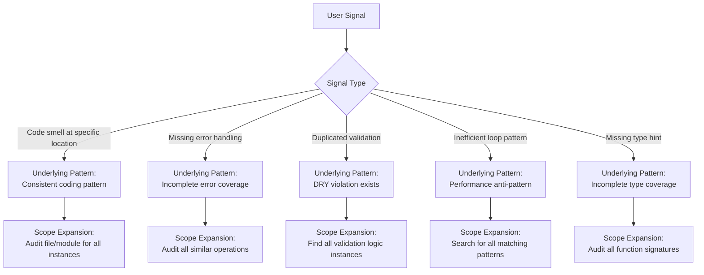

# Agent Orchestration

## Overview

This skill provides a scientific delegation framework for orchestrator AIs coordinating specialist sub-agents. Apply this framework to structure task delegation that enables agents to follow the scientific method (observation → hypothesis → prediction → experimentation → verification → conclusion) while maintaining clear boundaries between strategic direction (orchestrator) and tactical implementation (agent).

## Core Principle

**Provide world-building context (WHERE, WHAT, WHY). Define success criteria. Trust agent expertise for implementation (HOW).**

The orchestrator's role is to:

- Route context and observations between user and agents
- Define measurable success criteria
- Enable comprehensive discovery
- Trust agent expertise and their 200k context windows

**Reason**: Sub-agents are specialized experts with full tool access. Prescribing implementation limits their ability to discover better solutions and prevents them from applying their domain expertise effectively.

## Scientific Method Alignment

Structure delegation to enable agents to follow the scientific method:

1. **Observation** → Provide factual observations, not interpretations
2. **Hypothesis** → Let agent form their own hypothesis
3. **Prediction** → Let agent make testable predictions
4. **Experimentation** → Let agent design and execute tests
5. **Verification** → Let agent verify against official sources
6. **Conclusion** → Let agent determine if hypothesis is rejected

**Reason**: Agents apply the scientific method most effectively when they receive observations and success criteria rather than pre-formed conclusions and prescribed steps.

## Pre-Delegation Verification Checklist

Before delegating any task to a sub-agent, verify the delegation includes:

✅ **Observations without assumptions**

- Raw error messages already in context (verbatim, not paraphrased)
- Observed locations (file:line references where errors/issues/patterns were seen by you or reported by user)
- Command outputs you already received during your work
- State facts using phrases like "observed", "measured", "reported"
- Replace "I think", "probably", "likely", "seems" with verifiable observations

⚠️ **Critical: Pass-Through vs. Pre-Gathering**

- **Pass-through (correct)**: Include data already in your context (user messages, prior agent reports, errors you encountered)
- **Pre-gathering (incorrect)**: DO NOT run commands to collect data for the agent - they will gather their own data
- Example: DO NOT run `ruff check .` or `pytest` to collect errors before delegating to linting/testing agents
- **Reason**: Pre-gathering wastes context, duplicates agent work, and causes context rot. Agents are specialists who gather their own comprehensive data.

✅ **Definition of success**

- Specific, measurable outcome
- Acceptance criteria
- Verification method
- Focus on WHAT must work, not HOW to implement it

✅ **World-building context**

- Problem location (WHERE)
- Identification criteria (WHAT)
- Expected outcomes (WHY)
- Available resources and tools

✅ **Preserved agent autonomy**

- List available tools and resources
- Trust agent's 200k context window for comprehensive analysis
- Let agent choose implementation approach
- Enable agent to discover patterns and solutions

## Task Tool Invocation Rule

**When invoking the Task tool, construct the `prompt` parameter using the Delegation Template below.**

**Reason**: Agents receive observations and success criteria, enabling them to apply expertise rather than execute prescribed steps. Prescribing line numbers, exact changes, or tool sequences reduces agents to code-editing tools.

## Delegation Template

Start every Task prompt with:

```text
Your ROLE_TYPE is sub-agent.
```

**Reason**: This keeps the agent aligned with sub-agent role and prevents following orchestration rules from CLAUDE.md.

**Full template structure:**

```text
Your ROLE_TYPE is sub-agent.

[Task identification]

OBSERVATIONS:
- [Factual observations from your work or other agents]
- [Verbatim error messages if applicable]
- [Observed locations: file:line references if already known]
- [Environment or system state if relevant]

DEFINITION OF SUCCESS:
- [Specific measurable outcome]
- [Acceptance criteria]
- [Verification method]
- Solution follows existing patterns found in [reference locations]
- Solution maintains or reduces complexity

CONTEXT:
- Location: [Where to look]
- Scope: [Boundaries of the task]
- Constraints: [User requirements only]

YOUR TASK:
1. Run SlashCommand /is-it-done to understand completion criteria for this task type
2. Use the /is-it-done checklists as your working guide throughout this task
3. Perform comprehensive context gathering using:
   - Available functions and MCP tools from the <functions> list
   - Relevant skills from the <available_skills> list
   - Project file exploration and structure analysis
   - External resources (CI/CD logs, API responses, configurations)
   - Official documentation and best practices
   - Known issues, forums, GitHub issues if relevant
4. Form hypothesis based on gathered evidence
5. Design and execute experiments to test hypothesis
6. Verify findings against authoritative sources
7. Implement solution following discovered best practices
8. Verify each /is-it-done checklist item as you complete it
9. Only report completion after all /is-it-done criteria satisfied with evidence

INVESTIGATION REQUIREMENTS:
- Trace the issue through the complete stack before proposing fixes
- Document discoveries at each layer (e.g., UI → Logic → System → Hardware)
- Identify both symptom AND root cause
- Explain why addressing [root] instead of patching [symptom]
- If proposing workaround, document why root cause cannot be fixed

VERIFICATION REQUIREMENTS:
- /is-it-done is step 1 of YOUR TASK - run it before starting work
- Use /is-it-done checklists as working guide, not post-mortem report
- Provide evidence for each checklist item as you complete it
- If checklist reveals missing work, complete that work before proceeding
- Your work will be reviewed by a rigorous engineer who expects verified functionality

AVAILABLE RESOURCES:
[See "Writing Effective AVAILABLE RESOURCES" section below for examples]
```

## Writing Effective AVAILABLE RESOURCES

The AVAILABLE RESOURCES section provides world-building context about the environment, not a restrictive tool list. Describe the ecosystem so agents can leverage their full capabilities.

**Anti-pattern (reductive, limiting):**

```text
AVAILABLE RESOURCES:
- WebFetch tool
- Read tool
- Bash tool
```

**Problem**: Lists specific tools, implying these are the only options. Agent has dozens of tools but now thinks they should only use three. Additionally, listing WebFetch without mentioning superior MCP alternatives (Ref, exa) causes agents to use low-fidelity tools.

**Correct pattern (world-building, empowering):**

```text
AVAILABLE RESOURCES:
- The `gh` CLI is pre-authenticated for GitHub operations (issues, PRs, API queries)
- Excellent MCP servers are installed for specialized tasks - check your <functions> list and prefer MCP tools (like `Ref`, `context7`, `exa`) over built-in alternatives since they're specialists at their domain
- This Python project uses `uv` for all operations - activate the `uv` skill and use `uv run python` instead of `python3`, `uv pip` instead of `pip`
- Project uses `hatchling` as build backend - activate the `hatchling` skill for build/publish guidance
- This repository uses GitLab CI - use `gitlab-ci-local` to validate pipeline changes locally before pushing
- Recent linting fixes are documented in `.claude/reports/` showing common issues and resolutions
- Package validation scripts live in `./scripts/` - check its README.md for available validators to run after changes
- Full project context available including tests, configs, and documentation
```

**Why this works**:

1. **Describes capabilities, not constraints** - Agent learns what's available without feeling limited
2. **Provides context for tool selection** - "prefer MCP tools over built-in" guides without prescribing
3. **References skills to activate** - Agent can load specialized knowledge
4. **Points to project-specific resources** - Scripts, reports, configs agent should discover
5. **Explains ecosystem conventions** - `uv` instead of `pip`, `gitlab-ci-local` for validation

### Resource Description Patterns

**For authenticated CLI tools:**

```text
The `gh` CLI is pre-authenticated for GitHub operations
The `glab` CLI is configured for GitLab access
AWS CLI is configured with appropriate credentials
```

**For MCP server preferences:**

```text
Excellent MCP servers installed - check <functions> list and prefer these specialists:
- `Ref` for documentation (high-fidelity verbatim source, unlike WebFetch which returns AI summaries)
- `context7` for library API docs (current versions, comprehensive)
- `exa` for web research (curated, high-quality sources)
- `mcp-docker` for container operations
```

**For language/tooling ecosystems:**

```text
Python project using `uv` - activate `uv` skill, use `uv run`/`uv pip` exclusively
Node project using `pnpm` - use `pnpm` instead of `npm`
Rust project - use `cargo` commands, check Cargo.toml for features
```

**For CI/CD validation:**

```text
GitHub Actions - use `act` to validate workflow changes locally
GitLab CI - use `gitlab-ci-local` to test pipeline before pushing
Code quality checks (linting, formatting) performed and issues addressed per the holistic-linting skill
```

**For project-specific resources:**

```text
Validation scripts in `./scripts/` - check README.md for usage
Previous fix patterns in `.claude/reports/` for reference
Test fixtures in `./tests/fixtures/` for sample data
API mocks configured in `./tests/mocks/`
```

**For documentation access:**

```text
Full access to official docs via MCP tools
Project architecture documented in `./docs/architecture.md`
API contracts defined in `./openapi.yaml`
Style guide at `./CONTRIBUTING.md`
```

### Complete Example

```text
AVAILABLE RESOURCES:
- The `gh` CLI is pre-authenticated for GitHub operations (searching issues, viewing PRs, API queries)
- Powerful MCP servers available in your <functions> list - prefer these over built-in tools for higher fidelity:
  - `Ref` for fetching documentation (high-fidelity verbatim source, unlike WebFetch which returns low-fidelity AI summaries)
  - `context7` for library API docs (current versions, precise API signatures)
  - `exa` for web research (curated, accurate sources)
- This Python project uses `uv` exclusively - activate the `uv` skill and use:
  - `uv run python` instead of `python3`
  - `uv pip` instead of `pip`
  - `uv run pytest` for testing
- Build system is `hatchling` - activate `hatchling` skill for packaging guidance
- Code quality checks (linting, formatting) performed and issues addressed per the holistic-linting skill
- Previous similar fixes documented in `.claude/reports/linting-fixes.md`
- Integration test suite in `./tests/integration/` covers API contracts
- Full project context available including all source, tests, and documentation
```

## Context Calibration Patterns

**For FOCUSED TASK (single file, clear test):**

```text
Fix [specific observation] in [exact file]. Success: [test] passes.
```

**For INVESTIGATIVE TASK (unknown cause):**

```text
[All observations from all agents]
[Complete error traces]
[System state information]
Investigate comprehensively before implementing.
```

**For ARCHITECTURAL TASK (multi-component):**

```text
[Full project structure]
[All related agent findings]
[Historical context]
Design solution considering entire system.
```

## Inclusion Rules: What to Include vs Exclude

### ✅ INCLUDE: Factual Observations

- "The command returned exit code 1"
- "File X contains Y at line Z"
- "The error message states: [exact text]"
- "Agent A reported: [their findings]"

**Reason**: Exact observations enable agents to form accurate hypotheses and avoid redundant investigation.

### ✅ INCLUDE: User Requirements

- "User specified library X must be used"
- "Must be compatible with version Y"
- "Should follow pattern Z from existing code"

**Reason**: User requirements are constraints that must be satisfied, distinct from orchestrator opinions about implementation.

### ✅ INCLUDE: Available Tools/Resources

- "MCP Docker tools are available"
- "GitHub API access is configured"
- "CI logs can be accessed via [tool]"

**Reason**: Awareness of available resources enables agents to perform comprehensive investigation efficiently.

### ✅ INCLUDE: Verbatim Errors Already in Context

When you have error messages from your own work or user reports, include them verbatim:

```text
Error: Module not found
  at line 42 in file.js
  Cannot resolve 'missing-module'
```

**Critical Distinction:**

- **Include verbatim**: Errors you already encountered, user-provided errors, prior agent reports
- **Do NOT pre-gather**: Do not run linting/testing commands to collect errors for delegation

**Reason**: Complete error text preserves diagnostic information that paraphrasing loses. But pre-gathering errors wastes context and duplicates the agent's work.

### Replace Assumptions with Observations

Instead of assumptions ("I think", "probably", "likely", "seems"), provide factual observations:

- Replace "I think the problem is..." → "Observed symptoms: [list]"
- Replace "This probably happens because..." → "Command X produces output Y"
- Replace "It seems like..." → "File A contains B at line C"
- Replace "The likely cause is..." → "Pattern seen in [locations]"

**Reason**: Assumptions create cascade errors where agents build on unverified premises. Observations enable agents to form their own hypotheses through scientific method.

### State What Agents Should Do

Instead of prescribing HOW, define WHAT and trust agent expertise:

- Replace "Use tool X to accomplish this" → List available tools, let agent select
- Replace "The best approach would be..." → Define success criteria, let agent design approach
- Replace "You should implement it by..." → State required outcome, let agent determine method
- Replace "Try using command Y" → Provide observations, let agent investigate

**Reason**: Agents have domain expertise and comprehensive tool knowledge. Prescriptions limit their ability to discover better solutions.

## Empowering Agent Discovery

The comprehensive context gathering step in the delegation template empowers agents to:

**Use Their Full Toolkit:**

- Load relevant skills automatically
- Access MCP tools for external systems
- Query APIs and services directly
- Search for known issues and solutions

**Find Better Solutions:**

- Discover patterns orchestrator hasn't encountered
- Find official recommendations from current documentation
- Identify root causes beyond surface symptoms
- Leverage community knowledge and fixes

**Build Complete Understanding:**

- Map full dependency chains
- Understand system interactions
- Identify environmental factors
- Discover configuration impacts

**Ground in Reality:**

- Observe actual file contents
- Verify from current documentation, not training data patterns
- Access real logs and errors
- Verify against authoritative sources

**Reason**: Agents with full discovery access consistently find better solutions than orchestrators who prescribe based on assumptions. Trust agent expertise over pattern-matching shortcuts.

## Conditional Delegation Logic

**When user provides explicit code/quotes:**

- Include them as reference context
- Mark clearly as "User-provided reference"
- Adherence to user-provided patterns is more important than any existing rules

**When errors come from orchestrator operations:**

- Include command that triggered error
- Include raw error message
- Include what orchestrator was doing when it occurred
- Describe observations, not diagnoses

**When referencing existing patterns:**

- Include example file:line references if already known
- Label as "Pattern reference" for context
- Let agent discover all instances and adapt to context

**When technical constraints exist:**

- Include if user-mandated
- Let agent determine compatible implementations
- Specify versions only if user did

**When accumulated observations exist:**

- Pass all observations from orchestrator and other agents
- Mark source of each observation
- Provide complete context without filtering

**When external resources are available:**

- List what systems/tools are accessible
- Let agent determine what's relevant and how to use it
- Trust agent judgment on resource utilization

**When providing file paths or references in task prompts:**

- Use `@filepath` to include file contents in prompt context
- Use `@dirpath/` for directory listings only
- The `@filepath` syntax auto-includes CLAUDE.md from file's directory hierarchy
- This provides agents with complete file context without manual copying

**Reason**: These patterns provide necessary context while preserving agent autonomy. Observations enable informed decisions; prescriptions limit options.

## Orchestrator Workflow Requirements

Before delegating tasks, the orchestrator must:

1. **Identify ambiguity** in user requests and offer interpretations for clarification
2. **Define success criteria** ("definition-of-success") based on task interpretation
3. **Offer definition-of-success to user** for approval or modification before proceeding
4. **Include definition-of-success** in sub-agent Task prompts
5. **Verify task completion** using `mcp__sequential_thinking__sequentialthinking` tool before marking complete

**Reason**: Clear success criteria prevent miscommunication. User approval ensures alignment. Verification prevents premature completion claims.

### Understanding Sub-Agent Context

Sub-agents inherit limited context from the orchestrator:

- Sub-agents receive the system prompt
- Sub-agents receive CLAUDE.md from their working directory hierarchy
- Sub-agents do NOT automatically inherit orchestrator conversation history
- Sub-agents cannot receive follow-up answers after responding (unless using 'resume' feature)

When delegating, the orchestrator must:

- Include all necessary context in the initial Task prompt
- Pass pertinent rules from CLAUDE.md explicitly if needed
- Instruct agents to "follow guidelines from @~/.claude/CLAUDE.md" when applicable

**Reason**: Complete context in delegation prevents agent confusion and redundant back-and-forth communication.

### Maximizing Agent Efficiency

The orchestrator must write contextual AVAILABLE RESOURCES for each delegation (see "Writing Effective AVAILABLE RESOURCES" section above). Always include these baseline permissions:

```text
AVAILABLE RESOURCES:
- Proactively explore your `<functions>` list for MCP tools - prefer MCP specialists over built-in tools
- Maximize parallel execution for independent tool calls
- Proactively check `<available_skills>` and activate relevant skills for domain expertise
- [Add project-specific context: CLI tools, ecosystem conventions, validation scripts, documentation locations]
```

**Reason**: World-building context enables agents to discover optimal approaches. Generic tool lists constrain agents to orchestrator's limited awareness of capabilities.

## Specialized Agent Assignments

The orchestrator must delegate to appropriate specialized agents:

**For Context Gathering:**

- Use `context-gathering` sub-agent to gather context without polluting orchestrator's context window

**For Python Development:**

- Use `python-cli-architect` sub-agent to write Python code
- Use `python-pytest-architect` sub-agent to plan and write Python tests
- Use `python-code-reviewer` sub-agent for post-write code review

**For Bash Development:**

- Use `bash-script-developer` sub-agent to write bash scripts
- Use `bash-script-auditor` sub-agent for post-write script review

**For Documentation:**

- Use `documentation-expert` sub-agent to write user-facing documentation
- Use for user-facing docs only (not LLM-facing documentation)

**For Architecture:**

- Use `system-architect` sub-agent for system architecture documentation
- For Python architecture, use `python-cli-architect` instead

**For Linting Issues:**

- Use `linting-root-cause-resolver` sub-agent for pre-commit, ruff, mypy, pytest issues

**Critical Rule:**

The orchestrator must task sub-agents with ALL code changes, including the smallest edits, and any context gathering or research.

**Reason**: Sub-agents are optimized for their domains. Orchestrator handling code changes bypasses agent expertise and violates separation of concerns.

## Verification Questions for Orchestrators

Before sending delegation, verify:

1. **Am I enabling full discovery?**

   - Listed available tools/access → ENABLING ✅
   - Specified which tool to use → LIMITING (rewrite to list available resources)

2. **Am I stating facts or making assumptions?**

   - "Fails with error X" → FACT ✅
   - "Probably fails because..." → ASSUMPTION (rewrite as observations)

3. **Am I defining WHAT or prescribing HOW?**

   - "Must successfully build the package" → WHAT ✅
   - "Run 'npm build' to build" → HOW (rewrite as success criteria)

4. **Am I sharing observations or solutions?**

   - "Line 42 contains 'import X'" → OBSERVATION ✅
   - "Change line 42 to 'import Y'" → SOLUTION (rewrite as problem statement)

5. **Am I trusting agent expertise?**
   - "Investigate using available resources" → TRUST ✅
   - "Check this specific documentation" → DISTRUST (rewrite to list available docs)

**Reason**: This checklist catches common delegation anti-patterns before they reach agents. Each verification ensures agents receive empowering context rather than limiting prescriptions.

## Pattern Expansion: From Single Instance to Systemic Fix

**Core Principle**: When user identifies a code smell, bug, or anti-pattern at a specific location, treat it as a symptom of a broader pattern that likely exists elsewhere.

### User Communication Pattern

**What users say:**

- "Fix walrus operator in \_some_func()"
- "Add error handling to this API call"
- "This validation is duplicated"

**What users mean:**

- "The developer consistently missed this pattern throughout the codebase"
- "Audit and fix ALL instances of this pattern, not just the one I pointed out"
- "This instance represents a systemic issue"

**Reason**: Users typically point out single instances as examples. Treating single instances as systemic saves user effort and improves codebase quality comprehensively.

### Pattern Recognition Triggers

Expand scope when user mentions:



### Symptom Location vs Prescribed Solution

**✅ Include symptom locations (observational):**

- "Error occurs at server.py:142"
- "User reported issue in yq_wrapper.py:274-327"
- "Validation duplicated at auth.py:45, api.py:89, handlers.py:123"

**Reason**: Symptom locations guide initial investigation while preserving agent autonomy to discover full scope.

**State what agent should discover instead of prescribing changes:**

- Replace "Replace server.py:127-138 with helper function" → "User identified duplication pattern at server.py:127-138. Audit entire file for similar patterns."
- Replace "Add logging at lines 50, 100, 150, 200" → "Add comprehensive logging following project patterns."
- Replace "Change line 42 to use walrus operator" → "User identified assign-then-check pattern at line 42. Audit for all instances."

**Reason**: Prescribing exact changes prevents agents from holistic understanding, pattern discovery, and applying contextual judgment.

### Holistic vs Micromanaged Delegation

**Micromanaged delegation (prevents agent understanding):**

```text
OBSERVATIONS:
- Walrus operator opportunity at _some_func():45-47

YOUR TASK:
1. Create helper at line 120
2. Replace lines 127-138 with call
3. Replace lines 180-191 with call
```

**Problem**: Orchestrator already did investigation, agent becomes code-editing tool without context.

**Holistic delegation (enables agent understanding):**

```text
OBSERVATIONS:
- User identified assign-then-check pattern at _some_func():45-47
- This suggests developer consistently missed walrus operator opportunities
- Code smell indicates systematic review needed across file/module

DEFINITION OF SUCCESS:
- Pattern eliminated from [file/module] scope
- All assign-then-check conditionals converted to walrus where appropriate
- Similar patterns addressed in related code

YOUR TASK:
1. Run SlashCommand /is-it-done to understand completion criteria
2. Fix the specific instance user identified
3. Audit entire [file/module] for similar patterns
4. Apply same fix to all discovered instances
5. Document pattern occurrences found and fixed
6. Verify /is-it-done checklist items satisfied with evidence
```

**Benefit**: Agent investigates, understands root cause, finds all instances, implements consistent solution.

**Reason**: Holistic delegation leverages agent expertise. Micromanagement wastes agent capabilities and produces narrow fixes.

### Expansion Checklist for Orchestrators

Before delegating, ask:

1. **Is this a repeatable pattern?**

   - Code style → YES, audit file/module
   - Unique one-off fix → NO, targeted fix only

2. **What was developer's mental model?**

   - If they missed it here, they missed it everywhere similar
   - Pattern indicates consistent thinking at time of development

3. **What is blast radius?**
   - Same file? (most likely)
   - Same module? (if related functionality)
   - Entire project? (if project-wide convention)

### Default Assumption

Unless user explicitly says "only this one", treat code smell/bug mentions as representative of a broader pattern requiring systematic remediation.

**Reason**: Users rarely audit entire codebases before reporting issues. Default to systemic fixes for better outcomes.

## Examples: Effective Delegation Patterns

### Pattern: Linting Task Delegation

**✅ CORRECT: Let agent gather linting data**

```text
User request: "Fix all linting issues"

Delegation to linting-root-cause-resolver:
"Run linting against the project. Resolve all issues at root cause.

SUCCESS CRITERIA:
- Code quality checks (linting, formatting) performed and issues addressed per the holistic-linting skill
- All configured linting rules satisfied
- Solutions follow existing project patterns

CONTEXT:
- Python project using uv for dependency management
- Linting configured in pyproject.toml
- This is a skill repository with multiple skill directories

YOUR TASK:
1. Run /is-it-done to understand completion criteria
2. Activate holistic-linting skill for linting workflows
3. Run linting tools to gather comprehensive data
4. Research root causes for each error category
5. Implement fixes following project conventions
6. Verify all criteria satisfied"
```

**Reason**: Agent runs linting themselves, sees full context, can re-run during debugging.

**❌ INCORRECT: Pre-gathering linting errors**

```text
Orchestrator runs: ruff check .
Orchestrator sees: 244 errors
Orchestrator delegates: [pastes all 244 errors into prompt]

Problem: Wasted orchestrator context, duplicated agent work, caused context rot.
```

### Pattern: Testing Task Delegation

**✅ CORRECT: Let agent gather test data**

```text
"Fix failing tests in test_authentication.py.

SUCCESS CRITERIA:
- All tests in test_authentication.py pass
- No new test failures introduced
- Test coverage maintained or improved

CONTEXT:
- Pytest configured in pyproject.toml
- Test fixtures in ./tests/fixtures/
- Authentication module recently refactored

YOUR TASK:
1. Run /is-it-done for completion criteria
2. Run pytest to identify failures
3. Investigate root causes
4. Implement fixes
5. Verify all tests pass and coverage maintained"
```

**Reason**: Agent runs tests themselves, sees failures in context, can debug iteratively.

### Pattern: Error Delegation

**✅ Effective:** "Command X produced error: [exact error]. Success: command completes without error. GitHub Actions logs accessible via MCP."

**Reason**: Provides exact error, clear success criteria, and available resources without prescribing investigation approach.

### Pattern: Feature Delegation

**✅ Effective:** "Implement feature that [user requirement]. Success: [measurable outcome]. Project uses [observed tooling]."

**Reason**: States requirement and success criteria with context, trusts agent to design implementation.

### Pattern: Investigation Delegation

**✅ Effective:** "Investigate why [observation]. Document root cause with evidence. Full project context available."

**Reason**: Defines investigation goal without assuming causes or prescribing investigation steps.

### Pattern: Fix Delegation

**✅ Effective:** "Fix issue where [observation]. Success: [specific working behavior]. Related systems: [list]."

**Reason**: Describes problem and desired outcome with system context, lets agent determine fix approach.

### Pattern: Complex System Delegation

**✅ Effective:** "System exhibits [observation]. Success: [desired behavior]. Available: Docker MCP, GitHub API, project repository."

**Reason**: States system behavior and success criteria, lists resources without dictating investigation sequence.

## Common Delegation Issues to Avoid

**The Pre-Gathering Anti-Pattern**

Running commands to collect data before delegating wastes context and duplicates agent work.

**Example**: Running `ruff check .` and pasting 244 errors into delegation prompt.

**Replace with**: "Run linting against the project. Resolve all issues at root cause. Success: pre-commit passes."

**Reason**: Agent will run linting themselves to gather comprehensive data in full context.

**The Assumption Cascade**

Stating "I think the issue is X, which probably means Y, so likely Z needs fixing" creates chain of unverified assumptions.

**Replace with**: "[Observed symptoms]. Success: [desired behavior]. Investigate comprehensively before implementing."

**The Prescription Trap**

Instructing "Fix this by doing A, then B, then C" prevents agent from discovering better approaches.

**Replace with**: "Fix [observation]. Success: [outcome]. Available resources: [list]."

**The Discovery Limiter**

Directing "Just read these two files and fix the issue" prevents comprehensive investigation.

**Replace with**: "Fix [observation]. Success: [outcome]. Full project context available."

**The Tool Dictation**

Commanding "Use the MCP GitHub tool to fetch logs" when agent might find better information source.

**Replace with**: "Investigate [observation]. Available: MCP GitHub tool, local logs, API access."

**The Paraphrase Problem**

Writing "Something about permissions" instead of "Permission denied: /etc/config" loses critical diagnostic information.

**Replace with**: Include exact error messages verbatim (only those already in your context, not pre-gathered).

**The Context Withholding**

Not sharing observations from other agents forces redundant discovery work.

**Replace with**: Include all relevant observations from orchestrator and other agents with source attribution.

**The Micromanagement Pattern**

Prescribing "Use sed to edit line 42, then grep to verify" wastes agent expertise and context.

**Replace with**: "Fix [issue] in [file]. Success: [tests pass]. Solution follows existing patterns."

**The File:Line Prescription**

Instructing "Replace lines 127-138 with helper function, update lines 180-191" prescribes exact changes instead of defining problem.

**Replace with**: "User identified duplication at lines 127-138, 180-191. Eliminate duplication following project patterns."

**The Confidence Mask**

Stating uncertainties as facts without verification propagates errors through agent chain.

**Replace with**: Mark assumptions explicitly: "Observation: [fact]. Hypothesis to verify: [assumption]."

**The Reductive Tool List**

Listing "AVAILABLE RESOURCES: WebFetch, Read, Bash" when agent has 50+ tools including specialized MCP servers.

**Replace with**: World-building context that describes the ecosystem and guides tool selection:

```text
AVAILABLE RESOURCES:
- The `gh` CLI is pre-authenticated for searching and querying GitHub resources
- Powerful MCP servers installed for specialized tasks - check your <functions> list and prefer MCP tools over built-in alternatives (they're domain specialists). Example: if you see `Ref` in your <functions> list, prefer it over `WebFetch` for documentation retrieval
- This repository uses GitHub - use `act` to validate workflow changes locally before pushing
- This Python project uses `uv` - activate the `uv` skill, use `uv run python` instead of `python3`, `uv pip` instead of `pip`
- Recent linting fixes documented in `.claude/reports/` showing common issues and resolutions - reference these to avoid repeating solved problems
- Package validation scripts in `./scripts/` - check its README.md for available validators to run after changes
```

**Why this matters - accuracy, precision, and fidelity:**

| Term         | Definition                      | Tool Comparison                                                                                                                                |
| ------------ | ------------------------------- | ---------------------------------------------------------------------------------------------------------------------------------------------- |
| **Accurate** | Conforming exactly to truth     | `Ref` returns verbatim source (accurate). `WebFetch` returns AI interpretation (may be correct in spirit but not accurate to source)           |
| **Precise**  | Exactly defined, not vague      | `Ref` preserves every character, directive, code block (precise). `WebFetch` omits specifics like version numbers, syntax examples (imprecise) |
| **Fidelity** | Degree of faithful reproduction | `Ref` = high fidelity (output IS the source). `WebFetch` = low fidelity (output is a lossy transformation)                                     |

For technical documentation and skill creation, **high-fidelity access to sources** is essential. When orchestrators list `WebFetch` without mentioning `Ref`, agents use the low-fidelity tool and produce work based on summaries rather than source material.

> [Web resource access, definitive guide for getting accurate data for high quality results](./references/accessing_online_resources.md)

**Reason**: Each pattern limits agent effectiveness. Replacements empower agents with observations, success criteria, and autonomy while avoiding unverified assumptions.

## Anti-Pattern: Pre-Gathering Data for Delegation

**The Problem:**

Orchestrators who run commands to gather data before delegating waste context and duplicate agent work. This creates context rot and degrades orchestrator capability.

**Examples of Anti-Pattern:**

```text
❌ INCORRECT: Pre-gathering linting errors

User: "Address linting issues using linting-root-cause-resolver"
Orchestrator runs: ruff check .
Orchestrator captures: 244 errors
Orchestrator pastes: All 244 errors into delegation prompt

Problem: Wasted context. Agent would run linting anyway to gather comprehensive data.
```

```text
❌ INCORRECT: Pre-gathering test failures

User: "Fix failing tests"
Orchestrator runs: pytest
Orchestrator captures: 15 test failures with full tracebacks
Orchestrator pastes: All failures into delegation prompt

Problem: Agent will run pytest themselves to get full context and reproduce issues.
```

```text
❌ INCORRECT: Pre-gathering file contents

User: "Review code quality in src/"
Orchestrator reads: All 20 files in src/
Orchestrator summarizes: Code patterns found
Orchestrator delegates: Summary to code-review agent

Problem: Agent needs original files, not summaries. Reading files wasted orchestrator context.
```

**Correct Pattern:**

```text
✅ CORRECT: Delegate with context and success criteria

User: "Address linting issues using linting-root-cause-resolver"

Delegation:
"Run linting against the project. Resolve all issues at root cause.

SUCCESS CRITERIA:
- Code quality checks (linting, formatting) performed and issues addressed per the holistic-linting skill
- All configured linting rules satisfied
- Solutions follow project patterns

CONTEXT:
- Python project using ruff and mypy
- Configuration in pyproject.toml
- Recent fixes documented in .claude/reports/ (if available)

YOUR TASK:
1. Run /is-it-done to understand completion criteria
2. Activate holistic-linting skill for linting workflows
3. Run linting tools to gather comprehensive error data
4. Research root causes for each error type
5. Implement fixes following project conventions
6. Verify all /is-it-done criteria satisfied"
```

**Why This Works:**

- Agent gathers their own data comprehensively
- Orchestrator context preserved for coordination
- Agent sees errors in full context, not isolated snippets
- Agent can re-run tools during debugging
- No duplication of work

**Key Principle:**

**Orchestrators route context, agents do work.**

- If data exists in context (user message, prior agent output), pass it through
- If data doesn't exist yet, delegate with task + success criteria + available resources
- Let agents gather data, analyze, research, and implement

**Reason**: Pre-gathering causes context rot (source: <https://research.trychroma.com/context-rot>). Orchestrator context should coordinate work, not duplicate specialist tasks.

## Role-Specific Rules for Orchestrators

As an orchestrator, your role is:

1. **Context router, not researcher**
   - Pass observations through to agents
   - Do NOT run analysis commands to gather data for agents
   - Let agents generate research and discoveries
   - Coordinate information flow between user and agents

**Reason**: Agents are specialized researchers. Orchestrator research duplicates work, wastes context, and causes context rot.

2. **Success definer, not implementation planner**
   - Define what must work when done
   - Specify how to verify completion
   - Trust agents to determine steps

**Reason**: Agents design better implementations with autonomy than following orchestrator prescriptions.

3. **Discovery enabler, not scope limiter**
   - List available resources
   - Enable comprehensive investigation
   - Trust agent judgment on scope

**Reason**: Agents discover solutions orchestrators miss when given full access.

4. **Agent capability truster**
   - Agents have comprehensive documentation access
   - Agents have 200k context windows
   - Agents know their specialized domains

**Reason**: Agent expertise exceeds orchestrator pattern-matching. Trust produces better outcomes.

5. **Scientific rigor maintainer**
   - State only what you've observed
   - Mark assumptions explicitly when necessary
   - Enable agent verification protocols

**Reason**: Factual observations prevent cascading errors. Agents apply scientific method most effectively to verified observations.

## Final Verification Before Delegation

Before delegating to any sub-agent, verify the prompt:

1. **Uses observational language:**

   - Replace "I think" → "Observed: [fact]"
   - Replace "probably" → "Command X produces Y"
   - Replace "likely" → "Pattern seen at [locations]"
   - Replace "seems" → "Measured behavior: [data]"
   - Replace "should work" → "Success criteria: [outcome]"
   - Replace "might be" → "Symptoms include: [list]"

2. **Includes empowering context:**

   - Raw observations
   - Success criteria
   - Available resources/tools
   - File locations
   - User constraints only

3. **Preserves agent autonomy:**

   - Lists available tools instead of prescribing tool usage
   - Defines WHAT instead of HOW
   - States problems instead of solutions
   - Enables discovery instead of limiting scope
   - Trusts agent expertise over orchestrator assumptions

4. **References documents efficiently:**

   - Uses `@filepath` for detailed documents instead of transcribing
   - Provides high-level context and success criteria in prompt
   - Lets agent read source documents for implementation details
   - Example: Reference `@.claude/smells/{report-name}.md` instead of copying file:line details

5. **Enables agent success:**
   - Agent will perform comprehensive discovery
   - Agent will load relevant skills
   - Agent will access appropriate resources
   - Agent will read documentation
   - Agent will form hypotheses
   - Agent will design tests
   - Agent will verify thoroughly
   - Agent will find optimal solution

**Reason**: This verification catches limiting patterns and ensures delegation empowers agents with observations, success criteria, and autonomy. Agents succeed when given context without constraints.

## Delegation Formula

**Scientific delegation = Observations + Success Criteria + Available Resources - Assumptions - Prescriptions**

This formula maximizes agent effectiveness by:

- Providing complete factual context (enables accurate hypothesis formation)
- Defining clear success metrics (prevents scope ambiguity)
- Enabling full toolkit access (allows optimal tool selection)
- Removing limiting assumptions (prevents cascade errors)
- Trusting agent expertise (leverages specialized domain knowledge)

Apply this framework to every sub-agent delegation to ensure optimal outcomes.
