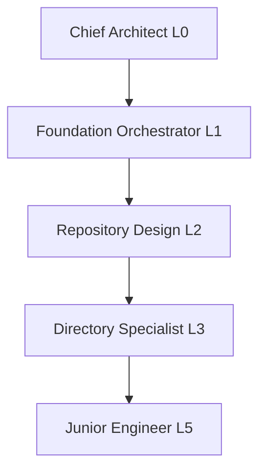

# Agent Hierarchy Diagram

Generate visual diagrams showing agent system structure and relationships.

## When to Use

- Documenting agent system for team
- Understanding delegation structure
- Onboarding new contributors
- Visualizing agent relationships for presentations

## Quick Reference

```bash
# Generate ASCII tree diagram
./scripts/generate_hierarchy_diagram.sh

# Generate Mermaid diagram
./scripts/generate_mermaid_diagram.sh > hierarchy.mmd

# Save to documentation
./scripts/generate_hierarchy_diagram.sh > agents/hierarchy-visual.txt
```

## ASCII Tree Format

```text
Chief Architect (L0)
├── Foundation Orchestrator (L1)
│   ├── Repository Design (L2)
│   │   ├── Directory Specialist (L3)
│   │   │   └── Junior Engineer (L5)
│   │   └── Config Specialist (L3)
│   └── Config Design (L2)
├── Shared Library Orchestrator (L1)
│   └── Tensor Module Design (L2)
│       └── Tensor Specialist (L3)
└── Tooling Orchestrator (L1)
```

## Mermaid Format



## Use Cases

- Add to `/agents/hierarchy.md` for reference
- Include in onboarding documentation
- Create presentation materials
- Understand delegation chains
- Communicate structure to stakeholders

## Output Formats

**ASCII**: Human-readable in terminals, copy-pasteable in docs

**Mermaid**: Renders in GitHub markdown, editable in Mermaid editor

**GraphML**: Import into diagram tools (yEd, Graphviz)

## References

- `/agents/hierarchy.md` - Existing hierarchy documentation
- `agent-test-delegation` - Validate diagram accuracy
- `.claude/agents/` - Agent configuration source
