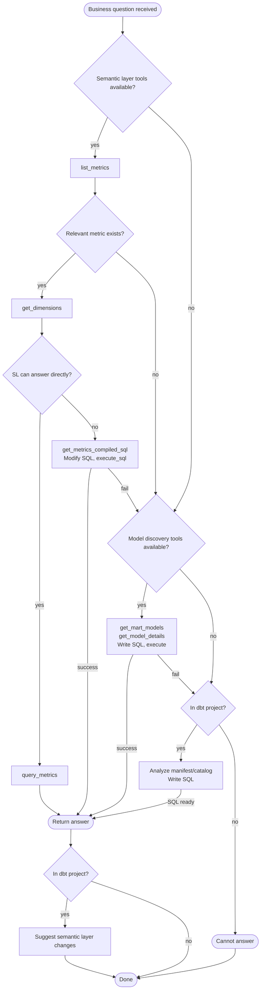

# Answering Natural Language Questions with dbt

## Overview

Answer data questions using the best available method: semantic layer first, then SQL modification, then model discovery, then manifest analysis. Always exhaust options before saying "cannot answer."

**Use for:** Business questions from users that need data answers
- "What were total sales last month?"
- "How many active customers do we have?"
- "Show me revenue by region"

**Not for:**
- Validating model logic during development
- Testing dbt models or semantic layer definitions
- Building or modifying dbt models
- `dbt run`, `dbt test`, or `dbt build` workflows

## Decision Flow



## Quick Reference

| Priority | Condition | Approach | Tools |
|----------|-----------|----------|-------|
| 1 | Semantic layer active | Query metrics directly | `list_metrics`, `get_dimensions`, `query_metrics` |
| 2 | SL active but minor modifications needed (missing dimension, custom filter, case when, different aggregation) | Modify compiled SQL | `get_metrics_compiled_sql`, then `execute_sql` |
| 3 | No SL, discovery tools active | Explore models, write SQL | `get_mart_models`, `get_model_details`, then `show`/`execute_sql` |
| 4 | No MCP, in dbt project | Analyze artifacts, write SQL | Read `target/manifest.json`, `target/catalog.json` |

## Approach 1: Semantic Layer Query

When `list_metrics` and `query_metrics` are available:

1. `list_metrics` - find relevant metric
2. `get_dimensions` - verify required dimensions exist
3. `query_metrics` - execute with appropriate filters

If semantic layer can't answer directly (missing dimension, need custom logic) → go to Approach 2.

## Approach 2: Modified Compiled SQL

When semantic layer has the metric but needs minor modifications:

- Missing dimension (join + group by)
- Custom filter not available as a dimension
- Case when logic for custom categorization
- Different aggregation than what's defined

1. `get_metrics_compiled_sql` - get the SQL that would run (returns raw SQL, not Jinja)
2. Modify SQL to add what's needed
3. `execute_sql` to run the raw SQL
4. **Always suggest** updating the semantic model if the modification would be reusable

```sql
-- Example: Adding sales_rep dimension
WITH base AS (
    -- ... compiled metric logic (already resolved to table names) ...
)
SELECT base.*, reps.sales_rep_name
FROM base
JOIN analytics.dim_sales_reps reps ON base.rep_id = reps.id
GROUP BY ...

-- Example: Custom filter
SELECT * FROM (compiled_metric_sql) WHERE region = 'EMEA'

-- Example: Case when categorization
SELECT
    CASE WHEN amount > 1000 THEN 'large' ELSE 'small' END as deal_size,
    SUM(amount)
FROM (compiled_metric_sql)
GROUP BY 1
```

**Note:** The compiled SQL contains resolved table names, not `{{ ref() }}`. Work with the raw SQL as returned.

## Approach 3: Model Discovery

When no semantic layer but `get_all_models`/`get_model_details` available:

1. `get_mart_models` - start with marts, not staging
2. `get_model_details` for relevant models - understand schema
3. Write SQL using `{{ ref('model_name') }}`
4. `show --inline "..."` or `execute_sql`

**Prefer marts over staging** - marts have business logic applied.

## Approach 4: Manifest/Catalog Analysis

When in a dbt project but no MCP server:

1. Check for `target/manifest.json` and `target/catalog.json`
2. **Filter before reading** - these files can be large

```bash
# Find mart models in manifest
jq '.nodes | to_entries | map(select(.key | startswith("model.") and contains("mart"))) | .[].value | {name: .name, schema: .schema, columns: .columns}' target/manifest.json

# Get column info from catalog
jq '.nodes["model.project_name.model_name"].columns' target/catalog.json
```

3. Write SQL based on discovered schema
4. Explain: "This SQL should run in your warehouse. I cannot execute it without database access."

## Suggesting Improvements

**When in a dbt project**, suggest semantic layer changes after answering (or when cannot answer):

| Gap | Suggestion |
|-----|------------|
| Metric doesn't exist | "Add a metric definition to your semantic model" |
| Dimension missing | "Add `dimension_name` to the dimensions list in the semantic model" |
| No semantic layer | "Consider adding a semantic layer for this data" |

**Stay at semantic layer level.** Do NOT suggest:
- Database schema changes
- ETL pipeline modifications
- "Ask your data engineering team to..."

## Rationalizations to Resist

| You're Thinking... | Reality |
|--------------------|---------|
| "Semantic layer doesn't support this exact query" | Get compiled SQL and modify it (Approach 2) |
| "No MCP tools, can't help" | Check for manifest/catalog locally |
| "User needs this quickly, skip the systematic check" | Systematic approach IS the fastest path |
| "Just write SQL, it's faster" | Semantic layer exists for a reason - use it first |
| "The dimension doesn't exist in the data" | Maybe it exists but not in semantic layer config |

## Red Flags - STOP

- Writing SQL without checking if semantic layer can answer
- Saying "cannot answer" without trying all 4 approaches
- Suggesting database-level fixes for semantic layer gaps
- Reading entire manifest.json without filtering
- Using staging models when mart models exist
- Using this to validate model correctness rather than answer business questions

## Common Mistakes

| Mistake | Fix |
|---------|-----|
| Giving up when SL can't answer directly | Get compiled SQL and modify it |
| Querying staging models | Use `get_mart_models` first |
| Reading full manifest.json | Use jq to filter |
| Suggesting ETL changes | Keep suggestions at semantic layer |
| Not checking tool availability | List available tools before choosing approach |
