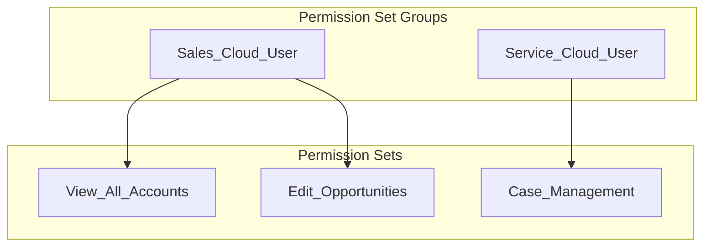

# sf-permissions

> Salesforce Permission Set analysis, visualization, and auditing tool

## When to Use This Skill

Use `sf-permissions` when the user needs to:
- Visualize Permission Set and Permission Set Group hierarchies
- Find out "who has access to X?" (objects, fields, Apex classes, custom permissions)
- Analyze what permissions a specific user has
- Export Permission Set configurations for auditing
- Generate Permission Set XML metadata
- Understand permission inheritance through PSG membership

## Capabilities

| Capability | Description |
|------------|-------------|
| **Hierarchy Viewer** | Visualize all PS/PSG in an org as ASCII trees |
| **Permission Detector** | Find which PS/PSG grant a specific permission |
| **User Analyzer** | Show all permissions assigned to a user |
| **CSV Exporter** | Export PS configuration for documentation |
| **Metadata Generator** | Generate Permission Set XML (delegates to sf-metadata) |
| **Tooling API** | Query tab settings, system permissions via Tooling API |

## Prerequisites

```bash
# Python dependencies
pip install simple-salesforce rich

# Salesforce CLI (for authentication)
sf --version  # Must be installed and authenticated
```

## Authentication

This skill reuses existing `sf` CLI authentication. Ensure you're authenticated:

```bash
# Check current org
sf org display

# Authenticate if needed
sf org login web --alias myorg
```

---

## Phase 1: Understanding the Request

When a user asks about permissions, identify which capability they need:

| User Says | Capability | Function |
|-----------|------------|----------|
| "Show permission hierarchy" | Hierarchy Viewer | `hierarchy_viewer.py` |
| "Who has access to Account?" | Permission Detector | `permission_detector.py` |
| "What permissions does John have?" | User Analyzer | `user_analyzer.py` |
| "Export Sales_Manager PS to CSV" | CSV Exporter | `permission_exporter.py` |
| "Generate PS XML with these permissions" | Metadata Generator | `permission_generator.py` |

---

## Phase 2: Connecting to the Org

### Step 1: Determine Target Org

```bash
# List available orgs
sf org list

# Default to current target org, or ask user to specify
sf org display --target-org <alias>
```

### Step 2: Get Connection via Python

```python
# Run from sf-permissions/scripts/
python -c "
from auth import get_sf_connection
sf = get_sf_connection('myorg')  # or None for default
print(f'Connected to: {sf.sf_instance}')
"
```

---

## Phase 3: Executing Queries

### 3.1 Permission Hierarchy Viewer

**Purpose**: Show all Permission Sets and Permission Set Groups in the org

```bash
cd ~/.claude/plugins/marketplaces/sf-skills/sf-permissions/scripts
python cli.py hierarchy [--target-org ALIAS] [--format ascii|mermaid]
```

**Output Example**:
```
📦 ORG PERMISSION HIERARCHY
════════════════════════════════════════

📁 Permission Set Groups (3)
├── 🔒 Sales_Cloud_User (Active)
│   ├── View_All_Accounts
│   ├── Edit_Opportunities
│   └── Run_Reports
├── 🔒 Service_Cloud_User (Active)
│   └── Case_Management
└── 🔒 Marketing_User (Outdated)
    └── Campaign_Access

📁 Standalone Permission Sets (12)
├── Admin_Tools
├── API_Access
└── ... (10 more)
```

### 3.2 Permission Detector ("Who has access to X?")

**Purpose**: Find which PS/PSG grant a specific permission

### 3.3 Agent Access Permissions

**Purpose**: Grant users access to Agentforce Employee Agents

Employee Agents require explicit access via the `<agentAccesses>` element in Permission Sets. Without this, users won't see the agent in the Lightning Experience Copilot panel.

**Permission Set XML Structure:**
```xml
<?xml version="1.0" encoding="UTF-8"?>
<PermissionSet xmlns="http://soap.sforce.com/2006/04/metadata">
    <agentAccesses>
        <agentName>Case_Assist</agentName>
        <enabled>true</enabled>
    </agentAccesses>
    <hasActivationRequired>false</hasActivationRequired>
    <label>Case Assist Agent Access</label>
</PermissionSet>
```

**Key Points:**
- `<agentName>` must exactly match the `developer_name` in the agent's config block
- Multiple `<agentAccesses>` elements can be included for multiple agents
- `<enabled>true</enabled>` grants access; `false` or omission denies access

**Deploy and Assign:**
```bash
# Deploy permission set
sf project deploy start --source-dir force-app/main/default/permissionsets/Agent_Access.permissionset-meta.xml -o TARGET_ORG

# Assign via Setup > Permission Sets > Manage Assignments
```

---

## Agent Visibility Troubleshooting

When an Agentforce Employee Agent is deployed but not visible to users:

### Step 1: Verify Agent Status
```bash
sf org open -p "/lightning/setup/EinsteinAgentforce/home" -o TARGET_ORG
# Agent should show Status: Active
```

### Step 2: Check for Agent Access Permission
```bash
# Retrieve permission sets to check for agentAccesses
sf project retrieve start -m "PermissionSet:*" -o TARGET_ORG

# Search for agentAccesses element
grep -r "agentAccesses" force-app/main/default/permissionsets/
```

### Step 3: Create Permission Set (if needed)
Create `force-app/main/default/permissionsets/MyAgent_Access.permissionset-meta.xml`:
```xml
<?xml version="1.0" encoding="UTF-8"?>
<PermissionSet xmlns="http://soap.sforce.com/2006/04/metadata">
    <agentAccesses>
        <agentName>MyAgent</agentName>
        <enabled>true</enabled>
    </agentAccesses>
    <hasActivationRequired>false</hasActivationRequired>
    <label>MyAgent Access</label>
</PermissionSet>
```

### Common Issues
| Symptom | Cause | Solution |
|---------|-------|----------|
| No Agentforce icon | CopilotSalesforceUser PS not assigned | Assign CopilotSalesforceUser permission set |
| Icon visible, agent not in list | Missing agentAccesses | Add `<agentAccesses>` to permission set |
| Agent visible, errors on open | Agent not fully published | Check agent logs in Setup |
| "Agent not found" error | Name mismatch | Ensure `<agentName>` matches `developer_name` exactly |

---

**Supported Permission Types**:
- `object` - Object CRUD (Create, Read, Update, Delete, ViewAll, ModifyAll)
- `field` - Field-Level Security (Read, Edit)
- `apex` - Apex Class access
- `vf` - Visualforce Page access
- `flow` - Flow access
- `custom` - Custom Permission
- `tab` - Tab visibility

```bash
cd ~/.claude/plugins/marketplaces/sf-skills/sf-permissions/scripts

# Object permissions
python cli.py detect object Account --access delete
python cli.py detect object Opportunity --access create,read,edit

# Field permissions
python cli.py detect field Account.AnnualRevenue --access edit

# Apex class access
python cli.py detect apex MyApexClass

# Custom permission
python cli.py detect custom Can_Approve_Expenses

# Tab visibility
python cli.py detect tab Account
```

**Output Example**:
```
🔍 PERMISSION DETECTION RESULTS
════════════════════════════════════════
Query: Delete access to Account

Found in 3 Permission Sets:

📋 Permission Set          │ Group Membership       │ Users
──────────────────────────┼────────────────────────┼───────
System_Administrator       │ ✗ Standalone           │ 2
Sales_Operations_Manager   │ ✓ Sales_Cloud_PSG      │ 5
Data_Steward               │ ✓ Data_Management_PSG  │ 1

Total users with this access: 8
```

### 3.3 User Permission Analyzer

**Purpose**: Show all permissions assigned to a specific user

```bash
cd ~/.claude/plugins/marketplaces/sf-skills/sf-permissions/scripts
python cli.py user "john.smith@company.com"
python cli.py user 005xx000001234AAA  # User ID also works
```

**Output Example**:
```
👤 USER PERMISSION ANALYSIS
════════════════════════════════════════
User: John Smith (john.smith@company.com)
Profile: Standard User

📁 Via Permission Set Groups (2)
├── 🔒 Sales_Cloud_User
│   ├── View_All_Accounts ✓
│   ├── Edit_Opportunities ✓
│   └── Run_Reports ✓
└── 🔒 Service_Cloud_User
    └── Case_Management ✓

📁 Direct Permission Sets (3)
├── API_Access
├── Custom_App_Access
└── Einstein_Analytics_User
```

### 3.4 Permission Set Exporter

**Purpose**: Export PS configuration to CSV for documentation/auditing

```bash
cd ~/.claude/plugins/marketplaces/sf-skills/sf-permissions/scripts
python cli.py export Sales_Manager --output /tmp/sales_manager.csv
```

**CSV Output Columns**:
- Category (Object, Field, Apex, Tab, System)
- Name (Object/Field/Class name)
- Permission (Create, Read, Edit, Delete, etc.)
- Value (true/false)

### 3.5 Metadata Fetcher (Helper)

**Purpose**: Get available objects, fields, Apex classes for autocomplete/validation

```python
from metadata_fetcher import (
    get_available_objects,
    get_object_fields,
    get_apex_classes,
    get_custom_permissions
)

sf = get_sf_connection()
objects = get_available_objects(sf)
fields = get_object_fields(sf, 'Account')
```

---

## Phase 4: Rendering Output

### ASCII Tree (Terminal)

Uses the `rich` library for professional terminal output:
- Trees for hierarchy visualization
- Tables for tabular data
- Panels for summaries
- Progress bars for long-running queries

### Mermaid Diagrams (Documentation)

For embedding in Markdown/documentation:

```bash
python cli.py hierarchy --format mermaid > hierarchy.md
```



---

## Phase 5: Generating Metadata (Optional)

If the user wants to create a new Permission Set based on analysis:

```bash
# Generate Permission Set XML
python cli.py generate \
    --name "New_Sales_PS" \
    --label "New Sales Permission Set" \
    --objects Account:crud,Opportunity:cru \
    --fields Account.AnnualRevenue:rw \
    --apex MyApexClass,AnotherClass \
    --output /tmp/New_Sales_PS.permissionset-meta.xml
```

**Or delegate to sf-metadata skill** for more complex generation.

---

## SOQL Reference

### Permission Set Queries

```sql
-- All Permission Sets (excluding PSGs)
SELECT Id, Name, Label, Description, IsOwnedByProfile
FROM PermissionSet
WHERE IsOwnedByProfile = false AND Type != 'Group'

-- All Permission Set Groups
SELECT Id, DeveloperName, MasterLabel, Status, Description
FROM PermissionSetGroup

-- PSG Components (which PS are in which PSG)
SELECT PermissionSetGroupId, PermissionSetGroup.DeveloperName,
       PermissionSetId, PermissionSet.Name
FROM PermissionSetGroupComponent

-- User's PS Assignments
SELECT AssigneeId, PermissionSetId, PermissionSet.Name,
       PermissionSetGroupId, PermissionSetGroup.DeveloperName
FROM PermissionSetAssignment
WHERE AssigneeId = '005...'
```

### Object Permissions

```sql
-- Object permissions for a specific PS
SELECT SobjectType, PermissionsCreate, PermissionsRead,
       PermissionsEdit, PermissionsDelete,
       PermissionsViewAllRecords, PermissionsModifyAllRecords
FROM ObjectPermissions
WHERE ParentId = '0PS...'

-- Find PS with specific object access
SELECT Parent.Name, Parent.Label, SobjectType,
       PermissionsCreate, PermissionsRead, PermissionsEdit, PermissionsDelete
FROM ObjectPermissions
WHERE SobjectType = 'Account' AND PermissionsDelete = true
```

### Field Permissions

```sql
-- Field permissions for a specific PS
SELECT Field, PermissionsRead, PermissionsEdit
FROM FieldPermissions
WHERE ParentId = '0PS...'

-- Find PS with specific field access
SELECT Parent.Name, Field, PermissionsRead, PermissionsEdit
FROM FieldPermissions
WHERE Field = 'Account.AnnualRevenue' AND PermissionsEdit = true
```

### Setup Entity Access (Apex, VF, Flows, Custom Permissions)

```sql
-- Setup entity access for a PS
SELECT SetupEntityType, SetupEntityId
FROM SetupEntityAccess
WHERE ParentId = '0PS...'

-- Find PS with access to specific Apex class
SELECT Parent.Name, Parent.Label
FROM SetupEntityAccess
WHERE SetupEntityType = 'ApexClass'
AND SetupEntityId IN (SELECT Id FROM ApexClass WHERE Name = 'MyClass')

-- Custom permissions
SELECT Parent.Name
FROM SetupEntityAccess
WHERE SetupEntityType = 'CustomPermission'
AND SetupEntityId IN (SELECT Id FROM CustomPermission WHERE DeveloperName = 'Can_Approve')
```

---

## Common Workflows

### Workflow 1: Audit "Who can delete Accounts?"

```
User: "Who has delete access to the Account object?"

1. Run permission detector for object:Account with delete access
2. For each PS found, get PSG membership
3. For each PS/PSG, count assigned users
4. Display results in table format
```

### Workflow 2: Troubleshoot User Access

```
User: "Why can't John edit Opportunities?"

1. Run user analyzer for john@company.com
2. Check if any PS grants Opportunity edit
3. If not, suggest which PS/PSG to assign
4. Check for conflicting profile restrictions
```

### Workflow 3: Document Permission Set

```
User: "Export the Sales_Manager PS for documentation"

1. Run exporter for Sales_Manager
2. Generate CSV with all permissions
3. Optionally generate Mermaid diagram showing PSG membership
```

---

## Troubleshooting

### "INVALID_SESSION_ID" Error

Re-authenticate with sf CLI:
```bash
sf org login web --alias myorg
```

### Slow Queries

Large orgs may have thousands of PS. Use filters:
```python
# Filter by name pattern
sf.query("SELECT Id, Name FROM PermissionSet WHERE Name LIKE 'Sales%'")
```

### Tooling API Limitations

Some metadata (like tab settings) requires Tooling API:
```python
from tooling_api import tooling_query
results = tooling_query(sf, "SELECT Name, Visibility FROM PermissionSetTabSetting")
```

---

## Integration with Other Skills

| Skill | Integration |
|-------|-------------|
| `sf-metadata` | Generate Permission Set XML from analysis results |
| `sf-apex` | Identify Apex classes to grant access to |
| `sf-deploy` | Deploy generated Permission Sets |
| `sf-data` | Query user assignments in bulk |

---

## Examples

### Example 1: Full Org Audit

```
User: "Give me a complete picture of permissions in my org"

Claude:
1. Runs hierarchy viewer to show all PS/PSG
2. Identifies PSGs with "Outdated" status
3. Counts users per PS
4. Generates Mermaid diagram for documentation
```

### Example 2: Security Review

```
User: "Find all PS that grant ModifyAllData"

Claude:
1. Queries PermissionSet for PermissionsModifyAllData = true
2. Lists PS names and assigned user counts
3. Flags any non-admin PS with this powerful permission
```

### Example 3: Permission Set Creation

```
User: "Create a PS for contractors with read-only Account access"

Claude:
1. Uses permission_generator.py to create XML
2. Sets Account object to Read-only (no Create/Edit/Delete)
3. Outputs .permissionset-meta.xml file
```
