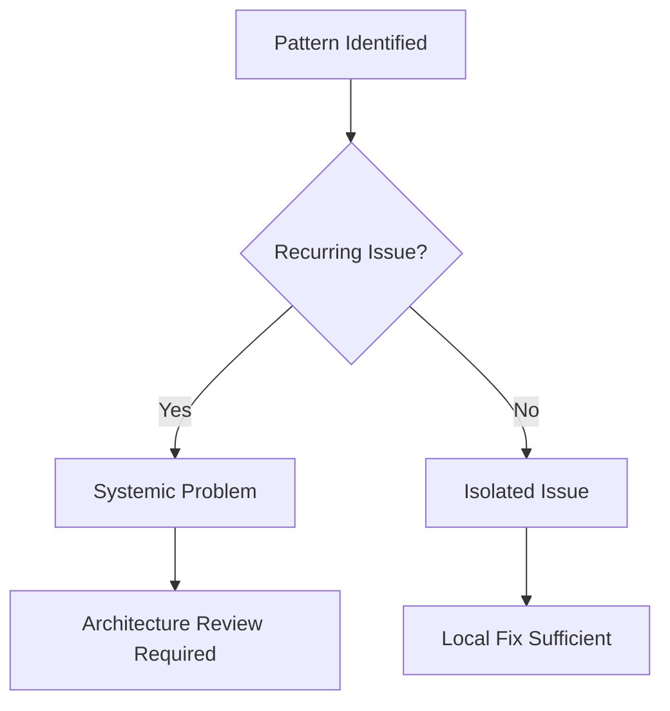

# Systematic Analysis & Diagnosis

<mission_control>
<objective>Perform systematic root cause investigation with evidence gathering before any fixes</objective>
<success_criteria>Root cause identified with documented evidence, minimal fix applied and verified</success_criteria>
</mission_control>

## Overview

Systematic root cause investigation framework for debugging bugs, test failures, and unexpected behavior. Implements the 4-phase Iron Law with evidence gathering protocols and psychological pressure resistance.

**Core principle:** NO FIXES WITHOUT ROOT CAUSE INVESTIGATION FIRST

**The Iron Law:** Root Cause → Pattern Analysis → Hypothesis → Implementation (never skip phases)

<interaction_schema>
symptom → evidence → hypothesis → test → implementation → verify
</interaction_schema>

## Investigation Format

<investigation_format>
<investigation>
<symptom>
<description>[What is the observable problem?]</description>
<error_messages>[Complete error text, stack traces]</error_messages>
<reproduction_steps>[Exact steps to reproduce]</reproduction_steps>
<frequency>[Always/Sometimes/Once]</frequency>
</symptom>

<evidence>
<logs>[Relevant log output]</logs>
<recent_changes>[Git diff, recent commits, config changes]</recent_changes>
<environment_data>[OS, versions, dependencies]</environment_data>
<diagnostic_output>[Output from diagnostic commands]</diagnostic_output>
</evidence>

<hypothesis>
<root_cause>[What is the likely root cause?]</root_cause>
<reasoning>[Why does this cause the symptom?]</reasoning>
<confidence>[High/Medium/Low - based on evidence]</confidence>
</hypothesis>

<test>
<minimal_reproduction>[Smallest test to confirm hypothesis]</minimal_reproduction>
<expected_result>[What should happen if hypothesis is correct]</expected_result>
<actual_result>[What actually happened]</actual_result>
<conclusion>[Confirmed/Rejected - hypothesis status]</conclusion>
</test>
</investigation>
</investigation_format>

---

## The Iron Law

<absolute_constraint>
**NO FIXES WITHOUT ROOT CAUSE INVESTIGATION FIRST**

If you haven't completed Phase 1, you CANNOT propose fixes.

This is not a suggestion. This is a law of debugging.
</absolute_constraint>

## When to Use

**Use when:**

- Any bug or test failure occurs
- Unexpected behavior observed
- Regression testing fails
- Debugging session extends beyond 15 minutes
- Multiple failed fix attempts
- Architecture-level issues suspected

**Don't use when:**

- Issue is trivial and obvious (typo, missing import)
- Creative/experimental debugging
- Learning new systems (use exploratory approach)

## The Four-Phase Investigation

### Phase 1: Root Cause Investigation

**MANDATORY FIRST STEP** - Never skip to fixing

#### Evidence Gathering Protocol

```bash
# Multi-component diagnostic instrumentation
diagnostic_check() {
  echo "=== System State ==="
  uname -a
  node --version 2>&1 || echo "Node not found"
  npm --version 2>&1 || echo "npm not found"

  echo -e "\n=== Error Context ==="
  tail -50 error.log 2>/dev/null || echo "No error.log"

  echo -e "\n=== Recent Changes ==="
  git log --oneline -10

  echo -e "\n=== Test Output ==="
  npm test 2>&1 | tail -100

  echo -e "\n=== Build Status ==="
  npm run build 2>&1 || echo "Build failed"
}
```

#### Root Cause Discovery Techniques

**1. Temporal Analysis**

- When did this first occur?
- What changed between working and broken?
- Commit history analysis
- Time-based correlation

**2. Backward Tracing**

- Start from error symptom
- Trace call stack backward
- Identify failure point
- Find root cause upstream

**3. Architecture Awareness**

- 3+ failures = architectural problem, not code issue
- Systemic patterns vs isolated bugs
- Integration points as failure sources
- State management issues

**4. 5 Whys Technique**

For complex problems, use iterative "why" questioning to drill down:

```
**Problem**: [Observable symptom]

**Why 1**: [First-level cause]
→ Because [explanation]

**Why 2**: [Second-level cause]
→ Because [explanation]

**Why 3**: [Third-level cause]
→ Because [explanation]

**Why 4**: [Fourth-level cause]
→ Because [explanation]

**Why 5**: [Root cause]
→ Because [explanation]

**Root Cause**: [The fundamental issue]
**Action**: [What to fix to prevent recurrence]
```

**Guidelines**:

- Be specific - each answer should be factual and verifiable
- Avoid blame - focus on systems and processes
- Check logic - ensure each answer explains the previous level
- Stop at root cause - when you reach something actionable

#### Evidence Documentation

Document ALL findings:

```markdown
## Root Cause Analysis

**Symptom:** [Exact error message or behavior]

**Evidence:**

1. [Source file:line] - What happened
2. [Source file:line] - Why it failed
3. [Source file:line] - Root cause

**Pattern:** [Isolated issue or systemic problem?]
```

### Phase 2: Pattern Analysis

**Question:** Is this isolated or systemic?

#### Pattern Recognition

**Isolated Patterns:**

- Single component affected
- Reproducible with specific input
- No cascade effects
- Local fix sufficient

**Systemic Patterns:**

- Multiple components affected
- Architecture-level issue
- State management problem
- Integration failure

#### Decision Tree



### Phase 3: Hypothesis Formation

**MANDATORY:** Single hypothesis, minimal testing

#### Hypothesis Criteria

**Good Hypotheses:**

- Based on evidence from Phase 1
- Falsifiable (can be proven wrong)
- Specific (predicts exact behavior)
- Actionable (suggests concrete fix)

**Bad Hypotheses:**

- Multiple competing hypotheses
- Based on assumptions, not evidence
- Too vague to test
- Confirmed without testing

#### Hypothesis Template

```markdown
## Hypothesis

**Based on:** [Evidence from Phase 1]

**Predicts:** [Specific behavior if hypothesis is true]

**Test:** [Minimal test to verify/falsify]

**Expected Result:** [What we should see]
```

### Phase 4: Implementation

**Only after Phases 1-3 complete**

#### Implementation Protocol

1. **Implement fix** based on verified hypothesis
2. **Test fix** with minimal test case
3. **Verify no regressions** with broader test suite
4. **Document root cause** for future reference

#### Fix Validation

```bash
# Minimal test to verify fix
test_fix() {
  echo "Running minimal fix verification..."
  node -e "[test code]"
  if [ $? -eq 0 ]; then
    echo "✅ Fix verified"
  else
    echo "❌ Fix failed - re-examine hypothesis"
  fi
}
```

## Red Flags - STOP

### Investigation Violations

- Skipping Phase 1 (root cause) and jumping to fixes
- Multiple competing hypotheses (choose ONE)
- Fixing without evidence-based hypothesis
- Assuming instead of testing
- Pattern denial (ignoring systemic issues)
- **Starting to code before completing Phase 3**

### Rationalization Prevention

| Excuse                  | Reality                             |
| ----------------------- | ----------------------------------- |
| "This should work"      | TEST it first                       |
| "Looks correct"         | Evidence needed                     |
| "Probably just a typo"  | Verify root cause                   |
| "I've seen this before" | This case may differ                |
| "Time pressure"         | Fixes without root cause waste time |
| "Probably nothing"      | Thorough investigation needed       |
| "Just restart"          | Restarts don't fix root causes      |

### Stop Patterns

If you catch yourself:

- ✅ Fixing without root cause analysis
- ✅ Making multiple hypothesis at once
- ✅ Ignoring evidence that contradicts assumptions
- ✅ Rushing to implementation
- ✅ Denying systemic patterns

STOP and return to Phase 1.

## Pressure Resistance

### Common Pressure Scenarios

**Time Pressure:**

- "Need to deploy soon"
- "User waiting for fix"
- "Demo in 30 minutes"

**Response:** Root cause investigation prevents future issues. Fixes without root cause create technical debt.

**Sunk Cost:**

- "Already spent 2 hours debugging"
- "Almost there with current approach"
- "Can't abandon this fix attempt"

**Response:** Sunk cost fallacy. Return to root cause with fresh perspective.

**Obvious Fix Temptation:**

- "It's obviously just a missing semicolon"
- "Clearly the API is down"
- "Just need to restart"

**Response:** Verify with evidence. Obvious ≠ Correct.

### Pressure Response Protocol

1. **Acknowledge pressure**
2. **Return to systematic approach**
3. **Brief justification**: "Root cause prevents recurrence"
4. **Continue investigation**

## Evidence Gathering Templates

### Bug Report Template

```markdown
## Bug Analysis Report

### Symptom

[Exact error message or behavior]

### Reproducibility

- [ ] Always
- [ ] Sometimes
- [ ] Specific conditions: [list]

### Environment

- OS: [uname -a]
- Node: [node --version]
- Dependencies: [npm list]

### Timeline

- First observed: [date/time]
- Last working: [date/time]
- Changes since: [git log]

### Evidence

1. [Source:line] - [description]
2. [Source:line] - [description]

### Root Cause

[Single sentence: What actually failed?]

### Pattern

- [ ] Isolated issue
- [ ] Systemic problem

### Hypothesis

[Based on evidence, what causes this?]

### Test

[How to verify hypothesis?]

### Fix

[What changes resolve the issue?]
```

### Test Failure Analysis

```markdown
## Test Failure Analysis

### Failure Message
```

[Exact test output]

```

### Stack Trace
```

[Full stack trace]

````

### Test Code
```javascript
[Relevant test code]
````

### Implementation

```javascript
[Relevant implementation]
```

### Root Cause

[What actually failed?]

### Fix Strategy

[How to resolve?]

```

## Systematic vs Heuristic Debugging

### When to Use Systematic

- **Complex failures** - Multiple components
- **Recurring issues** - Happened before
- **Production bugs** - High stakes
- **Architectural problems** - 3+ failures
- **Time pressure** - Prevent future issues

### When Heuristic is OK

- **Learning new code** - Exploratory
- **Prototyping** - Experimentation
- **Trivial issues** - Obvious typos
- **Time extreme** - Emergency hotfix

**Rule:** If systematic takes >30 minutes on obvious issue, switch to heuristic. But document root cause afterward.

## Key Principles

1. **Evidence-based investigation** - Gather proof, don't assume
2. **Single hypothesis focus** - Test one thing at a time
3. **Pattern recognition** - Distinguish isolated vs systemic
4. **Architecture awareness** - 3+ failures = systemic
5. **Pressure resistance** - Systematic beats intuition under stress

**Remember:** Fixing without root cause investigation is like putting tape on a water pipe without finding the crack.

---

## References

For related diagnostic capabilities:
- **Use the skill `quality-standards`** - Unified quality validation and three-way audit

---

## Genetic Code

This component carries essential Seed System principles for context: fork isolation:

<critical_constraint>
MANDATORY: All components MUST be self-contained (zero .claude/rules dependency)
MANDATORY: Achieve 80-95% autonomy (0-5 AskUserQuestion rounds per session)
MANDATORY: Description MUST use What-When-Not format in third person
MANDATORY: No component references another component by name in description
MANDATORY: Progressive disclosure - references/ for detailed content
MANDATORY: Use XML for control (mission_control, critical_constraint), Markdown for data
No exceptions. Portability invariant must be maintained.
</critical_constraint>

**Delta Standard**: Good Component = Expert Knowledge − What Claude Already Knows

**Recognition Questions**:
- "Would Claude know this without being told?" → Delete (zero delta)
- "Can this work standalone?" → Fix if no (non-self-sufficient)
- "Did I read the actual file, or just see it in grep?" → Verify before claiming

---

## Absolute Constraints (Non-Negotiable)

<critical_constraint>
**THE IRON LAW: NO FIXES WITHOUT ROOT CAUSE INVESTIGATION**

- Complete Phase 1 (Root Cause Investigation) BEFORE proposing ANY fix
- Document symptoms, evidence, hypothesis BEFORE implementing
- Test hypothesis with minimal reproduction BEFORE full fix
- NEVER skip to Phase 4 without completing Phases 1-3

**MANDATORY: Use `<investigation>` format**

- Symptom: What is the observable problem?
- Evidence: Error messages, logs, recent changes, environment
- Hypothesis: What is the likely root cause and why?
- Test: Minimal reproduction to confirm hypothesis

**MANDATORY: One hypothesis at a time**

- Form single hypothesis based on evidence
- Test with minimal reproduction
- Confirm or reject before next hypothesis
- NEVER try multiple fixes simultaneously

**MANDATORY: Verification before claiming completion**

- Test confirms fix resolves issue
- No regressions introduced
- Edge cases considered
- Root cause documented

**MANDATORY: Question architecture after 3+ failed hypotheses**

- If 3+ hypotheses fail: STOP fixing
- Question the pattern/architecture
- Discuss with human partner
- Wrong pattern cannot be fixed by more patches

**No exceptions. Symptom patches are failure. Evidence-based investigation is mandatory.**
</critical_constraint>
```
