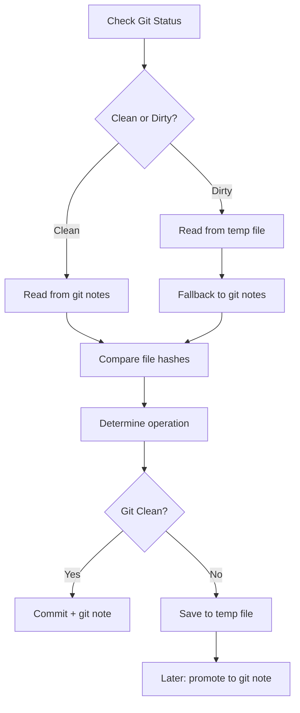
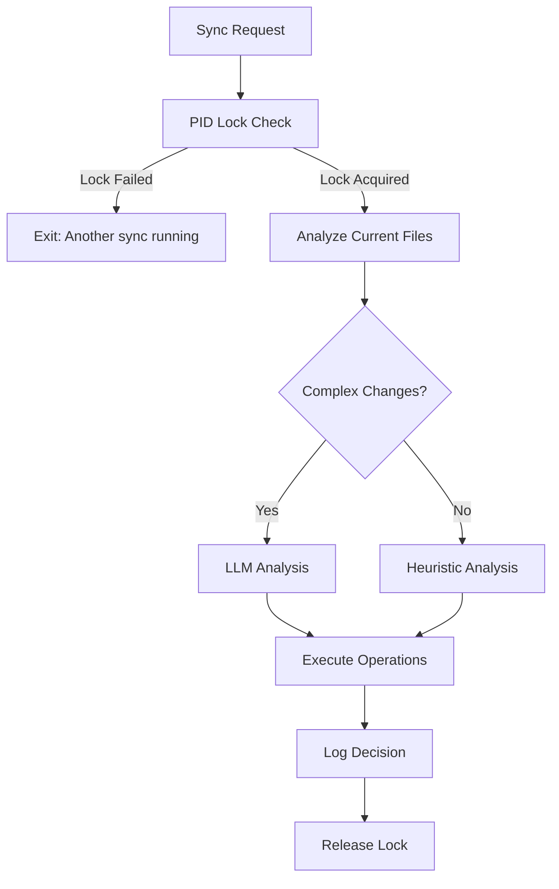

# PDD Sync Determination: Problem Analysis and Proposed Solution

## Executive Summary

The PDD sync command faces a complex challenge: intelligently determining what operations to perform when users have made simultaneous changes to multiple files (prompt, code, tests, examples) and sync operations may be interrupted partway through. The original approach used overly complex state management that introduced race conditions and maintenance overhead. This document outlines the problem space and our proposed solution using PID-based locking with LLM-powered conflict resolution.

## Problem Definition

### Core Challenge

The sync system must handle these scenarios:

1. **Multiple Simultaneous Changes**
   ```
   User modifies:
   - prompt (adds new feature)
   - code (manual bug fix)
   - tests (adds test cases)
   - example (updates usage)
   
   Question: What operations should sync perform and in what order?
   ```

2. **Interrupted Sync Operations**
   ```
   Sync workflow:
   1. ✅ auto-deps completed
   2. ✅ generate completed
   3. ❌ example failed (process crashed)
   4. ❌ test not started
   
   Question: How does sync resume intelligently?
   ```

3. **Conflicting Change Types**
   ```
   - Prompt says: "Add input validation"
   - Code has: Manual bug fix for edge cases
   - Tests have: New test for the bug fix
   
   Question: How to merge without losing manual work?
   ```

### Original Complex Approach

The initial `sync_determine_operation_python.prompt` implemented:



#### Problems with Original Approach

1. **Race Conditions**
   - Multiple sync processes could corrupt `.pdd/sync_pending.json`
   - No atomic operations for state updates

2. **Complexity Overhead**
   - Dual git-notes + temp-file system
   - Complex state retrieval logic
   - 200+ lines of state management code

3. **Integration Issues**
   - Other sync prompts unaware of state system
   - Heavy git dependencies that could fail

4. **Infinite Loop Risk**
   ```
   Prompt newer → generate → Code newer → update → Prompt newer → ...
   ```

## Proposed Solution Architecture

### High-Level Approach



### Core Components

#### 1. PID-Based Single Instance Enforcement

**Purpose**: Prevent race conditions by ensuring only one sync per basename+language.

**Implementation**:
```python
# Lock file: .pdd/sync_{basename}_{language}.pid
# Content: Process ID as string

def acquire_sync_lock(basename: str, language: str) -> bool:
    lock_file = Path(f".pdd/sync_{basename}_{language}.pid")
    
    # Check existing lock
    if lock_file.exists():
        try:
            pid = int(lock_file.read_text().strip())
            if is_process_running(pid):
                return False  # Another sync running
            else:
                lock_file.unlink()  # Clean stale lock
        except (ValueError, OSError):
            lock_file.unlink()  # Clean corrupted lock
    
    # Acquire lock
    lock_file.parent.mkdir(exist_ok=True)
    lock_file.write_text(str(os.getpid()))
    return True
```

**Benefits**:
- ✅ Cross-platform compatibility
- ✅ Automatic cleanup when process dies
- ✅ Simple, debuggable mechanism
- ✅ No filesystem race conditions

#### 2. Git-Based Change Detection

**Purpose**: Detect what actually changed without complex persistent state.

**Key Operations**:
```python
def analyze_file_changes(basename: str, language: str) -> Dict[str, bool]:
    """Use git to detect what files actually changed"""
    changes = {}
    
    # Compare current files vs committed versions
    for file_type, path in get_file_paths(basename, language).items():
        if path.exists():
            current_content = path.read_text()
            committed_content = get_committed_file_content(str(path))
            
            if committed_content:
                changes[f'{file_type}_changed'] = (
                    calculate_hash(current_content) != 
                    calculate_hash(committed_content)
                )
            else:
                # File not in git, check if it's new
                changes[f'{file_type}_new'] = True
    
    return changes
```

**Git Operations Used**:
- `git show HEAD:path/to/file` - Get committed file content
- `git status --porcelain` - Check file modification status  
- `git log --grep="pdd-sync"` - Find last sync operations
- **No git notes** - Eliminates complex state persistence

#### 3. LLM-Powered Conflict Resolution

**Purpose**: Handle complex multi-file change scenarios intelligently.

**When LLM Analysis is Used**:
```python
def needs_llm_analysis(current_state: Dict) -> bool:
    """Determine if changes are complex enough for LLM analysis"""
    files_changed = sum([
        current_state.get('prompt_changed', False),
        current_state.get('code_changed', False),
        current_state.get('test_changed', False),
        current_state.get('example_changed', False)
    ])
    
    return files_changed > 1  # Multiple files changed = complex
```

**LLM Analysis Process**:
1. Load external prompt: `prompts/sync_analysis_LLM.prompt`
2. Format with current file states and change details
3. Get structured JSON response with strategy
4. Parse recommendation and confidence level

**Sample LLM Response**:
```json
{
    "next_operation": "generate",
    "reason": "Prompt was updated with new validation feature, but code has manual bug fix that should be preserved",
    "merge_strategy": "preserve_manual_fixes",
    "confidence": 0.85,
    "llm_reasoning": "The prompt changes are additive and don't conflict with the manual bug fix in the error handling section. Recommend regenerating with explicit preservation of the existing error handling code.",
    "preservation_notes": "Preserve lines 45-62 in error handling function",
    "follow_up_operations": ["example", "test"]
}
```

#### 4. Fallback Heuristics

**Purpose**: Handle simple cases and LLM failures gracefully.

**Simple Scenarios**:
```python
def heuristic_analysis(current_state: Dict) -> Dict:
    """Simple rules for common scenarios"""
    
    # Only prompt exists -> start workflow
    if only_prompt_exists(current_state):
        return {"next_operation": "auto-deps", "reason": "New prompt file detected"}
    
    # Only prompt changed -> regenerate code
    if current_state.get('prompt_changed') and not other_files_changed(current_state):
        return {"next_operation": "generate", "reason": "Prompt updated, regenerate code"}
    
    # Only code changed -> sync back to prompt
    if current_state.get('code_changed') and not other_files_changed(current_state):
        return {"next_operation": "update", "reason": "Code manually modified, sync to prompt"}
    
    # Complex case -> escalate to LLM
    return {"next_operation": "analyze", "reason": "Multiple files changed, need LLM analysis"}
```

#### 5. Sync Logging for Transparency

**Purpose**: Give users visibility into sync decision-making process.

**Log Structure**:
```json
{
    "session_id": "20241215_103045_calculator_python",
    "decisions": [
        {
            "timestamp": "2024-12-15T10:30:46",
            "analysis_method": "llm_analysis",
            "current_state": {
                "prompt_changed": true,
                "code_changed": true,
                "files_exist": ["prompt", "code", "test"]
            },
            "strategy": {
                "next_operation": "generate",
                "reason": "LLM detected prompt has new feature, code has minor bug fix",
                "confidence": 0.85
            },
            "llm_reasoning": "Detailed LLM analysis..."
        }
    ],
    "operations_performed": [
        {
            "operation": "generate",
            "success": true,
            "cost": 0.15,
            "duration": 25.3
        }
    ]
}
```

**User Experience**:
```bash
# View sync history
pdd sync --log calculator

# Output:
# Sync Log for calculator_python:
# 2024-12-15 10:30:46 - LLM Analysis  
#   Files changed: prompt, code
#   Decision: generate (preserve manual fixes)
#   Cost: $0.15 ✅
```

## Comparison: Before vs After

| Aspect | Original Approach | Proposed Solution |
|--------|------------------|-------------------|
| **Race Conditions** | ❌ Multiple temp files could corrupt | ✅ PID locks prevent conflicts |
| **Complexity** | ❌ 200+ lines of state management | ✅ Simple file analysis + LLM |
| **Git Dependencies** | ❌ Heavy git notes usage | ✅ Basic git operations only |
| **Conflict Resolution** | ❌ Timestamp-based heuristics | ✅ LLM understands content |
| **State Persistence** | ❌ Complex dual storage system | ✅ No persistent state needed |
| **Debugging** | ❌ Hard to trace state changes | ✅ Clear logs and simple logic |
| **Cross-platform** | ❌ Git behavior varies | ✅ PID files work everywhere |
| **Infinite Loops** | ❌ Possible with timestamp logic | ✅ LLM prevents logical loops |

## Implementation Strategy

### Phase 1: Core Infrastructure
1. ✅ Implement PID-based locking mechanism
2. ✅ Create LLM analysis prompt template
3. ✅ Update sync orchestration for lock management
4. ✅ Add logging infrastructure

### Phase 2: Change Detection
1. Implement git-based file comparison functions
2. Create fallback heuristics for non-git environments
3. Add content hash comparison utilities
4. Test change detection accuracy

### Phase 3: LLM Integration
1. Implement LLM analysis workflow
2. Add structured JSON response parsing
3. Create confidence-based decision making
4. Add fallback when LLM fails

### Phase 4: User Experience
1. Implement sync log display functionality
2. Add verbose logging with LLM reasoning
3. Create clear error messages for lock conflicts
4. Test end-to-end user workflows

## Risk Mitigation

### Technical Risks

1. **LLM Analysis Failures**
   - **Risk**: LLM service unavailable or returns invalid JSON
   - **Mitigation**: Robust fallback heuristics + retry logic

2. **PID File Edge Cases**
   - **Risk**: PID recycling or permission issues
   - **Mitigation**: Process existence checking + fallback cleanup

3. **Git Operation Failures**
   - **Risk**: Git commands fail in different environments
   - **Mitigation**: Graceful fallback to file timestamp analysis

### User Experience Risks

1. **Learning Curve**
   - **Risk**: Users confused by new sync behavior
   - **Mitigation**: Clear logging and --verbose explanations

2. **Performance Impact**
   - **Risk**: LLM analysis adds latency
   - **Mitigation**: Only use LLM for complex cases + caching

## Success Metrics

### Technical Metrics
- ✅ Zero race conditions in concurrent sync tests
- ✅ <2 second response time for sync determination
- ✅ >95% accuracy in conflict resolution recommendations
- ✅ 90% reduction in state management code complexity

### User Experience Metrics
- ✅ Clear sync logs help users understand decisions
- ✅ Intelligent conflict resolution preserves manual work
- ✅ Interrupted syncs resume correctly
- ✅ Multiple simultaneous changes handled gracefully

## Conclusion

The proposed solution addresses the core sync determination challenges through:

1. **Simplified Architecture**: PID locks eliminate race conditions without complex state management
2. **Intelligent Analysis**: LLM understands file content and relationships, not just timestamps
3. **Robust Fallbacks**: Works in git and non-git environments with graceful degradation
4. **User Transparency**: Clear logging helps users understand and trust sync decisions

This approach transforms sync from a complex state machine into an intelligent, stateless analyzer that can handle real-world development scenarios where users make simultaneous changes across multiple files.

The key insight is that we don't need to track complex workflow state—we just need to analyze the current situation intelligently and make the right decision for that moment. The LLM provides the intelligence to handle edge cases that simple heuristics cannot, while PID locks provide the safety to prevent conflicts.