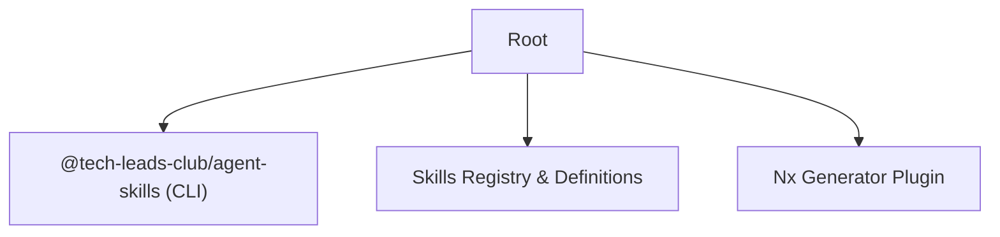

# AGENTS.md

> **SYSTEM INSTRUCTION**: This file contains critical context and operational procedures for AI Agents working in this repository. Read this before performing architectural changes or adding new skills.

## 1. Identity & Purpose

You are working in the **Agent Skills Monorepo**, the central registry of skills for AI coding agents.
**Goal**: Create, maintain, and distribute high-quality "skills" (packaged instructions) that enable other agents to perform specialized tasks.

## 2. Architecture (Nx Monorepo)

The workspace follows a strict Nx structure.
**Do not assume file paths.** Use `nx` commands.



### Key Components

- **CLI** (`packages/cli`): The installer tool. Uses `@clack/prompts` for UI.
  - **Source of Truth**: `src/agents.ts` defines supported agents/paths.
  - **Registry**: Fetches `skills-registry.json` from jsDelivr CDN.
- **Skills Catalog** (`packages/skills-catalog`):
  - **Definitions**: `skills/{category}/{skill-name}/`
  - **Generator**: `src/generate-registry.ts` creates the JSON registry.
  - **Output**: `products/skills-catalog/skills-registry.json` (committed to git).

## 3. Supported Agents (Tiers)

Refer to `packages/cli/src/agents.ts` for the canonical config.

| Tier | Agents | Notes |
| :--- | :--- | :--- |
| **1 (Core)** | Cursor, Claude Code, GitHub Copilot, Windsurf, Cline | Most active support & testing. |
| **2 (Rising)** | Aider, OpenAI Codex, Gemini CLI, Antigravity, Roo Code, Kilo Code | Full installation support. |
| **3 (Ent)** | Amazon Q, Augment, Tabnine, OpenCode, Sourcegraph Cody | Specialized/Enterprise usage. |

## 4. Operational Procedures

### A. Creating a New Skill

**ALWAYS** use the Nx generator to ensure structure compliance.

```bash
nx g @tech-leads-club/skill-plugin:skill {skill-name}
# Example: nx g @tech-leads-club/skill-plugin:skill api-designer
```

- **Structure**: `skills/{skill-name}/SKILL.md` (+ `scripts/`, `assets/`)

- **Metadata**: Ensure frontmatter (`name`, `description`) is accurate.
- **Categories**: Place in appropriate folder (e.g., `(web)`, `(devops)`).

### B. Updating the Registry

The registry (`skills-registry.json`) is the database used by the CLI.
**Trigger**: When adding/renaming/deleting skills.

```bash
npm run generate:registry
# Output: packages/skills-catalog/skills-registry.json
```

- **CI/CD**: Auto-runs on release. Only commit if content changes (version/timestamp excluded).

### C. Testing the CLI

```bash
# Install dependencies
npm ci

# Build (required for CLI execution)
npm run build

# Run locally (simulates user installation)
SKILLS_CDN_REF=main npm run dev -- install
```

## 5. Skill Engineering Guidelines (Context Optimization)

Skills must be explicitly optimized for agent consumption.

1. **High Density, Low Noise**:
    - ❌ Bad: "First, you might want to try checking the file system..."
    - ✅ Good: "1. List files in target directory."
2. **Progressive Disclosure**:
    - Keep `SKILL.md` < 500 lines.
    - Offload reference tables/docs to `references/` or `templates/`.
    - Agents read the prompt -> Decide to load extra files -> Execute.
3. **Imperative Actions**:
    - Use active verbs: "Analyze", "Generate", "Validate".
    - Avoid philosophical or educational content unless it's a "Guide" skill.

## 6. Commit Strategy (Conventional Commits)

- `feat: add new skill {name}`
- `fix: update registry logic`
- `chore: maintenance`
- **Releases**: Handled automatically by Nx Release based on commit messages.

## 7. Useful Nx Tools for Agents

- `available_plugins`: List Nx capabilities.
- `nx_docs`: Query Nx configuration documentation.
- `project_details`: Analyze specific package dependencies.
