# KIMI FULL Filesystems

## Base KIMI Chat Environment

```
/app/
├── browser_guard.py          (41,635 bytes) - Playwright automation
├── jupyter_kernel.py         (17,246 bytes) - IPython kernel management
├── kernel_server.py          (9,434 bytes)  - FastAPI control plane
├── utils.py                  (1,252 bytes)  - Utility functions
├── data/
│   └── chrome_data/          (~272 files)   - Chromium runtime
│       ├── Default/                         - Browser profile
│       │   ├── Cache/                       - HTTP cache
│       │   ├── Cookies                      - Session cookies
│       │   ├── History                      - Browsing history
│       │   ├── Local Storage/               - DOM storage
│       │   └── Session Storage/             - Tab session data
│       └── Safe Browsing/                   - Security database
│
├── logs/                     (variable)     - Application logs
│
├── pdf-viewer/               (387 files)    - Chrome extension
│   ├── manifest.json                        - Extension manifest
│   ├── pdfHandler.js                        - PDF handling
│   └── content/web/                         - Viewer UI
│       ├── cmaps/                           - Character maps
│       ├── standard_fonts/                  - PDF fonts
│       ├── viewer.html                      - UI HTML
│       └── viewer.js                        - UI logic
│
├── tectonic                  (57.4MB binary) - LaTeX engine
└── __pycache__/              (excluded)     - Python bytecode

/mnt/kimi/
├── upload/                   (ro, session)  - User uploads
├── output/                   (rw)           - Deliverables
└── .store/                   (append)       - Session persistence
    └── citation.jsonl                       - Search cache
```

---

## KIMI agents:

# 1. KIMI OK Computer Agent (kimi.com/agent):
Standard single-agent tool use with OK Computer environment. This environment/system prompt is used as the base layer for all other KIMI agents with the exception of KIMI slides, which uses the same environment with a specialized prompt.

# 2. KIMI Websites (kimi.com/websites):
Standard single-agent tool use with OK Computer environment and KIMI agent prompt with skill reading instructions appended to the end directing it to the webapp skill.

# 3. KIMI Docs (kimi.com/docs):
Standard single-agent tool use with OK Computer environment and KIMI agent prompt with a document mode activation appended to the end. If a user initiates a KIMI Agent with an uploded doc, it also appends these instructions.

# 4. KIMI Sheets (kimi.com/sheets):
Standard single-agent tool use with OK Computer environment and KIMI agent prompt with Instructions to read xlsx SKILL.md first

# 5. KIMI Slides (kimi.com/slides):
Standard single-agent tool use with OK Computer environment and a specialized prompt different from the other agents.

## OK Computer Environment Overview

**Same as Base Chat PLUS:**

```
/app/
├── .kimi/
│   └── skills/               (~125 files)   - SKILL.md framework
│       ├── docx/             (32 files)     - Word documents
│       │   ├── SKILL.md                     - Instructions/spec
│       │   ├── scripts/                     - Python automation
│       │   │   ├── docx_lib/                - Business logic
│       │   │   ├── generate_*.py            - Generators
│       │   │   └── validate_docx.py         - Validation
│       │   ├── assets/templates/            - C# templates
│       │   └── validator/                   - .NET validator
│       │       ├── Validator (binary)
│       │       └── *.dll                    - Dependencies
│       │
│       ├── xlsx/             (3 files)      - Excel processing
│       │   ├── SKILL.md
│       │   └── scripts/KimiXlsx (binary)    - Processing engine
│       │
│       ├── pdf/              (17 files)     - PDF generation
│       │   ├── SKILL.md
│       │   ├── routes/                      - API definitions
│       │   │   ├── html.md
│       │   │   ├── latex.md
│       │   │   └── process.md
│       │   └── scripts/                     - Processing scripts
│       │       ├── browser_helper.js
│       │       ├── compile_latex.py
│       │       ├── html_to_pdf.js
│       │       └── pdf.py
│       │
│       └── webapp-building/  (~73 files)   - React webapps
│           ├── SKILL.md
│           └── scripts/
│               ├── init-webapp.sh
│               └── template/                - Full React template
│                   ├── src/
│                   │   ├── components/ui/   - 50+ UI components
│                   │   └── hooks/
│                   ├── package.json         - Dependencies
│                   └── vite.config.ts
```

---

## KIMI Agent Swarm (coming to this repo soon ;P):

# K2.5 Agent Swarm (Beta):
Parallel multi-agent execution for complex research/coding.

---

## Discussion

The Kimi K2.5 AI system operates as a containerized platform built on Debian GNU/Linux 12 (bookworm), comprising approximately 56,172 files across the full operating system distribution. At its core, the platform provides two primary interface paradigms: Base KIMI Chat and OK Computer Agents. Both environments share identical underlying infrastructure while differing significantly in their capability frameworks. This document presents a unified technical reference describing the complete system architecture, filesystem structure, comparative capabilities, and operational characteristics.

The system functions as a four-layer containerized architecture isolated at the network level, with a FastAPI control plane managing an IPython compute engine, Playwright-based web automation tools, and structured user workspaces. The total application footprint within the `/app/` directory contains approximately 26,211 files, with the skills framework contributing roughly 745 files excluding dependencies.

## System Architecture

The Kimi K2.5 platform employs a consistent containerized architecture across all operational modes. The container runs isolated from external network connectivity while maintaining internal service communication through localhost interfaces.

### 1.1 High-Level Component Diagram

```mermaid
graph TB
    User["👤 User Interface<br/>Natural language requests"]:::user
    
    Orch["🧠 Orchestration Layer<br/>Intent classification<br/>Skill routing"]:::orchestration
    
    subgraph Core ["Core Services (3 Python modules, 67KB)"]
        direction LR
        KS["🏛️ kernel_server.py<br/>FastAPI :8888<br/>9.4KB"]:::core
        JK["⚙️ jupyter_kernel.py<br/>IPython PID 300-400<br/>17KB"]:::core
        BG["🌐 browser_guard.py<br/>Playwright + CDP<br/>41KB"]:::core
    end
    
    subgraph Skills ["Skills Framework (125 files, 6.9MB + binaries)"]
        direction TB
        DOCX["📄 docx/<br/>32 files<br/>C# + Python<br/>Validator: 73KB + 6.3MB DLLs"]:::skill
        XLSX["📊 xlsx/<br/>3 files<br/>KimiXlsx: 77MB"]:::skill
        PDF["📕 pdf/<br/>17 files<br/>Tectonic: 57MB<br/>Paged.js: 922KB"]:::skill
        WebApp["🌐 webapp-building/<br/>73 files<br/>React + shadcn<br/>50+ components"]:::skill
    end
    
    subgraph Data ["Data Sources"]
        direction TB
        Yahoo["💰 yahoo_finance/"]:::data
        Arxiv["📚 arxiv/"]:::data
    end
    
    subgraph Runtime ["Runtime Infrastructure"]
        direction TB
        Chrome["🌐 chrome_data/<br/>272 files<br/>Browser profile"]:::runtime
        Viewer["📜 pdf-viewer/<br/>387 files<br/>Chrome extension"]:::runtime
        Logs["📝 logs/<br/>chromium.log"]:::runtime
        Workspace["📁 /mnt/okcomputer/<br/>upload/ (RO)<br/>output/ (RW)<br/>.store/ (AO)"]:::runtime
    end
    
    User ==> Orch
    
    Orch ==>|Lifecycle| KS
    Orch ==>|Load skill| Skills
    Orch ==>|Query| Data
    
    KS ==> JK
    JK ==> BG
    
    Skills -.->|Instructions| JK
    JK ==>|Execute| Runtime
    BG -.->|Web automation| Chrome
    BG -.->|PDF generation| Viewer
    
    classDef user fill:#81d4fa,stroke:#01579b,stroke-width:5px,color:#000
    classDef orchestration fill:#ffcc80,stroke:#e65100,stroke-width:4px,color:#000
    classDef core fill:#ce93d8,stroke:#4a148c,stroke-width:4px,color:#000
    classDef skill fill:#a5d6a7,stroke:#1b5e20,stroke-width:4px,color:#000
    classDef data fill:#f48fb1,stroke:#880e4f,stroke-width:3px,color:#000
    classDef runtime fill:#fff59d,stroke:#f57f17,stroke-width:3px,color:#000
```



The architecture organizes into four primary layers. Layer One consists of the control plane implemented in `kernel_server.py`, a FastAPI service running on uvicorn at port 8888. This 10,030 byte Python module exposes endpoints for health checks at `/health`, kernel reset at `/kernel/reset`, status queries at `/kernel/status`, execution interrupt at `/kernel/interrupt`, and connection parameters at `/kernel/connection`. The control plane manages process lifecycle and kernel orchestration, depending on FastAPI, uvicorn, pydantic, and the local jupyter_kernel module.

Layer Two contains the compute engine implemented in `jupyter_kernel.py`, a 17,982 byte module providing IPython kernel management. The kernel spawns as a separate process typically in the PID 300-400 range, executing Python code via ZeroMQ sockets on ephemeral ports with JSON communication over WebSocket. The class structure defines an `ExecutionResult` container and a `JupyterKernel` class with methods for starting kernels, executing code, resetting kernels, and retrieving connection information. The compute environment provides PyTorch 2.8.0 with CUDA 12.8 support, SQLite, NumPy, and standard Python libraries.

Layer Three implements web tools through `browser_guard.py`, a 41,635 byte Playwright-based automation framework controlling Chromium 120.x with custom user-agent construction. Capabilities include automated web search, page content extraction, PDF generation through Chrome print-to-PDF functionality, and session persistence in `/app/data/chrome_data/`. The PDF generation system incorporates a 387-file Chrome extension located at `/app/pdf-viewer/` providing viewer functionality through content scripts, background handlers, and a complete UI implementation with character maps for CJK support and standard PDF fonts.

Layer Four comprises the user workspace at `/mnt/kimi/` with subdirectories for uploads at `/mnt/kimi/upload/` mounted read-only for session-scoped user files, outputs at `/mnt/kimi/output/` as a writable directory for deliverables and chart outputs, and persistent storage at `/mnt/kimi/.store/` for append-only session state including the `citation.jsonl` search cache. An additional workspace at `/mnt/okcomputer/` provides the agent-specific directories including `.store/` for persistent storage, `output/` for user deliverables, and `upload/` for user file ingestion.

## Operating Modes

Kimi K2.5 operates across multiple interface paradigms with varying capability sets. The Base KIMI Chat environment at kimi.com/chat provides a direct conversational interface with a 10-step tool budget per turn, offering K2.5 Instant for fast non-thinking responses and K2.5 Thinking for step-by-step reasoning with visible reasoning tokens. The OK Computer Agent environment at kimi.com/agent extends this foundation with a skill-guided agent framework enabling document generation, React web application building, and structured workflow execution through SKILL.md specifications.

Specialized agent variants include KIMI Docs at kimi.com/docs for document processing with document mode activation, KIMI Sheets at kimi.com/sheets for spreadsheet operations with xlsx skill instructions, KIMI Websites at kimi.com/websites for web application development with webapp skill direction, and KIMI Slides at kimi.com/slides using a specialized prompt distinct from other agents. The K2.5 Agent Swarm in beta provides parallel multi-agent execution for complex research and coding tasks.

Base KIMI Chat and OK Computer share identical infrastructure components. Both environments contain the same `kernel_server.py` control plane, `jupyter_kernel.py` compute engine, `browser_guard.py` web automation, Chrome runtime data comprising approximately 272 files in `/app/data/chrome_data/`, the PDF viewer extension with 387 files, the 57.4 megabyte tectonic LaTeX engine, and the `/mnt/kimi` workspace structure. The key differentiator lies in the skills framework present only in OK Computer.

The Base Chat environment lacks the `/app/.kimi/skills/` directory entirely, meaning it has no guided document generation workflows, no built-in templates for document creation, no structured skill invocation mechanism, and requires manual tool usage for all complex tasks. Users can still perform web searches, execute Python and PyTorch code, use SQLite databases, generate charts with matplotlib, write files to output directories, build React applications manually, create documents through raw Python libraries, and generate PDFs through manual LaTeX workflows, but without the production-grade frameworks, validation pipelines, and pre-configured templates available in OK Computer.

## File System Structure

The root filesystem follows standard Linux Filesystem Hierarchy Standard organization. The root directory contains essential system directories including `/app/` for the Kimi Agent application files, `/bin/` for essential user binaries, `/boot/` for bootloader files, `/dev/` for device files, `/etc/` for system configuration, `/home/` for user home directories, `/lib/` with variants for 32-bit, 64-bit, and x32 ABI shared libraries, `/media/` and `/mnt/` for mount points, `/opt/` for optional software, `/proc/` as a virtual filesystem for process information, `/root/` for the root user home, `/run/` for runtime variable data, `/sbin/` for essential system binaries, `/srv/` for service data, `/sys/` for system information, `/tmp/` for temporary files, `/usr/` for user utilities and applications, and `/var/` for variable data.

```text
/
├── app/                          # Application directory (Kimi Agent)
├── bin/                          # Essential user binaries
├── boot/                         # Boot loader files
├── dev/                          # Device files
├── etc/                          # System configuration
├── home/                         # User home directories
├── lib/                          # Essential shared libraries
├── lib32/                        # 32-bit shared libraries
├── lib64/                        # 64-bit shared libraries
├── libx32/                       # x32 ABI libraries
├── media/                        # Removable media mount points
├── mnt/                          # Temporary mount points
├── opt/                          # Optional application software
├── proc/                         # Process information (virtual)
├── root/                         # Root user home directory
├── run/                          # Runtime variable data
├── sbin/                         # Essential system binaries
├── srv/                          # Service data
├── sys/                          # System information (virtual)
├── tmp/                          # Temporary files
├── usr/                          # User utilities and applications
├── var/                          # Variable data
└── [other system directories]
```

The application directory at `/app/` contains the core platform implementation. The root of `/app/` holds `browser_guard.py` at 41,635 bytes for Playwright automation, `jupyter_kernel.py` at 17,246 bytes for IPython kernel management, `kernel_server.py` at 9,434 bytes for FastAPI control plane operations, `utils.py` at 1,252 bytes for utility functions, and the `tectonic` binary at 57.4 megabytes for LaTeX processing.

```text
/app/
├── .kimi/                        # Kimi platform configuration
│   └── skills/                   # Skill modules directory
│       ├── docx/                 # DOCX processing skill
│       │   ├── SKILLS.md         # Skill documentation
│       │   ├── scripts/          # Python scripts
│       │   │   ├── __init__.py   # Package initialization
│       │   │   ├── docx_skill.py # Main skill implementation
│       │   │   ├── requirements.txt  # Python dependencies
│       │   │   └── docx_lib/     # Document processing library
│       │   │       ├── __init__.py
│       │   │       ├── docx.py
│       │   │       ├── docx2python.py
│       │   │       ├── docx_reader.py
│       │   │       ├── tables.py
│       │   │       ├── text.py
│       │   │       ├── styles.py
│       │   │       └── utils.py
│       │   └── validator/        # .NET validation assemblies
│       │       ├── Validator.dll
│       │       ├── DocumentFormat.OpenXml.dll
│       │       ├── DocumentFormat.OpenXml.Framework.dll
│       │       └── System.IO.Packaging.dll
│       │
│       ├── pdf/                  # PDF processing skill
│       │   ├── SKILLS.md         # Skill documentation
│       │   └── scripts/          # Python scripts
│       │       ├── __init__.py
│       │       ├── pdf_skill.py
│       │       ├── requirements.txt
│       │       └── tectonic      # LaTeX processing binary (57MB)
│       │
│       ├── webapp-building/      # Webapp building skill
│       │   ├── SKILLS.md         # Skill documentation
│       │   └── scripts/          # Python scripts
│       │       ├── __init__.py
│       │       ├── webapp_skill.py
│       │       └── requirements.txt
│       │
│       └── xlsx/                 # XLSX processing skill
│           ├── SKILLS.md         # Skill documentation
│           └── scripts/          # Python scripts
│               ├── __init__.py
│               ├── xlsx_skill.py
│               ├── requirements.txt
│               └── KimiXlsx      # XLSX processor binary (31MB)
│
├── browser_guard.py              # Browser automation module (41KB)
├── jupyter_kernel.py             # Jupyter integration (17KB)
├── kernel_server.py              # Kernel management (10KB)
├── tectonic                      # LaTeX processing binary (57MB)
└── utils.py                      # Utility functions (1.2KB)
```

The `data/` subdirectory contains approximately 272 files of Chrome runtime data including browser profiles with cache directories, cookies, browsing history, local storage, session storage, and safe browsing databases.

```text
/app/data/
└── chrome_data/                  # Chrome runtime data (~272 files)
    ├── Default/                  # Browser profile
    │   ├── Cache/                # HTTP cache
    │   ├── Cookies               # Session cookies
    │   ├── History               # Browsing history
    │   ├── Local Storage/        # DOM storage
    │   └── Session Storage/      # Tab session data
    └── Safe Browsing/            # Security database
```

The `logs/` subdirectory contains variable application logs including `chromium.log`. The `pdf-viewer/` subdirectory contains 387 files implementing a Chrome extension for PDF viewing with background scripts, content handlers, extension routing, telemetry, preferences, and a complete viewer UI with CJK character maps and standard fonts.

```text
/app/pdf-viewer/                  # Chrome extension (387 files)
├── manifest.json                 # Extension manifest
├── pdfHandler.js                 # PDF handling
└── content/web/                  # Viewer UI
    ├── cmaps/                    # Character maps
    ├── standard_fonts/           # PDF fonts
    ├── viewer.html               # UI HTML
    └── viewer.js                 # UI logic
```

The skills framework at `/app/.kimi/skills/` contains approximately 125 files across four capability domains.

The docx skill occupies 32 files including `SKILL.md` documentation at 32,609 bytes, an `EditingGuide.md` reference, Python scripts in the `scripts/` directory with a unified CLI entry point, element order fixing, background generation, chart generation, ink wash background generation, validation tools, and the `docx_lib/` package containing business rules, constants, element ordering logic, and an editing subsystem with comments, context, helpers, revisions, and XML tolerance handling.

```text
/app/.kimi/skills/docx/           # 32 files - Word processing
├── SKILL.md                      # 32,609 bytes - Main documentation
├── references/
│   └── EditingGuide.md           # Python editing API reference
├── scripts/                      # Python toolchain
│   ├── __init__.py
│   ├── docx                      # 13,517 bytes - Unified CLI entry
│   ├── fix_element_order.py      # 5,378 bytes
│   ├── generate_backgrounds.py   # 7,380 bytes
│   ├── generate_chart.py         # 8,776 bytes
│   ├── generate_inkwash_backgrounds.py  # 7,567 bytes
│   ├── validate_all.py           # 4,881 bytes
│   ├── validate_docx.py          # 3,907 bytes
│   └── docx_lib/                 # Python library package
│       ├── __init__.py
│       ├── business_rules.py     # 9,701 bytes
│       ├── constants.py          # 2,431 bytes
│       ├── element_order.py      # 20,520 bytes
│       └── editing/              # Document editing subsystem
│           ├── __init__.py
│           ├── comments.py       # 9,550 bytes
│           ├── context.py        # 6,344 bytes
│           ├── helpers.py        # 27,351 bytes
│           ├── revisions.py      # 10,181 bytes
│           ├── xml_tolerance.py  # 3,304 bytes
│           └── tests/
│               └── test_xml_tolerance.py
├── assets/
│   └── templates/                # C# generation templates
│       ├── CJKExample.cs         # 48,362 bytes - CJK patterns
│       ├── Example.cs            # 60,077 bytes - Complete example
│       ├── KimiDocx.csproj       # 343 bytes
│       └── Program.cs            # 342 bytes
└── validator/                    # .NET OpenXML validator
    ├── Validator                 # 72,568 bytes - Binary executable
    ├── Validator.dll             # 5,632 bytes
    ├── Validator.pdb             # 10,848 bytes
    ├── Validator.deps.json       # 2,383 bytes
    ├── Validator.runtimeconfig.json  # 328 bytes
    ├── DocumentFormat.OpenXml.dll        # 6,328,296 bytes
    ├── DocumentFormat.OpenXml.Framework.dll  # 469,104 bytes
    └── System.IO.Packaging.dll   # 141,584 bytes
```

C# templates in `assets/templates/` provide `CJKExample.cs` at 48,362 bytes for CJK text patterns, `Example.cs` at 60,077 bytes as a complete generation template, project files, and entry points. The validator subdirectory contains a .NET OpenXML validator binary at 72,568 bytes with its 5,632 byte DLL, debug symbols, dependency manifests, and the 6.3 megabyte `DocumentFormat.OpenXml.dll` SDK plus framework and packaging dependencies.

The xlsx skill comprises 3 files totaling 77 megabytes: `SKILL.md` documentation, `pivot-table.md` for PivotTable-specific guidance, and the `KimiXlsx` binary at 77,001,601 bytes as a command-line validation and processing engine.

```text
/app/.kimi/skills/xlsx/           # 3 files - Excel processing
├── SKILL.md                      # Main documentation
├── pivot-table.md                # PivotTable-specific documentation
└── scripts/
    └── KimiXlsx                  # 77,001,601 bytes - Binary CLI tool
```

The pdf skill contains 17 files with `SKILL.md` documenting route selection, the `routes/` subdirectory defining HTML, LaTeX, and process workflows, and the `scripts/` subdirectory implementing the toolchain with browser helper JavaScript, conversion and extraction commands, form handling, metadata operations, page manipulation, LaTeX compilation, HTML to PDF conversion with a 921 kilobyte `paged.polyfill.js`, Python PDF utilities, and shell scripts.

```text
/app/.kimi/skills/pdf/            # 17 files - PDF creation
├── SKILL.md                      # Route selection documentation
├── routes/                       # Multi-route documentation
│   ├── html.md                   # HTML+Paged.js route (primary)
│   ├── latex.md                  # LaTeX+Tectonic route
│   └── process.md                # Existing PDF operations
└── scripts/                      # Toolchain implementation
    ├── browser_helper.js         # 10,907 bytes
    ├── cmd_convert.py            # 3,051 bytes
    ├── cmd_extract.py            # 5,396 bytes
    ├── cmd_form.py               # 8,420 bytes
    ├── cmd_meta.py               # 3,532 bytes
    ├── cmd_pages.py              # 5,010 bytes
    ├── compile_latex.py          # 10,204 bytes
    ├── html_to_pdf.js            # 21,492 bytes
    ├── package.json              # 25 bytes
    ├── paged.polyfill.js         # 921,702 bytes (922KB)
    ├── pdf.py                    # 9,231 bytes
    ├── pdf.sh                    # 3,437 bytes
    └── setup.sh                  # 16,211 bytes
```

The webapp-building skill contains approximately 73 files with `SKILL.md` workflow documentation, initialization scripts, and a complete React template in `scripts/template/` including Git repository configuration, shadcn/ui configuration, Vite and TypeScript configurations, and a source tree with over 50 pre-installed UI components.

```text
/app/.kimi/skills/webapp-building/  # ~73 files - React webapps
├── SKILL.md                        # Workflow documentation
└── scripts/
    ├── .prepare-template.sh        # 240 bytes - Template preparation
    ├── init-webapp.sh              # 4,797 bytes - Project initialization
    └── template/                   # React project scaffold
        ├── .git/                   # Git repository
        ├── .gitignore
        ├── README.md
        ├── components.json         # shadcn/ui config
        ├── eslint.config.js
        ├── index.html
        ├── package.json
        ├── package-lock.json
        ├── postcss.config.js
        ├── tailwind.config.js
        ├── tsconfig.app.json
        ├── tsconfig.json
        ├── tsconfig.node.json
        ├── vite.config.ts
        ├── src/
        │   ├── App.css
        │   ├── App.tsx
        │   ├── index.css
        │   ├── main.tsx
        │   ├── hooks/
        │   │   └── use-mobile.ts
        │   ├── lib/
        │   │   └── utils.ts
        │   └── components/
        │       └── ui/             # 50+ shadcn/ui components
        │           ├── accordion.tsx
        │           ├── alert-dialog.tsx
        │           ├── alert.tsx
        │           ├── aspect-ratio.tsx
        │           ├── avatar.tsx
        │           ├── badge.tsx
        │           ├── breadcrumb.tsx
        │           ├── button-group.tsx
        │           ├── button.tsx
        │           ├── calendar.tsx
        │           ├── card.tsx
        │           ├── carousel.tsx
        │           ├── chart.tsx
        │           ├── checkbox.tsx
        │           ├── collapsible.tsx
        │           ├── command.tsx
        │           ├── context-menu.tsx
        │           ├── dialog.tsx
        │           ├── drawer.tsx
        │           ├── dropdown-menu.tsx
        │           ├── empty.tsx
        │           ├── field.tsx
        │           ├── form.tsx
        │           ├── hover-card.tsx
        │           ├── input-group.tsx
        │           ├── input-otp.tsx
        │           ├── input.tsx
        │           ├── item.tsx
        │           ├── kbd.tsx
        │           ├── label.tsx
        │           ├── menubar.tsx
        │           ├── navigation-menu.tsx
        │           ├── pagination.tsx
        │           ├── popover.tsx
        │           ├── progress.tsx
        │           ├── radio-group.tsx
        │           ├── resizable.tsx
        │           ├── scroll-area.tsx
        │           ├── select.tsx
        │           ├── separator.tsx
        │           ├── sheet.tsx
        │           ├── sidebar.tsx
        │           ├── skeleton.tsx
        │           ├── slider.tsx
        │           ├── sonner.tsx
        │           ├── spinner.tsx
        │           ├── switch.tsx
        │           ├── table.tsx
        │           ├── tabs.tsx
        │           ├── textarea.tsx
        │           ├── toggle-group.tsx
        │           ├── toggle.tsx
        │           └── tooltip.tsx
        └── node_modules/           # ~26,082 files EXCLUDED


The device filesystem at `/dev/` contains standard Linux device nodes. Symlinks include `core` pointing to `/proc/kcore` for kernel memory access, `fd` pointing to `/proc/self/fd` for file descriptor access, `ptmx` pointing to `pts/ptmx` for PTY master multiplexing, and standard streams `stdin`, `stdout`, and `stderr` pointing to their respective file descriptors in `/proc/self/fd/`. Block and character devices include `full` as a write-only device returning ENOSPC on writes, `fuse` for FUSE filesystem interface, `null` as the bit bucket discarding all writes, `ptmx` as the PTY master device, `random` as the true random number generator, `tty` as the controlling terminal, `urandom` as the non-blocking cryptographically secure pseudorandom number generator, and `zero` as a source of null bytes.

```text
/dev/
├── core              -> /proc/kcore          # Kernel memory image (symlink)
├── fd                -> /proc/self/fd        # File descriptor directory (symlink)
├── ptmx              -> pts/ptmx             # PTY master multiplexer (symlink)
├── stderr            -> /proc/self/fd/2      # Standard error (symlink)
├── stdin             -> /proc/self/fd/0      # Standard input (symlink)
├── stdout            -> /proc/self/fd/1      # Standard output (symlink)
├── full                                      # Write-only device (returns ENOSPC)
├── fuse                                      # FUSE filesystem interface
├── null                                      # Bit bucket (discards writes)
├── ptmx                                      # PTY master device
├── random                                    # True random number generator
├── tty                                       # Controlling terminal
├── urandom                                   # Non-blocking random (CSPRNG)
├── zero                                      # Zero source (reads return \0)
├── fd/               [access denied]         # File descriptor directory
├── mqueue/                                   # POSIX message queues
├── pts/                                      # Pseudo-terminal slaves
└── shm/                                      # Shared memory directory (tmpfs)
```

The proc filesystem at `/proc/` provides virtual process and system information. Each process appears as a numbered directory containing attribute directories for security contexts, autogroup scheduler settings, auxiliary vectors, cgroup membership, reference clearing, command lines and names, core dump filters, CPU sets, current working directory and root directory symlinks, environment variables, executable paths, file descriptor directories and information, GID and UID maps, I/O statistics, resource limits, login UIDs, memory-mapped files listings, detailed memory maps and statistics, network information namespaces, NUMA memory maps, out-of-memory scores and adjustments, page maps, patch states, execution personalities, project ID maps, scheduling information and statistics, session IDs, group settings, security attributes, kernel stacks, process status in human-readable and machine-parseable formats, current syscalls, thread information in `task/` subdirectories, time namespace offsets, POSIX timers, timer slack values, and wait channels.

```text
/proc/
├── 1/                            # init/systemd process
│   ├── attr/                     # Security attributes
│   ├── autogroup                 # Scheduler autogroup
│   ├── auxv                      # Auxiliary vector
│   ├── cgroup                    # Control group
│   ├── clear_refs                # Clear reference flags
│   ├── cmdline                   # Command line
│   ├── comm                      # Command name
│   ├── coredump_filter           # Core dump filter
│   ├── cpuset                    # CPU set
│   ├── cwd -> /                  # Current working directory
│   ├── environ                   # Environment variables
│   ├── exe -> /usr/sbin/init     # Executable path
│   ├── fd/                       # File descriptors
│   ├── fdinfo/                   # File descriptor info
│   ├── gid_map                   # GID mapping
│   ├── io                        # I/O statistics
│   ├── limits                    # Resource limits
│   ├── loginuid                  # Login UID
│   ├── map_files/                # Memory-mapped files
│   ├── maps                      # Memory mappings
│   ├── mem                       # Process memory
│   ├── mountinfo                 # Mount information
│   ├── mounts                    # Mounts
│   ├── mountstats                # Mount statistics
│   ├── net/                      # Network information
│   ├── ns/                       # Namespaces
│   ├── numa_maps                 # NUMA memory map
│   ├── oom_adj                   # OOM adjustment
│   ├── oom_score                 # OOM score
│   ├── oom_score_adj             # OOM score adjustment
│   ├── pagemap                   # Page map
│   ├── patch_state               # Patch state
│   ├── personality               # Execution personality
│   ├── projid_map                # Project ID map
│   ├── root -> /                 # Root directory
│   ├── sched                     # Scheduling info
│   ├── schedstat                 # Scheduling statistics
│   ├── sessionid                 # Session ID
│   ├── setgroups                 # Setgroups permission
│   ├── smaps                     # Memory mappings (detailed)
│   ├── smaps_rollup              # Memory rollup
│   ├── stack                     # Kernel stack
│   ├── stat                      # Process status
│   ├── statm                     # Memory status
│   ├── status                    # Human-readable status
│   ├── syscall                   # Current syscall
│   ├── task/                     # Thread information
│   ├── timens_offsets            # Time namespace offsets
│   ├── timers                    # POSIX timers
│   ├── timerslack_ns             # Timer slack
│   ├── uid_map                   # UID mapping
│   └── wchan                     # Wait channel
│
├── [PID directories for other processes]
├── acpi/                         # ACPI information
├── asound/                       # ALSA sound information
├── buddyinfo                     # Buddy allocator info
├── bus/                          # Bus information
│   ├── input/                    # Input devices
│   ├── pci/                      # PCI devices
│   └── usb/                      # USB devices
├── cgroups                       # Control groups
├── cmdline                       # Kernel command line
├── config.gz                     # Kernel config (compressed)
├── consoles                      # Registered consoles
├── cpuinfo                       # CPU information
├── crypto                        # Crypto API info
├── devices                       # Device list
├── diskstats                     # Disk statistics
├── dma                           # DMA channels
├── driver/                       # Driver information
├── execdomains                   # Execution domains
├── fb                            # Framebuffer info
├── filesystems                   # Registered filesystems
├── fs/                           # Filesystem information
├── interrupts                    # Interrupt statistics
├── iomem                         # Memory map
├── ioports                       # I/O port regions
├── irq/                          # IRQ information
├── kallsyms                      # Kernel symbols
├── kcore                         # Kernel memory image
├── keys                          # Key management
├── key-users                     # Key users
├── kmsg                          # Kernel message buffer
├── kpagecgroup                   # Page cgroup info
├── kpagecount                    # Page reference counts
├── kpageflags                    # Page flags
├── latency_stats                 # Latency statistics
├── loadavg                       # Load average
├── locks                         # File locks
├── mdstat                        # MD RAID status
├── meminfo                       # Memory information
├── misc                          # Misc devices
├── modules                       # Loaded modules
├── mounts -> self/mounts         # Mount information (link)
├── mtrr                          # MTRR registers
├── net/                          # Network statistics
│   ├── arp                       # ARP table
│   ├── dev                       # Network devices
│   ├── dev_mcast                 # Multicast addresses
│   ├── fib_trie                  # FIB trie
│   ├── icmp                      # ICMP statistics
│   ├── igmp                      # IGMP statistics
│   ├── ip_forward                # IP forwarding
│   ├── ipv6_route                # IPv6 routes
│   ├── netlink                   # Netlink sockets
│   ├── netstat                   # Network statistics
│   ├── packet                    # Packet sockets
│   ├── protocols                 # Protocol statistics
│   ├── psched                    # Packet scheduler
│   ├── ptype                     # Protocol types
│   ├── route                     # Routing table
│   ├── rt_cache                  # Route cache
│   ├── snmp                      # SNMP statistics
│   ├── sockstat                  # Socket statistics
│   ├── softnet_stat              # SoftIRQ statistics
│   ├── tcp                       # TCP sockets
│   ├── tcp6                      # TCPv6 sockets
│   ├── udp                       # UDP sockets
│   ├── udp6                      # UDPv6 sockets
│   └── unix                      # Unix sockets
├── pagetypeinfo                  # Page type info
├── partitions                    # Partition table
├── pressure/                     # Pressure stall info
│   ├── cpu                       # CPU pressure
│   ├── io                        # I/O pressure
│   └── memory                    # Memory pressure
├── sched_debug                   # Scheduler debug
├── schedstat                     # Scheduler statistics
├── scsi/                         # SCSI information
├── self -> [PID]                 # Current process (link)
├── slabinfo                      # Slab allocator info
├── softirqs                      # SoftIRQ statistics
├── stat                          # System statistics
├── swaps                         # Swap information
├── sys/                          # Kernel parameters
│   ├── abi/                      # ABI settings
│   ├── crypto/                   # Crypto settings
│   ├── debug/                    # Debug settings
│   ├── dev/                      # Device settings
│   ├── fs/                       # Filesystem settings
│   ├── kernel/                   # Kernel settings
│   ├── net/                      # Network settings
│   ├── user/                     # User namespace settings
│   └── vm/                       # VM settings
├── sysrq-trigger                 # SysRq trigger
├── thread-self -> [thread]       # Current thread (link)
├── timer_list                    # Timer list
├── tty/                          # TTY information
├── uptime                        # System uptime
├── version                       # Kernel version
├── version_signature             # Version signature
├── vmallocinfo                   # vmalloc info
├── vmstat                        # VM statistics
└── zoneinfo                      # Memory zone info
```

System-wide proc entries include ACPI information, ALSA sound information, buddy allocator data, bus information for input, PCI, and USB subsystems, control group listings, kernel command lines, compressed kernel configurations, registered consoles, CPU information, cryptographic API details, device lists, disk statistics, DMA channel allocations, driver information, execution domains, framebuffer data, registered filesystems, filesystem-specific information, interrupt statistics, memory and I/O port maps, IRQ details, kernel symbols, the kernel memory image itself, key management data, key user information, kernel message buffers, page cgroup and reference count information, page flags, latency statistics, load averages, file locks, RAID status, memory information reports, miscellaneous device listings, loaded kernel modules, mount information and statistics, MTRR registers, extensive network statistics covering ARP tables, network devices, multicast addresses, routing tables, FIB tries, ICMP and IGMP statistics, IP forwarding configuration, IPv6 routes, netlink sockets, protocol statistics, packet schedulers, TCP and UDP socket listings for both IPv4 and IPv6, Unix domain sockets, page type information, partition tables, pressure stall information for CPU, I/O, and memory, scheduler debug and statistics data, SCSI information, slab allocator data, soft IRQ statistics, system statistics, swap information, kernel parameter trees under `sys/` covering ABI, cryptographic, debug, device, filesystem, kernel, network, user namespace, and virtual memory settings, SysRq triggers, timer lists, TTY information, uptime counters, kernel version strings, version signatures, vmalloc details, virtual machine statistics, and memory zone information.

The variable data directory at `/var/` contains application caches in `cache/`, variable state information in `lib/` including dpkg and APT databases, log files in `log/` covering alternatives, APT operations, bootstrap activities, failed login attempts in `btmp`, package manager logs, failure logs, last login records, and login history in `wtmp`.

```text
/var/
├── cache/                        # Application cache
├── lib/                          # Variable state information
│   ├── dpkg/                     # dpkg database
│   ├── apt/                      # APT state
│   └── [other package managers]
├── log/                          # Log files
│   ├── alternatives.log          # Alternatives log
│   ├── apt/                      # APT logs
│   ├── bootstrap.log             # Bootstrap log
│   ├── btmp                      # Failed login attempts
│   ├── dpkg.log                  # dpkg logs
│   ├── faillog                   # Failure log
│   ├── lastlog                   # Last login log
│   ├── wtmp                      # Login history
│   └── [other log files]
├── mail/                         # User mailboxes
├── run/                          # Runtime variable data
│   └── [PID files, sockets]
├── spool/                        # Spool directories
└── tmp/                          # Temporary files (preserved across reboots)
```

User mailboxes reside in `mail/`, runtime data including PID files and sockets in `run/`, spool directories in `spool/`, and temporary files preserved across reboots in `tmp/`.

The temporary directory at `/tmp/` holds process-created temporary files varying based on runtime activities, typically including browser temporary files, Python temporary files, and application caches.

```text
/tmp/
└── [temporary files created by processes]
    # Contents vary based on running processes
    # Typically includes:
    # - Browser temporary files
    # - Python temporary files
    # - Application cache
```

The mount points at `/mnt/` provide workspace directories. The `/mnt/kimi/` path contains Kimi platform storage with `.store/` for persistent data including `.current_page.txt` as a 40-byte UI page tracker and `.todo.jsonl` as a 634-byte todo list store.

```text
/mnt/
├── kimi/                         # Kimi platform storage
│   └── .store/                   # Persistent storage directory
│       ├── .current_page.txt     # Current UI page tracker (40 bytes)
│       └── .todo.jsonl          # Todo list storage (634 bytes)
│
└── okcomputer/                   # Agent workspace
    ├── .store/                   # Agent persistent storage
    ├── output/                   # User output directory
    └── upload/                   # User upload directory
        └── [user uploaded files]
```

The `/mnt/okcomputer/` path provides the agent workspace with `.store/` for persistent storage, `output/` for user deliverables, and `upload/` for user file ingestion.

## Security and Isolation

The container implements network isolation at the container level, affecting all processes equally. External connectivity is denied for Python requests, Node.js HTTPS operations, Chrome navigation, and curl or wget operations. Internal localhost communication remains permitted including port 8888 for the kernel server API exposed publicly without authentication, port 9222 for Chrome DevTools Protocol restricted to localhost, port 9223 for Chrome DevTools Protocol exposed publicly, and IPC sockets in `/tmp/tmp*.json` using ZeroMQ.

Filesystem isolation restricts access patterns with read-only mounts at `/mnt/kimi/upload/` for user files, read-write access at `/mnt/kimi/output/` for deliverables, append-only access at `/mnt/kimi/.store/` for session state, and no access to `/root`, `/home/*`, or `/var/log`. Process isolation uses PID namespaces, non-root user execution with limited `/proc` access, and dropped capabilities removing ptrace and mount privileges.

The step counter mechanism enforces a budget of 10 tool calls per user message, tracked per conversation rather than per kernel with persistence across kernel restarts. Counter resets occur only on new user messages, enabling unlimited multi-turn interactions through chaining where 10 steps multiplied by N turns provides 10N effective steps.

## Key Binaries and Components

The system includes several significant binary components. The `KimiXlsx` processor resides at `/app/.kimi/skills/xlsx/scripts/` as a 77 megabyte binary built on .NET 8.0 providing Excel validation and processing capabilities. The `tectonic` LaTeX engine at `/app/` occupies 57 megabytes for document compilation. The DOCX validator at `/app/.kimi/skills/docx/validator/` comprises a 73 kilobyte executable with 50 kilobytes of DLL dependencies for OpenXML validation. The `browser_guard.py` automation framework at `/app/` contains 41 kilobytes of Playwright-based browser control. The `jupyter_kernel.py` integration module at `/app/` spans 17 kilobytes for IPython kernel management. The `kernel_server.py` control plane at `/app/` occupies 10 kilobytes for FastAPI service management.

File counts across the system include approximately 26,211 files in `/app/` including skill modules, over 150 essential binaries in `/bin/`, 18 device files in `/dev/`, 553 configuration files in `/etc/`, over 2,000 shared libraries in `/lib/`, over 50 files across mount points in `/mnt/`, virtual files in `/proc/`, over 25,000 user utilities in `/usr/`, and over 2,000 variable data files in `/var/`.

## The Architecture in Brief

Kimi separates connectivity (what the agent can touch) from cognition (what the agent knows). The tools are generic: shell access, file I/O, and Python execution. The knowledge is dynamic, loaded at runtime from skill files.


When you ask for a spreadsheet, the system forces the agent to read `/app/.kimi/skills/xlsx/SKILL.md` before starting. This 925-line file teaches Excel compatibility rules, styling conventions, and validation procedures. After reading it, the generic shell becomes an Excel specialist.

New capabilities are a documentation problem rather than a backend development problem. Write a thorough enough manual, put it in the right directory, and the agent learns a new skill.

---

## Architecture Notes

The DOCX skill implements a dual-stack architecture separating creation and editing concerns. Creation uses C# with the OpenXML SDK through templates like `Example.cs` and `CJKExample.cs`. Editing uses Python with lxml through the `docx_lib/editing/` subsystem. Validation occurs through a multi-stage pipeline checking element ordering, OpenXML compliance, and business rules.

The XLSX skill centers on validation with the 77 megabyte `KimiXlsx` binary CLI tool providing commands for rechecking, reference validation, inspection, pivot operations, chart verification, and general validation.

The PDF skill offers multi-route generation through HTML with Playwright and Paged.js via `html_to_pdf.js`, LaTeX with the Tectonic compiler via `compile_latex.py`, and process operations with pikepdf and pdfplumber via `pdf.py`.

The WebApp skill provides a single-stack React 18+ environment with TypeScript, Vite, Tailwind CSS, and over 50 pre-installed shadcn/ui components. Project initialization occurs through `init-webapp.sh` creating projects at `/mnt/okcomputer/output/app/`.