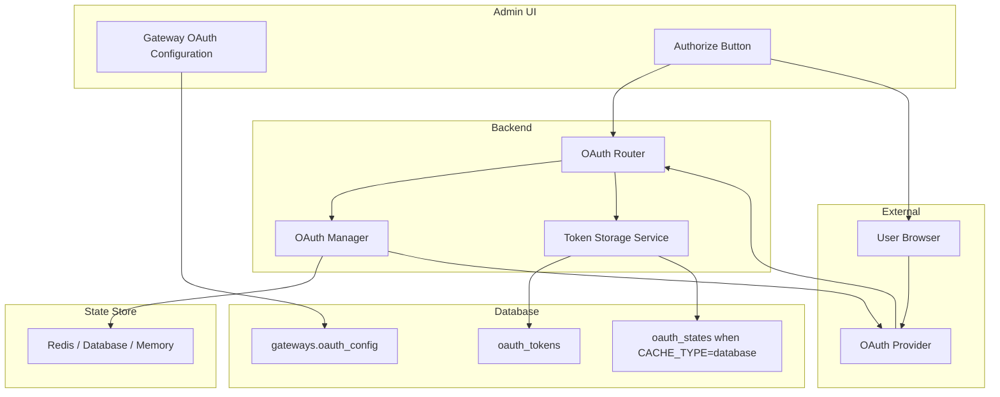
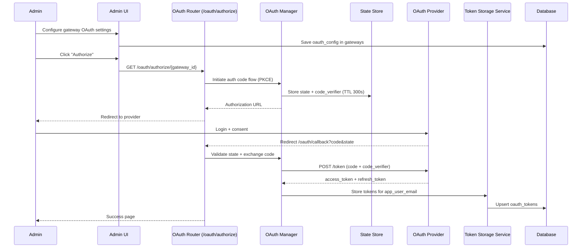
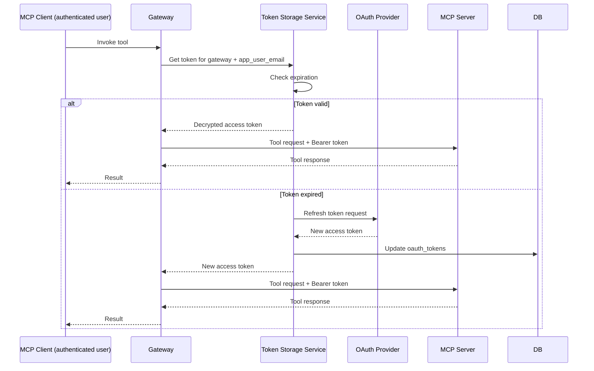

# OAuth 2.0 Authorization Code Flow UI Implementation Design

**Version**: 1.2
**Status**: Design + implementation notes
**Date**: February 2026
**Related**: [OAuth Design Document](./oauth-design.md)

## Executive Summary

This document describes how the Admin UI initiates OAuth 2.0 Authorization Code flow for MCP gateways and how the backend stores and uses user-delegated tokens. It reflects current behavior in code and calls out remaining gaps.

!!! note "Scope of This Document"
    This document covers the **UI implementation** for gateway OAuth token delegation - specifically how administrators configure OAuth settings and authorize access to upstream MCP servers.

    For information about **user authentication to MCP Gateway** (SSO, JWT tokens, RBAC), see:

    - [RBAC Configuration](../manage/rbac.md) - Token scoping, permissions, and access control
    - [Multi-Tenancy Architecture](./multitenancy.md) - User authentication flows and team management

## Current Implementation Snapshot

### Implemented today

- Admin UI exposes OAuth configuration fields for gateways and an "Authorize" action.
- Authorization Code flow uses PKCE (S256) and an HMAC-signed state value with a 300-second TTL.
- OAuth state is stored in Redis when `CACHE_TYPE=redis`, in the database when `CACHE_TYPE=database`, and in memory otherwise.
- Tokens are stored per gateway and app user (email) in `oauth_tokens`, encrypted with `AUTH_ENCRYPTION_SECRET`.
- Refresh tokens are used when access tokens are near expiry; invalid refresh tokens are cleared.
- DCR auto-registration can run during `/oauth/authorize/{gateway_id}` when `issuer` is set and `client_id` is missing.

### Known gaps and constraints

- `oauth_store_tokens` and `oauth_auto_refresh` checkboxes exist in the UI but are not persisted or enforced by the backend.
- `OAUTH_PREFERRED_CODE_CHALLENGE_METHOD` is defined but PKCE is always S256 today.
- No admin UI to list or revoke stored OAuth tokens per user.
- Token cleanup is a helper method only; there is no scheduler invoking it.

## Architecture Overview

Authorize redirects to `/oauth/authorize/{gateway_id}`. The OAuth Manager performs PKCE and state handling.

## Data Model

### Gateway OAuth configuration (`gateways.oauth_config`)

Stored as JSON and assembled from Admin UI fields or API payloads.

- `grant_type`: `authorization_code`, `client_credentials`, or `password`
- `issuer`: OAuth Authorization Server issuer URL (required for DCR)
- `authorization_url`: OAuth authorization endpoint
- `token_url`: OAuth token endpoint
- `redirect_uri`: Must match the OAuth client registration
- `client_id`: OAuth client identifier
- `client_secret`: Encrypted before storage
- `username` / `password`: Used only for password grant
- `scopes`: Array of requested scopes
- `resource` (optional): RFC 8707 resource parameter; when omitted, `/oauth/authorize` derives it from the gateway URL

### `oauth_tokens`

One token record per gateway and app user (email).

- `gateway_id`, `app_user_email` (unique pair)
- `user_id` (OAuth provider user identifier)
- `access_token`, `refresh_token` (encrypted at rest)
- `token_type`, `expires_at`, `scopes`
- `created_at`, `updated_at`

### `oauth_states` (database-backed state storage)

Used only when `CACHE_TYPE=database`.

- `gateway_id`, `state` (unique)
- `code_verifier` (PKCE)
- `expires_at`, `used`, `created_at`
- TTL is enforced in logic (300 seconds)

### `registered_oauth_clients` (DCR, optional)

Stored when Dynamic Client Registration succeeds.

- `issuer`, `client_id`, `client_secret_encrypted`
- `redirect_uris`, `grant_types`, `response_types`, `scope`
- `token_endpoint_auth_method`, `registration_client_uri`
- `created_at`, `expires_at`, `is_active`

## UI and Flow

### Admin UI touchpoints

The gateway form maps these inputs into `oauth_config`:

- `oauth_grant_type`
- `oauth_issuer`
- `oauth_client_id`
- `oauth_client_secret`
- `oauth_authorization_url`
- `oauth_token_url`
- `oauth_redirect_uri`
- `oauth_scopes`
- `oauth_username` / `oauth_password` (password grant only)

The gateway list shows an **Authorize** button for OAuth gateways, which sends the current user through `/oauth/authorize/{gateway_id}`.

### Authorization Code flow (current)

### Tool invocation using stored tokens

## Security and Operational Notes

- Tokens are encrypted at rest using `AUTH_ENCRYPTION_SECRET` (via the encryption service).
- State is HMAC-signed with `AUTH_ENCRYPTION_SECRET`, single-use, and expires after 300 seconds.
- Tokens are scoped per gateway and app user (email); cross-user reuse is blocked.
- The gateway derives an RFC 8707 `resource` value from the gateway URL when `oauth_config.resource` is absent.
- HTTPS is recommended in production; the gateway does not enforce it automatically.

## Relationship to Gateway Authentication

This OAuth flow is for **upstream server authentication** and is separate from user authentication to the MCP Gateway:

| Aspect | Gateway OAuth (this doc) | User Auth to Gateway |
|--------|-------------------------|---------------------|
| Purpose | Authenticate to upstream MCP servers | Authenticate users to the gateway |
| Initiated by | Admin UI "Authorize" button | Login flow (SSO, email, etc.) |
| Token storage | `oauth_tokens` table (encrypted) | JWT in client, session in browser |
| User involvement | User consents at OAuth provider | User authenticates to gateway |

For user authentication and RBAC configuration, see [RBAC Configuration](../manage/rbac.md).

## Configuration

| Setting | Default | Notes |
| --- | --- | --- |
| `OAUTH_REQUEST_TIMEOUT` | `30` | Timeout for OAuth HTTP requests |
| `OAUTH_MAX_RETRIES` | `3` | Retry count for token exchanges |
| `OAUTH_DEFAULT_TIMEOUT` | `3600` | Default `expires_in` when provider omits it |
| `AUTH_ENCRYPTION_SECRET` | `my-test-salt` | Encrypts OAuth tokens and signs state |
| `CACHE_TYPE` | `database` | `redis`, `database`, `memory`, or `none` |
| `REDIS_URL` | `redis://localhost:6379` | Required when `CACHE_TYPE=redis` |
| `DATABASE_URL` | `sqlite:///./mcp.db` | Required when `CACHE_TYPE=database` |
| `DCR_ENABLED` | `true` | Enable Dynamic Client Registration |
| `DCR_AUTO_REGISTER_ON_MISSING_CREDENTIALS` | `true` | Auto-register when issuer is set but client_id is missing |
| `DCR_DEFAULT_SCOPES` | `["mcp:read"]` | Default scopes for DCR |
| `DCR_ALLOWED_ISSUERS` | `[]` | Allowlist of issuer URLs |
| `DCR_TOKEN_ENDPOINT_AUTH_METHOD` | `client_secret_basic` | Token endpoint auth method |
| `DCR_METADATA_CACHE_TTL` | `3600` | Cache TTL for AS metadata discovery |
| `DCR_CLIENT_NAME_TEMPLATE` | `MCP Gateway ({gateway_name})` | DCR client_name template |
| `DCR_REQUEST_REFRESH_TOKEN_WHEN_UNSUPPORTED` | `false` | Request refresh token even if AS metadata omits support |
| `OAUTH_DISCOVERY_ENABLED` | `true` | Enable RFC 8414 discovery |
| `OAUTH_PREFERRED_CODE_CHALLENGE_METHOD` | `S256` | Defined but currently unused; PKCE is always S256 |

## Validation Checklist

- Create an OAuth gateway with `authorization_code` grant and complete provider consent via **Authorize**.
- Confirm an `oauth_tokens` record exists for your user and gateway.
- Invoke a tool to verify the stored token is used.
- Let the access token expire and confirm refresh happens when a refresh token is available.
- Switch `CACHE_TYPE` between `database` and `redis` to confirm state storage works in both modes.

## Future Enhancements

- Wire `oauth_store_tokens` and `oauth_auto_refresh` to backend behavior.
- Make PKCE method configurable using `OAUTH_PREFERRED_CODE_CHALLENGE_METHOD`.
- Add admin UI for token status and revocation.
- Schedule periodic cleanup of expired OAuth tokens.
