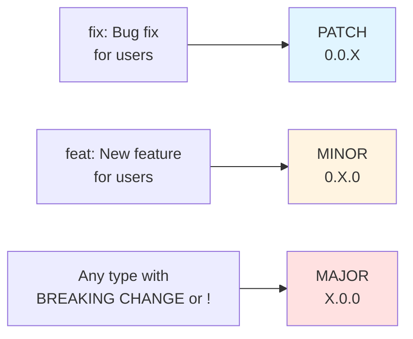
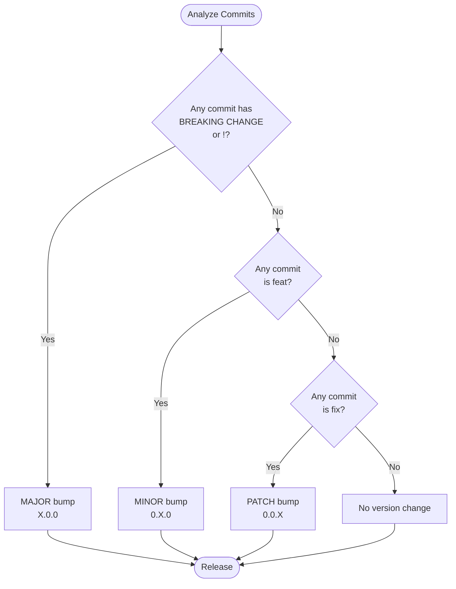

# Conventional Commits

Compose commit messages following the Conventional Commits v1.0.0 specification for structured commit history, automated changelog generation, and semantic versioning.

## When to Use This Skill

Use this skill when:

- Creating git commit messages for structured projects
- Validating commit message format against Conventional Commits specification
- Setting up commit message validation with commitlint
- Configuring changelog generation from commit history
- Implementing semantic versioning automation
- Reviewing commit messages for specification compliance
- Training teams on commit message standards
- Integrating with tools like semantic-release, commitizen, or git-cliff

## Message Structure

```text
<type>[optional scope]: <description>

[optional body]

[optional footer(s)]
```

### Components

| Component   | Required | Description                  | Example                          |
| ----------- | -------- | ---------------------------- | -------------------------------- |
| type        | Yes      | Commit category              | `feat`, `fix`, `docs`            |
| scope       | No       | Codebase section affected    | `(auth)`, `(parser)`             |
| description | Yes      | Short summary of changes     | `add user authentication`        |
| body        | No       | Detailed explanation         | Multiple paragraphs with context |
| footer      | No       | Breaking changes, issue refs | `BREAKING CHANGE:`, `Refs: #123` |

## Commit Types

### Required Types (SemVer Impact)

These types are mandated by the Conventional Commits specification and directly affect semantic versioning:



| Type   | Description           | SemVer        | Example                             |
| ------ | --------------------- | ------------- | ----------------------------------- |
| `feat` | New feature for users | MINOR (0.X.0) | `feat: add user authentication`     |
| `fix`  | Bug fix for users     | PATCH (0.0.X) | `fix: prevent crash on empty input` |

### Recommended Types (Angular Convention)

These types come from [@commitlint/config-conventional](https://github.com/conventional-changelog/commitlint/tree/master/%40commitlint/config-conventional) based on [Angular commit guidelines](https://github.com/angular/angular/blob/main/contributing-docs/commit-message-guidelines.md). They have no implicit SemVer effect unless they include `BREAKING CHANGE`.

| Type       | Description                                 | Example                              |
| ---------- | ------------------------------------------- | ------------------------------------ |
| `build`    | Build system or external dependency changes | `build: update webpack to v5`        |
| `ci`       | CI configuration changes                    | `ci: add Node 18 to test matrix`     |
| `docs`     | Documentation only changes                  | `docs: update API reference`         |
| `perf`     | Performance improvement                     | `perf: reduce bundle size by 20%`    |
| `refactor` | Code change with no bug fix or feature      | `refactor: extract validation logic` |
| `style`    | Code style changes (whitespace, formatting) | `style: fix indentation`             |
| `test`     | Adding or correcting tests                  | `test: add unit tests for parser`    |

### Additional Common Types

| Type     | Description                             | Example                       |
| -------- | --------------------------------------- | ----------------------------- |
| `chore`  | Changes not modifying src or test files | `chore: update .gitignore`    |
| `revert` | Reverts a previous commit               | `revert: feat: add user auth` |

**Note**: Teams can define custom types beyond `feat` and `fix`, but Angular convention types are widely supported by tooling.

## Specification Rules

The following rules constitute the official Conventional Commits 1.0.0 specification per [RFC 2119](https://www.ietf.org/rfc/rfc2119.txt).

### Type and Scope

1. Commits **MUST** be prefixed with a type, consisting of a noun (`feat`, `fix`, etc.), followed by **OPTIONAL** scope, **OPTIONAL** `!`, and **REQUIRED** terminal colon and space.

2. Type `feat` **MUST** be used when a commit adds a new feature.

3. Type `fix` **MUST** be used when a commit represents a bug fix.

4. A scope **MAY** be provided after a type. A scope **MUST** consist of a noun describing a codebase section surrounded by parenthesis, e.g., `fix(parser):`

5. A description **MUST** immediately follow the colon and space after the type/scope prefix. The description is a short summary of code changes, e.g., `fix: array parsing issue when multiple spaces were contained in string`

### Body

6. A longer commit body **MAY** be provided after the short description, providing additional contextual information. The body **MUST** begin one blank line after the description.

7. A commit body is free-form and **MAY** consist of any number of newline separated paragraphs.

### Footer

8. One or more footers **MAY** be provided one blank line after the body. Each footer **MUST** consist of a word token, followed by either a `:<space>` or `<space>#` separator, followed by a string value (inspired by [git trailer convention](https://git-scm.com/docs/git-interpret-trailers)).

9. A footer's token **MUST** use `-` in place of whitespace characters, e.g., `Acked-by` (this helps differentiate footer section from multi-paragraph body). Exception: `BREAKING CHANGE` **MAY** also be used as a token.

10. A footer's value **MAY** contain spaces and newlines. Parsing **MUST** terminate when the next valid footer token/separator pair is observed.

### Breaking Changes

11. Breaking changes **MUST** be indicated in the type/scope prefix of a commit, or as an entry in the footer.

12. If included as a footer, a breaking change **MUST** consist of uppercase text `BREAKING CHANGE`, followed by colon, space, and description, e.g., `BREAKING CHANGE: environment variables now take precedence over config files`

13. If included in the type/scope prefix, breaking changes **MUST** be indicated by `!` immediately before `:`. If `!` is used, `BREAKING CHANGE:` **MAY** be omitted from footer, and commit description **SHALL** be used to describe the breaking change.

### Additional Rules

14. Types other than `feat` and `fix` **MAY** be used in commit messages, e.g., `docs: update ref docs`

15. The units of information that make up Conventional Commits **MUST NOT** be treated as case sensitive by implementors, except `BREAKING CHANGE` which **MUST** be uppercase.

16. `BREAKING-CHANGE` **MUST** be synonymous with `BREAKING CHANGE` when used as a token in a footer.

## Description Best Practices

Based on [Angular commit message guidelines](https://github.com/angular/angular/blob/main/contributing-docs/commit-message-guidelines.md):

### Summary/Description Guidelines

- Use imperative, present tense: "change" not "changed" nor "changes"
- Do not capitalize first letter
- No period (.) at the end
- Keep entire header (type + scope + description) under 72 characters

### Good Examples

```text
feat: add validation for email input
fix: handle null pointer in user service
docs: update installation instructions
refactor: simplify authentication flow
```

### Bad Examples (Avoid)

```text
feat: Added validation for email input     # Past tense
fix: Handles null pointer in user service  # Third person
docs: Update installation instructions.    # Period at end, capitalized
FEAT: add validation                       # Uppercase type (inconsistent)
```

### Body Guidelines

- Use imperative, present tense (same as summary)
- Explain motivation for the change
- Include comparison of previous vs new behavior when helpful
- Body **MUST** begin with one blank line after description
- Recommended minimum: 20 characters when body is present

## Breaking Changes

### Methods to Indicate Breaking Changes

Three equivalent approaches:

1. **Footer notation**:

   ```text
   feat: allow provided config object to extend other configs

   BREAKING CHANGE: `extends` key in config file is now used for extending other config files
   ```

2. **Type suffix with `!`**:

   ```text
   feat!: remove support for Node 6
   ```

3. **Type+scope suffix with `!`**:
   ```text
   feat(api)!: send an email to the customer when a product is shipped
   ```

### Rules

- `BREAKING CHANGE` **MUST** be uppercase
- `BREAKING-CHANGE` is synonymous when used as footer token
- Breaking changes **MUST** correlate to MAJOR version bump in SemVer

## Semantic Versioning Correlation



### Commit Type to Version Mapping

| Commit Type              | Version Bump  |
| ------------------------ | ------------- |
| `fix`                    | PATCH (0.0.X) |
| `feat`                   | MINOR (0.X.0) |
| `BREAKING CHANGE` or `!` | MAJOR (X.0.0) |

**Reason**: Enables automated semantic versioning based on commit history.

## Validation Patterns

### Header Validation Regex

```regex
^(feat|fix|docs|style|refactor|perf|test|build|ci|chore|revert)(\(.+\))?!?:\s.+$
```

### Python Validation Example

```python
import re

CONVENTIONAL_COMMIT_PATTERN = re.compile(
    r'^(?P<type>feat|fix|docs|style|refactor|perf|test|build|ci|chore|revert)'
    r'(?:\((?P<scope>[^)]+)\))?'
    r'(?P<breaking>!)?'
    r':\s'
    r'(?P<description>.+)$'
)

def validate_header(header: str) -> bool:
    """Validate commit header follows Conventional Commits."""
    return bool(CONVENTIONAL_COMMIT_PATTERN.match(header))

def parse_header(header: str) -> dict | None:
    """Parse commit header into components."""
    match = CONVENTIONAL_COMMIT_PATTERN.match(header)
    if not match:
        return None
    return {
        'type': match.group('type'),
        'scope': match.group('scope'),
        'breaking': bool(match.group('breaking')),
        'description': match.group('description'),
    }
```

## Complete Examples

### Simple Commits

```text
feat: add user authentication
```

```text
fix: prevent crash on empty input
```

```text
docs: correct spelling of CHANGELOG
```

### Commits with Scope

```text
feat(lang): add Polish language
```

```text
feat(parser): add ability to parse arrays
```

```text
fix(auth): handle token expiration correctly
```

### Breaking Changes

```text
feat: allow provided config object to extend other configs

BREAKING CHANGE: `extends` key in config file is now used for extending other config files
```

```text
feat!: send an email to the customer when a product is shipped
```

```text
feat(api)!: send an email to the customer when a product is shipped
```

```text
chore!: drop support for Node 6

BREAKING CHANGE: use JavaScript features not available in Node 6.
```

### Multi-Paragraph Body with Footers

```text
fix: prevent racing of requests

Introduce a request id and a reference to latest request. Dismiss
incoming responses other than from latest request.

Remove timeouts which were used to mitigate the racing issue but are
obsolete now.

Reviewed-by: Z
Refs: #123
```

### Revert Commit

```text
revert: let us never again speak of the noodle incident

Refs: 676104e, a215868
```

### Performance Improvement

```text
perf: reduce memory allocation in parser by 40%

Replace string concatenation with StringBuilder pattern.
Benchmark results show 40% reduction in heap allocations.

Refs: #456
```

### Refactoring

```text
refactor: extract authentication logic into separate module

Move auth-related functions from utils.py to auth.py.
No functional changes.
```

### Build/CI Changes

```text
ci: add Node 18 to test matrix
```

```text
build: upgrade webpack from v4 to v5

- Update webpack.config.js for v5 compatibility
- Replace deprecated plugins
- Update all loader dependencies

Refs: #789
```

### Test and Style Changes

```text
test: add unit tests for user validation

Cover edge cases for email validation and password strength.
```

```text
style: format code according to prettier config
```

```text
chore: update .gitignore to exclude IDE files
```

## Integration with Validation Tools

### commitlint Configuration

Validate commits with commitlint using Angular configuration:

```bash
# Install commitlint
npm install --save-dev @commitlint/cli @commitlint/config-conventional

# Create configuration
echo "module.exports = {extends: ['@commitlint/config-conventional']}" > commitlint.config.js

# Test commit message
echo 'feat(api): add new endpoint' | npx commitlint
```

For comprehensive commitlint configuration guidance, activate the commitlint skill:

```text
Skill(command: "commitlint")
```

### Pre-commit Hooks

Enforce commit message format with pre-commit hooks. For complete pre-commit setup guidance, activate the pre-commit skill:

```text
Skill(command: "pre-commit")
```

### Changelog Generation

Generate changelogs from Conventional Commits using semantic-release:

```javascript
// release.config.js
module.exports = {
  branches: ['main'],
  plugins: [
    '@semantic-release/commit-analyzer',
    '@semantic-release/release-notes-generator',
  ],
};
```

Or using git-cliff:

```toml
# cliff.toml
[git]
conventional_commits = true
```

## Benefits

From the [official specification](https://www.conventionalcommits.org/en/v1.0.0/):

1. **Automatically generating CHANGELOGs** - Tools parse commit history and generate release notes
2. **Automatically determining semantic version bumps** - Based on commit types landed
3. **Communicating nature of changes** - To teammates, public, and stakeholders
4. **Triggering build and publish processes** - CI/CD pipelines react to specific commit types
5. **Making it easier for people to contribute** - Through structured commit history exploration

## Frequently Asked Questions

### Can I use custom types?

Yes. Types beyond `feat` and `fix` are not mandated by the specification but have no implicit SemVer effect unless they include `BREAKING CHANGE`. Teams commonly add types like `wip`, `deps`, `security`.

### Is the specification case-sensitive?

Implementation-defined. Most tools normalize to lowercase. Exception: `BREAKING CHANGE` **MUST** be uppercase. Best practice: be consistent within your project.

### What about merge commits?

Merge commits are typically ignored by changelog generators. They do not need to follow the format.

### What if I use the wrong type?

**Before merging/releasing**: Use `git rebase -i` to edit commit history **After release**: Depends on tools and processes **Worst case**: Non-conforming commit is missed by tools based on the specification

### Do all contributors need to use Conventional Commits?

No. With squash-based workflows, lead maintainers can clean up commit messages when merging. Many teams configure git systems to automatically squash commits from pull requests and present a form for entering proper commit messages.

### How do I handle revert commits?

Use the `revert` type with a footer referencing reverted commit SHAs:

```text
revert: let us never again speak of the noodle incident

Refs: 676104e, a215868
```

## Related Skills

**Commit message validation and enforcement:**

- `commitlint` - Configure and use commitlint for commit message validation
- `pre-commit` - Set up pre-commit hooks for automated validation

**Git workflow tools:**

- `git-commit-helper` - Generate commit messages from git diffs
- `semantic-release` - Automate versioning and changelog generation

## References

### Official Documentation

- [Conventional Commits v1.0.0 Specification](https://www.conventionalcommits.org/en/v1.0.0/) - Official specification (accessed 2025-01-15)
- [Conventional Commits GitHub Repository](https://github.com/conventional-commits/conventionalcommits.org) - Specification source repository
- [RFC 2119](https://www.ietf.org/rfc/rfc2119.txt) - Key words used in specification

### Related Standards

- [Semantic Versioning (SemVer)](https://semver.org/) - Versioning standard that Conventional Commits dovetails with
- [Angular Commit Message Guidelines](https://github.com/angular/angular/blob/main/contributing-docs/commit-message-guidelines.md) - Convention that inspired Conventional Commits
- [Git Trailer Format](https://git-scm.com/docs/git-interpret-trailers) - Convention that inspired footer format

### Tools and Configurations

- [@commitlint/config-conventional](https://github.com/conventional-changelog/commitlint/tree/master/%40commitlint/config-conventional) - Commitlint shareable config
- [@commitlint/config-angular](https://github.com/conventional-changelog/commitlint/tree/master/%40commitlint/config-angular) - Angular-style commitlint config
- [semantic-release](https://github.com/semantic-release/semantic-release) - Automated versioning and changelog
- [git-cliff](https://github.com/orhun/git-cliff) - Changelog generator
- [commitizen](https://github.com/commitizen/cz-cli) - Interactive commit message builder
