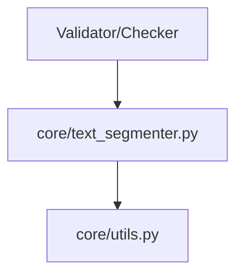

# System Design & Architecture

## Architecture Overview
**What is the high-level system structure?**

The `text_segmenter` is a core utility that depends on `core.utils` for constants and logging.



## Data Models
**What data do we need to manage?**

### Chunk Data Class
```python
@dataclass(frozen=True)
class Chunk:
    text: str
    start_index: int
    end_index: int
    is_partial: bool  # True if it's the last, smaller chunk
```

## API Design
**How do components communicate?**

### Primary Interface
- `segment_text(text: str, chunk_size: int = 600, overlap: int = 100) -> List[Chunk]`
- `normalize_whitespace(text: str) -> str`: Helper to ensure single spaces and no trailing whitespace.

## Component Breakdown
**What are the major building blocks?**

- **Normalizer:** Pre-processes the input string.
- **Sliding Window Logic:** Calculates the slices based on size and overlap.
- **Chunk Factory:** Produces `Chunk` objects with correct indices.

## Design Decisions
**Why did we choose this approach?**

- **Character-based slicing:** More predictable than word-based slicing when dealing with potential OCR errors or strange formatting in PDF.
- **Frozen Dataclass:** Ensures chunks are immutable and safe to pass around.
- **Overlap Formula:** `start_index = max(0, previous_end - overlap)`.

## Non-Functional Requirements
**How should the system perform?**

- **Performance:** O(n) complexity.
- **Memory:** Should not create unnecessary copies of long strings during slicing (using Python's efficient string slicing).
- **Correctness:** Must never lose a single character from the original text (except for normalized whitespace).
