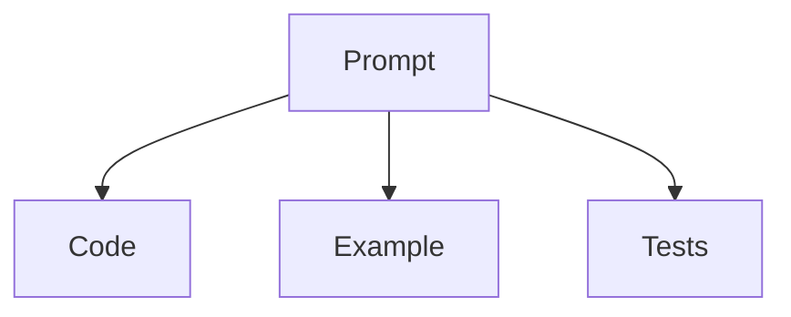
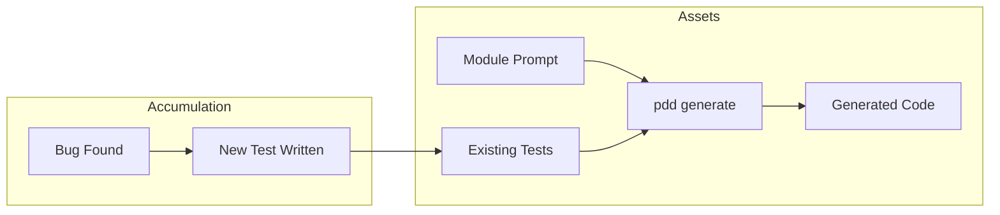
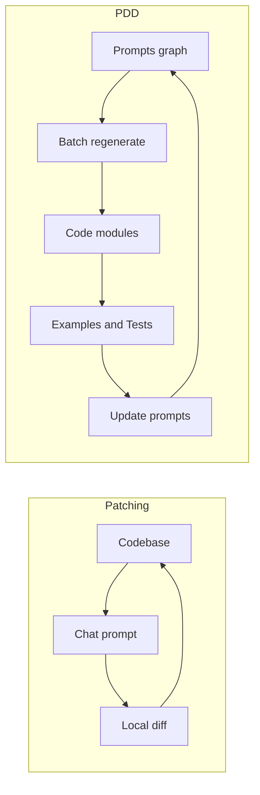
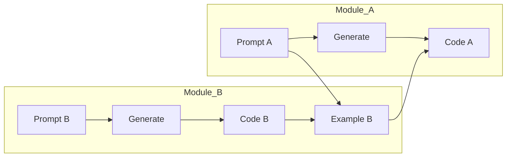

# Prompt‑Driven Development Prompting Guide

This guide shows how to write effective prompts for Prompt‑Driven Development (PDD). It distills best practices from the PDD whitepaper, the PDD doctrine, and working patterns in this repo. It also contrasts PDD prompts with interactive agentic coding tools (e.g., Claude Code, Cursor) where prompts act as ad‑hoc patches instead of the source of truth.

References: pdd/docs/whitepaper.md, pdd/docs/prompt-driven-development-doctrine.md, README.md (repo structure, conventions), [Effective Context Engineering](https://www.anthropic.com/engineering/effective-context-engineering-for-ai-agents), [Anthropic Prompt Engineering Overview](https://docs.anthropic.com/en/docs/build-with-claude/prompt-engineering/overview).

---

## Quickstart: PDD in 5 Minutes

If you are new to Prompt-Driven Development (PDD), follow this recipe:

1.  **Think "One Prompt = One Module":** Don't try to generate the whole app at once. Focus on one file (e.g., `user_service.py`).
2.  **Use a Template:** Start with a clear structure: Role, Requirements, Dependencies, Instructions.
3.  **Explicitly Include Context:** Use `<include>path/to/file</include>` to give the model *only* what it needs (e.g., a shared preamble or a dependency interface). This is a **PDD directive**, not just XML.
4.  **Regenerate, Don't Patch:** If the code is wrong, fix it using `pdd fix`. This updates the system's memory so the next `pdd generate` is grounded in the correct solution.
5.  **Verify:** Run the generated code/tests.

*Tip: Treat your prompt like source code. It is the single source of truth.*

*For the conceptual foundation of why this works, see [The Mold Paradigm](prompt-driven-development-doctrine.md#the-mold-paradigm) in the doctrine.*

---

## Glossary

- **Context Engineering:** The art of curating exactly what information (code, docs, examples) fits into the LLM's limited "working memory" (context window) to get the best result.
- **Shared Preamble:** A standard text file (e.g., `project_preamble.prompt`) included in every prompt to enforce common rules like coding style, forbidden libraries, and formatting.
- **PDD Directive:** Special tags like `<include>` or `<shell>` that the PDD tool processes *before* sending the text to the AI. The AI sees the *result* (the file content), not the tag.
- **Source of Truth:** The definitive record. In PDD, the **Prompt** is the source of truth; the code is just a temporary artifact generated from it.
- **Grounding (Few-Shot History):** The process where the PDD system automatically uses successful past pairs of (Prompt, Code) as "few-shot" examples during generation. This ensures that regenerated code adheres to the established style and logic of the previous version, preventing the model from hallucinating a completely different implementation.
- **Drift:** When the generated code slowly diverges from the prompt's intent over time, or when manual edits to code make it inconsistent with the prompt.

---

## Why PDD Prompts (Not Patches)

- Prompts are the source of truth; code is a generated artifact. Update the prompt and regenerate instead of patching code piecemeal.
- Regeneration preserves conceptual integrity and reduces long‑term maintenance cost (see pdd/docs/whitepaper.md).
- Prompts consolidate intent, constraints, dependencies, and examples into one place so the model can enforce them.
- Tests accumulate across regenerations and act as a regression net; prompts and tests stay in sync.

Contrast with interactive patching (Claude Code, Cursor): prompts are ephemeral instructions for local diffs. They are great for short, local fixes, but tend to drift from original intent as context is implicit and often lost. In PDD, prompts are versioned, explicit, and designed for batch, reproducible generation.

For a deeper exploration of why this paradigm shift matters—and an analogy to manufacturing's wood‑to‑plastic transition—see [The Mold Paradigm](prompt-driven-development-doctrine.md#the-mold-paradigm) in the doctrine.

---

## The PDD Mental Model

- One prompt typically maps to one code file or narrowly scoped module.
- You explicitly curate the context to place in the model’s window (don’t “dump the repo”).
- Change behavior by editing the prompt; re‑generate the file; run crash/verify/test/fix; then update the prompt with learnings.
- Keep the “dev unit” synchronized: prompt + generated code + minimal runnable example + tests.

Key principles: everything is explicit, prompts are the programming language, and you regenerate rather than patch.

Dev Unit (Prompt with Code, Example, Test):



Notes:
- The prompt defines intent. Code, example, and tests are generated artifacts.
- Regenerate rather than patch; keep tests accumulating over time.

---

<a name="automated-grounding"></a>
## Automated Grounding (PDD Cloud)

Unlike standard LLM interactions where every request is a blank slate, PDD Cloud uses **Automated Grounding** to prevent "implementation drift."

### How It Works

When you run `pdd generate`, the system:
1. Embeds your prompt into a vector
2. Searches for similar prompts in the cloud database (cosine similarity)
3. Auto-injects the closest (prompt, code) pair as a few-shot example

**This is automatic.** You don't configure it. As you edit your prompt:
- The embedding changes
- Different examples may be retrieved
- Generation naturally adapts to your prompt's content

On first generation: Similar existing modules in your project provide grounding.
On re-generation: Your prior successful generation is typically the closest match.

### Why This Matters for Prompt Writing

- **Your prompt wording affects grounding.** Similar prompts retrieve similar examples.
- **Implementation patterns are handled automatically.** Grounding provides structural consistency from similar modules (class vs functional, helper patterns, etc.).
- **Prompts can be minimal.** Focus on requirements; grounding handles implementation patterns.

*Note: This is distinct from "Examples as Interfaces" (which teach how to **use** a dependency). Grounding teaches the model how to **write** the current module.*

> **Local users (no cloud):** Without grounding, prompts must be more detailed—include structural guidance and explicit examples via `<include>`. Use a shared preamble for coding style. The minimal prompt guidance in this document assumes cloud access.

---

## Grounding Overrides: Pin & Exclude (PDD Cloud)

For users with PDD Cloud access, you can override automatic grounding using XML tags:

**`<pin>module_name</pin>`** — Force a specific example to always be included
- Use case: Ensure a critical module always follows a "golden" pattern
- Use case: Bootstrap a new module with a specific style

**`<exclude>module_name</exclude>`** — Block a specific example(s) from being retrieved
- Use case: Escape an old pattern that's pulling generation in the wrong direction
- Use case: Intentionally break from established patterns for a redesign

These tags are processed by the preprocessor (like `<include>`) and removed before the LLM sees the prompt.

**Most prompts don't need these.** Automatic grounding works well for:
- Standard modules with similar existing examples
- Re-generations of established modules
- Modules following common project patterns

---

## Anatomy of a Good PDD Prompt

A well-designed prompt contains **only what can't be handled elsewhere**. With cloud grounding and accumulated tests, prompts can be minimal.

### Required Sections

1. **Role and scope** (1-2 sentences): What this module does
2. **Requirements** (5-10 items): Functional and non-functional specs
3. **Dependencies** (via `<include>`): Only external or critical interfaces

### Optional Sections

4. **Instructions**: Only if default behavior needs overriding
5. **Deliverables**: Only if non-obvious

### What NOT to Include

- **Coding style** (naming, formatting, imports) → Handled by shared preamble
- **Implementation patterns** (class structure, helpers) → Handled by grounding
- **Every edge case** → Handled by accumulated tests
- **Implementation steps** → Let the LLM decide (unless critical)

### Target Size: Prompt-to-Code Ratio

Aim for **10-30%** of your expected code size:

| Ratio | Meaning |
|-------|---------|
| **< 10%** | Too vague—missing contracts, error handling, or key constraints |
| **10-30%** | Just right—requirements and contracts without implementation details |
| **> 50%** | Too detailed—prompt is doing preamble's or grounding's job |

If your prompt exceeds 30%, ask: Am I specifying things that preamble, grounding, or tests should handle?

**Note:** Tests are generated from the module prompt (via Requirements), so explicit Testing sections are unnecessary—well-written Requirements are inherently testable. Use `context/test.prompt` for project-wide test guidance.

See pdd/pdd/templates/generic/generate_prompt.prompt for a concrete scaffold.

---

## Prompt Syntax Essentials

These patterns are used across prompts in this repo:

- Preamble and role: start with a concise, authoritative description of the task and audience (e.g., “You are an expert Python engineer…”).
- Includes for context: bring only what the model needs.
  - Single include: `<include>path/to/file</include>`. **Note:** This is a PDD directive, not standard XML. The PDD tool replaces this tag with the actual file content *before* the LLM sees it. (Handles both text and images).
  - Multiple: `<include-many>path1, path2, …</include-many>`
  - Grouping: wrap includes in a semantic tag to name the dependency or file they represent, for example:
    ```xml
    <render_js>
      <include>src/render.js</include>
    </render_js>
    ```
  - When including larger files inline for clarity, wrap with opening/closing tags named after the file, e.g. `<render.js>…</render.js>`.
  - Note: `<include>`, `<include-many>`, `<shell>`, and `<web>` inside fenced code blocks (``` or ~~~) or inline backticks are treated as literal text.
- Inputs/outputs: state them explicitly (names, types, shapes). Prompts should define Inputs/Outputs and steps clearly.
- Steps & Chain of Thought: Outline a short, deterministic plan. For complex logical tasks, explicitly instruct the model to "Analyze the requirements and think step-by-step before writing code." This improves accuracy on difficult reasoning problems.
- Constraints: specify style, performance targets, security, and error handling.
- Environment: reference required env vars (e.g., `PDD_PATH`) when reading data files.

Tip: Prefer small, named sections using XML‑style tags to make context scannable and deterministic.

### Special XML Tags: pdd, shell, web

The PDD preprocessor supports additional XML‑style tags to keep prompts clean, reproducible, and self‑contained. Processing order (per spec) is: `pdd` → `include`/`include-many` → `shell` → `web`. When `recursive=True`, `<shell>` and `<web>` are deferred until a non‑recursive pass.

- `<pdd>…</pdd>`
  - Purpose: human‑only comment. Removed entirely during preprocessing.
  - Use: inline rationale or notes that should not reach the model.
  - Example: `Before step X <pdd>explain why we do this here</pdd>`

- `<shell>…</shell>`
  - Purpose: run a shell command and inline stdout at that position.
  - Behavior: executes during non‑recursive preprocessing; on non‑zero exit, inserts a bracketed error with the exit code instead of failing the pipeline.
  - Example: `<shell>git config --get user.name</shell>`

- `<web>URL</web>`
  - Purpose: fetch the page (via Firecrawl) and inline the markdown content.
  - Behavior: executes during non‑recursive preprocessing; on failure, inserts a bracketed error note.
  - Example: `<web>https://docs.litellm.ai/docs/completion/json_mode</web>`

> ⚠️ **Warning: Non-Deterministic Tags**
>
> `<shell>` and `<web>` introduce **non-determinism**:
> - `<shell>` output varies by environment (different machines, different results)
> - `<web>` content changes over time (same URL, different content)
>
> **Impact:** Same prompt file → different generations on different machines/times
>
> **Prefer instead:** Capture output to a static file, then `<include>` that file. This ensures reproducible regeneration.

Use these tags sparingly. When you must use them, prefer stable commands with bounded output (e.g., `head -n 20` in `<shell>`).

**`context_urls` in Architecture Entries:**

When an architecture.json entry includes a `context_urls` array, the `generate_prompt` template automatically converts each entry into a `<web>` tag in the generated prompt's Dependencies section. This enables the LLM to fetch relevant API documentation during code generation:

```json
"context_urls": [
  {"url": "https://fastapi.tiangolo.com/tutorial/first-steps/", "purpose": "FastAPI routing patterns"}
]
```

Becomes in the generated prompt:
```xml
<fastapi_routing_patterns>
  <web>https://fastapi.tiangolo.com/tutorial/first-steps/</web>
</fastapi_routing_patterns>
```

The tag name is derived from the `purpose` field (lowercased, spaces replaced with underscores). This mechanism bridges architecture-level research with prompt-level context.

---

## Architecture Metadata Tags

PDD prompts can include optional XML metadata tags that sync with `architecture.json`. These tags enable bidirectional sync between prompt files and the architecture visualization, keeping your project's architecture documentation automatically up-to-date.

### Tag Format

Place architecture metadata tags at the **top of your prompt file** (after any `<include>` directives but before the main content):

```xml
<pdd-reason>Brief description of module's purpose (60-120 chars)</pdd-reason>

<pdd-interface>
{{
  "type": "module",
  "module": {{
    "functions": [
      {{"name": "function_name", "signature": "(...)", "returns": "Type"}}
    ]
  }}
}}
</pdd-interface>

<pdd-dependency>dependency_prompt_1.prompt</pdd-dependency>
<pdd-dependency>dependency_prompt_2.prompt</pdd-dependency>
```

### Tag Reference

**`<pdd-reason>`**
- **Purpose**: One-line description of why this module exists
- **Maps to**: `architecture.json["reason"]`
- **Format**: Single line string (recommended 60-120 characters)
- **Example**: `<pdd-reason>Provides unified LLM invocation across all PDD operations.</pdd-reason>`

**`<pdd-interface>`**
- **Purpose**: JSON describing the module's public API (functions, commands, pages)
- **Maps to**: `architecture.json["interface"]`
- **Format**: Valid JSON matching one of four interface types (see below)
- **Example**:
  ```xml
  <pdd-interface>
  {{
    "type": "module",
    "module": {{
      "functions": [
        {{"name": "llm_invoke", "signature": "(prompt, strength, ...)", "returns": "Dict"}}
      ]
    }}
  }}
  </pdd-interface>
  ```

**`<pdd-dependency>`**
- **Purpose**: References other prompt files this module depends on
- **Maps to**: `architecture.json["dependencies"]` array
- **Format**: Prompt filename (e.g., `llm_invoke_python.prompt`)
- **Multiple tags**: Use one `<pdd-dependency>` tag per dependency
- **Example**:
  ```xml
  <pdd-dependency>llm_invoke_python.prompt</pdd-dependency>
  <pdd-dependency>path_resolution_python.prompt</pdd-dependency>
  ```

### Interface Types

The `<pdd-interface>` tag supports four interface types, matching the architecture.json schema:

**Module Interface** (Python modules with functions):
```json
{
  "type": "module",
  "module": {
    "functions": [
      {"name": "func_name", "signature": "(arg1, arg2)", "returns": "Type"}
    ]
  }
}
```

**CLI Interface** (Command-line interfaces):
```json
{
  "type": "cli",
  "cli": {
    "commands": [
      {"name": "cmd_name", "description": "What it does"}
    ]
  }
}
```

**Command Interface** (PDD commands):
```json
{
  "type": "command",
  "command": {
    "commands": [
      {"name": "cmd_name", "description": "What it does"}
    ]
  }
}
```

**Frontend Interface** (UI pages):
```json
{
  "type": "frontend",
  "frontend": {
    "pages": [
      {"name": "page_name", "route": "/path"}
    ]
  }
}
```

### Sync Workflow

1. **Add/edit tags** in your prompt files using the format above
2. **Click "Sync from Prompt"** in the PDD Connect Architecture page (or call the API endpoint)
3. **Tags automatically update** `architecture.json` with your changes
4. **Architecture visualization** reflects the updated dependencies and interfaces

Prompts are the **source of truth** - tags in prompt files override what's in `architecture.json`. This aligns with PDD's core philosophy that prompts, not code or documentation, are authoritative.

### Validation

Validation is **lenient**:
- Missing tags are OK - only fields with tags get updated
- Malformed XML/JSON is skipped without blocking sync
- Circular dependencies are detected and prevent invalid updates
- Missing dependency files generate warnings but don't block sync

### Best Practices

**Keep `<pdd-reason>` concise** (60-120 chars)
- Good: "Provides unified LLM invocation across all PDD operations."
- Too long: "This module exists because we needed a way to call different LLM providers through a unified interface that supports both streaming and non-streaming modes while also handling rate limiting and retry logic..."

**Use prompt filenames for dependencies**, not module names
- Correct: `<pdd-dependency>llm_invoke_python.prompt</pdd-dependency>`
- Wrong: `<pdd-dependency>pdd.llm_invoke</pdd-dependency>`
- Wrong: `<pdd-dependency>context/example.py</pdd-dependency>`

**Validate interface JSON before committing**
- Use a JSON validator to check syntax
- Ensure `type` field matches one of: `module`, `cli`, `command`, `frontend`
- Include required nested keys (`functions`, `commands`, or `pages`)

**Run "Sync All" after bulk prompt updates**
- If you've edited multiple prompts, sync all at once
- Review the validation results for circular dependencies
- Fix any warnings before committing changes

### Relationship to Other Tags

**`<pdd-dependency>` vs `<include>`**:
- `<pdd-dependency>`: Declares architectural dependency (updates `architecture.json`)
- `<include>`: Injects content into prompt for LLM context (does NOT affect architecture)
- Use both when appropriate - they serve different purposes

**`<pdd-*>` tags vs `<pdd>` comments**:
- `<pdd-reason>`, `<pdd-interface>`, `<pdd-dependency>`: Metadata tags (processed by sync tool)
- `<pdd>...</pdd>`: Human-only comments (removed by preprocessor, never reach LLM)
- Both are valid PDD directives with different purposes

### Example: Complete Prompt with Metadata Tags

See `docs/examples/prompt_with_metadata.prompt` for a full example showing all three metadata tags in context.

---

## Advanced Tips

### Shared Preamble for Consistency

Use a shared include (e.g., `<include>context/project_preamble.prompt</include>`) at the top of every prompt. You should create this file in your project's `context/` directory to define your "Constitution": consistent coding style (e.g., indentation, naming conventions), preferred linting rules, and forbidden libraries. This ensures all generated code speaks the same language without cluttering individual prompts.

### Automatic Update Propagation via Includes

A key benefit of `<include>` directives is **automatic propagation**: when the included file changes, all prompts that reference it automatically reflect those changes on the next generation—without editing the prompts themselves.

Use this pattern when:
- **Authoritative documentation exists elsewhere** (e.g., a README that defines environment variables, API contracts, or configuration options). Include it rather than duplicating the content.
- **Shared constraints evolve** (e.g., coding standards, security policies). A single edit to the preamble file updates all prompts.
- **Interface definitions change** (e.g., a dependency's example file). Prompts consuming that example stay current.

*Tradeoff:* Large includes consume context tokens. If only a small portion of a file is relevant, consider extracting that portion into a dedicated include file (e.g., `docs/output_conventions.md` rather than the full `README.md`).

### Positive over Negative Constraints

Models often struggle with negative constraints ("Do not use X"). Instead, phrase requirements positively: instead of "Do not use unassigned variables," prefer "Initialize all variables with default values." This greatly improves reliability.

### Positioning Critical Instructions (Hierarchy of Attention)

LLMs exhibit "middle-loss" – they pay more attention to the **beginning** (role, preamble) and the **end** (steps, deliverables) of the prompt context. If a critical constraint (e.g., security, output format) is ignored, ensure it's placed in your shared preamble, explicitly reiterated in the final "Instructions" or "Steps" section, or even pre-filled in the expected output format if applicable.

### Command-Specific Context Files

Some PDD commands (e.g., `pdd test`, `pdd example`) can automatically include project-specific context files like `context/test.prompt` or `context/example.prompt` during their internal preprocessing. Use these to provide instructions tailored to your project, such as preferred testing frameworks or specific import statements, without modifying the main prompt.

**`context/test.prompt`** is particularly important:
- Defines testing conventions, frameworks, and patterns for your project
- Included automatically when running `pdd test` (alongside the module prompt and generated code)
- Tests accumulate over time via `--merge` as bugs are found
- Tests persist when the module prompt changes—only code is regenerated, not tests
- This ensures tests remain stable "permanent assets" while code can be freely regenerated

---

## Why PDD Scales to Large Codebases

- Explicit, curated context: use minimal examples and targeted includes instead of dumping source, reducing tokens and confusion.
- Modular dev units: one prompt per file/module constrains scope, enabling independent regeneration and parallel work.
- Batch, reproducible flow: eliminate long chat histories; regeneration avoids patch accumulation and incoherent diffs.
- Accumulating tests: protect behavior across wide regenerations and refactors; failures localize issues quickly.
- Single source of truth: prompts unify intent and dependencies, improving cross‑team coordination and reducing drift.
- Automated Grounding: By feeding successful past generations back into the context, the system stabilizes the code over time, making "regeneration" safe even for complex modules.

### Tests as Generation Context

A key PDD feature: existing tests are automatically included as context when generating code. This means:

- The LLM sees the test file and knows what behaviors must be preserved
- Generated code is constrained to pass existing tests
- New tests accumulate over time, progressively constraining future generations
- This creates a "ratchet effect" - each bug fix adds a test, preventing regression

This is distinct from test *generation*. Tests are generated via `pdd test PROMPT_FILE CODE_FILE`, which uses the module prompt, generated code, and `context/test.prompt` for project-wide guidance. Tests accumulate over time via `--merge` as bugs are found. Requirements in the module prompt implicitly define what to test—each requirement should correspond to at least one test case.



---

Patch vs PDD at Scale (diagram):



---

## The Three Pillars of PDD Generation

Understanding how prompts, grounding, and tests work together is key to writing minimal, effective prompts.

| Pillar | What It Provides | Maintained By |
|--------|-----------------|---------------|
| **Prompt** | Requirements and constraints (WHAT) | Developer (explicit) |
| **Grounding** | Implementation patterns (HOW) | System (automatic, Cloud) |
| **Tests** | Behavioral correctness | Accumulated over time |

### How They Interact

- **Prompt** defines WHAT → "validate user input, return errors"
- **Grounding** defines HOW → class structure, helper patterns (from similar modules)
- **Tests** define CORRECTNESS → edge cases discovered through bugs

### Conflict Resolution

- **Tests override grounding**: If a test requires new behavior, generation must satisfy it
- **Explicit requirements override grounding**: If prompt says "use functional style", that overrides OOP examples in grounding
- **Grounding fills gaps**: Everything not specified in prompt or constrained by tests

### Why Prompts Can Be Minimal

You don't need to specify:
- **Coding style** → preamble provides it
- **Implementation patterns** → grounding provides them
- **Edge cases** → tests encode them

You only specify:
- What the module does
- What contracts it must satisfy
- What constraints apply

---

## Example (Minimal, Python)

This simplified example illustrates a minimal functional prompt:

```text
% You are an expert Python engineer. Your goal is to write a function `get_extension` that returns the file extension for a given language.

<include>context/python_preamble.prompt</include>

% Inputs/Outputs
  Input: language (str), like "Python" or "Makefile".
  Output: str file extension (e.g., ".py"), or "" if unknown.

% Data
  The CSV at $PDD_PATH/data/language_format.csv contains: language,comment,extension

% Steps
  1) Load env var PDD_PATH and read the CSV
  2) Normalize language case
  3) Lookup extension
  4) Return "" if not found or invalid
```

This style:
- Declares role and outcome
- Specifies IO, data sources, and steps
- Uses an `<include>` to pull a shared preamble

---

## Scoping & Modularity

- One prompt → one file/module. If a prompt gets too large or brittle, split it into smaller prompts that compose via explicit interfaces.
- Treat examples as interfaces: create a minimal runnable example demonstrating how the module is meant to be used.
- Avoid “mega‑prompts” that try to implement an entire subsystem. Use the PDD graph of prompts instead. For how prompts compose via examples, see “Dependencies & Composability (Token‑Efficient Examples)”.

---

## Writing Effective Requirements

Requirements are the core of your prompt. Everything else is handled automatically by grounding and tests.

### Structure (aim for 5-10 items)

1. **Primary function**: What does this module do? (one sentence)
2. **Input contract**: Types, validation rules, what's accepted
3. **Output contract**: Types, error conditions, return values
4. **Key invariants**: What must always be true
5. **Performance constraints**: If any (latency, memory, complexity)
6. **Security constraints**: If any (input sanitization, auth requirements)

### Each Requirement Should Be

- **Testable**: If you can't write a test for it, it's too vague
- **Behavioral**: Describe WHAT, not HOW
- **Unique**: Don't duplicate what preamble or grounding provides

### Example: Before/After

**Too detailed:**
```
1. Create a UserValidator class with validate() method
2. Use snake_case for all methods          ← belongs in preamble
3. Import typing at the top                ← belongs in preamble
4. Add docstrings to all public methods    ← belongs in preamble
5. Handle null by returning ValidationError
6. Handle empty string by returning ValidationError
7. Handle whitespace-only by returning ValidationError
```

**Just right** (requirements only):
```
1. Function: validate_user(input) → ValidationResult
2. Input: Any type (untrusted user input)
3. Output: ValidationResult with is_valid bool and errors list
4. Invalid inputs: null, empty, whitespace-only, malformed
5. Performance: O(n) in input length
6. Security: No eval/exec, treat input as untrusted
```

Style conventions (2-4) belong in a shared preamble. Edge cases (5-7) can be collapsed into a single requirement.

**Requirements as Test Specifications:** Each requirement implies at least one test case. If you can't test a requirement, it's too vague.

---

## Prompt Abstraction Level


Write prompts at the level of *architecture, contract, and intent*, not line-by-line *implementation details*.

### Heuristics: Are You at the Right Level?

| Indicator | Too Detailed (> 30%) | Too Vague (< 10%) |
|-----------|----------------------|-------------------|
| **Content** | Specifying variable names, loop structures | Missing error handling strategy |
| **Style** | Dictating indentation, imports | No input/output types |
| **Result** | Prompt harder to maintain than code | Every generation is wildly different |

### If Your Prompt Is Too Long

Ask yourself:
- **Am I specifying coding style?** → Remove it (preamble handles this)
- **Am I specifying implementation patterns?** → Remove them (grounding handles this)
- **Am I listing every edge case?** → Remove them (tests handle this)
- **Is the module too big?** → Split into multiple prompts

### Examples

- **Too Vague:** "Create a user page." (Model guesses everything; unrepeatable)
- **Too Detailed:** "Create a class User with a private field _id. In the constructor, set _id. Write a getter..." (Prompt is harder to maintain than code)
- **Just Right:** "Implement a UserProfile component that displays user details and handles the 'update' action via the API. It must handle loading/error states and match the existing design system."

**Rule of Thumb:** Focus on **Interfaces**, **Invariants**, and **Outcomes**. Let the preamble handle coding style; let grounding handle implementation patterns.

---

## Dependencies

### When to Use `<include>`

Include dependencies explicitly when:
- **External libraries** not in your grounding history
- **Critical interfaces** that must be exact
- **New modules** with no similar examples in grounding

```xml
<billing_service>
  <include>context/billing_service_example.py</include>
</billing_service>
```

### When to Rely on Grounding

If you've successfully generated code that uses a dependency before, grounding often suffices—the usage pattern is already in the cloud database.

**Prefer explicit `<include>` for:** External APIs, critical contracts, cross-team interfaces
**Rely on grounding for:** Internal modules with established patterns

### Token Efficiency

Real source code is heavy. A 500-line module might have a 50-line usage example. By including only the example, you save ~90% of tokens. Use `pdd auto-deps` to automatically populate relevant examples.



---

## Regenerate, Verify, Test, Update

**Crucial Prerequisite:** Before regenerating a module, ensure you have **high test coverage** for its current functionality. Because PDD overwrites the code file entirely, your test suite is the critical safety net that prevents regression of existing features while you iterate on new ones.

The PDD workflow (see pdd/docs/whitepaper.md):

1) **Generate:** Fully regenerate (overwrite) the code module and its example.
2) **Crash → Verify:** Run the example. Fix immediate runtime errors.
3) **Test (Accumulate):** Run existing tests. If fixing a bug, **write a new failing test case first** and append it to the test file. *Never overwrite the test file; tests must accumulate to prevent regressions.*
4) **Fix via Command:** When you use `pdd fix` (or manual fixes verified by tests), the system **automatically submits** the successful Prompt+Code pair to PDD Cloud (or local history).
5) **Fix via Prompt:** If the logic is fundamentally flawed, update the prompt text to clarify the requirement or constraint that was missed, then **go to step 1**.
5) **Drift Check (Optional):** Occasionally regenerate the module *without* changing the prompt (e.g., after upgrading LLM versions or before major releases). If the output differs significantly or fails tests, your prompt has "drifted" (it relied on lucky seeds or implicit context). Tighten the prompt until the output is stable.
6) **Update:** Once tests pass, back-propagate any final learnings into the prompt.

Key practice: Code and examples are ephemeral (regenerated); Tests and Prompts are permanent assets (accumulated and versioned).

**Important:** Tests ARE generated from the module prompt (plus code and `context/test.prompt`). The key distinction is their lifecycle:
- Code is regenerated on prompt changes; tests accumulate and persist
- Requirements implicitly define test coverage—each requirement implies at least one test
- Use `context/test.prompt` for project-wide test guidance (frameworks, patterns)
- Existing tests are included as context during code generation
- This creates a "ratchet effect" where each new test permanently constrains future generations

### Workflow Cheatsheet: Features vs. Bugs

| Task Type | Where to Start | The Workflow |
| :--- | :--- | :--- |
| **New Feature** | **The Prompt** | 1. Add/Update Requirements in Prompt.<br>2. Regenerate Code (LLM sees existing tests).<br>3. Write new Tests to verify. |
| **Bug Fix (Code)** | **The Test File** | 1. Use `pdd bug` to create a failing test case (repro) in the Test file.<br>2. Clarify the Prompt to address the edge case if needed.<br>3. Run `pdd fix` (LLM sees the new test and must pass it).<br>**Tip:** Use `pdd fix --protect-tests` if the tests from `pdd bug` are correct and you want to prevent the LLM from modifying them. |
| **Bug Fix (Prompt Defect)** | **The Prompt** | When `pdd bug` determines the prompt specification itself is wrong (Step 5.5), it auto-fixes the prompt file. The workflow then continues to generate tests based on the corrected prompt. |

**Key insight:** When you run `pdd generate` after adding a test, the LLM sees that test as context. This means the generated code is constrained to pass it - the test acts as a specification, not just a verification.

**Why?** Features represent *new intent* (Prompt). Bugs represent *missed intent* which must first be captured as a constraint (Test) before refining the definition (Prompt).

### When to Update the Prompt (and When Not To)

After a successful fix, ask: "Where should this knowledge live?"

| Knowledge Type | Where It Lives | Update Prompt? |
|---------------|----------------|----------------|
| New edge case behavior | Test file | **No** |
| Implementation pattern fix | Grounding (auto-captured) | **No** |
| Missing requirement | Prompt | **Yes** |
| Wrong constraint | Prompt | **Yes** |
| Security/compliance rule | Prompt or preamble | **Yes** |

**Rule of thumb:** Update the prompt only for **intent changes**:
- "The module should also handle X" → Add requirement
- "The constraint was wrong" → Fix requirement
- "This security rule applies" → Add requirement

**Don't update for implementation fixes:**
- "There was a bug with null handling" → Add test; grounding captures the fix
- "The code style was inconsistent" → Update preamble (not prompt)
- "I prefer different variable names" → Update preamble/prompt

### Prompt Defects vs. Code Bugs

In PDD, the prompt is the source of truth. However, prompts themselves can contain defects. The `pdd bug` agentic workflow (Step 5.5: Prompt Classification) distinguishes between two types of bugs:

| Defect Type | Definition | Detection | Action |
|-------------|------------|-----------|--------|
| **Code Bug** | Code doesn't match the prompt specification | Tests fail because implementation diverges from requirements | Fix the code via `pdd fix` |
| **Prompt Defect** | Prompt doesn't match the intended behavior | User-reported expected behavior contradicts the prompt | Fix the prompt, then regenerate |

**How Prompt Classification Works:**

After root cause analysis (Step 5), the workflow examines whether:
1. The code correctly implements the prompt, but the prompt is wrong (→ Prompt Defect)
2. The code incorrectly implements the prompt (→ Code Bug)

**Output markers** for automation:
- `DEFECT_TYPE: code` - Proceed with normal test generation
- `DEFECT_TYPE: prompt` - Auto-fix the prompt file first
- `PROMPT_FIXED: path/to/file.prompt` - Indicates which prompt was modified
- `PROMPT_REVIEW: reason` - Request human review for ambiguous cases

**Default behavior:** When classification is uncertain, the workflow defaults to "code bug" to preserve backward compatibility.

This classification prevents the "test oracle problem" - where tests generated from a flawed prompt would encode incorrect behavior, causing `pdd fix` to "fix" correct code to match the buggy specification.

---

## PDD vs Interactive Agentic Coders (Claude Code, Cursor)

- Source of truth:
  - PDD: the prompt is primary and versioned; code is regenerated output
  - Interactive: the code is primary; prompts are ephemeral patch instructions
- Workflow:
  - PDD: batch‑oriented, reproducible runs; explicit context via includes
  - Interactive: live chat loops; implicit context; local diffs
- Scope:
  - PDD: scoped to modules/files with clear interfaces; compose via examples
  - Interactive: excels at small, local edits; struggles as scope and history grow
- Synchronization:
  - PDD: update prompts after fixes; tests accumulate and protect behavior
  - Interactive: prompt history rarely persists; documentation often drifts

When to use which: Use PDD for substantive new modules, refactors, and anything requiring long‑term maintainability and repeatability. Use interactive patching for trivial hotfixes; follow up with a prompt `update` so the source of truth remains synchronized.

---

## Patch vs PDD: Concrete Examples

Patch‑style prompt (interactive agent):

```text
Fix this bug in src/utils/user.ts. In function parseUserId, passing null should return null instead of throwing.

Constraints:
- Change the minimum number of lines
- Do not alter the function signature or add new functions
- Keep existing imports and formatting
- Output a unified diff only

Snippet:
  export function parseUserId(input: string) {
    return input.trim().split(":")[1];
  }
```

PDD‑style prompt (source of truth):

```text
% You are an expert TypeScript engineer. Create a module `user_id_parser` with a function `parseUserId` that safely extracts a user id.

% Role & Scope
  A utility module responsible for parsing user identifiers from various inputs.

% Requirements
  1) Function: `parseUserId(input: unknown): string | null`
  2) Accepts strings like "user:abc123" and returns "abc123"
  3) For null/undefined/non‑string, return null without throwing
  4) Trim whitespace; reject blank ids as null
  5) Log at debug level on parse failures; no exceptions for expected cases
  6) Performance: O(n) in input length; no regex backtracking pitfalls
  7) Security: no eval/exec; treat input as untrusted

% Dependencies
  <logger>
    <include>context/logger_example.ts</include>
  </logger>

% Instructions
  - Implement in `src/utils/user_id_parser.ts`
  - Export `parseUserId`
  - Add narrow helpers if needed; keep module cohesive
  - Include basic JSDoc and simple debug logging hooks
```

Key differences:
- Patch prompt constrains a local edit and often asks for a diff. It assumes code is the source of truth.
- PDD prompt defines the module's contract, dependencies, and deliverables. It is the source of truth; code is regenerated to match it, while tests accumulate over time.

---

## Checklist: Before You Run `pdd generate`

### Must Have
- [ ] Module purpose is clear (1-2 sentences)
- [ ] Requirements are testable and behavioral (5-10 items)
- [ ] Dependencies included (if external or critical)

### For Established Modules
- [ ] Tests exist for known edge cases
- [ ] Previous generation was successful (grounding will use it)

### For New Modules
- [ ] Similar modules exist in codebase (grounding will find them)
- [ ] Or: Consider `<pin>` to reference a template module (Cloud)

### You Don't Need to Specify
- Coding style (preamble handles this)
- Implementation patterns (grounding handles this)
- Every edge case (tests handle this)

---

## Common Pitfalls (And Fixes)

- Too much context: prune includes; prefer targeted examples over entire files.
- Vague requirements: convert to explicit contracts, budgets, and behaviors.
- Mega‑prompts: split into smaller prompts (one per file/module) and compose.
- Prompt outweighs the code: if the prompt is larger than the generated file, it’s usually over‑specifying control flow. Aim for prompts to be a fraction of the target code size; keep them at the interface/behavior level and let the model fill in routine implementation.
- Patching code directly: make the change in the prompt and regenerate; then `update` with learnings.
- Throwing away tests: keep and expand; they are your long‑term leverage.

---

## Naming & Conventions (This Repo)

- One prompt per module/file, named like `${BASENAME}_${LanguageOrFramework}.prompt` (see templates under `pdd/pdd/templates`).
- Follow codebase conventions from README.md for Python and TypeScript style.
- Use curated examples under `context/` to encode interfaces and behaviors.

---

## Final Notes

Think of prompts as your programming language. Keep them concise, explicit, and modular. Regenerate instead of patching, verify behavior with accumulating tests, and continuously back‑propagate implementation learnings into your prompts. That discipline is what converts maintenance from an endless patchwork into a compounding system of leverage.
