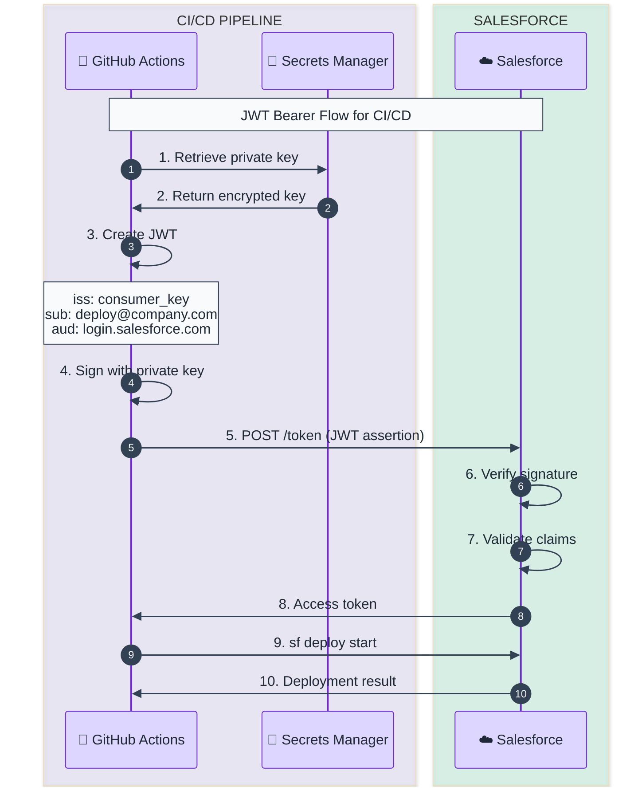
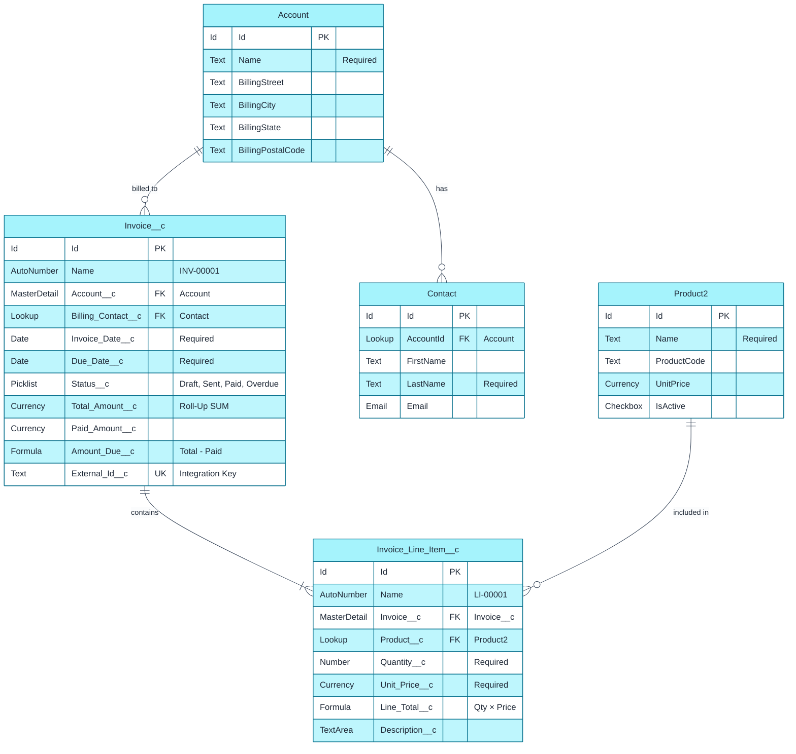
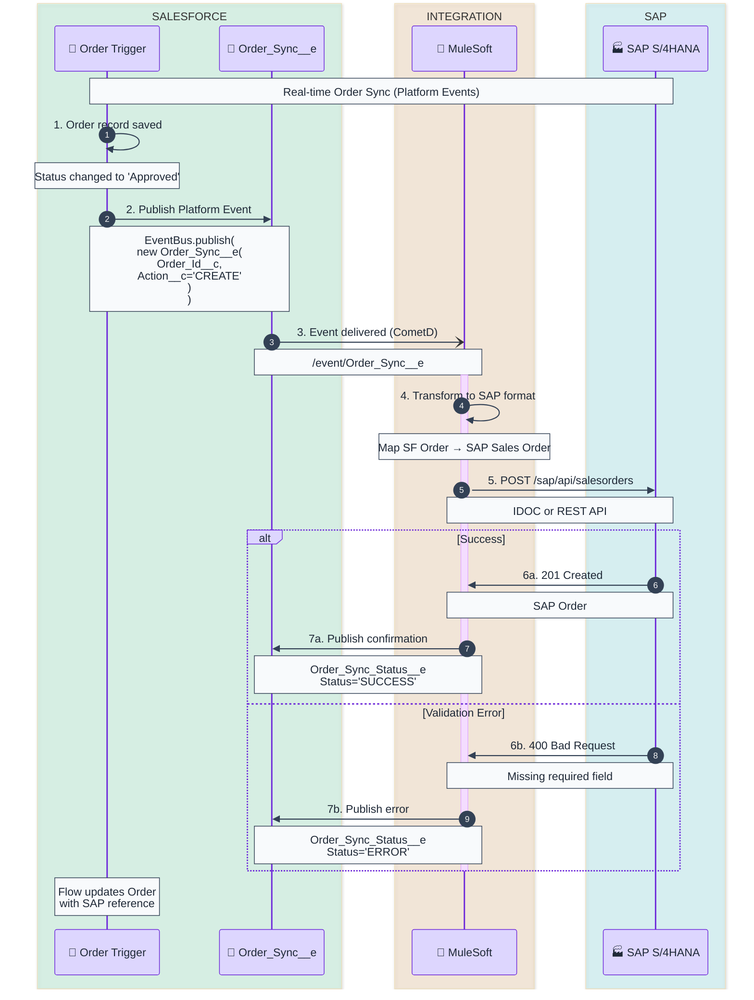

# sf-diagram Usage Examples

Real-world examples of using the sf-diagram skill.

---

## Example 1: OAuth Flow Diagram

### Request
```
"Create a JWT Bearer OAuth flow diagram for our CI/CD pipeline integration"
```

### Generated Output

#### Mermaid Diagram


#### ASCII Fallback
```
┌───────────────────────┐     ┌────────────────────┐
│   GitHub Actions      │     │     Salesforce     │
│   (Private Key)       │     │   (Certificate)    │
└───────────┬───────────┘     └─────────┬──────────┘
            │                           │
            │  1. Create JWT            │
            │  2. Sign with key         │
            │                           │
            │  3. POST /token           │
            │──────────────────────────>│
            │                           │
            │  4. Verify signature      │
            │  5. Return access_token   │
            │<──────────────────────────│
            │                           │
            │  6. sf deploy start       │
            │──────────────────────────>│
```

### Score
```
Score: 72/80 ⭐⭐⭐⭐⭐ Excellent
├─ Accuracy: 20/20     ✓ All JWT Bearer steps correct
├─ Clarity: 18/20      ✓ Clear labels, good flow
├─ Completeness: 14/15 ✓ Includes CI/CD context
├─ Styling: 12/15      ✓ Proper theming
└─ Best Practices: 8/10 ✓ Good annotations
```

---

## Example 2: Data Model ERD

### Request
```
"Create an ERD for our custom Invoice system with Invoice__c, Invoice_Line_Item__c, and relationships to Account and Product"
```

### Generated Output

#### Mermaid Diagram


#### ASCII Fallback
```
┌─────────────────────────┐       ┌─────────────────────────┐
│        ACCOUNT          │       │        CONTACT          │
├─────────────────────────┤       ├─────────────────────────┤
│ Id (PK)                 │       │ Id (PK)                 │
│ Name (Required)         │──┐    │ AccountId (FK) ─────────│───┐
│ BillingStreet           │  │    │ FirstName               │   │
│ BillingCity             │  │    │ LastName (Required)     │   │
│ BillingState            │  │    │ Email                   │   │
│ BillingPostalCode       │  │    └─────────────────────────┘   │
└─────────────────────────┘  │                                  │
              │               │                                  │
              │ 1:N           └──────────────────────────────────┘
              ▼
┌─────────────────────────┐
│      INVOICE__C         │
├─────────────────────────┤
│ Id (PK)                 │
│ Name (Auto: INV-00001)  │
│ Account__c (MD)         │
│ Billing_Contact__c (LK) │
│ Invoice_Date__c (Req)   │
│ Due_Date__c (Req)       │
│ Status__c (Picklist)    │
│ Total_Amount__c (Roll)  │
│ Amount_Due__c (Formula) │
│ External_Id__c (UK)     │
└─────────────┬───────────┘
              │
              │ 1:N (Master-Detail)
              ▼
┌─────────────────────────┐       ┌─────────────────────────┐
│  INVOICE_LINE_ITEM__C   │       │       PRODUCT2          │
├─────────────────────────┤       ├─────────────────────────┤
│ Id (PK)                 │       │ Id (PK)                 │
│ Name (Auto: LI-00001)   │       │ Name (Required)         │
│ Invoice__c (MD) ────────│──┘    │ ProductCode             │
│ Product__c (LK) ────────│──────>│ UnitPrice               │
│ Quantity__c (Req)       │       │ IsActive                │
│ Unit_Price__c (Req)     │       └─────────────────────────┘
│ Line_Total__c (Formula) │
│ Description__c          │
└─────────────────────────┘
```

### Score
```
Score: 74/80 ⭐⭐⭐⭐⭐ Excellent
├─ Accuracy: 20/20     ✓ All relationships correct
├─ Clarity: 19/20      ✓ Clear field annotations
├─ Completeness: 15/15 ✓ All objects included
├─ Styling: 13/15      ✓ Good layout
└─ Best Practices: 7/10  ⚠ Could add more field comments
```

---

## Example 3: Integration Sequence

### Request
```
"Diagram our real-time Order sync from Salesforce to SAP using Platform Events"
```

### Generated Output

#### Mermaid Diagram


### Score
```
Score: 70/80 ⭐⭐⭐⭐ Very Good
├─ Accuracy: 19/20     ✓ Platform Event pattern correct
├─ Clarity: 18/20      ✓ Good error handling shown
├─ Completeness: 13/15 ✓ Main paths covered
├─ Styling: 12/15      ✓ Good use of boxes
└─ Best Practices: 8/10 ✓ Shows async pattern
```

---

## Example 4: Combined Request

### Request
```
"I need to document our partner portal authentication.
Create: 1) The OAuth flow for partner login, 2) The data model showing Partner Account, Portal User, and Opportunities they can see"
```

### Generated Output

The skill generates two diagrams:

1. **OAuth Authorization Code + PKCE Flow** (for the portal)
2. **ERD showing Partner Access Model**

Both with Mermaid and ASCII versions.

---

## Tips for Best Results

1. **Be specific** - "JWT Bearer for CI/CD" is better than just "OAuth"
2. **Name your systems** - "Salesforce to SAP" produces clearer diagrams
3. **Mention custom objects** - Include `__c` suffix so we know they're custom
4. **Request both formats** - If you need ASCII fallback, mention it explicitly
