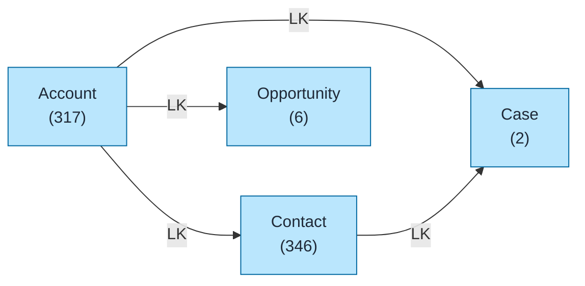
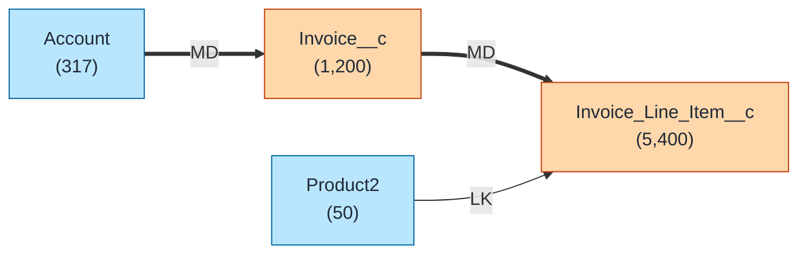
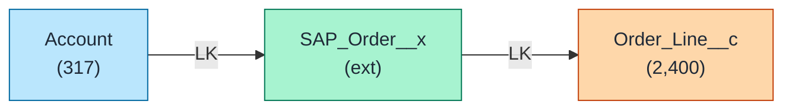
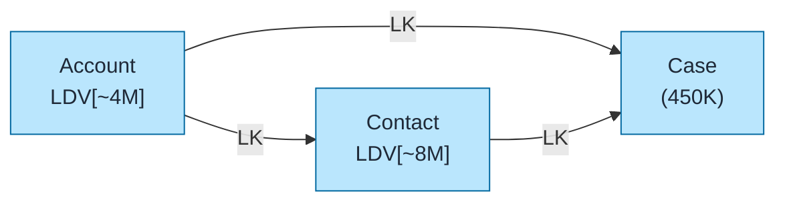

# Salesforce Data Model Template

Data model diagram template using `flowchart LR` for visualizing Salesforce object relationships with color coding, LDV markers, and relationship type labels.

## When to Use
- Documenting object relationships
- Planning data model changes
- Understanding existing schema
- Design reviews and architecture discussions

## Cloud-Specific Templates

For pre-built cloud diagrams, see:
- **[Sales Cloud ERD](sales-cloud-erd.md)** - Account, Contact, Opportunity, Lead, Product, Campaign
- **[Service Cloud ERD](service-cloud-erd.md)** - Case, Entitlement, Knowledge, ServiceContract

## Preferred Format: `flowchart LR`

Use `flowchart LR` (left-to-right) for data model diagrams. This format supports:
- Individual node color coding by object type
- Thick arrows (`==>`) for Master-Detail relationships
- Left-to-right flow for readability
- Simple object nodes (name + record count, no fields)

---

## Quick Reference

### Object Type Colors

| Type | Fill | Stroke | Example |
|------|------|--------|---------|
| Standard | `#bae6fd` | `#0369a1` | Account, Contact |
| Custom (`__c`) | `#fed7aa` | `#c2410c` | Invoice__c |
| External (`__x`) | `#a7f3d0` | `#047857` | SAP_Order__x |

### Relationship Arrows

| Arrow | Type | Meaning |
|-------|------|---------|
| `-->` | Lookup (LK) | Optional parent, no cascade delete |
| `==>` | Master-Detail (MD) | Required parent, cascade delete |
| `-.->` | Special | Conversion, indirect relationship |

### Metadata Annotations

| Annotation | When to Use |
|------------|-------------|
| `LDV[~4M]` | Record count >2M |
| `(317)` | Record count <2M |

---

## Query Org Metadata

Enrich diagrams with live org data:

```bash
python3 ~/.claude/plugins/marketplaces/sf-skills/sf-diagram-mermaid/scripts/query-org-metadata.py \
    --objects Account,Contact,Opportunity,Case \
    --target-org myorg
```

---

## Mermaid Template (Preferred)



---

## ASCII Fallback Template

```
┌─────────────────────────────────────────────────────────────────────────────┐
│  DATA MODEL (L→R)                                                           │
│  Legend: LK = Lookup (-->), MD = Master-Detail (==>)                        │
└─────────────────────────────────────────────────────────────────────────────┘

┌────────────────┐         ┌────────────────┐         ┌────────────────┐
│    ACCOUNT     │── LK ──>│    CONTACT     │── LK ──>│     CASE       │
│     (317)      │         │     (346)      │         │      (2)       │
└───────┬────────┘         └────────────────┘         └────────────────┘
        │
        │ LK
        ▼
┌────────────────┐
│  OPPORTUNITY   │
│      (6)       │
└────────────────┘
```

---

## Custom Object Example

Shows mixing Standard (blue) and Custom (orange) objects:



---

## External Object Example

Shows Standard, Custom, and External objects together:



---

## LDV (Large Data Volume) Example

Objects with >2M records show LDV indicator:



---

## Best Practices

1. **Use `flowchart LR`** - Left-to-right flow is easier to read
2. **Keep objects simple** - Show name + record count only (no fields)
3. **Color code by type** - Blue=Standard, Orange=Custom, Green=External
4. **Use correct arrows** - `-->` for Lookup, `==>` for Master-Detail
5. **Add LDV indicators** - For objects >2M records
6. **Use API names** - Show `Account` not "Accounts"

---

## ERD Conventions

See **[ERD Conventions](../../docs/erd-conventions.md)** for full documentation.
