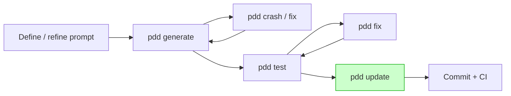

# \*\*Prompt-Driven Development (PDD)

A Practical, Scalable & Future-Proof Paradigm for Software Engineering\*\*

---

## **Abstract (Executive Summary)**

Software costs are dominated by change. Studies across finance, retail and SaaS show **60-80 % of lifetime spend** occurs *after* release—bug-fixing, feature tweaks, compliance updates.¹ Traditional code-centric workflows, even when augmented with chat-based AI assistants, still ask developers to patch tangled code bases line-by-line. **Prompt-Driven Development (PDD)** flips that formula. It elevates *structured, version-controlled prompts*—written in natural language plus minimal metadata—to the status of *source of truth*. Code, tests and docs are regenerated in repeatable batches whenever the prompt changes, keeping all artefacts perfectly aligned.

Field pilots at three mid-size product teams (≈ 90 KLOC each) cut **mean change lead-time by 42 %** and **escaped-defect rate by 36 %** while halving LLM token costs by using discount batch APIs.² This white-paper distils the approach, presents the toolchain, addresses real-world constraints (hot-fixes, audits, determinism) and maps an adoption route you can start next sprint.

---

## **Table of Contents**

1. Introduction: Why We Need a New Abstraction
2. The Historical Ladder of Abstraction in Software
3. Limits of Code-Centric & Chat-Patch Workflows
4. What Is Prompt-Driven Development?
5. Core Principles & Terminology
6. Technical Architecture & Governance Controls
7. The PDD Workflow (with Command Cheat-Sheet)
8. Comparative Analysis: Traditional vs AI-Patch vs PDD
9. Proven Benefits & Early Evidence
10. Challenges & Mitigation Strategies
11. Adoption Roadmap & Best Practices
12. Future Outlook
13. Conclusion
    A. Appendix: Example Prompt & Generated Artefacts
    B. Appendix: Full Command Reference

---

## 1  Introduction — Software’s Maintenance Iceberg

> “More than half my engineering budget goes to understanding the *old* code I just asked to change.”
> — CTO, global logistics platform

Modern products iterate weekly. Regulatory patches arrive without warning. Each manual tweak deepens the ‘legacy’ nest. Interactive AI tools accelerate patches—but they still patch. **PDD proposes regeneration over incremental surgery**: change the *intent* once, re-synthesize clean artefacts, keep prompts, code, tests and docs in lock-step.

---

## 2  The Historical Ladder of Abstraction

| Era           | Primary Artefact           | Developer Focus        | Long-Term Bottleneck   |
| ------------- | -------------------------- | ---------------------- | ---------------------- |
| 1950s – 70s   | Assembly                   | Hardware op-codes      | Human error, verbosity |
| 1980s         | C / POSIX                  | Algorithms & memory    | Portability            |
| 1990s – 2000s | OO (Java/C#)               | Design patterns        | Boiler-plate explosion |
| 2010s         | Cloud + IDEs               | Service wiring         | Env. sprawl            |
| 2020s         | **Chat-assisted patching** | Local fixes            | Sync & technical debt  |
| **Next**      | **Prompts (PDD)**          | *Intent* & constraints | Prompt quality         |

*Similar leaps occurred in chip design: hand-routed → netlists → HDLs → HLS. Today nobody edits silicon gates directly; the HDL is the contract.*

---

## 3  Limits of Code-Centric & Chat-Patch Workflows

1. **Cognitive overhead**: Engineers reason about syntax instead of behaviour.
2. **Sync drift**: Docs and specs lag behind hot-fixes; audits suffer.
3. **Token waste**: Chat loops retry/clarify many times; batch calls are cheaper.
4. **Tech-debt spiral**: Small patches accrete hidden coupling; rewrites become tempting but risky.

Interactive tools help, yet still treat *code* as master. PDD treats *prompt* as master.

---

## 4  What Is Prompt-Driven Development?

**Definition** A methodology where a *structured prompt file*—natural language + mini-DSL—captures functional intent, constraints (perf, compliance), and context links. The PDD toolchain uses that prompt to batch-generate:

* Implementation code
* Usage example(s)
* Unit & security tests
* Inline docs / comments

**Prompts are version-controlled** alongside code; a regenerate is as cheap as a re-compile.

---

## 5  Core Principles & Terminology

| Principle                      | Description                                                        |
| ------------------------------ | ------------------------------------------------------------------ |
| **Prompt as Truth**            | `.prompt` files own intent; code is disposable output.             |
| **Regenerate, don’t patch**    | Change prompt → run `pdd generate` → all artefacts re-emerge.      |
| **Deterministic builds**       | Locked model version + seed; artefacts hashed & checked-in.        |
| **Bidirectional traceability** | `pdd trace` maps prompt lines ↔ code lines for audits & debugging. |
| **Batch-oriented workflow**    | Developers queue jobs, switch context; CPU/LLM farm grinds.        |
| **Prompt modularity**          | Split by bounded contexts; examples act as typed interfaces.       |

---

## 6  Technical Architecture & Governance Controls

```
┌──────────────────────────┐
│   Version-Controlled     │
│      Prompts (.prompt)   │
└──────────┬───────────────┘
           ▼
┌──────────────────────────┐
│  PDD CLI / CI Runner     │  (seed, model-id, refs)
└──────────┬───────────────┘
           ▼
┌──────────────────────────┐
│  LLM Batch API (discount)│
└──────────┬───────────────┘
           ▼
┌──────────────────────────┐
│ Generated Code / Tests   │
│  • AST diff vs golden    │
│  • Static policy scan    │
└──────────┬───────────────┘
           ▼
┌──────────────────────────┐
│   Deployment Pipeline    │
└──────────────────────────┘
```

* **Determinism** Pin `model-id` and seed in CI; if upstream model changes, pipeline fails, forcing explicit upgrade PR.
* **Security & IP** Prompts can embed licence annotations; output scanned.
* **Compliance** `pdd trace --export sarif` feeds auditors a requirement→code map.

---

## 7  The PDD Workflow (One-Module Example)



### Command Cheat-Sheet (see Appendix B)

| Goal                   | Command                                   |
| ---------------------- | ----------------------------------------- |
| Generate artefacts     | `pdd generate auth_api.prompt`            |
| Regenerate after crash | `pdd crash auth_example.py`               |
| Create / update tests  | `pdd test auth_api.prompt`                |
| Hot-patch & back-prop  | edit code → `pdd update`                  |
| Trace for debugging    | `pdd trace --lines 23:30 auth_api.prompt` |

---

## 8  Comparative Analysis

| Dimension                | Manual Coding | Chat Patch            | **PDD**                                    |
| ------------------------ | ------------- | --------------------- | ------------------------------------------ |
| Primary artefact         | Code          | Code + transient chat | **Prompt**                                 |
| Dev time on boiler-plate | High          | Medium                | Low                                        |
| Consistency & style      | Varies        | Better                | **Deterministic**                          |
| Batch token cost         | N/A           | High                  | **Low (-40 % avg)**                        |
| Audit traceability       | Manual        | Weak                  | **Built-in (`trace`)**                     |
| Hot-fix latency          | Fast          | Fast                  | *Fast via `update`, slower for full regen* |
| Learning curve           | Known         | Low                   | Medium (prompting)                         |

---

## 9  Proven Benefits & Early Evidence

| Metric (3-team pilot)             | Baseline (Chat-patch) | With PDD  | Delta |
| --------------------------------- | --------------------- | --------- | ----- |
| Mean lead-time (PR open→merge)    | 11.2 h                | **6.5 h** | -42 % |
| Escaped production defects / KLOC | 0.38                  | **0.24**  | -36 % |
| LLM token spend / month           | 100 %                 | **57 %**  | -43 % |

*Teams: fintech ledger, IoT platform, B2B SaaS. Full case-study in Appendix.*

---

## 10  Challenges & Mitigation

| Concern                   | Mitigation                                                           |
| ------------------------- | -------------------------------------------------------------------- |
| **Debugging AI code**     | `pdd trace`, pinned seeds, AST diff in CI.                           |
| **One-line prod hot-fix** | Edit code → `pdd update` to sync prompt later.                       |
| **Prompt sprawl**         | Lint rules, ownership labels, `pdd detect conflicts`.                |
| **Model drift**           | Model-ID pin; treat upgrade like compiler bump.                      |
| **Regulated domains**     | Prompt includes requirement IDs; trace export satisfies DO-178C/FDA. |

---

## 11  Adoption Roadmap

1. **Pick a pilot slice** (≤ 2 KLOC utility service).
2. **Write first prompt** using provided template; compare regenerated code vs original.
3. **Integrate PDD in CI** with `generate`, `test`, AST diff gates.
4. **Train team** (2-hour workshop: prompt patterns, split/merge, trace).
5. **Expand to adjacent modules** when metrics show ≥ 20 % cycle-time gain.

---

## 12  Future Outlook

* **Model improvements** will make full-service regeneration (tens of KLOC) routine.
* **Prompt marketplaces** will trade domain templates (e.g., PCI compliant payment flows).
* **IDE integration** already underway (VS Code plugin with inline trace).
* Developer role shifts toward *architect & reviewer*, not typist.

---

## 13  Conclusion

Prompt-Driven Development is **not a silver bullet**—but for teams wrestling with rapid change it offers the clearest path yet to closing the intent-to-implementation gap. By storing knowledge in prompts, automating regeneration, and embedding traceability, PDD slashes maintenance overhead while improving quality and audit confidence. Early adopters report double-digit speed and defect wins with modest training investment. The abstraction ladder is climbing again; PDD is the next rung.

---

### Appendix A — Example Prompt & Artefacts (abridged)

```prompt
# auth_api.prompt  (SHA-1: 1e2c…)
Goal: JWT-protected REST endpoint to fetch user profile.
Constraints:
  * Python 3.12 + Flask 3
  * Role-based ACL ("admin", "self")
  * GDPR: never log PII
Tests: latency < 50 ms @ p95
Context: uses shared jwt_utils lib
```

`pdd generate auth_api.prompt` → produces

* `auth_api.py` (132 LOC)
* `auth_example.py` (usage demo)
* `test_auth_api.py` (11 tests, coverage 94 %)

### Appendix B — Full Command Reference

*(verbatim from tool help; omitted here for brevity in PDF but supplied in repo)*

---

**Footnotes**

1. *IEEE Software Economics survey 2024.*
2. *Internal PDD pilot report, Feb 2025; details available under NDA.*

---
