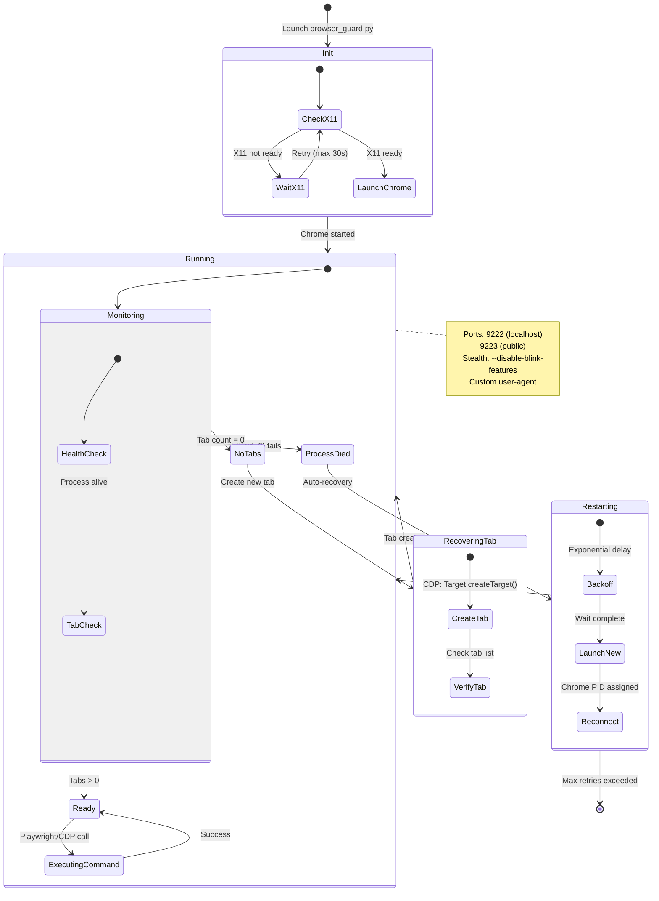

# The Browser Guard

At 1,178 lines, browser_guard.py is the largest Python module in the core infrastructure. It handles browser automation through a dual-implementation strategy: Playwright for high-level automation and Chrome DevTools Protocol for low-level control. The complexity reflects the challenges of modern browser automation—bot detection, stealth injection, persistent profiles, and failure recovery.

---

## The Dual Implementation

The module provides two distinct browser control classes. BrowserGuard uses Playwright's high-level API for standard automation tasks. BrowserCDPGuard uses direct WebSocket communication with Chrome's debugging protocol for scenarios that need lower-level control.

Why have both? Playwright is convenient but abstracts away browser internals. When you need direct access—to recover from an unresponsive context, to inject commands before page load, to manipulate windows at the CDP level—Playwright's abstraction becomes a limitation. CDP provides the escape hatch. It also serves as a fallback when Playwright encounters edge cases.

The trade-off is complexity. Maintaining two implementations means more code, more potential inconsistencies, and more surface area for bugs. But for an agent that needs reliable browser automation across varied conditions, the redundancy is probably worth it.



---

## Playwright Implementation

The Playwright-based BrowserGuard handles most automation work. On startup, it waits for the X11 display server to be ready (the container runs a virtual display), builds launch options including user agent and locale, and creates a persistent browser context pointing at `/app/data/chrome_data`.

```python
async def start(self) -> None:
    # 1. Wait for X11 display server
    await wait_for_display()

    # 2. Build launch options (user agent, locale, timezone)
    launch_options = self._build_launch_options()

    # 3. Launch persistent context with profile
    self.context = await self.browser_type.launch_persistent_context(
        user_data_dir="/app/data/chrome_data",
        **launch_options
    )

    # 4. Create initial page
    self.page = await self.context.new_page()
```

The launch options include anti-detection flags, container requirements, and performance tuning.

```python
launch_options = {
    "headless": False,  # GUI mode for screenshots
    "viewport": {"width": 1920, "height": 1080},
    "user_agent": self._build_user_agent(),
    "extra_http_headers": self._build_headers(),
    "locale": self.locale,
    "timezone_id": self.timezone,
    "args": [
        # Anti-detection
        "--disable-blink-features=AutomationControlled",
        "--disable-infobars",

        # Container requirements
        "--no-sandbox",
        "--disable-setuid-sandbox",

        # Performance
        "--disable-gpu",
        "--disable-dev-shm-usage",

        # Extensions
        "--load-extension=/app/pdf-viewer",

        # Logging
        f"--log-file=/app/logs/chromium.log",
        "--enable-logging",
    ]
}
```

The user agent is constructed dynamically to match a real Chrome installation.

```python
def _build_user_agent(self) -> str:
    base = "Mozilla/5.0 (X11; Linux x86_64) AppleWebKit/537.36"
    chrome_version = "120.0.0.0"
    safari_version = "537.36"
    return f"{base} (KHTML, like Gecko) Chrome/{chrome_version} Safari/{safari_version}"
```

Client Hints headers provide additional browser fingerprinting information.

```python
headers = {
    "sec-ch-ua": '"Not_A Brand";v="8", "Chromium";v="120"',
    "sec-ch-ua-mobile": "?0",
    "sec-ch-ua-platform": '"Linux"',
    "Accept-Language": self.locale,  # From CHROME_LOCALE env
}
```

---

## The Stealth Mystery

Lines 55-439 of browser_guard.py contain 384 lines of JavaScript stored in a variable called `stealth_js`. The variable name suggests browser stealth (anti-detection code to hide Playwright from bot detection). The actual content is Bitcoin stealth address cryptography from DarkWallet's 2014 library.

### What the Code Is

The JavaScript matches DarkWallet's stealth.js library exactly. The telltale signatures are all present: `Stealth.version = 42`, `Stealth.nonceVersion = 6` (the BIP byte 0x06), `Stealth.quirk = false` (a DarkWallet compatibility flag), and the distinctive `affineX.toBuffer().toJSON().data` pattern that's unique to DarkWallet's implementation.

The source repository is https://github.com/DarkWallet/stealth.js, described as "Stealth address support for bitcore" and dated 2014-2016. This is cryptocurrency privacy technology—it generates one-time payment addresses from a public "scan key" using ECDH (Elliptic Curve Diffie-Hellman) for key derivation. The purpose is to prevent address reuse on the Bitcoin blockchain.

### Why It Does Nothing

The code requires Node.js modules to function:

```javascript
var Bitcoin = require('./bitcoinjs-lib-wrapper');
var BigInteger = require('bigi');
var base58check = require('bs58check');
var Buffer = require('buffer').Buffer;
```

These packages aren't installed in the container. More fundamentally, `require()` is a Node.js function that doesn't exist in a browser context. The code gets injected into Chrome via Playwright's `add_init_script()`, where `require()` immediately throws a `ReferenceError`.

The injection is wrapped in error handling that swallows the failure:

```python
try:
    await page.add_init_script(stealth_js)
except:
    pass
```

The code fails silently. The browser launches normally. Nothing happens.

### The Circumstantial Evidence

Several details suggest this wasn't intentional. The variable name `stealth_js` implies browser stealth—code to hide automation from bot detection. This is a common need for tools like Playwright. The surrounding code and comments reference "stealth evasions" in the context of browser fingerprint resistance.

The actual content is cryptocurrency, not browser fingerprinting. These are completely unrelated domains. Bitcoin stealth addresses have nothing to do with hiding Playwright from Cloudflare.

There's also a `__LANGS__` placeholder in the file that appears to be from a different source entirely. It's never used by the Bitcoin code, suggesting content was merged from multiple places.

The silent failure handling means no one would notice this doesn't work. If you wrap something in `try/except: pass` and never log the exception, you won't know when it breaks.

### Possible Explanations

A few theories fit the evidence. A copy-paste error is plausible—someone searching for browser stealth code found a file called `stealth.js` and copied it without reading the content. "Stealth" appears in both browser anti-detection and Bitcoin privacy contexts; the terminology overlap could cause confusion.

A placeholder that was never replaced is another possibility. The variable was created as a placeholder for browser stealth code, something got pasted in temporarily, and the actual implementation never arrived.

Intentional but abandoned cryptocurrency functionality seems less likely given the complete mismatch between the code and its context.

### What We Know vs. What We Don't

The facts are clear: the code is from DarkWallet's stealth.js (2014-2016), it implements Bitcoin stealth addresses rather than browser anti-detection, it cannot execute due to missing dependencies and wrong runtime environment, it fails silently, it has no effect on browser operation, and it's not malware—there's no network access, no data exfiltration, and it fails immediately.

What we can't determine from the code alone: why it was added, whether the addition was intentional or accidental, when it was added, or who added it. The evidence points toward some kind of mistake, but that's inference rather than certainty.

---

## CDP Implementation

BrowserCDPGuard launches Chrome directly via subprocess and connects through the debugging port. This gives lower-level control: direct WebSocket commands, process lifecycle management, tab enumeration via HTTP endpoints.

```python
async def start(self) -> None:
    # Launch Chromium directly via subprocess
    self.process = subprocess.Popen(
        [chromium_path,
         "--remote-debugging-port=9222",
         "--user-data-dir=/app/data/chrome_data",
         ...],
        stdout=subprocess.PIPE,
        stderr=subprocess.PIPE
    )

    # Connect via CDP WebSocket
    self.ws = await self._connect_cdp()
```

CDP commands like `Browser.setWindowBounds` go through the WebSocket connection with timeout handling.

```python
async def maximize_window(self):
    await self._send_cdp_command(
        self.ws,
        "Browser.setWindowBounds",
        {
            "windowId": window_id,
            "bounds": {"windowState": "maximized"}
        },
        timeout=3.0
    )
```

Tab management uses HTTP endpoints.

```python
async def get_tabs(self) -> List[Dict]:
    response = await self._http_get("http://localhost:9222/json/list")
    return json.loads(response)
```

The CDP implementation runs a monitoring loop that checks process health and tab count.

```python
async def _monitor_browser(self):
    while self.running:
        # Check process health
        if self.process.poll() is not None:
            await self._restart_browser()

        # Check tab count
        tabs = await self.get_tabs()
        if len(tabs) == 0:
            await self._create_new_tab()

        await asyncio.sleep(self.check_interval)
```

If the browser crashes, it restarts automatically. If all tabs close, it creates a new one. This kind of self-healing behavior makes the agent more robust against unexpected failures.

---

## X11 Integration

The container runs a virtual X11 display (typically :99), and the module waits for it to be ready before launching Chrome. The `wait_for_display()` function polls the display server with a 60-second timeout, using python-xlib to test connectivity.

```python
async def wait_for_display(timeout: float = 60.0) -> bool:
    """Poll X11 display server until ready"""
    start = time.time()
    while time.time() - start < timeout:
        try:
            display = Xlib.display.Display()
            display.close()
            return True
        except:
            await asyncio.sleep(0.5)
    raise TimeoutError("X11 display not available")
```

The module also coordinates with pyautogui for GUI-level automation—screenshots, mouse clicks, keyboard input. This works through the same X11 display, allowing the agent to interact with browser content that can't be automated through Playwright or CDP.

---

## Security Considerations

Chrome runs with `--no-sandbox`, which disables process sandboxing. This is required for container environments where Chrome's sandbox conflicts with container security features—you're trading browser-level sandboxing for container-level sandboxing.

The persistent profile at `/app/data/chrome_data` accumulates sensitive data: cookies, session tokens, browsing history, autofill information. In a multi-tenant deployment, this would need isolation per user session.

The PDF viewer extension at `/app/pdf-viewer` is a separate Chrome extension (not part of the PDF skill). It uses Mozilla's PDF.js library to render PDFs in the browser. The extension has broad host permissions (`<all_urls>`) which would be a security concern in a standard browser context but is acceptable in this isolated container environment.

---

## Failure Recovery

The module handles several failure modes. Process death triggers auto-restart with exponential backoff. All tabs closing triggers new tab creation. Unresponsive commands trigger context restart. CDP disconnections trigger reconnection and reinitialization.

This resilience matters for an agent that might run hundreds of browser interactions in a session. Without self-healing, any failure would require manual intervention. With it, the agent can often recover transparently and continue working.
