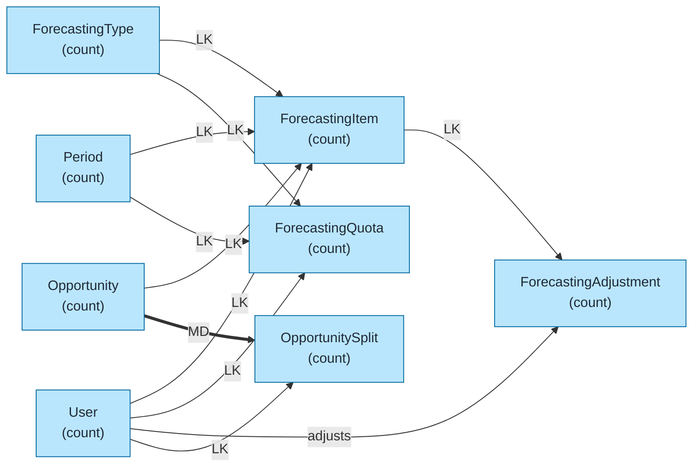
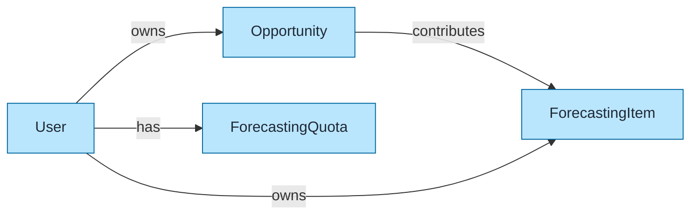
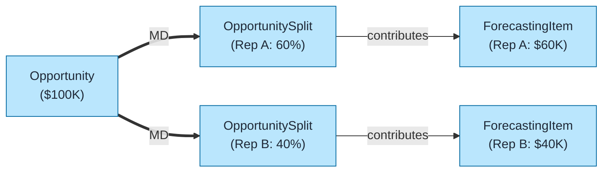

# Forecasting Data Model Template

Pre-built data model for Salesforce Collaborative Forecasts using `flowchart LR` format with color coding and relationship indicators.

## Objects Included

| Object | Type | Description |
|--------|------|-------------|
| ForecastingType | STD | Forecast configuration |
| ForecastingItem | STD | Individual forecasts |
| ForecastingQuota | STD | User quotas |
| ForecastingAdjustment | STD | Manager adjustments |
| Opportunity | STD | Source opportunities |
| OpportunitySplit | STD | Revenue splits |
| User | STD | Forecast owners |

---

## Query Org Metadata (Recommended)

Enrich diagram with live org data:

```bash
python3 ~/.claude/plugins/marketplaces/sf-skills/sf-diagram-mermaid/scripts/query-org-metadata.py \
    --objects ForecastingItem,ForecastingQuota,Opportunity,OpportunitySplit \
    --target-org myorg
```

---

## Mermaid Template (Preferred)

Left-to-right flowchart with color coding.



---

## Key Concepts

### Forecasting Types
| Type | Source Field | Description |
|------|--------------|-------------|
| **Opportunity Revenue** | Amount | Standard opportunity forecasting |
| **Opportunity Quantity** | Quantity | Unit-based forecasting |
| **Product Family** | Product2.Family | By product category |
| **Opportunity Splits** | Split Amount | Team selling |
| **Custom Measure** | Custom field | Custom currency/number |

### Forecast Categories
| Category | Stage Mapping |
|----------|---------------|
| Pipeline | Early stages |
| Best Case | High probability |
| Commit | Committed deals |
| Closed | Won deals |
| Omitted | Excluded from forecast |

### Forecast Rollup Hierarchy
```
CEO
 └── VP Sales
      ├── Regional Manager 1
      │    ├── Sales Rep A
      │    └── Sales Rep B
      └── Regional Manager 2
           └── Sales Rep C
```

Forecasts roll up through **Role Hierarchy** or **Forecast Hierarchy**.

---

## Simplified Version (Core Objects Only)

For presentations focusing on core forecast flow:



---

## Opportunity Splits Model

For team selling with revenue splits:



---

## ASCII Fallback

```
┌─────────────────────────────────────────────────────────────────────────────┐
│  COLLABORATIVE FORECASTS DATA MODEL (L→R)                                    │
│  Legend: LK = Lookup (-->), MD = Master-Detail (==>)                        │
└─────────────────────────────────────────────────────────────────────────────┘

┌──────────────────┐
│ FORECASTING_TYPE │─────── LK ──────┬──────────────────────────────────┐
│     (count)      │                 │                                  │
└──────────────────┘                 ▼                                  ▼
                          ┌──────────────────┐              ┌──────────────────┐
                          │ FORECASTING_ITEM │              │FORECASTING_QUOTA │
                          │     (count)      │              │     (count)      │
                          └────────┬─────────┘              └────────┬─────────┘
                                   │                                 │
                                   │ LK                              │ LK
                                   ▼                                 ▼
┌──────────────┐         ┌──────────────────┐              ┌──────────────────┐
│ OPPORTUNITY  │── LK ──>│                  │              │      USER        │
│   (count)    │         │                  │<──── LK ─────│     (count)      │
└──────┬───────┘         └──────────────────┘              └──────────────────┘
       │
       │ MD
       ▼
┌──────────────────┐
│ OPPORTUNITY_SPLIT│
│     (count)      │
└──────────────────┘
```

---

## Key Relationships Summary

| Parent | Child | Type | Behavior |
|--------|-------|------|----------|
| ForecastingType | ForecastingItem | LK | Type configuration |
| ForecastingType | ForecastingQuota | LK | Type configuration |
| User | ForecastingItem | LK | Forecast owner |
| User | ForecastingQuota | LK | Quota owner |
| Period | ForecastingItem | LK | Time period |
| Period | ForecastingQuota | LK | Time period |
| Opportunity | ForecastingItem | LK | Source opportunity |
| Opportunity | OpportunitySplit | MD | Cascade delete |
| User | OpportunitySplit | LK | Split owner |

---

## Limits & Considerations

| Limit | Value |
|-------|-------|
| Forecasting types | 4 (standard) + 4 (custom) |
| Forecast hierarchy levels | Role hierarchy depth |
| Splits per opportunity | Unlimited |
| Quota periods | Fiscal periods |
| Adjustment history | 12 months |

---

## Forecast Hierarchy vs Role Hierarchy

| Option | Use Case |
|--------|----------|
| **Role Hierarchy** | Forecasts follow org chart |
| **Forecast Hierarchy** | Custom forecast rollup path |
| **Territory Hierarchy** | Territory-based forecasting |

---

## Best Practices

1. **Use `flowchart LR`** - Left-to-right flow for readability
2. **Keep objects simple** - Name + record count only
3. **Replace `(count)` placeholders** - With actual counts from query
4. **Add LDV indicator** - For objects >2M records: `LDV[~4M]`
5. **Color code object types** - Blue=Standard, Orange=Custom, Green=External
