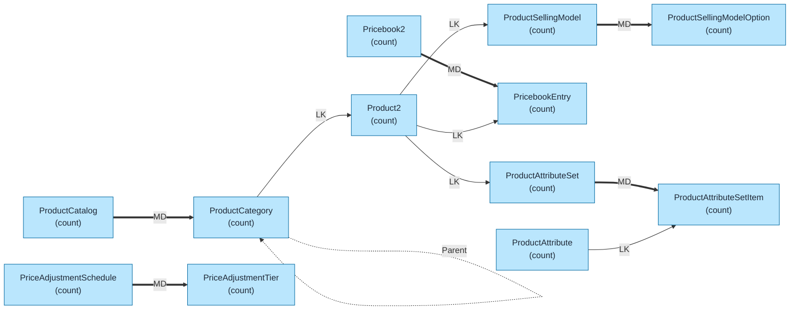
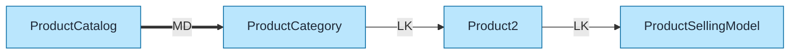
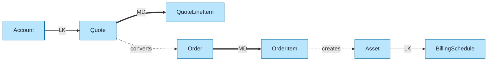
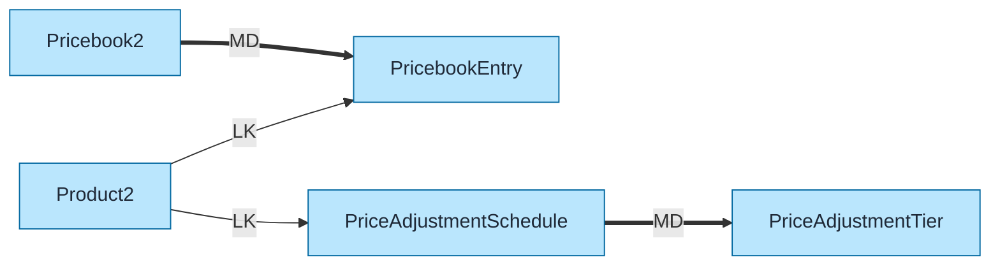
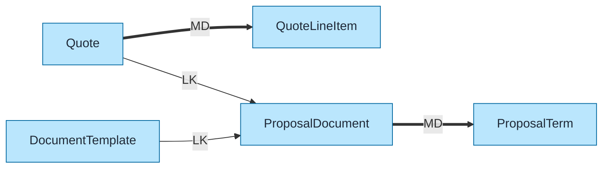

# Revenue Cloud Data Model Template

Pre-built data model for Salesforce Revenue Cloud (CPQ, Billing, Subscription Management) using `flowchart LR` format with color coding and relationship indicators.

## Objects Included

| Object | Type | Description |
|--------|------|-------------|
| ProductCatalog | STD | Product catalogs |
| ProductCategory | STD | Category hierarchy |
| ProductSellingModel | STD | Selling configurations |
| ProductSellingModelOption | STD | Model options |
| PriceAdjustmentSchedule | STD | Discount schedules |
| PriceAdjustmentTier | STD | Discount tiers |
| ProductAttribute | STD | Product attributes |
| ProductAttributeSet | STD | Attribute groupings |

---

## Query Org Metadata (Recommended)

Enrich diagram with live org data:

```bash
python3 ~/.claude/plugins/marketplaces/sf-skills/sf-diagram-mermaid/scripts/query-org-metadata.py \
    --objects ProductCatalog,ProductCategory,ProductSellingModel,PriceAdjustmentSchedule \
    --target-org myorg
```

---

## Mermaid Template (Preferred)

Left-to-right flowchart with color coding.



---

## Key Concepts

### Revenue Cloud Components
| Component | Purpose |
|-----------|---------|
| **Industries CPQ** | Configure-Price-Quote |
| **Subscription Management** | Recurring billing |
| **Revenue Lifecycle** | Rev rec, forecasting |
| **Dynamic Revenue Orchestration** | Guided selling |

### Product Hierarchy
```
ProductCatalog
    └── ProductCategory (Hierarchy)
            └── Product2
                    ├── ProductSellingModel
                    ├── ProductAttribute
                    └── PricebookEntry
```

### Selling Model Types
| Type | Description |
|------|-------------|
| One-Time | Single purchase |
| Subscription | Recurring billing |
| Usage-Based | Consumption pricing |
| Evergreen | Auto-renewing |
| Term | Fixed duration |

### Price Adjustment Schedules
| Schedule Type | Use Case |
|---------------|----------|
| Volume Discount | Quantity-based tiers |
| Contract Discount | Agreement discounts |
| Promotional | Time-limited offers |
| Bundled | Package pricing |

---

## Simplified Version (Core Objects Only)

For presentations focusing on core revenue structure:



---

## Subscription Management Model



---

## Pricing Model Detail



---

## Industries CPQ Objects



---

## ASCII Fallback

```
┌─────────────────────────────────────────────────────────────────────────────┐
│  REVENUE CLOUD DATA MODEL (L→R)                                              │
│  Legend: LK = Lookup (-->), MD = Master-Detail (==>)                        │
└─────────────────────────────────────────────────────────────────────────────┘

                           PRODUCT CATALOG
┌──────────────────┐         ┌──────────────────┐
│ PRODUCT_CATALOG  │═══ MD ═>│ PRODUCT_CATEGORY │◄──── Parent (self)
│     (count)      │         │     (count)      │
└──────────────────┘         └────────┬─────────┘
                                      │ LK
                                      ▼
                             ┌──────────────────┐
                             │     PRODUCT2     │
                             │     (count)      │
                             └────────┬─────────┘
                                      │
                    ┌─────────────────┼─────────────────┐
                    │ LK              │ LK              │ LK
                    ▼                 ▼                 ▼
         ┌──────────────────┐ ┌─────────────┐ ┌──────────────────┐
         │PRODUCT_SELLING_  │ │PRICEBOOK_   │ │PRODUCT_ATTRIBUTE │
         │MODEL (count)     │ │ENTRY(count) │ │_SET (count)      │
         └────────┬─────────┘ └─────────────┘ └────────┬─────────┘
                  │ MD                                 │ MD
                  ▼                                    ▼
         ┌──────────────────┐                ┌──────────────────┐
         │PRODUCT_SELLING_  │                │PRODUCT_ATTRIBUTE_│
         │MODEL_OPTION      │                │SET_ITEM (count)  │
         │    (count)       │                └────────┬─────────┘
         └──────────────────┘                         │ LK
                                                      ▼
                                             ┌──────────────────┐
                                             │PRODUCT_ATTRIBUTE │
                                             │     (count)      │
                                             └──────────────────┘

                           PRICE ADJUSTMENTS
┌────────────────────────┐         ┌──────────────────────────┐
│PRICE_ADJUSTMENT_       │═══ MD ═>│PRICE_ADJUSTMENT_TIER     │
│SCHEDULE (count)        │         │        (count)           │
└────────────────────────┘         └──────────────────────────┘
```

---

## Key Relationships Summary

| Parent | Child | Type | Behavior |
|--------|-------|------|----------|
| ProductCatalog | ProductCategory | MD | Cascade delete |
| ProductCategory | ProductCategory | LK | Parent (hierarchy) |
| ProductCategory | Product2 | LK | Product classification |
| Product2 | ProductSellingModel | LK | Selling configuration |
| ProductSellingModel | ProductSellingModelOption | MD | Model options |
| PriceAdjustmentSchedule | PriceAdjustmentTier | MD | Discount tiers |
| Pricebook2 | PricebookEntry | MD | Product prices |
| Product2 | PricebookEntry | LK | Product reference |
| ProductAttributeSet | ProductAttributeSetItem | MD | Attribute membership |
| ProductAttribute | ProductAttributeSetItem | LK | Attribute reference |

---

## Limits & Considerations

| Limit | Value |
|-------|-------|
| Product categories depth | 10 levels |
| Products per catalog | Unlimited (LDV) |
| Selling models per product | Multiple |
| Discount tiers per schedule | Unlimited |
| Attributes per product | Unlimited |
| Pricebooks per org | Unlimited |

---

## Revenue Cloud vs Salesforce CPQ

| Feature | Revenue Cloud | Salesforce CPQ |
|---------|---------------|----------------|
| Platform | Industries | Core |
| Bundles | Dynamic | Static |
| Attributes | Dynamic | Limited |
| Selling Models | Native | Custom |
| Subscription | Native | Requires add-on |
| Target | Industry-specific | General |

---

## Best Practices

1. **Use `flowchart LR`** - Left-to-right flow for readability
2. **Keep objects simple** - Name + record count only
3. **Replace `(count)` placeholders** - With actual counts from query
4. **Add LDV indicator** - For objects >2M records: `LDV[~4M]`
5. **Color code object types** - Blue=Standard, Orange=Custom, Green=External
