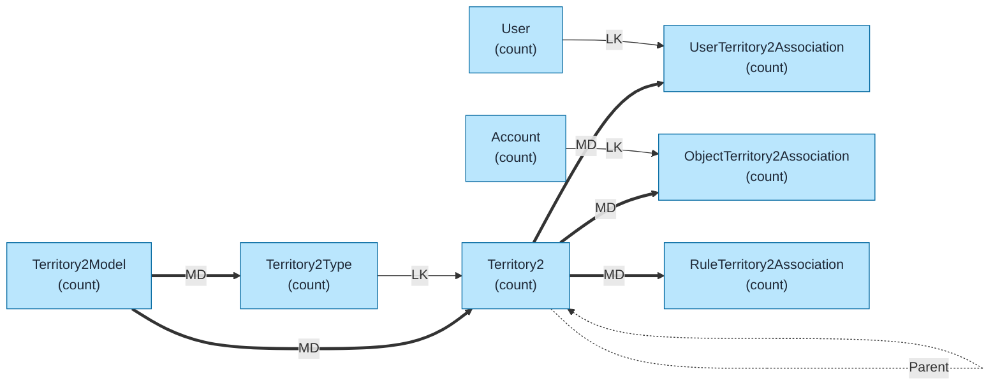
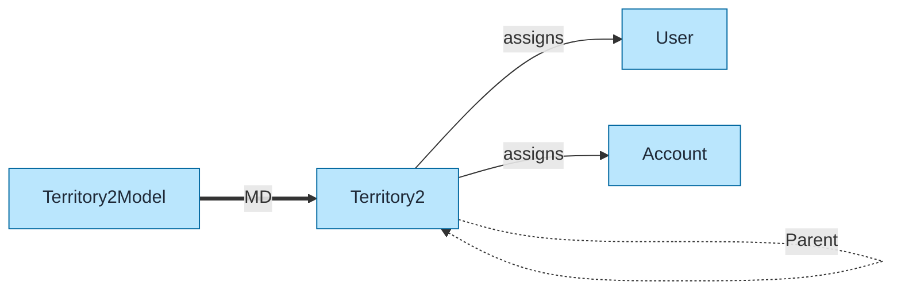
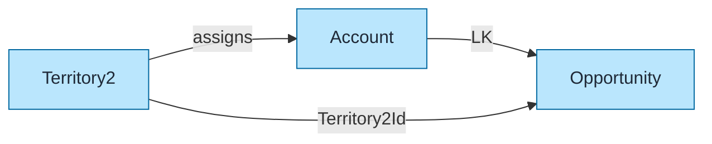

# Territory Management Data Model Template

Pre-built data model for Salesforce Enterprise Territory Management (Territory2) using `flowchart LR` format with color coding and relationship indicators.

## Objects Included

| Object | Type | Description |
|--------|------|-------------|
| Territory2Model | STD | Territory model container |
| Territory2 | STD | Individual territories |
| Territory2Type | STD | Territory classification |
| UserTerritory2Association | STD | User-to-territory assignments |
| ObjectTerritory2Association | STD | Account-to-territory assignments |
| RuleTerritory2Association | STD | Assignment rule linkage |

---

## Query Org Metadata (Recommended)

Enrich diagram with live org data:

```bash
python3 ~/.claude/plugins/marketplaces/sf-skills/sf-diagram-mermaid/scripts/query-org-metadata.py \
    --objects Territory2Model,Territory2,Territory2Type,UserTerritory2Association,ObjectTerritory2Association \
    --target-org myorg
```

---

## Mermaid Template (Preferred)

Left-to-right flowchart with color coding.



---

## Key Concepts

### Territory2Model States
| State | Description |
|-------|-------------|
| **Planning** | Model being configured (not active) |
| **Active** | Live model in use |
| **Archived** | Historical model (read-only) |

Only **one model can be Active** at a time.

### Territory Hierarchy
- Territories support **ParentTerritory2Id** self-lookup
- Creates hierarchy within a model
- Opportunity access rolls up through hierarchy

### Assignment Types
| Object | Purpose |
|--------|---------|
| **UserTerritory2Association** | Assigns users to territories |
| **ObjectTerritory2Association** | Assigns accounts to territories |
| **RuleTerritory2Association** | Links assignment rules to territories |

---

## Simplified Version (Core Objects Only)

For presentations focusing on core territory structure:



---

## Opportunity Territory Assignment

Territory Management also affects Opportunities:



---

## ASCII Fallback

```
┌─────────────────────────────────────────────────────────────────────────────┐
│  ENTERPRISE TERRITORY MANAGEMENT DATA MODEL (L→R)                           │
│  Legend: LK = Lookup (-->), MD = Master-Detail (==>)                        │
└─────────────────────────────────────────────────────────────────────────────┘

┌──────────────────┐         ┌──────────────────┐
│ TERRITORY2_MODEL │═══ MD ═>│   TERRITORY2     │◄──── Parent (self)
│     (count)      │         │     (count)      │
└────────┬─────────┘         └────────┬─────────┘
         │                            │
         │ MD                         ├─── MD ──>┌────────────────────────┐
         ▼                            │          │ USER_TERRITORY2_ASSOC  │
┌──────────────────┐                  │          │       (count)          │
│ TERRITORY2_TYPE  │── LK ───────────>┤          └───────────┬────────────┘
│     (count)      │                  │                      │ LK
└──────────────────┘                  │                      ▼
                                      │          ┌────────────────────────┐
                                      │          │         USER           │
                                      │          │       (count)          │
                                      │          └────────────────────────┘
                                      │
                                      ├─── MD ──>┌────────────────────────┐
                                      │          │ OBJECT_TERRITORY2_ASSOC│
                                      │          │       (count)          │
                                      │          └───────────┬────────────┘
                                      │                      │ LK
                                      │                      ▼
                                      │          ┌────────────────────────┐
                                      │          │       ACCOUNT          │
                                      │          │       (count)          │
                                      │          └────────────────────────┘
                                      │
                                      └─── MD ──>┌────────────────────────┐
                                                 │ RULE_TERRITORY2_ASSOC  │
                                                 │       (count)          │
                                                 └────────────────────────┘
```

---

## Key Relationships Summary

| Parent | Child | Type | Behavior |
|--------|-------|------|----------|
| Territory2Model | Territory2 | MD | Cascade delete |
| Territory2Model | Territory2Type | MD | Cascade delete |
| Territory2Type | Territory2 | LK | Type classification |
| Territory2 | Territory2 | LK | Parent (hierarchy) |
| Territory2 | UserTerritory2Association | MD | Cascade delete |
| Territory2 | ObjectTerritory2Association | MD | Cascade delete |
| Territory2 | RuleTerritory2Association | MD | Cascade delete |
| User | UserTerritory2Association | LK | User assignment |
| Account | ObjectTerritory2Association | LK | Account assignment |

---

## Limits & Considerations

| Limit | Value |
|-------|-------|
| Territory models (total) | Unlimited (1 active) |
| Territories per model | 1,000 |
| Territory hierarchy levels | 10 |
| Users per territory | No hard limit |
| Accounts per territory | No hard limit |
| Assignment rules | 15 per model |

---

## Best Practices

1. **Use `flowchart LR`** - Left-to-right flow for readability
2. **Keep objects simple** - Name + record count only
3. **Replace `(count)` placeholders** - With actual counts from query
4. **Add LDV indicator** - For objects >2M records: `LDV[~4M]`
5. **Color code object types** - Blue=Standard, Orange=Custom, Green=External
