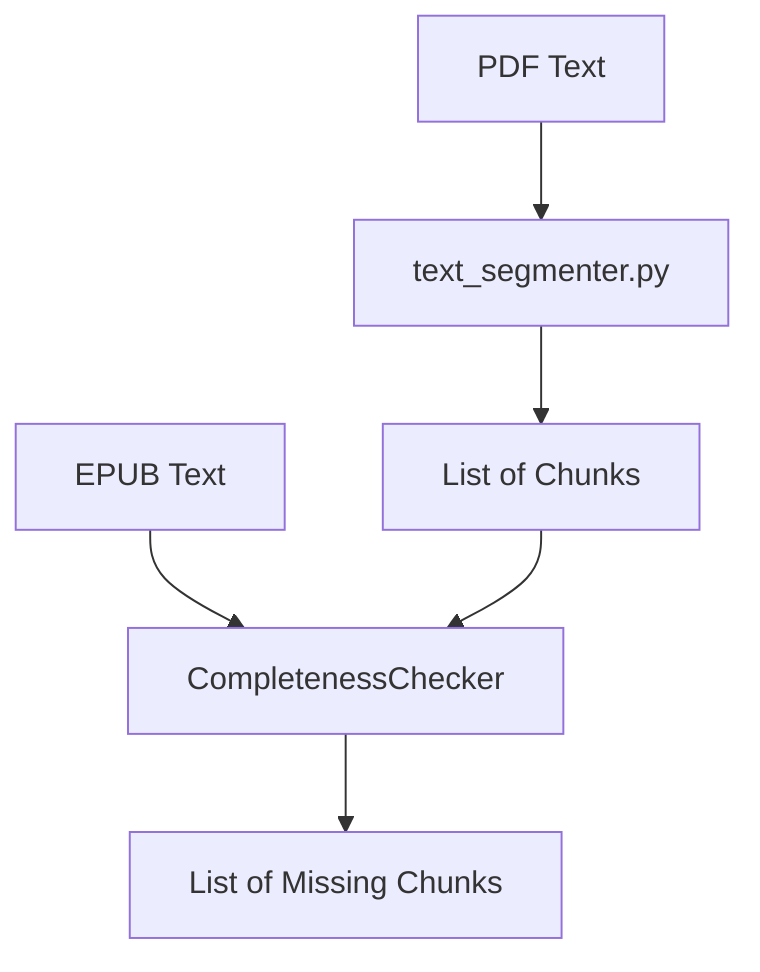

# System Design & Architecture

## Architecture Overview
**What is the high-level system structure?**

The `CompletenessChecker` takes two strings (source and target), segments the source, and searches for each segment in the target.

## Data Models
**What data do we need to manage?**

- **ValidationResult:** Dataclass containing a list of `ValidationFailure` objects and a score.
- **ValidationFailure:** Dataclass with the missing `Chunk` and suggested location (if partial match found).

## API Design
**How do components communicate?**

### Primary Interface
- `class CompletenessChecker`:
    - `__init__(source_text: str, target_text: str)`
    - `check(chunk_size: int, overlap: int) -> ValidationResult`

## Component Breakdown
**What are the major building blocks?**

- **Segmenter Hub:** Utilizes `segment_text` to prepare the source.
- **Search Engine:** Performs efficient substring lookups. To optimize, the engine uses a **sliding search cursor**: searching for the next chunk starts near the position of the previous match, significantly reducing scan surface.
- **Noise Filter:** A post-processing step that filters out missing chunks that are shorter than a specific threshold or consist only of numbers.

## Design Decisions
**Why did we choose this approach?**

- **Sliding Window:** Essential because a loss of text might start in the middle of a fixed block. Overlap ensures we catch mismatches at boundaries.
- **Simple Substring Search:** Before using complex Diff algorithms, simple searching is faster and more precise for "completeness" checks.

## Non-Functional Requirements
**How should the system perform?**

- **Accuracy:** Zero false positives for identical texts.
- **Execution Time:** Under 1 second for a 100,000-character text check.
