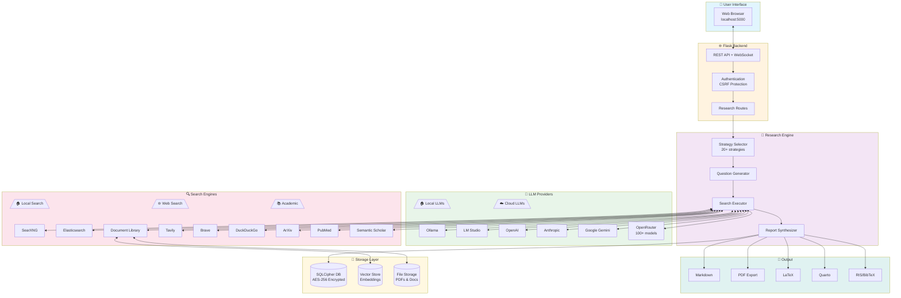
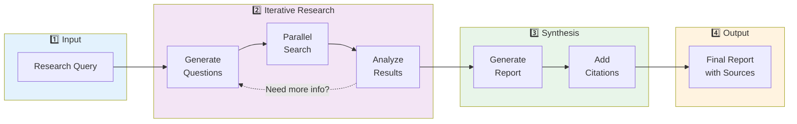
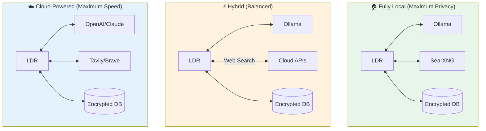
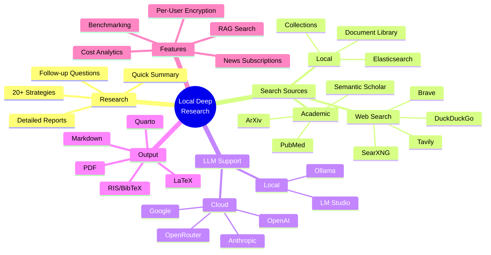
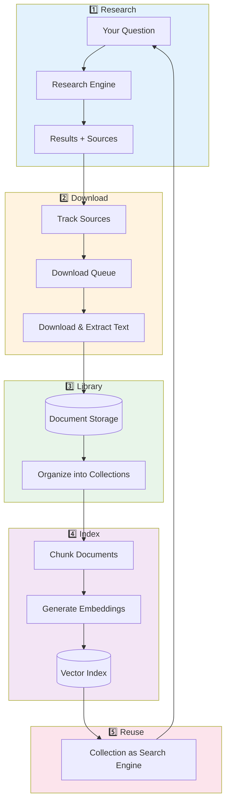
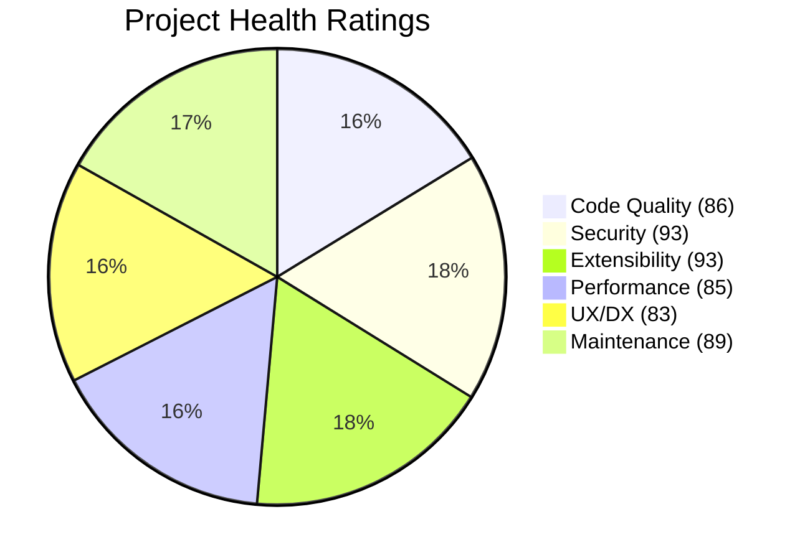
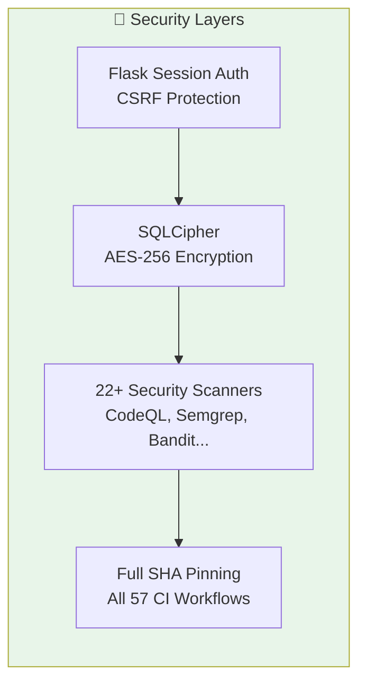

# Architecture Overview

This document provides detailed technical diagrams of Local Deep Research's architecture.

## System Architecture



## Research Flow



## Deployment Options



## Feature Map



## Component Details

### LLM Providers

| Provider | Type | Description |
|----------|------|-------------|
| Ollama | Local | Self-hosted open-source models |
| LM Studio | Local | Desktop app for local models |
| OpenAI | Cloud | GPT-4, GPT-3.5 |
| Anthropic | Cloud | Claude 3 family |
| Google | Cloud | Gemini models |
| OpenRouter | Cloud | 100+ models via single API |

### Search Engines

| Engine | Type | Best For |
|--------|------|----------|
| SearXNG | Local/Self-hosted | Privacy, aggregated results |
| Tavily | Cloud | AI-optimized search |
| ArXiv | Academic | Physics, CS, Math papers |
| PubMed | Academic | Biomedical research |
| Semantic Scholar | Academic | Cross-discipline papers |
| Wikipedia | Knowledge | General knowledge |
| Your Documents | Local | Private document search |

### Output Formats

| Format | Use Case |
|--------|----------|
| Markdown | Default, web display |
| PDF | Sharing, printing |
| LaTeX | Academic papers |
| Quarto | Reproducible documents |
| RIS/BibTeX | Reference managers |

## Knowledge Loop: Research → Library → Future Research

One of LDR's powerful features is the ability to build a personal knowledge base that improves future research.



### How It Works

1. **Research Completes** → Sources are tracked in `ResearchResource` table
2. **Download Sources** → Click "Get All Research PDFs" to queue downloads
   - Smart downloaders for ArXiv, PubMed, Semantic Scholar, etc.
   - Automatic text extraction from PDFs
3. **Build Library** → Documents stored in encrypted database
   - Deduplication via content hash
   - Multiple storage modes: database (encrypted), filesystem, text-only
4. **Create Collections** → Organize documents by topic/project
   - Each collection can have different embedding settings
   - Documents can belong to multiple collections
5. **Index for Search** → Generate vector embeddings
   - Configurable chunk size and overlap
   - FAISS index for fast similarity search
6. **Use in Future Research** → Select collection as search engine
   - RAG search finds relevant passages
   - Results cite back to your documents

### Key Components

| Component | Purpose |
|-----------|---------|
| `DownloadService` | Manages PDF downloads with source-specific strategies |
| `LibraryService` | Queries and manages document library |
| `LibraryRAGService` | Creates vector indices for semantic search |
| `CollectionSearchEngine` | Searches collections using RAG |
| `Document` | Stores text content, metadata, file references |
| `DocumentChunk` | Stores indexed text chunks with embeddings |
| `Collection` | Groups documents with shared embedding settings |

### Storage Options

| Mode | Security | Use Case |
|------|----------|----------|
| Database | AES-256 encrypted | Default, maximum security |
| Filesystem | Unencrypted | Need external tool access |
| Text Only | Encrypted text, no PDFs | Minimal storage |

---

## Technical Analysis & Project Health

*Last updated: December 2024*

This section provides a comprehensive technical analysis of the codebase, including quality metrics, architecture patterns, and project health indicators.

### Project Statistics

| Metric | Count |
|--------|-------|
| Test Classes | 809+ |
| Search Engine Implementations | 25 |
| LLM Provider Implementations | 9 |
| Search Strategies | 20+ |
| Abstract Base Classes | 26 |
| CI/CD Workflows | 57 |
| Security Scanners in CI | 22+ |
| Core Dependencies | 63 |

### Architecture Patterns

#### Extensibility Design

The codebase follows a consistent pattern for extensibility:

```
┌─────────────────────────────────────────────────────────────┐
│                    Abstract Base Classes                     │
├─────────────────────────────────────────────────────────────┤
│ BaseSearchEngine      │ Common interface for 25+ engines    │
│ BaseSearchStrategy    │ Strategy pattern for research       │
│ BaseCitationHandler   │ Citation processing abstraction     │
│ BaseQuestionGenerator │ Question generation interface       │
│ BaseExporter          │ Export format abstraction           │
└─────────────────────────────────────────────────────────────┘
```

#### Search Engine Plugin System

New search engines can be added by:
1. Creating a class inheriting from `BaseSearchEngine`
2. Placing it in `web_search_engines/engines/`
3. Auto-discovery handles registration

```python
# Example: Adding a new search engine
class SearchEngineCustom(BaseSearchEngine):
    def run(self, query: str) -> List[Dict]:
        # Implementation
        pass
```

#### LLM Provider Integration

Supports 9 LLM providers with auto-discovery:
- Ollama (local)
- LM Studio (local)
- OpenAI
- Anthropic
- Google Gemini
- OpenRouter (100+ models)
- DeepSeek
- Mistral
- Groq

### Quality Ratings



#### Detailed Ratings

| Category | Score | Highlights |
|----------|-------|------------|
| **Code Quality** | 86/100 | 809+ test classes, ruff/mypy enforcement, comprehensive pre-commit hooks |
| **Security** | 93/100 | SQLCipher AES-256 encryption, full SHA pinning in CI, 22+ security scanners |
| **Extensibility** | 93/100 | 26 abstract base classes, plugin architecture, strategy pattern throughout |
| **Performance** | 85/100 | Adaptive rate limiting, cache stampede protection, parallel search execution |
| **UX/Developer Experience** | 83/100 | Real-time WebSocket updates, in-tool documentation, comprehensive error handling |
| **Maintenance** | 89/100 | 57 CI/CD workflows, automated security scanning, structured changelog |
| **Overall** | 88/100 | Production-ready with excellent security and extensibility |

### Security Architecture



**Security Features:**
- Per-user encrypted databases (SQLCipher with AES-256)
- Full GitHub Action SHA pinning (not tag-based)
- Comprehensive CI security scanning:
  - CodeQL (Python, JavaScript)
  - Semgrep (custom rulesets)
  - Bandit (Python security)
  - Trivy (container scanning)
  - Dependency review
  - Secret scanning

### Performance Optimizations

| Feature | Implementation |
|---------|----------------|
| **Parallel Search** | `concurrent.futures.ThreadPoolExecutor` for multi-question search |
| **Rate Limiting** | Adaptive system with `learning_rate=0.3` |
| **Cache Protection** | `fetch_events` + `fetch_locks` for stampede prevention |
| **Progress Streaming** | SocketIO for real-time UI updates |
| **Cross-Engine Filtering** | LLM-powered relevance scoring and deduplication |

### Areas for Improvement

While the project scores highly overall, these areas have room for growth:

1. **Integration Testing** - More end-to-end tests for full research workflows
2. **API Documentation** - OpenAPI/Swagger spec for REST endpoints
3. **Metrics Dashboard** - Prometheus/Grafana integration for monitoring
4. **Container Optimization** - Multi-stage Docker builds for smaller images
5. **Async Architecture** - Migration to async/await for I/O-bound operations

### Key Source Files

| Component | Location | Purpose |
|-----------|----------|---------|
| Research Engine | `src/local_deep_research/search_system.py` | Main `AdvancedSearchSystem` class |
| Strategies | `src/local_deep_research/advanced_search_system/strategies/` | 20+ research strategies |
| Search Engines | `src/local_deep_research/web_search_engines/engines/` | 25 search engine implementations |
| Report Generation | `src/local_deep_research/report_generator.py` | `IntegratedReportGenerator` |
| Web API | `src/local_deep_research/web/routes/` | Flask routes and WebSocket handlers |
| Database | `src/local_deep_research/web/database/` | SQLCipher models and migrations |
| Settings | `src/local_deep_research/config/` | Configuration and LLM setup |

### Contributing to Architecture

When extending the system:

1. **Adding Search Engines**: Inherit from `BaseSearchEngine`, implement `run()` method
2. **Adding Strategies**: Inherit from `BaseSearchStrategy`, implement `analyze_topic()` method
3. **Adding LLM Providers**: Add to `config/llm_config.py` with proper initialization
4. **Adding Export Formats**: Inherit from base exporter pattern in `utilities/`

See [CONTRIBUTING.md](../CONTRIBUTING.md) for detailed guidelines.
