# Inside Kimi K2.5: Architecture at a Glance

---

```
┌─────────────────────────────────────────────────────────────────────────────┐
│                           USER INTERFACE LAYER                              │
│                      (Natural Language Requests)                            │
└─────────────────────────────────────────────────────────────────────────────┘
                                      │
                                      ▼
┌─────────────────────────────────────────────────────────────────────────────┐
│                         ORCHESTRATION LAYER                                 │
│                    (Intent Classification, Routing)                         │
└─────────────────────────────────────────────────────────────────────────────┘
                                      │
          ┌───────────────────────────┼───────────────────────────┐
          │                           │                           │
          ▼                           ▼                           ▼
┌─────────────────┐         ┌─────────────────┐         ┌─────────────────┐
│  CORE SERVICES  │         │  SKILL SYSTEM   │         │  DATA SOURCES   │
│                 │         │                 │         │                 │
│ • browser_guard │         │ • docx/         │         │ • yahoo_finance │
│ • jupyter_kernel│         │ • xlsx/         │         │ • world_bank    │
│ • kernel_server │         │ • pdf/          │         │ • arxiv         │
│ • utils         │         │ • webapp/       │         │ • google_scholar│
└────────┬────────┘         └────────┬────────┘         └─────────────────┘
         │                           │
         │         ┌─────────────────┘
         │         │
         ▼         ▼
┌─────────────────────────────────────────────────────────────────────────────┐
│                      RUNTIME INFRASTRUCTURE                                 │
│                                                                             │
│  ┌─────────────┐  ┌─────────────┐  ┌─────────────┐  ┌─────────────┐        │
│  │ chrome_data/│  │ pdf-viewer/ │  │ logs/       │  │ binaries    │        │
│  │ (profile)   │  │ (extension) │  │ (chromium)  │  │ (tectonic)  │        │
│  └─────────────┘  └─────────────┘  └─────────────┘  └─────────────┘        │
└─────────────────────────────────────────────────────────────────────────────┘
```
---

## The "Missing" Tools

Start with something simple: look at what tools Kimi has access to.

```
mshtools-shell       Run bash commands
mshtools-ipython     Execute Python
mshtools-read_file   Read files
mshtools-write_file  Write files
mshtools-web_search  Search the web
```

That's it. There's no `create_docx()`. No `validate_excel()`. No `compile_latex()`. Yet Kimi creates Word documents, validates Excel formulas, and compiles LaTeX papers. It builds React applications with TypeScript and Tailwind. It generates presentations with consistent design systems. How does a generic shell become a document expert? How does a basic Python interpreter become a data analyst? The answer is in the files the agent reads.

---

## Skills as Instruction Manuals


When you ask Kimi for a spreadsheet, something interesting happens before it starts working. The system forces the agent to read a file called `/app/.kimi/skills/xlsx/SKILL.md`. This file is 925 lines of detailed instructions containing everything the agent needs to know about Excel compatibility, formula validation, styling conventions, and output verification.

The skill file teaches things a generic agent wouldn't know. For instance, `FILTER()`, `XLOOKUP()`, and `LAMBDA()` work in Excel 365 but crash in Excel 2019. The skill file tells the agent to use `INDEX/MATCH` instead. It specifies that gridlines should always be hidden. It explains the exact validation commands to run before delivering a file. After reading this file, the same shell tool that could do anything becomes focused. It knows what to do. The generic tool becomes a specialist.

---



```mermaid
graph TB
    Request["📄 PDF Generation Request"]:::input
    
    Request --> Analyze{Analyze Context}
    
    Analyze -->|Formatted document<br/>Business report| Route1
    Analyze -->|Academic paper<br/>Citations needed| Route2
    Analyze -->|Existing PDF<br/>Manipulation| Route3
    
    subgraph Route1 ["Route 1: HTML → PDF"]
        direction TB
        HTML["Write HTML + CSS"]:::code
        Playwright["Playwright + Paged.js<br/>922KB polyfill"]:::tool
        Print1["Chrome Print-to-PDF"]:::tool
        HTML --> Playwright --> Print1
    end
    
    subgraph Route2 ["Route 2: LaTeX → PDF"]
        direction TB
        LaTeX["Write LaTeX source"]:::code
        Tectonic["Tectonic Compiler<br/>57.4MB binary"]:::tool
        Compile["Compile to PDF"]:::tool
        LaTeX --> Tectonic --> Compile
    end
    
    subgraph Route3 ["Route 3: Process Existing"]
        direction TB
        Load["Load existing PDF"]:::code
        Tools["pikepdf + pdfplumber"]:::tool
        Manipulate["Extract/Modify/Merge"]:::tool
        Load --> Tools --> Manipulate
    end
    
    Print1 --> Output
    Compile --> Output
    Manipulate --> Output
    
    Output["📕 Final PDF"]:::output
    
    classDef input fill:#90caf9,stroke:#0d47a1,stroke-width:4px,color:#000
    classDef code fill:#ffcc80,stroke:#e65100,stroke-width:3px,color:#000
    classDef tool fill:#ce93d8,stroke:#4a148c,stroke-width:3px,color:#000
    classDef output fill:#a5d6a7,stroke:#1b5e20,stroke-width:4px,color:#000
```

The shell doesn't change. The knowledge changes.

---

## Why This Matters

Consider what this architecture implies about agent design. Traditional tool-based agents have a hard capability ceiling. Each capability requires explicit implementation. Want to support a new file format? Write the code, test it, deploy it. The model can only do what someone has built backends for.

Kimi's architecture shifts this constraint. Capabilities become a documentation problem. If you can explain a process clearly enough that a skilled developer could follow it, the model can probably follow it too. The ceiling isn't "what can we implement" but "what can we document well enough."

This has trade-offs. MCP-style tools are more predictable; backend code produces consistent outputs every time. Kimi's approach depends on the model correctly interpreting instructions and generating valid code. There's more room for variation. Sometimes that variation produces creative solutions; sometimes it produces bugs. But the trade-off isn't clearly better or worse. It's different. MCP is about control and consistency. Kimi is about flexibility and transparency.

---

## The Infrastructure

Understanding the runtime environment helps explain how all this hangs together. Kimi's container has a four-layer architecture.


The first layer is the control plane: a FastAPI server on port 8888 that manages kernel lifecycle, including starting, stopping, and resetting the Python environment. This is how the outer system controls the agent's execution context. The second layer is the compute engine: an IPython kernel that handles code execution, with ZeroMQ providing inter-process communication. The kernel has a 10-step budget per turn, which is enough for complex tasks but still maintains guardrails.

The third layer handles web tools. Playwright drives a Chrome instance for web interactions. The browser runs in stealth mode with anti-detection flags, allowing the agent to interact with web pages that might block obvious automation. The fourth layer is the user workspace: a mounted filesystem at `/mnt/okcomputer/` that provides persistent storage. The `upload/` directory is read-only for user files. The `output/` directory is read-write for deliverables. A `.store/` directory supports append-only operations for things like web search citations.

The agent operates within container isolation. External network access is blocked at the container level; as a result, the agent can't `curl google.com` directly. Web access goes through the browser tools, which presumably have their own controls.

---

## Base Chat vs. OK Computer

The same Kimi model powers two different experiences. Base Chat (kimi.com/chat) is conversational: 10 tool calls per turn, no skill loading, no persistent filesystem. It's a question-answering system. OK Computer (kimi.com/agent) is agentic: 200-300 tool calls per session, runtime skill injection, persistent workspace. It produces deliverables.

The difference isn't model intelligence—it's what the model has access to. Same cognition, different connectivity. This suggests that many "capability" differences between AI products are actually infrastructure differences. The model is often the same; the question is what it's connected to and what context it receives.

---

## The Slides Anomaly

Most Kimi variants follow the skill injection pattern. The base prompt stays the same; a skill file gets added for domain expertise. The agent's identity is stable; its knowledge changes.

Kimi Slides breaks this pattern. Instead of skill injection, it uses identity replacement: "You are a world-class presentation designer with 20 years of experience at McKinsey. You have deep expertise in visual storytelling, audience psychology, and design systems." This is a fundamentally different approach. The agent doesn't just learn new skills—it becomes a different character.

Why would you do this for presentations but not for spreadsheets? One theory: spreadsheet creation has right answers. Formulas work or they don't. Compatibility rules are objective. You can teach these through documentation. Presentation design requires taste. What makes a slide compelling isn't fully specifiable. You can't write a SKILL.md that explains how to create an emotionally resonant visual argument. But you can ask the model to embody someone who would know. Technical tasks get skill injection. Creative tasks get persona replacement. It's an interesting division.

---

## What This Architecture Suggests

Kimi demonstrates that you can separate two concerns that usually get conflated: connectivity (what the agent can touch, such as the tools, filesystem access, and execution environment) and cognition (what the agent knows, such as the skills, context, and expertise). Connectivity is fixed infrastructure. Cognition is dynamic, loaded at runtime.

New capabilities become a documentation problem. Write a thorough enough manual, put it in the right directory, and the agent becomes an expert in that domain. Whether this scales remains to be seen. 900-line instruction manuals are complex documents. Models might struggle as skills get more intricate. Verification becomes harder when the model generates the logic rather than calling verified backend code.

But it works today for documents, spreadsheets, PDFs, and web applications. That's not nothing.
