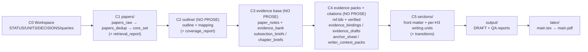

# research-units-pipeline-skills

> **In one sentence**: Make pipelines that can "guide humans / guide models" through research—not a bunch of scripts, but a set of **semantic skills**, where each skill knows "what to do, how to do it, when it's done, and what NOT to do."

---

## Todo
1. Add multi-CLI collaboration and multi-agent design (plug APIs into the right stages to replace or share the load of Codex execution).
2. Keep polishing writing skills to raise both the floor and ceiling of writing quality.
3. Complete the remaining pipelines; add more examples under `example/`.
4. Remove redundant intermediate content in pipelines, following Occam's razor: do not add entities unless necessary.

## Core Idea: Break “Write a Survey” into Small Resumable Steps

Most research pipelines drift toward one of two extremes:
- scripts only: they run, but the process is opaque (hard to debug or improve)
- docs only: they read well, but execution still relies on ad‑hoc human judgment

This repo takes a simple approach: turn the whole workflow into a sequence of **small, auditable, resumable steps**, and write artifacts to disk at every step.

1) **A skill = an executable playbook (with acceptance criteria)**
- Each skill states: required inputs, required outputs, what counts as DONE, and what is forbidden (e.g., NO PROSE in C2–C4).

2) **A unit = one resumable task**
- A run is split into checkpoints C0→C5; each unit is one row in `UNITS.csv`.
- When something fails, you fix the specific artifact and resume from the blocked unit (no full restart).

3) **Evidence first, writing later**
- C1–C4 build a write‑ready evidence base (outline + per‑section paper pools + evidence packs + references).
- C5 writes, merges, polishes, audits, and compiles a PDF (LaTeX pipeline).

At a glance: problems vs what to look at

| What goes wrong | What this repo uses | Where you look / what you fix |
|---|---|---|
| Black box: failures are opaque | Unit contract + reports that point to artifacts | `UNITS.csv` / `output/*REPORT*.md` / `output/*TODO*.md` |
| Docs aren’t executable | Skills are explicit playbooks | `.codex/skills/*/SKILL.md` |
| Hollow / templated writing | Evidence-first + writing self-loops | `outline/*` / `sections/*` / `output/WRITER_SELFLOOP_TODO.md` |
| Want a different deliverable | Pipelines only orchestrate; skills hold the capability | `pipelines/*.pipeline.md` |

Chinese version: [`README.md`](README.md).

## Codex Reference Config

```toml

[sandbox_workspace_write]
network_access = true

[features]
unified_exec = true
shell_snapshot = true
steer = true
```

## One-line Activation (recommended: run it in chat)

1) Start Codex in this repo directory:

```bash
codex --sandbox workspace-write --ask-for-approval never
```

2) Tell it what you want (example):

> Write a LaTeX survey about LLM agents (pause at the outline for my review)

It will: create `workspaces/<timestamp>/` → retrieve and curate papers → draft an outline → **pause at C2 (outline review)** → then write the draft and compile the PDF.

Optional: specify which pipeline to use (choose the LaTeX one if you want a PDF):

> Use `pipelines/arxiv-survey-latex.pipeline.md` to write a survey on LLM agents (strict; pause at C2 for my review)

If you do *not* want to pause at C2, say it explicitly up front (recommended only once you trust the workflow), e.g. “auto‑approve C2”.

Glossary (only what you need here):
- workspace: one run’s output folder under `workspaces/<name>/`
- pipeline: the stage plan (retrieval → structure → evidence → writing → outputs), in `pipelines/*.pipeline.md`
- skill: a step playbook in `.codex/skills/*/SKILL.md`
- unit: one step (one row in `UNITS.csv`)
- checkpoint / C2: a pause-for-human-review point; C2 = approve the outline before any prose
- strict: enables quality gates; failures stop and write reports under `output/`

## What You Get (Layered Artifacts + Self-Healing Entry Points)

In a workspace, there are two things you will use most: a run checklist, and stage artifacts.

Default posture (A150++, aligned with a “real survey” deliverable):
- core set: `core_size=300` (→ `papers/core_set.csv` / `citations/ref.bib`)
- per‑H3 paper pool: `per_subsection=28` (→ `outline/mapping.tsv`)
- global unique citations: hard floor `>=150`, recommended target `>=165` (controlled by `draft_profile` + `citation_target`)

**Run checklist (progress + where it got stuck)**:
- `UNITS.csv`: one row per step (deps/inputs/outputs/acceptance); look for units marked `BLOCKED`
- `DECISIONS.md`: human review points (most importantly **C2: outline approval before prose**)
- `STATUS.md`: the run log (what ran, and when)

**Stage artifacts (the actual content)**:
```
C1 (find papers):
  papers/papers_raw.jsonl → papers/papers_dedup.jsonl → papers/core_set.csv
  + papers/retrieval_report.md

C2 (outline, no prose):
  outline/outline.yml + outline/mapping.tsv
  (+ outline/taxonomy.yml / outline/coverage_report.md)

C3 (build a write-ready evidence base, no prose):
  papers/paper_notes.jsonl + papers/evidence_bank.jsonl → outline/subsection_briefs.jsonl
  + papers/fulltext_index.jsonl  # always present; in abstract mode it records “skip”, fulltext mode downloads/extracts

C4 (prepare per-section writing packs, no prose):
  citations/ref.bib + citations/verified.jsonl
  + outline/evidence_bindings.jsonl / outline/evidence_drafts.jsonl / outline/anchor_sheet.jsonl
  → outline/writer_context_packs.jsonl
  + outline/tables_appendix.md  # reader-facing Appendix tables (index tables stay intermediate)

C5 (writing and outputs):
  sections/*.md → output/DRAFT.md
  (+ latex/main.pdf)  # LaTeX pipeline only
```

**Quality gates / where to start when something fails**:
- script/run errors: `output/RUN_ERRORS.md`
- strict mode blocks: `output/QUALITY_GATE.md` (the last entry is the current reason + next step)
- writing quality (fix only listed files): `output/WRITER_SELFLOOP_TODO.md`
- paragraph “jump cuts”: `output/SECTION_LOGIC_REPORT.md`
- argument continuity + consistency: `output/ARGUMENT_SELFLOOP_TODO.md` (the single source of truth lives in `output/ARGUMENT_SKELETON.md# Consistency Contract`)
- low citation coverage: `output/CITATION_BUDGET_REPORT.md`
- final audit: `output/AUDIT_REPORT.md`

## Conversational Execution (0 to PDF)

```
You: Write a LaTeX survey about LLM agents (pause at the outline for my review)

↓ [C0-C1] Find papers: retrieve candidates (default cap: 1800) → dedupe → select a core set (default 300 in `papers/core_set.csv`)
↓ [C2] Produce an outline + per‑H3 paper pools (no prose): `outline/outline.yml` + `outline/mapping.tsv` (default 28 papers per H3)
   → pause at C2 for your approval

You: Looks good. Continue.

↓ [C3-C4] Turn papers into write-ready material (no prose):
   - `papers/paper_notes.jsonl` (what each paper did / found / limitations)
   - `citations/ref.bib` (the reference list you can cite)
   - `outline/writer_context_packs.jsonl` (per-section writing packs: what to compare + which papers are in scope)
↓ [C5] Write and output:
   - write per-section files: `sections/*.md`
   - merge into the draft: `output/DRAFT.md`
   - LaTeX pipeline also compiles: `latex/main.pdf`
   - target: global unique citations recommended `>=165` (the workflow includes a “citation budget/injection” step if needed)

If it gets blocked:
- strict mode: read `output/QUALITY_GATE.md`
- final audit: read `output/AUDIT_REPORT.md`

You: fix the referenced file, say “continue”
→ resume from the blocked step (no full restart)
```

**Key principle**: C2–C4 enforce NO PROSE—build the evidence base first; C5 writes prose; failures are point-fixable.

## Example Artifacts (v0.1, full intermediate outputs)

This is a fully-run example workspace: find papers → draft outline → build evidence → write → compile PDF. It includes all intermediate artifacts so you can learn the workflow by inspection.

- Example path: `example/e2e-agent-survey-latex-verify-<TIMESTAMP>/` (pipeline: `pipelines/arxiv-survey-latex.pipeline.md`)
- It pauses at **C2 (outline review)** before writing any prose
- Default posture (A150++): 300 core papers, 28 mapped papers per subsection, abstract-level evidence by default; the goal is to keep citation coverage high across the full draft
- Recommended: `draft_profile: survey` (default deliverable) or `draft_profile: deep` (stricter)

Directory quick glance (what each folder is for):

```text
example/e2e-agent-survey-latex-verify-<LATEST_TIMESTAMP>/
  STATUS.md            # progress + run log (current checkpoint)
  UNITS.csv            # execution contract (deps / acceptance / outputs)
  DECISIONS.md         # human checkpoints (Approve C*)
  CHECKPOINTS.md       # checkpoint rules
  PIPELINE.lock.md     # selected pipeline (single source of truth)
  GOAL.md              # goal/scope seed
  queries.md           # retrieval + writing profile config
  papers/              # C1/C3: retrieval outputs + paper notes/evidence base
  outline/             # C2/C3/C4: outline/mapping + briefs + evidence packs
  citations/           # C4: BibTeX + verification records
  sections/            # C5: per-H2/H3 writing units (incl. chapter leads)
  output/              # C5: merged DRAFT + reports
  latex/               # C5: LaTeX scaffold + compiled PDF
```

Pipeline view (how folders connect):



For delivery, only the latest successfully-run example directory matters (timestamped). Keep 2–3 older runs for regression comparisons.

The three files you will open most often:
- Draft (Markdown): `example/e2e-agent-survey-latex-verify-<LATEST_TIMESTAMP>/output/DRAFT.md`
- PDF: `example/e2e-agent-survey-latex-verify-<LATEST_TIMESTAMP>/latex/main.pdf`
- QA / Audit report: `example/e2e-agent-survey-latex-verify-<LATEST_TIMESTAMP>/output/AUDIT_REPORT.md`

## Feel Free to Open Issues (Help Improve the Writing Workflow)

## Star History

[](https://star-history.com/#WILLOSCAR/research-units-pipeline-skills&Date)
