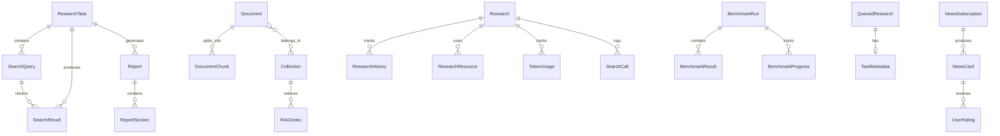

# Database Schema

This document describes the database models and their relationships in Local Deep Research.

## Table of Contents

- [Overview](#overview)
- [Entity Relationship Diagram](#entity-relationship-diagram)
- [Model Groups](#model-groups)
  - [Research Domain](#research-domain)
  - [Authentication](#authentication)
  - [Settings](#settings)
  - [Library & Documents](#library--documents)
  - [Queue Management](#queue-management)
  - [Metrics & Analytics](#metrics--analytics)
  - [News System](#news-system)
  - [Benchmarking](#benchmarking)
  - [Rate Limiting](#rate-limiting)
  - [Caching](#caching)
  - [File Integrity](#file-integrity)

---

## Overview

Local Deep Research uses **SQLAlchemy ORM** with **SQLCipher** for encryption.

**Key Characteristics:**
- **Per-user databases**: Each user has their own encrypted SQLite database
- **AES-256 encryption**: User password derives the encryption key
- **HMAC verification**: Ensures database integrity
- **Central auth database**: Only stores usernames (no passwords)

**Location:** `src/local_deep_research/database/models/`

---

## Entity Relationship Diagram



---

## Model Groups

### Research Domain

The core models for conducting research.

#### ResearchTask

Top-level research container.

| Column | Type | Description |
|--------|------|-------------|
| `id` | Integer | Primary key |
| `title` | String(500) | Research title |
| `description` | Text | Detailed description |
| `status` | String(50) | pending, in_progress, completed, failed |
| `priority` | Integer | Priority level (higher = more urgent) |
| `tags` | JSON | List of categorization tags |
| `research_metadata` | JSON | Flexible metadata storage |
| `created_at` | DateTime | Creation timestamp |
| `updated_at` | DateTime | Last update timestamp |
| `started_at` | DateTime | When research started |
| `completed_at` | DateTime | When research completed |

**Relationships:** `searches`, `results`, `reports`

#### SearchQuery

Individual search queries within a research task.

| Column | Type | Description |
|--------|------|-------------|
| `id` | Integer | Primary key |
| `research_task_id` | Integer | FK to ResearchTask |
| `query` | Text | The search query text |
| `search_engine` | String(50) | Engine used (duckduckgo, arxiv, etc.) |
| `search_type` | String(50) | Type (web, academic, news) |
| `parameters` | JSON | Additional search parameters |
| `status` | String(50) | pending, executing, completed, failed |
| `error_message` | Text | Error details if failed |
| `retry_count` | Integer | Number of retry attempts |
| `executed_at` | DateTime | When query was executed |

**Indexes:** `idx_research_task_status`, `idx_search_engine`

#### SearchResult

Individual results from search queries.

| Column | Type | Description |
|--------|------|-------------|
| `id` | Integer | Primary key |
| `research_task_id` | Integer | FK to ResearchTask |
| `search_query_id` | Integer | FK to SearchQuery |
| `title` | String(500) | Result title |
| `url` | Text | Result URL (indexed) |
| `snippet` | Text | Brief preview |
| `content` | Text | Full fetched content |
| `content_type` | String(50) | html, pdf, text, etc. |
| `content_hash` | String(64) | For deduplication |
| `relevance_score` | Float | Calculated relevance |
| `position` | Integer | Position in results |
| `domain` | String(255) | Source domain (indexed) |
| `language` | String(10) | Content language |
| `published_date` | DateTime | Publication date |
| `fetch_status` | String(50) | pending, fetched, failed, skipped |

#### Research

Simplified research record (alternative to ResearchTask).

| Column | Type | Description |
|--------|------|-------------|
| `id` | Integer | Primary key |
| `query` | Text | Original query |
| `mode` | Enum | ResearchMode value |
| `strategy` | Enum | ResearchStrategy value |
| `status` | Enum | ResearchStatus value |
| `result` | Text | Final result/summary |
| `iterations` | Integer | Iterations completed |
| `created_at` | DateTime | Creation timestamp |

**Enums:**
- `ResearchMode`: quick, detailed, report
- `ResearchStatus`: pending, running, completed, failed, cancelled
- `ResearchStrategy`: source-based, focused-iteration, etc.

#### ResearchHistory

Tracks research iterations and progress.

| Column | Type | Description |
|--------|------|-------------|
| `id` | Integer | Primary key |
| `research_id` | Integer | FK to Research |
| `iteration` | Integer | Iteration number |
| `questions` | JSON | Questions asked |
| `findings` | JSON | Findings discovered |
| `created_at` | DateTime | When recorded |

#### Report / ReportSection

Generated research reports.

| Column (Report) | Type | Description |
|-----------------|------|-------------|
| `id` | Integer | Primary key |
| `research_task_id` | Integer | FK to ResearchTask |
| `title` | String(500) | Report title |
| `format` | String(50) | markdown, pdf, latex |
| `content` | Text | Full report content |
| `created_at` | DateTime | Generation time |

| Column (ReportSection) | Type | Description |
|------------------------|------|-------------|
| `id` | Integer | Primary key |
| `report_id` | Integer | FK to Report |
| `title` | String(255) | Section title |
| `content` | Text | Section content |
| `order` | Integer | Display order |

---

### Authentication

User management with per-user encrypted databases.

#### User

Central user registry (stored in auth database, not user database).

| Column | Type | Description |
|--------|------|-------------|
| `id` | Integer | Primary key |
| `username` | String(80) | Unique username (indexed) |
| `created_at` | DateTime | Registration date |
| `last_login` | DateTime | Last login time |
| `database_version` | Integer | Schema version |

**Note:** Passwords are NEVER stored. They derive encryption keys.

#### APIKey

API keys for programmatic access.

| Column | Type | Description |
|--------|------|-------------|
| `id` | Integer | Primary key |
| `key_hash` | String(64) | Hashed API key |
| `name` | String(100) | Key description |
| `created_at` | DateTime | Creation date |
| `last_used` | DateTime | Last usage |
| `expires_at` | DateTime | Expiration date |
| `is_active` | Boolean | Whether key is valid |

---

### Settings

Configuration storage.

#### Setting

Global application settings.

| Column | Type | Description |
|--------|------|-------------|
| `id` | Integer | Primary key |
| `key` | String(255) | Setting key (unique, indexed) |
| `value` | Text | Setting value |
| `type` | Enum | SettingType (string, int, bool, json) |
| `category` | String(100) | Setting category |
| `description` | Text | Human-readable description |
| `updated_at` | DateTime | Last update |

#### UserSettings

Per-user setting overrides.

| Column | Type | Description |
|--------|------|-------------|
| `id` | Integer | Primary key |
| `key` | String(255) | Setting key |
| `value` | Text | User's value |
| `updated_at` | DateTime | Last update |

---

### Library & Documents

Document management for RAG.

#### Document

Documents in the research library.

| Column | Type | Description |
|--------|------|-------------|
| `id` | Integer | Primary key |
| `title` | String(500) | Document title |
| `source_type` | Enum | SourceType (upload, url, api) |
| `source_url` | Text | Original source URL |
| `file_path` | Text | Local file path |
| `file_hash` | String(64) | Content hash |
| `mime_type` | String(100) | MIME type |
| `file_size` | Integer | Size in bytes |
| `text_content` | Text | Extracted text |
| `metadata` | JSON | Additional metadata |
| `created_at` | DateTime | When added |
| `indexed_at` | DateTime | When indexed for RAG |

**Enum SourceType:** upload, url, doi, arxiv, pubmed, semantic_scholar

#### Collection

Document collections for organization.

| Column | Type | Description |
|--------|------|-------------|
| `id` | Integer | Primary key |
| `name` | String(255) | Collection name |
| `description` | Text | Description |
| `is_default` | Boolean | Default collection flag |
| `created_at` | DateTime | Creation date |

#### DocumentCollection

Junction table for document-collection relationship.

| Column | Type | Description |
|--------|------|-------------|
| `document_id` | Integer | FK to Document |
| `collection_id` | Integer | FK to Collection |

#### DocumentChunk

Text chunks for RAG indexing.

| Column | Type | Description |
|--------|------|-------------|
| `id` | Integer | Primary key |
| `document_id` | Integer | FK to Document |
| `chunk_index` | Integer | Position in document |
| `content` | Text | Chunk text |
| `embedding` | BLOB | Vector embedding |
| `metadata` | JSON | Chunk metadata |

#### RAGIndex

Vector index metadata.

| Column | Type | Description |
|--------|------|-------------|
| `id` | Integer | Primary key |
| `collection_id` | Integer | FK to Collection |
| `status` | Enum | RAGIndexStatus |
| `embedding_model` | String(100) | Model used |
| `chunk_count` | Integer | Number of chunks |
| `created_at` | DateTime | Creation time |
| `updated_at` | DateTime | Last update |

---

### Queue Management

Background task processing.

#### QueuedResearch

Research waiting to be processed.

| Column | Type | Description |
|--------|------|-------------|
| `id` | Integer | Primary key |
| `query` | Text | Research query |
| `mode` | String(50) | Research mode |
| `strategy` | String(50) | Strategy name |
| `status` | Enum | QueueStatus |
| `priority` | Integer | Queue priority |
| `created_at` | DateTime | When queued |
| `started_at` | DateTime | When started |
| `completed_at` | DateTime | When finished |
| `error` | Text | Error message if failed |

**Enum QueueStatus:** pending, running, completed, failed, cancelled

#### TaskMetadata

Additional task information.

| Column | Type | Description |
|--------|------|-------------|
| `id` | Integer | Primary key |
| `queued_research_id` | Integer | FK to QueuedResearch |
| `key` | String(255) | Metadata key |
| `value` | Text | Metadata value |

---

### Metrics & Analytics

Usage tracking and analytics.

#### TokenUsage

LLM token consumption.

| Column | Type | Description |
|--------|------|-------------|
| `id` | Integer | Primary key |
| `research_id` | Integer | FK to Research |
| `model` | String(100) | Model name |
| `provider` | String(50) | Provider name |
| `input_tokens` | Integer | Input token count |
| `output_tokens` | Integer | Output token count |
| `cost` | Float | Estimated cost |
| `created_at` | DateTime | When recorded |

#### SearchCall

Search API call logging.

| Column | Type | Description |
|--------|------|-------------|
| `id` | Integer | Primary key |
| `research_id` | Integer | FK to Research |
| `engine` | String(50) | Search engine |
| `query` | Text | Query text |
| `result_count` | Integer | Results returned |
| `duration_ms` | Integer | Request duration |
| `success` | Boolean | Whether succeeded |
| `created_at` | DateTime | When called |

#### ModelUsage

Aggregated model usage statistics.

| Column | Type | Description |
|--------|------|-------------|
| `id` | Integer | Primary key |
| `model` | String(100) | Model name |
| `provider` | String(50) | Provider name |
| `total_input_tokens` | Integer | Cumulative input |
| `total_output_tokens` | Integer | Cumulative output |
| `total_cost` | Float | Cumulative cost |
| `request_count` | Integer | Number of requests |
| `date` | Date | Aggregation date |

#### ResearchRating

User ratings for research quality.

| Column | Type | Description |
|--------|------|-------------|
| `id` | Integer | Primary key |
| `research_id` | Integer | FK to Research |
| `rating` | Integer | 1-5 rating |
| `feedback` | Text | Optional feedback |
| `created_at` | DateTime | When rated |

---

### News System

News subscription and recommendation.

#### NewsSubscription

User news subscriptions.

| Column | Type | Description |
|--------|------|-------------|
| `id` | Integer | Primary key |
| `topic` | String(255) | Subscription topic |
| `type` | Enum | SubscriptionType |
| `status` | Enum | SubscriptionStatus |
| `frequency` | String(50) | Update frequency |
| `last_fetched` | DateTime | Last fetch time |
| `created_at` | DateTime | Creation date |

#### NewsCard

Individual news items.

| Column | Type | Description |
|--------|------|-------------|
| `id` | Integer | Primary key |
| `subscription_id` | Integer | FK to NewsSubscription |
| `title` | String(500) | News title |
| `summary` | Text | News summary |
| `url` | Text | Source URL |
| `source` | String(100) | Source name |
| `published_at` | DateTime | Publication date |
| `card_type` | Enum | CardType |
| `created_at` | DateTime | When fetched |

#### UserRating / UserPreference / NewsInterest

User interaction tracking for recommendations.

---

### Benchmarking

Performance benchmarking system.

#### BenchmarkRun

Benchmark execution record.

| Column | Type | Description |
|--------|------|-------------|
| `id` | Integer | Primary key |
| `name` | String(255) | Run name |
| `dataset_type` | Enum | DatasetType (SimpleQA, BrowseComp) |
| `strategy` | String(100) | Strategy tested |
| `status` | Enum | BenchmarkStatus |
| `config` | JSON | Configuration used |
| `started_at` | DateTime | Start time |
| `completed_at` | DateTime | End time |

#### BenchmarkResult

Individual benchmark results.

| Column | Type | Description |
|--------|------|-------------|
| `id` | Integer | Primary key |
| `run_id` | Integer | FK to BenchmarkRun |
| `question` | Text | Test question |
| `expected_answer` | Text | Expected answer |
| `actual_answer` | Text | Model's answer |
| `is_correct` | Boolean | Whether correct |
| `score` | Float | Quality score |
| `latency_ms` | Integer | Response time |
| `tokens_used` | Integer | Tokens consumed |

#### BenchmarkProgress

Progress tracking during runs.

| Column | Type | Description |
|--------|------|-------------|
| `id` | Integer | Primary key |
| `run_id` | Integer | FK to BenchmarkRun |
| `completed` | Integer | Questions completed |
| `total` | Integer | Total questions |
| `current_accuracy` | Float | Running accuracy |
| `updated_at` | DateTime | Last update |

---

### Rate Limiting

Adaptive rate limiting data.

#### RateLimitAttempt

Individual rate limit events.

| Column | Type | Description |
|--------|------|-------------|
| `id` | Integer | Primary key |
| `engine` | String(50) | Search engine |
| `wait_time` | Float | Wait time used |
| `success` | Boolean | Whether request succeeded |
| `created_at` | DateTime | When occurred |

#### RateLimitEstimate

Learned rate limit estimates.

| Column | Type | Description |
|--------|------|-------------|
| `id` | Integer | Primary key |
| `engine` | String(50) | Search engine |
| `estimated_wait` | Float | Optimal wait time |
| `confidence` | Float | Estimate confidence |
| `sample_count` | Integer | Data points used |
| `updated_at` | DateTime | Last update |

---

### Caching

Result caching for performance.

#### SearchCache

Cached search results.

| Column | Type | Description |
|--------|------|-------------|
| `id` | Integer | Primary key |
| `query_hash` | String(64) | Query hash (indexed) |
| `engine` | String(50) | Search engine |
| `results` | JSON | Cached results |
| `expires_at` | DateTime | Cache expiration |
| `created_at` | DateTime | When cached |

#### Cache

General-purpose cache.

| Column | Type | Description |
|--------|------|-------------|
| `id` | Integer | Primary key |
| `key` | String(255) | Cache key (unique) |
| `value` | Text | Cached value |
| `expires_at` | DateTime | Expiration time |
| `created_at` | DateTime | When created |

---

### File Integrity

File verification for security.

#### FileIntegrityRecord

File hash records.

| Column | Type | Description |
|--------|------|-------------|
| `id` | Integer | Primary key |
| `file_path` | Text | File path |
| `sha256_hash` | String(64) | SHA256 hash |
| `blake3_hash` | String(64) | BLAKE3 hash |
| `file_size` | Integer | Size in bytes |
| `verified_at` | DateTime | Last verification |
| `created_at` | DateTime | First recorded |

#### FileVerificationFailure

Failed verification attempts.

| Column | Type | Description |
|--------|------|-------------|
| `id` | Integer | Primary key |
| `file_path` | Text | File path |
| `expected_hash` | String(64) | Expected hash |
| `actual_hash` | String(64) | Computed hash |
| `failure_type` | String(50) | Type of failure |
| `created_at` | DateTime | When detected |

---

## Database Location

```
~/.local/share/local-deep-research/
├── auth.db                    # Central auth database (unencrypted)
└── users/
    └── <username>/
        └── research.db        # User's encrypted database
```

---

## See Also

- [Architecture Overview](./OVERVIEW.md) - System architecture
- [Extension Guide](../developing/EXTENDING.md) - Adding custom components
- [Troubleshooting](../troubleshooting.md) - Common issues
