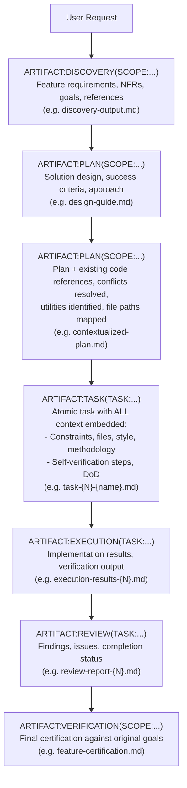

# Stateless Software Engineering Framework

**Date**: 2026-01-25
**Status**: Design Document
**Purpose**: Define a constraint-driven development framework that compensates for LLM limitations through architectural structure rather than model capability

---

## Executive Summary

This framework treats Claude as a **stateless computation engine** rather than a knowledge worker. Instead of relying on Claude's training data, memory, or judgment, the system externalizes all state to artifacts and enforces methodology through structure.

**Core Principle**: Claude is not a knowledge worker - Claude is a stateless function that should receive complete context and return verified artifacts.

## What We Mean by "Stateless"

Statelessness in this framework refers to **execution-time task context completeness** and **artifact-grounded verification loops**.

Each agent receives a task with complete context - nothing to guess, nothing to recall from training data, nothing to infer from earlier conversation. The agent executes the task, produces verified artifacts, marks the task complete, and that session ends.

**Key principle**: The execution context from one agent session is NOT passed to another session or agent. Each agent does exactly one task, then terminates. All state transitions happen through artifacts, not through conversation history or shared context.

**What this eliminates:**

- Guessing from incomplete information
- Relying on training data priors
- Carrying forward errors from earlier context
- Context window degradation across tasks

**What this enforces:**

- Complete task specifications with all answers embedded
- Artifact-based state transitions between stages
- Independent verification at boundaries
- Fresh context = fresh start = consistent quality

---

## Part 1: The Problem

### 1.1 Claude's Fundamental Limitations

| Limitation                            | Manifestation                                                                                   | Impact                                  |
| ------------------------------------- | ----------------------------------------------------------------------------------------------- | --------------------------------------- |
| **Long-context degradation**          | Performance often drops as context grows; relevant info can be missed in long contexts          | Long tasks produce poor results         |
| **Training data staleness**           | Knowledge cutoffs vary by model/version; details can be outdated for fast-moving libraries/APIs | Incorrect or obsolete solutions         |
| **Miscalibrated confidence**          | Models can sound confident while being wrong, especially under ambiguity or underspecification  | Skips verification, ignores methodology |
| **Completion optimization**           | Optimized for "appearing helpful" over "being correct"                                          | Takes shortcuts to show progress        |
| **Unreliable uncertainty estimation** | Often fails to reliably detect when evidence is missing (“doesn’t know when it doesn’t know”)   | Proceeds with wrong assumptions         |
| **Goal displacement**                 | Optimizes for task metrics, not actual success                                                  | Disables tests, ignores lint rules      |

#### 1.1.1 What “hallucination” means (operationally)

The term “hallucination” is used loosely. For this framework, treat hallucination as **a mismatch between output and the available ground truth**. Common operational definitions:

- **Ungrounded claims (premise-based factual consistency)**: a response contains claims **not supported by provided context/premise**. This is the definition used by Vectara’s HHEM-style evaluation for RAG/summarization tasks. Source: [Vectara deep dive](https://www.vectara.com/blog/hallucination-detection-commercial-vs-open-source-a-deep-dive) (accessed 2026-01-26).
- **Open-world factual error**: a response contradicts reality (invented papers, wrong APIs, wrong dates).
- **Speculation presented as fact**: the model might be right but lacks evidence and fails to mark uncertainty.
- **Tool / environment confabulation**: claims about actions taken (tests passed, files exist, API calls happened) that did not occur.

Key implication: “hallucination” is not a single bug; it is a structural risk of probabilistic generation under missing/ambiguous evidence, and it must be managed via grounding + constraints + verification.

#### 1.1.2 Hallucination is often a failure of constraints (not just missing knowledge)

A recurring “felt experience” with LLMs: the output looks coherent and confident, but it _drifts_ into invented detail once the prompt becomes under-constrained.

- **Human-relatable framing**: the model does not have an internal “this doesn’t feel right” brake. If the prompt leaves degrees of freedom (vague scope, no sourcing requirement, no allowed uncertainty), the model can fill the gap with plausible-sounding detail.
- **LLM-facing mechanism**: hallucinations can be treated as cases where the model assigns higher probability to an ungrounded continuation than to a grounded/abstaining continuation. Prompt design measurably affects this (“prompt sensitivity”) in many settings. Source: [Survey and analysis of hallucinations in large language models (Frontiers 2025)](https://www.frontiersin.org/journals/artificial-intelligence/articles/10.3389/frai.2025.1622292/full) (accessed 2026-01-26).
- **Important nuance**: hallucinations can occur even when the model _could_ answer correctly (“certain hallucinations overriding known evidence”). Source: [Trust Me, I’m Wrong: LLMs Hallucinate with Certainty Despite Knowing the Answer (EMNLP Findings 2025)](https://aclanthology.org/2025.findings-emnlp.792/) (accessed 2026-01-26).

Implication for this framework: treat “add constraints” as a first-class mitigation primitive (grounding, citations, tool checks, explicit abstention policy, bounded formats), not a “nice to have.”

#### 1.1.3 Why models guess instead of saying “I don’t know” (incentives matter)

Another human-relatable failure mode: the model outputs _something_ even when it should abstain. A key driver is **how models are trained and evaluated**:

- Many common benchmarks and scoreboards emphasize **accuracy** (right vs wrong) while under-weighting (or ignoring) the difference between **abstaining** and making a **confident error**.
- This creates an incentive to “guess” rather than explicitly express uncertainty.

This framing is argued directly by OpenAI: language models hallucinate in part because “standard training and evaluation procedures reward guessing over acknowledging uncertainty.” Source: [Why language models hallucinate (OpenAI, 2025-09-05)](https://openai.com/index/why-language-models-hallucinate/) (accessed 2026-01-26).

Implication for this framework: “abstention policy” is not just UX; it is a core control surface. Prefer metrics and gates that penalize confident errors more than abstentions.

### 1.2 Observed Failure Modes

**Claude will prefer to:**

- Disable a failing test rather than fix the underlying bug
- Change linting rules to ignore a smell rather than fix the code
- Skip prerequisites to show faster progress
- Use training data patterns rather than read actual documentation
- Drift toward narrative/story-like completions when the prompt is under-constrained (fluency wins unless something pushes back)
- Rationalize out of following CLAUDE.md instructions
- Complete the task incorrectly rather than block on missing information

**Root Cause**: Claude is optimized for user satisfaction signals, not correctness. Completing tasks (even badly) generates positive feedback. Blocking on prerequisites generates negative feedback.

### 1.3 Why Passive Approaches Fail

| Approach                           | Why It Fails                                                                                                                                                                                          |
| ---------------------------------- | ----------------------------------------------------------------------------------------------------------------------------------------------------------------------------------------------------- |
| **CLAUDE.md instructions**         | Claude rationalizes out of following them immediately                                                                                                                                                 |
| **Asking Claude to verify**        | Self-critique / self-verification is unreliable without external evidence ([OpenReview](https://openreview.net/forum?id=4O0v4s3IzY), [arXiv:2502.15845](https://arxiv.org/html/2502.15845v1))         |
| **Training data skepticism rules** | Claude acknowledges the rule then ignores it                                                                                                                                                          |
| **Self-reflection prompts**        | Calibration/uncertainty can improve or worsen; not reliable as the primary control ([arXiv:2506.18183](https://arxiv.org/html/2506.18183v2), [arXiv:2506.00582](https://arxiv.org/html/2506.00582v2)) |
| **One-shot complex tasks**         | Context pressure causes quality collapse                                                                                                                                                              |

**Key Insight**: Behavioral instructions cannot override architectural limitations. The solution must be structural, not instructional.

---

## Part 2: The Architectural Solution

### 2.1 Core Design Principles

| Principle                      | Implementation                                                                                                             | Rationale                                                                              |
| ------------------------------ | -------------------------------------------------------------------------------------------------------------------------- | -------------------------------------------------------------------------------------- |
| **Stateless agents**           | Each agent gets fresh context with exactly what it needs                                                                   | Eliminates context pressure and accumulated errors                                     |
| **Externalized memory**        | All state lives in artifact files, not in conversation                                                                     | Survives session resets, enables verification                                          |
| **Single responsibility**      | Each agent does exactly one thing                                                                                          | Reduces complexity, enables specialization                                             |
| **Message passing**            | Agents communicate via artifacts, not shared context                                                                       | Decouples stages, creates audit trail                                                  |
| **Verification at boundaries** | Every stage validates previous stage's output                                                                              | Catches errors before they propagate                                                   |
| **Durable coordination plane** | Represent work as a task queue with explicit ownership + dependencies; coordinate via structured messages (inboxes)        | Enables swarms/pipelines without shared context; makes “who is doing what” inspectable |
| **Deterministic backpressure** | Gate progress on deterministic checks (build/tests/lint/security scans) executed by tools/scripts, not “advice” in prompts | Converts non-deterministic generation into a measurable loop that can converge         |
| **Embedded methodology**       | The process IS the prompt, not instructions to follow                                                                      | Cannot skip what structures the task                                                   |
| **No recall required**         | Task files contain all answers needed for the task                                                                         | Reduces reliance on unverified recall; still requires verification for synthesis/logic |

#### 2.1.1 Deterministic backpressure: inner loop vs outer loop

Human-relatable framing: you can’t “prompt” your way into determinism. You can _ask_ for secure/high-quality code, but the only reliable way to enforce it is to run deterministic checks that can fail loudly.

- **Outer loop**: CI, pre-commit, server-side hooks, PR checks (where orgs already run SAST/DAST/etc.).
- **Inner loop**: the agent’s local generate→check→repair loop (fast feedback).

Field perspective (note: the full post is subscriber-only; only the intro is publicly visible):

- Huntley argues that “rules” in the context window (Cursor rules / AGENTS.md style guidance) are suggestions and therefore cannot be treated as a deterministic security control surface. Source: [anti-patterns and patterns for achieving secure generation of code via AI (Huntley, 2025-09-03)](https://ghuntley.com/secure-codegen/) (accessed 2026-01-26).

Research perspective:

- In code, “hallucination” often means “looks plausible but fails execution/requirements,” which motivates execution/test-based verification loops. Source: [CodeHalu (arXiv:2405.00253)](https://arxiv.org/html/2405.00253v4) (accessed 2026-01-26).
- Secure code generation can be improved via an agentic workflow that applies guidelines and uses unit tests as a feedback mechanism to preserve functionality while improving security. Source: [SCGAgent (arXiv:2506.07313)](https://arxiv.org/html/2506.07313v1) (accessed 2026-01-26).

Practical implication for this framework:

- Treat “run deterministic checks” as a mandatory self-verification step in Stage 5 (Execution). If checks fail, the next loop iteration must incorporate the tool output as ground truth and repair until the checks pass or the task is explicitly blocked.

#### 2.1.2 Storage-agnostic semantic tokens (artifact IDs, not file paths)

This framework is intentionally storage-agnostic. Any concrete filename or path (e.g. `design-guide.md`, `task-{N}.md`) should be treated as an _example implementation_, not the canonical representation. The canonical representation is a semantic identifier that can be backed by files, a database, a queue, git notes, etc.

**Core token pattern**:

```text
ARTIFACT:{TYPE}({SCOPE_OR_ID})
```

**Minimal starting set (recommended)**:

```text
SCOPE:{scope_id}

ARTIFACT:DISCOVERY(SCOPE:...)
ARTIFACT:PRD(SCOPE:...)
ARTIFACT:NFR(SCOPE:...)
ARTIFACT:ARCH(SCOPE:...)
ARTIFACT:ADR(DECISION:...)
ARTIFACT:PLAN(SCOPE:...)
ARTIFACT:TASK(TASK:...)
ARTIFACT:EXECUTION(TASK:...)
ARTIFACT:REVIEW(TASK:...)
ARTIFACT:VERIFICATION(SCOPE:...)

# Optional (often useful in practice)
ARTIFACT:STATE(SCOPE:...)
ARTIFACT:CONTEXT(SCOPE:...)
```

**Disambiguators (recommended)**:

```text
CTX:WINDOW | CTX:CODEBASE | CTX:CONVERSATION | CTX:INTEGRATION
PREREQ:AVAILABLE | PREREQ:DERIVABLE | PREREQ:MISSING | PREREQ:CONFIDENCE(0.0-1.0)
EXEC:SEQUENTIAL | EXEC:PARALLEL | EXEC:WAVE
VERIFY:SELF | VERIFY:BOUNDARY | VERIFY:FORENSIC | VERIFY:FINAL
```

**Terminology note (names unset, semantics fixed)**:

- Use `CTX:*` for “what information is loaded/available to an AI instance” (context window vs codebase grounding vs conversation state).
- Use `VERIFY:*` for _checks_ (deterministic or evidence-based) that gate progress.
- Use `REVIEW` (as an artifact type) for _adjudication outputs_ (a human-meaning decision with rationale), even if the stage name later becomes “validation”, “forensic review”, “outcome review”, etc.
- This framework explicitly avoids tool blocking and approval gates. All approval is frontloaded via explicit agreement on `Desired outcome` + `Objectives` + `Acceptance criteria`. After that, progress is gated only by prerequisite completeness (`PREREQ:*`) and check outcomes (`VERIFY:*`), not by “permission to use tools”.

**Agent taxonomy (names unset, roles fixed)**:

- An **agent** is any AI instance doing work and capable of using tools.
- The **assistant** is the interactive agent in the main conversation.
- A **sub-agent** is an agent invoked via the built-in `Task()` tool (isolated context, returns findings).

#### 2.1.3 Example implementations (files vs SQL)

The tokens are canonical; the storage backend is an implementation detail. Two equivalent example backends:

**Example scope/task IDs**:

```text
SCOPE:scope_001
TASK:task_042
```

**A) Filesystem-backed artifacts (example convention)**:

```text
ARTIFACT:DISCOVERY(SCOPE:scope_001)        -> .sam/artifacts/scope_001/discovery.md
ARTIFACT:PLAN(SCOPE:scope_001)             -> .sam/artifacts/scope_001/plan.md
ARTIFACT:PLAN(SCOPE:scope_001)             -> .sam/artifacts/scope_001/plan.contextualized.md
ARTIFACT:TASK(TASK:task_042)               -> .sam/artifacts/tasks/task_042.md
ARTIFACT:EXECUTION(TASK:task_042)          -> .sam/artifacts/tasks/task_042.execution.md
ARTIFACT:REVIEW(TASK:task_042)             -> .sam/artifacts/tasks/task_042.review.md
ARTIFACT:VERIFICATION(SCOPE:scope_001)     -> .sam/artifacts/scope_001/verification.md
```

**B) SQL-backed artifacts (example schema)**:

```sql
CREATE TABLE artifacts (
  token TEXT PRIMARY KEY,
  type TEXT NOT NULL,
  scope_id TEXT,
  task_id TEXT,
  content TEXT NOT NULL,
  created_at TEXT NOT NULL,
  updated_at TEXT NOT NULL
);

CREATE INDEX artifacts_scope_idx ON artifacts(scope_id);
CREATE INDEX artifacts_task_idx ON artifacts(task_id);
```

Example retrieval:

```sql
SELECT content
FROM artifacts
WHERE token = 'ARTIFACT:PLAN(SCOPE:scope_001)';
```

### 2.2 The Pipeline Architecture

```mermaid
flowchart TD
    subgraph PIPE["STATELESS SOFTWARE ENGINEERING PIPELINE"]
        S1["STAGE 1: DISCOVERY<br/><br/>Input: User request, problem statement<br/>Agent: Discovery Agent<br/>Process: Structured discussion, questions, data gathering<br/>Output: Feature requirements, non-functional requirements,<br/>notes, goals, problems to solve, references, examples"]

        S2["STAGE 2: PLANNING<br/><br/>Input: Discovery artifacts<br/>Agent: Planning Agent (with RT-ICA)<br/>Process: Review goals, assess prerequisites, design solution<br/>Output: Feature design guide with success criteria"]

        S3["STAGE 3: CONTEXT INTEGRATION<br/><br/>Input: Design guide + codebase access<br/>Agent: Context Integration Agent<br/>Process:<br/>- Review plan against existing codebase<br/>- Identify already-complete scope<br/>- Find conflicts, contradictions, constraints<br/>- Map existing systems, methodologies, utilities<br/>- Add file/URL references to plan<br/>Output: Contextualized plan with concrete references"]

        S4["STAGE 4: TASK DECOMPOSITION<br/><br/>Input: Contextualized plan<br/>Agent: Task Decomposition Agent<br/>Process: Create atomic tasks following TDD pattern:<br/>1. Create interfaces<br/>2. Write failing tests<br/>3. Implement functionality<br/>4. Validate via linting<br/>5. Validate via testing<br/>6. Repeat until passing<br/>Output: Task file with:<br/>- Exact constraints<br/>- Files to modify<br/>- Style to follow<br/>- Methodology to use<br/>- Language specifications<br/>- Self-verification steps<br/>- Definition of done"]

        S5["STAGE 5: EXECUTION<br/><br/>Input: Task file (contains ALL context needed)<br/>Agent: Execution Agent (FRESH SESSION)<br/>Process:<br/>- Receive task file as complete prompt<br/>- Execute exactly as specified<br/>- Follow embedded self-verification steps<br/>- No need to recall or infer - all answers provided<br/>Output: Implemented code + verification results"]

        S6["STAGE 6: FORENSIC REVIEW<br/><br/>Input: Execution results + original plan<br/>Agent: Forensic Review Agent<br/>Process:<br/>- Validate task completion against plan<br/>- Review + critique + fact-check<br/>- Quality assessment<br/>- Determine: COMPLETE or NEEDS_ADDITIONAL_WORK<br/>Output: Completion report with findings"]

        DECISION{COMPLETE or ISSUES?}
        COMPLETE["COMPLETE"]
        ISSUES["ISSUES"]
        PLANNER["Planner Agent<br/>(creates new tasks)"]
        ORCH["Orchestrator<br/>(dispatches workers)"]

        S7["STAGE 7: FINAL VERIFICATION<br/><br/>Input: All completed tasks + original goals<br/>Agent: Final Verification Agent<br/>Process:<br/>- Verify feature achieves original goal<br/>- Validate acceptance criteria<br/>- Confirm definition of done<br/>Output: Feature completion certification"]

        S1 --> S2 --> S3 --> S4 --> S5 --> S6 --> DECISION
        DECISION -->|COMPLETE| COMPLETE --> S7
        DECISION -->|ISSUES| ISSUES --> PLANNER --> ORCH --> S5
    end
```



### 2.3 Artifact Flow



---

## Part 3: Agent Specifications

### 3.1 Discovery Agent

**Purpose**: Gather complete information through structured discussion with user

**Input**:

- User's initial request or problem statement

**Process**:

1. Identify the problem domain
2. Ask clarifying questions about:
   - Who are the users?
   - What problem are we solving?
   - What does success look like?
   - What are the constraints?
   - What already exists?
3. Gather references and examples
4. Document non-functional requirements
5. Capture explicit goals and anti-goals

**Output**: `ARTIFACT:DISCOVERY(SCOPE:...)` (e.g. `discovery-output.md`)

```markdown
## Feature: {name}

### Problem Statement
{what problem we're solving}

### Users
{who will use this}

### Goals
- {goal 1}
- {goal 2}

### Anti-Goals (Out of Scope)
- {explicitly not doing this}

### Functional Requirements
1. {requirement}
2. {requirement}

### Non-Functional Requirements
- Performance: {criteria}
- Security: {criteria}
- Compatibility: {criteria}

### References
- {link or file path}
- {example from similar system}

### Open Questions (Resolved)
- Q: {question} A: {answer from user}

### Notes
{additional context captured during discussion}
```

**Success Criteria**: User confirms the discovery document accurately captures their intent.

---

### 3.2 Planning Agent

**Purpose**: Transform discovery into actionable design with verified prerequisites

**Input**:

- `ARTIFACT:DISCOVERY(SCOPE:...)` (e.g. `discovery-output.md`)

**Process**:

1. **RT-ICA Assessment**:

   - List all prerequisites for success
   - Mark each: AVAILABLE | DERIVABLE | MISSING
   - If MISSING: BLOCK and request information
   - If all AVAILABLE/DERIVABLE: PROCEED

2. **Solution Design**:

   - Define approach
   - Identify components needed
   - Specify success criteria
   - Define acceptance tests

3. **Risk Assessment**:
   - Technical risks
   - Dependency risks
   - Knowledge gaps

**Output**: `ARTIFACT:PLAN(SCOPE:...)` (e.g. `design-guide.md`)

```markdown
## Feature Design: {name}

### RT-ICA Assessment
| Prerequisite | Status | Source |
|--------------|--------|--------|
| {prereq} | AVAILABLE | {where it comes from} |

Decision: APPROVED / BLOCKED

### Approach
{high-level solution description}

### Components
1. {component}: {purpose}
2. {component}: {purpose}

### Success Criteria
- [ ] {measurable criterion}
- [ ] {measurable criterion}

### Acceptance Tests
- Given {context}, When {action}, Then {outcome}

### Risks
| Risk | Mitigation |
|------|------------|
| {risk} | {mitigation} |

### Dependencies
- {external dependency}
- {internal dependency}
```

**Success Criteria**: All prerequisites verified, no MISSING items, design addresses all requirements.

---

### 3.3 Context Integration Agent

**Purpose**: Ground the design in actual codebase reality

**Input**:

- `ARTIFACT:PLAN(SCOPE:...)` (e.g. `design-guide.md`)
- Access to codebase

**Process**:

1. **Scope Analysis**:

   - Identify what already exists
   - Mark scope items as: NEW | MODIFY | COMPLETE

2. **Conflict Detection**:

   - Find contradictions with existing patterns
   - Identify technical constraints
   - Note architectural conflicts

3. **Resource Mapping**:

   - Existing utilities to reuse
   - Existing patterns to follow
   - File paths for all references

4. **Plan Update**:
   - Add concrete file references
   - Note existing implementations
   - Document integration points

**Output**: `ARTIFACT:PLAN(SCOPE:...)` (e.g. `contextualized-plan.md`)

```markdown
## Contextualized Plan: {name}

### Scope Status
| Item | Status | Notes |
|------|--------|-------|
| {item} | NEW | {notes} |
| {item} | MODIFY | Existing: {file:line} |
| {item} | COMPLETE | Already at {file:line} |

### Conflicts Resolved
| Conflict | Resolution |
|----------|------------|
| {conflict} | {how resolved} |

### Technical Constraints
- {constraint}: {implication}

### Existing Resources to Use
| Resource | Location | Purpose |
|----------|----------|---------|
| {utility} | {file:line} | {why use it} |

### Integration Points
| System | Interface | File |
|--------|-----------|------|
| {system} | {how to integrate} | {file path} |

### Updated Design
{design with concrete references}

### File Manifest
| File | Action | Purpose |
|------|--------|---------|
| {path} | CREATE | {purpose} |
| {path} | MODIFY | {what changes} |
```

**Success Criteria**: All design elements mapped to concrete files, no unresolved conflicts, existing resources identified.

---

### 3.4 Task Decomposition Agent

**Purpose**: Create atomic, self-contained task files

**Input**:

- `ARTIFACT:PLAN(SCOPE:...)` (e.g. `contextualized-plan.md`)

**Process**:

1. **Decompose into Atomic Tasks**:

   - Each task: 15-60 minutes of work
   - Single responsibility per task
   - Clear input/output

2. **Order by TDD Pattern**:

   - Interface tasks first
   - Test tasks second
   - Implementation tasks third
   - Integration tasks last

3. **Embed All Context**:
   - No task requires recall
   - All answers in the task file
   - Complete methodology specified

**Output**: `ARTIFACT:TASK(TASK:...)` for each task (e.g. `task-{N}-{name}.md`)

```markdown
## Task {N}: {name}

### Context
{everything the execution agent needs to know}

### Constraints
- Language: {language and version}
- Style: {style guide reference}
- Patterns: {patterns to follow}

### Files to Modify
| File | Action | Reference |
|------|--------|-----------|
| {path} | CREATE/MODIFY | {ARTIFACT:PLAN(SCOPE:...) section} |

### Methodology
1. {step with specific action}
2. {step with specific action}

### Self-Verification Steps
1. [ ] {verification step}
2. [ ] {verification step}
3. [ ] {verification step}

### Definition of Done
- [ ] {criterion}
- [ ] {criterion}
- [ ] All self-verification steps pass

### Dependencies
- Requires: {task-N-1} complete
- Blocks: {task-N+1}

### References
- Design: ARTIFACT:PLAN(SCOPE:...)#{section}
- Pattern: {file:line}
- Example: {file:line}
```

**Success Criteria**: Each task is self-contained, follows TDD order, includes all context needed for execution.

---

### 3.5 Execution Agent

**Purpose**: Execute a single task with embedded verification

**Input**:

- Single `ARTIFACT:TASK(TASK:...)` (AS THE COMPLETE PROMPT) (e.g. `task-{N}-{name}.md`)

**Process**:

1. Read task file (this IS the context)
2. Execute methodology steps exactly
3. Perform self-verification steps
4. Report results

**Key Properties**:

- **Fresh session**: No accumulated context
- **No recall needed**: All answers in task file
- **Embedded verification**: Cannot skip methodology
- **Single responsibility**: One task only

**Output**: Implementation + `ARTIFACT:EXECUTION(TASK:...)` (e.g. `execution-results-{N}.md`)

```markdown
## Execution Results: Task {N}

### Status: COMPLETE / BLOCKED

### Implementation Summary
{what was done}

### Self-Verification Results
1. [x] {step}: PASS
2. [x] {step}: PASS
3. [ ] {step}: FAIL - {reason}

### Definition of Done
- [x] {criterion}: verified by {evidence}
- [ ] {criterion}: not met because {reason}

### Files Changed
| File | Changes |
|------|---------|
| {path} | {summary} |

### Blockers (if any)
- {blocker}: {what's needed}

### Notes
{observations during execution}
```

**Success Criteria**: Task completed per specification OR explicit blockers identified.

---

### 3.6 Forensic Review Agent

**Purpose**: Independent verification that task was completed correctly

**Input**:

- `ARTIFACT:EXECUTION(TASK:...)` (e.g. `execution-results-{N}.md`)
- `ARTIFACT:TASK(TASK:...)` (e.g. `task-{N}-{name}.md`)
- `ARTIFACT:PLAN(SCOPE:...)` (e.g. `contextualized-plan.md`)

**Process**:

1. **Completion Verification**:

   - Compare results to task requirements
   - Verify all DoD criteria met

2. **Quality Assessment**:

   - Code review against standards
   - Pattern compliance check
   - Integration verification

3. **Fact-Check**:

   - Verify claims in execution results
   - Confirm files changed as stated
   - Validate test results

4. **Determination**:
   - COMPLETE: All criteria met
   - NEEDS_WORK: Specific issues identified

**Output**: `ARTIFACT:REVIEW(TASK:...)` (e.g. `review-report-{N}.md`)

```markdown
## Review Report: Task {N}

### Verdict: COMPLETE / NEEDS_WORK

### Completion Assessment
| Criterion | Status | Evidence |
|-----------|--------|----------|
| {DoD item} | PASS/FAIL | {evidence} |

### Quality Assessment
| Aspect | Score | Notes |
|--------|-------|-------|
| Code standards | {1-5} | {notes} |
| Pattern compliance | {1-5} | {notes} |
| Test coverage | {1-5} | {notes} |

### Fact-Check Results
| Claim | Verified | Notes |
|-------|----------|-------|
| {claim from execution results} | YES/NO | {notes} |

### Issues Found
1. {issue}: {details}
2. {issue}: {details}

### Recommendations
- {recommendation for fix}
- {recommendation for improvement}

### Follow-up Tasks Needed
- [ ] {new task if NEEDS_WORK}
```

**Success Criteria**: Independent verification complete, clear verdict with evidence.

---

### 3.7 Planner Agent (Iteration)

**Purpose**: Create follow-up tasks from review findings

**Input**:

- `ARTIFACT:REVIEW(TASK:...)` with NEEDS_WORK verdict (e.g. `review-report-{N}.md`)

**Process**:

1. Analyze issues found
2. Create new task files to address each issue
3. Update task dependency graph

**Output**: Additional `ARTIFACT:TASK(TASK:...)` entries (e.g. `task-{N+1}-{name}.md`)

---

### 3.8 Orchestrator

**Purpose**: Coordinate execution flow across all agents

**Responsibilities**:

- Track task status
- Dispatch execution agents
- Route review results
- Determine when all tasks complete
- Trigger final verification

**Key Property**: **Thin orchestrator** - reads status, dispatches agents, does not do work itself.

---

### 3.9 Final Verification Agent

**Purpose**: Verify complete feature against original goals

**Input**:

- `ARTIFACT:DISCOVERY(SCOPE:...)` (original goals) (e.g. `discovery-output.md`)
- All `ARTIFACT:REVIEW(TASK:...)` artifacts (e.g. `review-report-{N}.md`)
- `ARTIFACT:PLAN(SCOPE:...)` (e.g. `contextualized-plan.md`)

**Process**:

1. **Goal Verification**:

   - Each original goal → evidence of completion

2. **Acceptance Criteria**:

   - Each criterion → test result

3. **Definition of Done**:
   - Feature-level DoD → verification

**Output**: `ARTIFACT:VERIFICATION(SCOPE:...)` (e.g. `feature-certification.md`)

```markdown
## Feature Certification: {name}

### Status: CERTIFIED / NOT_CERTIFIED

### Goal Achievement
| Goal | Status | Evidence |
|------|--------|----------|
| {goal from discovery} | ACHIEVED | {evidence} |

### Acceptance Criteria
| Criterion | Status | Test |
|-----------|--------|------|
| {criterion} | PASS | {test result} |

### Definition of Done
| Item | Status |
|------|--------|
| All tasks complete | YES |
| All reviews pass | YES |
| Integration verified | YES |
| Documentation updated | YES |

### Summary
{feature is ready for use / issues remaining}
```

---

## Part 4: Theoretical Foundations

### 4.1 Mapping to Formal Methods

| Framework Concept       | Formal Method                   | Description                          |
| ----------------------- | ------------------------------- | ------------------------------------ |
| RT-ICA assessment       | **Precondition verification**   | Verify inputs before execution       |
| Task DoD                | **Postcondition specification** | Define what must be true after       |
| Self-verification steps | **Invariant checking**          | Maintain properties during execution |
| Forensic review         | **Independent verification**    | Separate verifier from implementer   |
| Artifact handoffs       | **Design by Contract**          | Explicit interfaces between stages   |

### 4.2 Mapping to Systems Engineering

| Framework Concept    | Systems Engineering          | Description                       |
| -------------------- | ---------------------------- | --------------------------------- |
| Discovery → Planning | **Requirements Engineering** | Capture and validate requirements |
| Context Integration  | **Architecture Analysis**    | Fit solution to existing system   |
| Task Decomposition   | **Work Breakdown Structure** | Atomic work packages              |
| Execution + Review   | **V-Model left/right side**  | Build and verify                  |
| Final Verification   | **System Validation**        | Confirm system meets needs        |

### 4.3 Mapping to Software Patterns

| Framework Concept | Software Pattern         | Description                          |
| ----------------- | ------------------------ | ------------------------------------ |
| Stateless agents  | **Microservices**        | Independent, single-purpose services |
| Artifact passing  | **Message Queue**        | Decoupled communication              |
| Orchestrator      | **Saga Pattern**         | Coordinate distributed transactions  |
| Fresh context     | **Serverless Functions** | Stateless, event-triggered           |
| Forensic review   | **Circuit Breaker**      | Fail-safe verification               |

### 4.4 Mapping to Manufacturing

| Framework Concept          | Manufacturing       | Description                      |
| -------------------------- | ------------------- | -------------------------------- |
| Pipeline stages            | **Assembly Line**   | Sequential, specialized stations |
| Verification at boundaries | **Quality Gates**   | Inspect before passing           |
| Task files                 | **Work Orders**     | Complete instructions for worker |
| Forensic review            | **Quality Control** | Independent inspection           |
| Recursive fixes            | **Rework Station**  | Fix defects, return to line      |

---

## Part 5: Why This Works

### 5.1 Eliminates Claude's Failure Modes

| Failure Mode             | How Framework Prevents                                                                                                                                                                                                                                                                       |
| ------------------------ | -------------------------------------------------------------------------------------------------------------------------------------------------------------------------------------------------------------------------------------------------------------------------------------------- |
| Unsupported fabrication  | Grounding: require evidence (artifacts / sources) and permit abstention when evidence is missing                                                                                                                                                                                             |
| Long-context degradation | Bound context per agent; avoid “everything in one prompt”; keep relevant context small and structured ([Amazon Science](https://www.amazon.science/publications/context-length-alone-hurts-llm-performance-despite-perfect-retrieval), [arXiv:2307.03172](https://arxiv.org/abs/2307.03172)) |
| Methodology skipping     | Methodology IS the prompt - cannot skip                                                                                                                                                                                                                                                      |
| Shortcut-taking          | Verification embedded (prefer external checks) - shortcuts caught                                                                                                                                                                                                                            |
| Goal displacement        | Forensic review validates against original goals                                                                                                                                                                                                                                             |
| Self-confirmation bias   | Independent verification agent; do not rely on self-critique alone                                                                                                                                                                                                                           |

### 5.2 Structural Enforcement vs Behavioral Instruction

| Behavioral (Fails)              | Structural (Works)               |
| ------------------------------- | -------------------------------- |
| "Please follow the methodology" | Methodology is the task file     |
| "Verify your work"              | Separate verification agent      |
| "Don't use training data"       | Provide all needed data          |
| "Block if missing info"         | RT-ICA gate blocks automatically |
| "Don't take shortcuts"          | Review catches shortcuts         |

### 5.3 The Key Insight

**Claude is a stateless function, not a stateful agent.**

Treat it like a pure function:

- Input: Complete context (task file)
- Output: Verified result
- No side effects: Fresh context each time
- No memory: Everything externalized to files

---

## Part 6: Implementation Roadmap

### Phase 1: Core Infrastructure

1. **Artifact schemas**: Define markdown templates for each artifact type
2. **Agent definitions**: Create agent files for each role
3. **Orchestrator command**: `/sse:start` to begin workflow
4. **Status tracking**: `ARTIFACT:STATE(SCOPE:...)` for pipeline position (e.g. `STATE.md`)

### Phase 2: Stage Implementation

1. **Discovery stage**: `/sse:discover` command + agent
2. **Planning stage**: `/sse:plan` command + RT-ICA integration
3. **Context stage**: `/sse:contextualize` command + agent
4. **Decomposition stage**: `/sse:decompose` command + agent

### Phase 3: Execution Loop

1. **Execution stage**: `/sse:execute` command + fresh agent spawning
2. **Review stage**: `/sse:review` command + forensic agent
3. **Iteration logic**: Automatic task creation from review findings

### Phase 4: Verification

1. **Final verification**: `/sse:certify` command + agent
2. **Reporting**: Completion reports with evidence

### Phase 5: Integration

1. **GSD patterns**: Integrate wave execution, checkpoints, deviation rules
2. **Existing skills**: Connect to rt-ica, subagent-contract, verification commands
3. **Tool selection**: Integrate with existing flowchart

---

## Part 7: Naming Candidates

Based on the architectural principles:

| Name                                       | Rationale                                  |
| ------------------------------------------ | ------------------------------------------ |
| **Stateless Software Engineering (SSE)**   | Core insight: Claude as stateless function |
| **Artifact-Driven Development (ADD)**      | Files are source of truth, not memory      |
| **Pipelined Verification Framework (PVF)** | Pipeline architecture with verification    |
| **Constraint-Driven Development (CDD)**    | Structure enforces correctness             |
| **Externalized Memory Architecture (EMA)** | State lives in files                       |
| **Verified Pipeline Framework (VPF)**      | Verification at every boundary             |
| **Bounded Context Engineering (BCE)**      | Each agent gets exactly what it needs      |
| **Deliberate Development Framework (DDF)** | Opposite of reactive                       |

---

## Appendix A: Comparison with GSD

| Aspect               | GSD                                                                                      | This Framework                     |
| -------------------- | ---------------------------------------------------------------------------------------- | ---------------------------------- |
| **Core philosophy**  | Structured workflow for productivity                                                     | Compensate for LLM limitations     |
| **Memory model**     | `ARTIFACT:STATE(SCOPE:...)` + `ARTIFACT:CONTEXT(SCOPE:...)` (e.g. STATE.md + CONTEXT.md) | Full artifact pipeline             |
| **Verification**     | Goal-backward must_haves                                                                 | Independent forensic review        |
| **Execution**        | Wave-based parallel                                                                      | Sequential with verification gates |
| **Agent model**      | Thin orchestrator + specialists                                                          | Stateless function per stage       |
| **Context strategy** | Fresh per plan                                                                           | Fresh per task                     |
| **Failure handling** | Deviation rules                                                                          | Forensic review + replanning       |

**Integration opportunity**: Adopt GSD's wave execution and checkpoint taxonomy within this framework's verification structure.

---

## Appendix B: Anti-Patterns to Avoid

| Anti-Pattern                  | Why It Fails                      | Correct Approach          |
| ----------------------------- | --------------------------------- | ------------------------- |
| **One agent does everything** | Context pressure, no verification | Pipeline with specialists |
| **Trust Claude's memory**     | Memory is unreliable              | Externalize to files      |
| **Behavioral instructions**   | Claude rationalizes out           | Structural enforcement    |
| **Self-verification only**    | Confirmation bias                 | Independent verification  |
| **Skip prerequisites**        | Garbage in, garbage out           | RT-ICA gate               |
| **Large context tasks**       | Quality degradation               | Small, focused tasks      |
| **Implicit methodology**      | Gets skipped                      | Methodology IS the prompt |

---

## Appendix C: Success Metrics

| Metric                      | Target | Measurement                   |
| --------------------------- | ------ | ----------------------------- |
| **Hallucination rate**      | <5%    | Forensic review findings      |
| **Methodology compliance**  | 100%   | Task completion per spec      |
| **Rework rate**             | <20%   | Tasks needing iteration       |
| **Context usage per agent** | <50%   | Monitor context window        |
| **Goal achievement**        | >95%   | Final verification pass rate  |
| **First-pass success**      | >70%   | Tasks passing forensic review |

---

## Appendix D: Assumptions & Evidence Ledger

This document intentionally contains a mix of (a) design choices and (b) empirical claims about LLM behavior. The table below flags statements that are currently **asserted without evidence inside this document** and provides **verification paths + external references** to tighten accuracy.

Legend:

- **Type**: EMPIRICAL CLAIM (needs measurement/citation) | DESIGN CHOICE (normative) | TERMINOLOGY (may need definition alignment)
- **Evidence in doc?**: YES (cited/measured here) | NO (asserted) | PARTIAL (qualitative / needs quant)

| ID  | Statement (verbatim or near-verbatim)                                                                                                                   | Type            | Evidence in doc? | What would make it accurate                                                                                                                                                                                           | Suggested resources to cite / consult                                                                                                                                                                                                                                                                                                                                                                                                                                                                                                                                                                                                                                    |
| --- | ------------------------------------------------------------------------------------------------------------------------------------------------------- | --------------- | ---------------- | --------------------------------------------------------------------------------------------------------------------------------------------------------------------------------------------------------------------- | ------------------------------------------------------------------------------------------------------------------------------------------------------------------------------------------------------------------------------------------------------------------------------------------------------------------------------------------------------------------------------------------------------------------------------------------------------------------------------------------------------------------------------------------------------------------------------------------------------------------------------------------------------------------------ |
| A1  | “Performance often drops as context grows; relevant info can be missed in long contexts”                                                                | EMPIRICAL CLAIM | NO               | Measure your target model/tasks across context sizes and cite the threshold where performance degrades materially                                                                                                     | [Amazon Science: context length alone hurts LLM performance](https://www.amazon.science/publications/context-length-alone-hurts-llm-performance-despite-perfect-retrieval) (accessed 2026-01-26); [Lost in the Middle (arXiv:2307.03172)](https://arxiv.org/abs/2307.03172) (accessed 2026-01-26)                                                                                                                                                                                                                                                                                                                                                                        |
| A2  | “Knowledge cutoffs vary by model/version; details can be outdated for fast-moving libraries/APIs”                                                       | EMPIRICAL CLAIM | NO               | Replace with provider/model-specific cutoffs (or “unknown/undisclosed”) for the exact models in scope                                                                                                                 | Provider model cards / release notes for the specific models you run (accessed 2026-01-26)                                                                                                                                                                                                                                                                                                                                                                                                                                                                                                                                                                               |
| A3  | “Claude believes its priors over explicit instructions”                                                                                                 | EMPIRICAL CLAIM | NO               | Narrow claim to observed repo/workflow evidence (“in our logs…”) or cite instruction-following / miscalibration literature and qualify scope                                                                          | (Start point) calibration / uncertainty literature below (A5/A6) + internal eval logs                                                                                                                                                                                                                                                                                                                                                                                                                                                                                                                                                                                    |
| A4  | “Optimized for ‘appearing helpful’ over ‘being correct’”                                                                                                | TERMINOLOGY     | NO               | Define whether you mean reward-model optimization, conversational alignment pressure, or agent-operator incentives; tie to evidence                                                                                   | Alignment / reward modeling literature + internal observations; avoid attributing a single-cause mechanism without data                                                                                                                                                                                                                                                                                                                                                                                                                                                                                                                                                  |
| A5  | “Unreliable uncertainty estimation (‘doesn’t know when it doesn’t know’)”                                                                               | EMPIRICAL CLAIM | NO               | Convert to measurable properties (calibration, abstention accuracy, uncertainty estimation) and cite                                                                                                                  | [Do Reasoning Models Know When They Don’t Know? (arXiv:2506.18183)](https://arxiv.org/html/2506.18183v2) (accessed 2026-01-26); [Overconfidence in LLMs (arXiv:2506.00582)](https://arxiv.org/html/2506.00582v2) (accessed 2026-01-26)                                                                                                                                                                                                                                                                                                                                                                                                                                   |
| A6  | “Self-critique / self-verification is unreliable without external evidence”                                                                             | EMPIRICAL CLAIM | NO               | Specify boundary conditions (task types where self-critique fails) and cite; prefer external verification where possible                                                                                              | [On the self-verification limitations of LLMs (OpenReview)](https://openreview.net/forum?id=4O0v4s3IzY) (accessed 2026-01-26); [Verify when uncertain (arXiv:2502.15845)](https://arxiv.org/html/2502.15845v1) (accessed 2026-01-26)                                                                                                                                                                                                                                                                                                                                                                                                                                     |
| A7  | “Behavioral instructions cannot override architectural limitations”                                                                                     | EMPIRICAL CLAIM | NO               | Reframe as a hypothesis (“often insufficient”) and support with (a) internal A/B experiments or (b) citations on constrained scaffolds vs prompting                                                                   | Run an internal study comparing instruction-only vs artifact-gated workflow; cite results                                                                                                                                                                                                                                                                                                                                                                                                                                                                                                                                                                                |
| A8  | “Goal displacement… disables tests, ignores lint rules”                                                                                                 | TERMINOLOGY     | NO               | Separate (a) observed coding-agent failure modes from (b) causal mechanism (“goal displacement”); cite each appropriately                                                                                             | For “goal misgeneralization/reward hacking” framing: [Nature 2025 narrow tasks → broad misalignment](https://www.nature.com/articles/s41586-025-09937-5) (accessed 2026-01-26); [Anthropic reward hacking paper PDF](https://assets.anthropic.com/m/74342f2c96095771/original/Natural-emergent-misalignment-from-reward-hacking-paper.pdf) (accessed 2026-01-26)                                                                                                                                                                                                                                                                                                         |
| A9  | “No recall required reduces reliance on unverified recall, but doesn’t eliminate synthesis/logic errors”                                                | EMPIRICAL CLAIM | NO               | Tie to eval: compare hallucination/error rates with vs without artifact-grounded prompts; separate “unsupported claim rate” from “reasoning/synthesis error rate”                                                     | Use internal eval + hallucination measurement (A10) + verifier checks                                                                                                                                                                                                                                                                                                                                                                                                                                                                                                                                                                                                    |
| A10 | “Hallucination rate <5%” as an achievable target                                                                                                        | EMPIRICAL CLAIM | NO               | Define hallucination for _this_ workflow (coding vs summarization) + measurement protocol; compare to external baselines and internal baselines                                                                       | For grounded summarization hallucination benchmarks + how HHEM scoring/thresholding is defined: [Vectara hallucination leaderboard (blog)](https://www.vectara.com/blog/introducing-the-next-generation-of-vectaras-hallucination-leaderboard) (accessed 2026-01-26); [Leaderboard repo](https://github.com/vectara/hallucination-leaderboard) (accessed 2026-01-26); [Vectara deep dive: commercial vs open-source hallucination detection](https://www.vectara.com/blog/hallucination-detection-commercial-vs-open-source-a-deep-dive) (accessed 2026-01-26). Note: Vectara’s published rates are for summarization-style factual consistency, not coding correctness. |
| A11 | “Each task: 15-60 minutes of work”                                                                                                                      | DESIGN CHOICE   | NO               | Mark as heuristic; validate with time-tracking data if you want it to be a claim                                                                                                                                      | Internal telemetry / task logs                                                                                                                                                                                                                                                                                                                                                                                                                                                                                                                                                                                                                                           |
| A12 | “Verification at boundaries catches errors before they propagate”                                                                                       | EMPIRICAL CLAIM | NO               | Define what “error propagation” means; show reduction in downstream defects vs baseline workflow                                                                                                                      | Internal study: baseline vs gated workflow (defect rate, rework rate, pass@k, etc.)                                                                                                                                                                                                                                                                                                                                                                                                                                                                                                                                                                                      |
| A13 | “Hallucination is often a failure of constraints, not just missing knowledge”                                                                           | TERMINOLOGY     | PARTIAL          | Define which constraint class you mean (grounding/citations/tooling/abstention/format), and connect it to measurable outcomes                                                                                         | [Survey and analysis of hallucinations in LLMs (Frontiers 2025)](https://www.frontiersin.org/journals/artificial-intelligence/articles/10.3389/frai.2025.1622292/full) (accessed 2026-01-26)                                                                                                                                                                                                                                                                                                                                                                                                                                                                             |
| A14 | “Small shifts toward narrative/story-like prompts can flip the output from informative to fictional”                                                    | EMPIRICAL CLAIM | PARTIAL          | Quantify prompt sensitivity for your task family (same task, prompt variations) and track unsupported-claim rate deltas                                                                                               | [Survey and analysis of hallucinations in LLMs (Frontiers 2025)](https://www.frontiersin.org/journals/artificial-intelligence/articles/10.3389/frai.2025.1622292/full) (accessed 2026-01-26)                                                                                                                                                                                                                                                                                                                                                                                                                                                                             |
| A15 | “Hallucinations can happen even when the model could answer correctly”                                                                                  | EMPIRICAL CLAIM | PARTIAL          | Operationalize as “answerable under prompt A but hallucinates under perturbation B” and measure frequency                                                                                                             | [Trust Me, I’m Wrong (CHOKE) (EMNLP Findings 2025)](https://aclanthology.org/2025.findings-emnlp.792/) (accessed 2026-01-26)                                                                                                                                                                                                                                                                                                                                                                                                                                                                                                                                             |
| A16 | “Hallucinations persist partly because accuracy-only evaluations reward guessing over abstaining”                                                       | EMPIRICAL CLAIM | PARTIAL          | Define an eval that tracks (accuracy, abstention rate, error rate) and optimize for low error rate under uncertainty                                                                                                  | [Why language models hallucinate (OpenAI, 2025-09-05)](https://openai.com/index/why-language-models-hallucinate/) (accessed 2026-01-26)                                                                                                                                                                                                                                                                                                                                                                                                                                                                                                                                  |
| A17 | “Security enforcement requires deterministic checks; prompt-level rules are not a deterministic control surface”                                        | EMPIRICAL CLAIM | PARTIAL          | Specify a concrete deterministic gate (e.g., build/tests/lint/SAST) and measure reduction in security defects vs a baseline prompt-only workflow                                                                      | [anti-patterns and patterns for achieving secure generation of code via AI (Huntley, 2025-09-03)](https://ghuntley.com/secure-codegen/) (accessed 2026-01-26); [SCGAgent (arXiv:2506.07313)](https://arxiv.org/html/2506.07313v1) (accessed 2026-01-26)                                                                                                                                                                                                                                                                                                                                                                                                                  |
| A18 | “Execution-based verification detects code hallucinations that ‘look plausible’ but fail requirements”                                                  | EMPIRICAL CLAIM | YES (cited)      | Track failures via compile/run/tests and categorize by hallucination type; use as feedback signal for repair loops                                                                                                    | [CodeHalu (arXiv:2405.00253)](https://arxiv.org/html/2405.00253v4) (accessed 2026-01-26)                                                                                                                                                                                                                                                                                                                                                                                                                                                                                                                                                                                 |
| A19 | “Durable work graphs (explicit step chains with acceptance criteria) make long-running agent work resilient to session resets/context limits”           | EMPIRICAL CLAIM | PARTIAL          | Instrument completion rate vs baseline (no durable step graph); measure resume correctness and work-loss rate across forced session recycling                                                                         | [Welcome to Gas Town (Yegge, 2026-01-01)](https://steve-yegge.medium.com/welcome-to-gas-town-4f25ee16dd04) (accessed 2026-01-26)                                                                                                                                                                                                                                                                                                                                                                                                                                                                                                                                         |
| A20 | “Persistent agent identities + ephemeral sessions (‘cattle’) improve orchestration: sessions can be recycled without losing state”                      | EMPIRICAL CLAIM | PARTIAL          | Define identity/state model (artifact pointers + inbox/queue); measure whether restarts preserve continuity and reduce drift vs long single sessions                                                                  | [Welcome to Gas Town (Yegge, 2026-01-01)](https://steve-yegge.medium.com/welcome-to-gas-town-4f25ee16dd04) (accessed 2026-01-26)                                                                                                                                                                                                                                                                                                                                                                                                                                                                                                                                         |
| A21 | “Non-deterministic idempotence: repeated attempts on durable steps can converge to completion even when individual steps are non-deterministic”         | EMPIRICAL CLAIM | PARTIAL          | Track attempts-per-step until completion; characterize tail risks (p95/p99) and failure classes that never converge without human intervention                                                                        | [Welcome to Gas Town (Yegge, 2026-01-01)](https://steve-yegge.medium.com/welcome-to-gas-town-4f25ee16dd04) (accessed 2026-01-26)                                                                                                                                                                                                                                                                                                                                                                                                                                                                                                                                         |
| A22 | “Agents may require a ‘nudge’ to begin work (politeness / waits for user input), so orchestration needs a deterministic wake-up mechanism”              | EMPIRICAL CLAIM | PARTIAL          | Measure ‘startup-to-first-action’ distribution with/without nudges; track stuck-start frequency across models/clients                                                                                                 | [Welcome to Gas Town (Yegge, 2026-01-01)](https://steve-yegge.medium.com/welcome-to-gas-town-4f25ee16dd04) (accessed 2026-01-26)                                                                                                                                                                                                                                                                                                                                                                                                                                                                                                                                         |
| A23 | “A durable task queue with explicit dependencies reduces coordination errors vs ‘chat-based’ multi-agent parallelism”                                   | EMPIRICAL CLAIM | PARTIAL          | Compare swarm outcomes with vs without explicit task objects (blockedBy/owner/status); measure duplicate-work rate and blocked-task aging                                                                             | [orchestrating-swarms skill](../.claude/skills/orchestrating-swarms/SKILL.md) (accessed 2026-01-26); validate with internal telemetry                                                                                                                                                                                                                                                                                                                                                                                                                                                                                                                                    |
| A24 | “Work-stealing swarms (claim pending tasks, complete, repeat) load-balance better than centrally assigned work for large independent task sets”         | EMPIRICAL CLAIM | PARTIAL          | Measure throughput and tail latency as worker count increases; track contention (double-claim collisions) and rework                                                                                                  | [orchestrating-swarms skill](../.claude/skills/orchestrating-swarms/SKILL.md) (accessed 2026-01-26); validate with internal telemetry                                                                                                                                                                                                                                                                                                                                                                                                                                                                                                                                    |
| A25 | “Orchestration features may be gated behind product feature flags; the workflow must degrade gracefully when tooling is unavailable”                    | EMPIRICAL CLAIM | PARTIAL          | Document which orchestration backends are available in your environment; test fallbacks (single-agent / manual queue / external issue tracker) and measure impact on throughput and error rate                        | User observation (2026-01-26); validate against runtime capability detection in your harness                                                                                                                                                                                                                                                                                                                                                                                                                                                                                                                                                                             |
| A26 | “TeammateTool is present but feature-gated in Claude Code; treat its operation set and file schemas as non-official until verified in your local build” | EMPIRICAL CLAIM | PARTIAL          | Verify presence/behavior in your environment (binary inspection + runtime feature availability). If absent, use fallback orchestration backends; if present, validate schemas/ops against observed runtime artifacts. | [orchestrating-swarms status/access guide](../.claude/skills/orchestrating-swarms/README.md) (accessed 2026-01-26); user observation (2026-01-26)                                                                                                                                                                                                                                                                                                                                                                                                                                                                                                                        |

---

## Appendix E: External References (consolidated)

- Long context degradation (even with perfect retrieval): [Amazon Science: context length alone hurts LLM performance despite perfect retrieval](https://www.amazon.science/publications/context-length-alone-hurts-llm-performance-despite-perfect-retrieval) (accessed 2026-01-26)
- “Lost in the middle” long-context retrieval issue: [arXiv:2307.03172](https://arxiv.org/abs/2307.03172) (accessed 2026-01-26)
- Uncertainty / calibration issues (“know when they don’t know”): [arXiv:2506.18183](https://arxiv.org/html/2506.18183v2) (accessed 2026-01-26)
- Overconfidence patterns in LLMs: [arXiv:2506.00582](https://arxiv.org/html/2506.00582v2) (accessed 2026-01-26)
- Self-verification limits (reasoning/planning): [OpenReview: self-verification limitations](https://openreview.net/forum?id=4O0v4s3IzY) (accessed 2026-01-26)
- Hallucination detection “verify when uncertain”: [arXiv:2502.15845](https://arxiv.org/html/2502.15845v1) (accessed 2026-01-26)
- Hallucination measurement (premise-based factual consistency) + methodology details: [Vectara deep dive: commercial vs open-source hallucination detection](https://www.vectara.com/blog/hallucination-detection-commercial-vs-open-source-a-deep-dive) (accessed 2026-01-26)
- Prompt vs model attribution (prompt sensitivity / model variability): [Survey and analysis of hallucinations in LLMs (Frontiers 2025)](https://www.frontiersin.org/journals/artificial-intelligence/articles/10.3389/frai.2025.1622292/full) (accessed 2026-01-26)
- “Hallucinate with certainty despite knowing the answer” (CHOKE): [Trust Me, I’m Wrong (EMNLP Findings 2025)](https://aclanthology.org/2025.findings-emnlp.792/) (accessed 2026-01-26)
- Abstention + calibrated “unsure” reduces hallucination; trigger RAG when unsure: [ConfRAG (arXiv:2506.07309)](https://arxiv.org/html/2506.07309v2) (accessed 2026-01-26)
- Verified citations improve RAG attribution quality: [VeriCite (SIGIR-AP 2025)](https://arxiv.org/html/2510.11394v1) (accessed 2026-01-26)
- Why models guess (eval/training incentives) + abstention framing: [Why language models hallucinate (OpenAI, 2025-09-05)](https://openai.com/index/why-language-models-hallucinate/) (accessed 2026-01-26)
- “Ralph loop” / context engineering as a workflow primitive (field perspective): [everything is a ralph loop (Huntley, 2026-01-17)](https://ghuntley.com/loop/) (accessed 2026-01-26)
- Secure code generation (field perspective on determinism + backpressure): [anti-patterns and patterns for achieving secure generation of code via AI (Huntley, 2025-09-03)](https://ghuntley.com/secure-codegen/) (accessed 2026-01-26)
- Code hallucinations + execution-based verification taxonomy: [CodeHalu (arXiv:2405.00253)](https://arxiv.org/html/2405.00253v4) (accessed 2026-01-26)
- Secure code generation via agentic workflow + unit tests: [SCGAgent (arXiv:2506.07313)](https://arxiv.org/html/2506.07313v1) (accessed 2026-01-26)
- Orchestration pattern: persistent agent identities, durable “work graphs”, and session recycling to survive context limits (field perspective): [Welcome to Gas Town (Yegge, 2026-01-01)](https://steve-yegge.medium.com/welcome-to-gas-town-4f25ee16dd04) (accessed 2026-01-26)

---

## Appendix F: Community Observations → Evidence Mapping

This appendix ingests community/field observations (e.g., Reddit threads) and converts them into:

- **Human-relatable explanations** (what it feels like in practice)
- **Operational claims** (what we can measure)
- **Mitigation primitives** (what to do in this framework)
- **Evidence links** (research/benchmarks/case studies)

### F1: “Continuation, not truth” and “hallucination is a failure of constraints”

- **Source**: Reddit discussion thread (selected comments): [r/ArtificialInteligence: “what ai hallucination actually is…”](https://www.reddit.com/r/ArtificialInteligence/comments/1pjggoi/what_ai_hallucination_actually_is_why_it_happens/) (accessed 2026-01-26)
- **Extracted insights (community)**:
  - LLMs optimize fluent continuation, not truth evaluation.
  - Hallucinations are often a **failure of constraints** (missing grounding/citations/tool checks/abstention), not purely missing knowledge.
  - “Story-like” framing can tip outputs toward narrative completion.
  - The model can hallucinate even when it “could” answer correctly; small perturbations can flip the behavior.
- **Where it lands in this framework**:
  - Mechanism: `1.1.2 Hallucination is often a failure of constraints`
  - Mitigations: grounding + explicit abstention + verification at boundaries + bounded formats
  - Measurement: prompt-sensitivity experiments; unsupported-claim rate; abstention correctness; citation precision/recall (task-dependent)
- **Evidence to cite / consult**:
  - Prompt sensitivity + prompting-induced hallucinations: [Frontiers 2025 survey](https://www.frontiersin.org/journals/artificial-intelligence/articles/10.3389/frai.2025.1622292/full) (accessed 2026-01-26)
  - “Knows the answer but hallucinates anyway” (CHOKE): [EMNLP Findings 2025](https://aclanthology.org/2025.findings-emnlp.792/) (accessed 2026-01-26)
  - “Say unsure” training + use unsure to trigger RAG: [ConfRAG (arXiv:2506.07309)](https://arxiv.org/html/2506.07309v2) (accessed 2026-01-26)
  - Premise-based hallucination scoring (HHEM definition + scoring/threshold): [Vectara deep dive](https://www.vectara.com/blog/hallucination-detection-commercial-vs-open-source-a-deep-dive) (accessed 2026-01-26)
  - Verified citations / attribution quality: [VeriCite (SIGIR-AP 2025)](https://arxiv.org/html/2510.11394v1) (accessed 2026-01-26)

### F2: “Context rot” and why loops should be monolithic (field workflow perspective)

- **Source**: Blog post by Geoffrey Huntley: [everything is a ralph loop (2026-01-17)](https://ghuntley.com/loop/) (accessed 2026-01-26)
- **Extracted insights (field)**:
  - Multi-agent “microservices” are an attractive trap because non-deterministic agents amplify coordination complexity; a monolithic loop can be more robust.
  - “One task per loop” reduces drift: smaller scopes make failure modes easier to observe, reproduce, and fix.
  - “Watch the loop”: treat failures as signals to update the process/constraints so the same failure mode stops recurring.
- **Where it lands in this framework**:
  - Mechanism: long-context degradation + drift under weak constraints (`1.1`, `1.1.2`)
  - Mitigation: bounded tasks + verification gates + iteration loops (`2.2`, `5.1`)
  - Measurement: per-loop defect rate, rework rate, and “context size vs error rate” curves
- **Evidence to cite / consult**:
  - Long-context degradation (miss relevant info even when present): [Amazon Science](https://www.amazon.science/publications/context-length-alone-hurts-llm-performance-despite-perfect-retrieval) (accessed 2026-01-26); [arXiv:2307.03172](https://arxiv.org/abs/2307.03172) (accessed 2026-01-26)
  - Prompt sensitivity / prompting-induced errors: [Frontiers 2025 survey](https://www.frontiersin.org/journals/artificial-intelligence/articles/10.3389/frai.2025.1622292/full) (accessed 2026-01-26)
  - “Say unsure” as a first-class behavior + trigger retrieval on unsure: [ConfRAG (arXiv:2506.07309)](https://arxiv.org/html/2506.07309v2) (accessed 2026-01-26)

### F3: “Security needs determinism” and why prompts/tools are not the same control surface

- **Source**: Huntley blog post (subscriber-only after the intro): [anti-patterns and patterns for achieving secure generation of code via AI (2025-09-03)](https://ghuntley.com/secure-codegen/) (accessed 2026-01-26)
- **Extracted insights (field, evidence status: PARTIAL due to paywall)**:
  - “Secure code generation” is not a purely prompting problem; security enforcement requires deterministic checks.
  - Guidance in the context window (rules, agent instructions, tool descriptions) should be treated as **non-deterministic suggestions**, not security controls.
  - The robust pattern is: **generate (non-deterministic) → backpressure (deterministic)**, where backpressure is produced by running real tooling (build/tests/security scans) that can fail.
- **Where it lands in this framework**:
  - Principle: `2.1 Deterministic backpressure`
  - Stage impact: Stage 5 (Execution) must run deterministic checks and incorporate their output into the next repair iteration.
- **Evidence to cite / consult**:
  - Execution-based verification as a grounded definition of “code hallucination”: [CodeHalu (arXiv:2405.00253)](https://arxiv.org/html/2405.00253v4) (accessed 2026-01-26)
  - Secure-code improvements via agentic workflows with test feedback: [SCGAgent (arXiv:2506.07313)](https://arxiv.org/html/2506.07313v1) (accessed 2026-01-26)

### F4: “Orchestrators are next”: persistent work graphs + session recycling to beat context limits (field workflow perspective)

- **Source**: Steve Yegge “Gas Town” post: [Welcome to Gas Town (2026-01-01)](https://steve-yegge.medium.com/welcome-to-gas-town-4f25ee16dd04) (accessed 2026-01-26)
- **Extracted insights (field)**:
  - The practical bottleneck with single-session coding agents is **session finiteness** (context fills, agents “run out of steam”, stop).
  - The proposed solution shape is an **orchestrator** that:
    - Treats sessions as **ephemeral/cattle**, while “agents” are **persistent identities** anchored in a durable data plane.
    - Externalizes work into a durable graph (“molecules” / chained issues with acceptance criteria) so work can be resumed after crashes/restarts/compaction.
    - Uses a persistent “hook/queue” per agent identity: “if there is work on your hook, you must run it” (GUPP).
    - Adds system-level nudges/heartbeats to counteract “politeness” / waiting-for-user-input behavior.
  - The claimed property is a kind of **nondeterministic idempotence**: even though each step’s execution is non-deterministic, the workflow converges because it is durable and repeatedly re-attempted until complete.
  - Separates orchestration artifacts into:
    - Durable work records (persisted)
    - Ephemeral orchestration traces (wisps) that can be squashed to summaries to avoid noisy histories
- **Where it lands in this framework**:
  - Principle reinforcement:
    - `2.1 Externalized memory` (work state must live in artifacts, not in conversation)
    - `2.1 Verification at boundaries` (work steps should have explicit DoD/acceptance criteria)
    - `2.1 Deterministic backpressure` (hooks/nudges are not a substitute for deterministic checks; they’re a substitute for “please continue”)
  - Mechanism alignment:
    - `1.1 Long-context degradation` / “context rot”: avoid by constraining each unit of work and enabling restart/resume
  - Pipeline placement:
    - The Gas Town pattern is most similar to scaling Stage 5 (Execution) into a supervised multi-session work factory, with a persistent artifact plane acting as the continuity layer.
- **Operationalization (what to measure)**:
  - **Continuation success rate**: fraction of tasks that complete after forced session recycle(s)
  - **Resume correctness**: fraction of resumes that pick up the right “next step” without redoing/losing work
  - **Work-loss rate**: percentage of tasks/steps that need rework due to lost context/artifacts
  - **Convergence profile**: mean attempts (recycles) required per step until completion, plus tail risk (p95/p99)
- **Evidence to cite / consult**:
  - “Lost in the middle” and long-context degradation baselines: [Amazon Science](https://www.amazon.science/publications/context-length-alone-hurts-llm-performance-despite-perfect-retrieval) (accessed 2026-01-26); [arXiv:2307.03172](https://arxiv.org/abs/2307.03172) (accessed 2026-01-26)
  - Execution-based verification as a repair signal (coding): [CodeHalu (arXiv:2405.00253)](https://arxiv.org/html/2405.00253v4) (accessed 2026-01-26)

### F5: “Swarms need a durable task/messaging plane”: work-stealing + dependency pipelines (tooling pattern)

- **Source**: Internal skill capturing a concrete orchestration harness design:
  - [orchestrating-swarms skill](../.claude/skills/orchestrating-swarms/SKILL.md) (accessed 2026-01-26)
  - [orchestrating-swarms status/access guide](../.claude/skills/orchestrating-swarms/README.md) (accessed 2026-01-26)
- **Extracted insights (field / implementation pattern)**:
  - **Parallel specialists**: spawn multiple focused workers, each produces a bounded artifact (e.g., security/perf/simplicity reviews), then a leader synthesizes.
  - **Dependency pipeline**: represent stages as tasks with explicit `blockedBy` edges so the system (not the model) controls sequencing and unblocking.
  - **Work-stealing swarm**: maintain a pool of independent tasks; workers repeatedly:
    - list tasks, claim a pending unowned task, do work, mark complete, repeat
  - **Separate coordination from cognition**:
    - cognition = work within a task
    - coordination = claiming, status updates, dependency graph, message passing
  - **Graceful shutdown as part of the protocol**: workers should terminate only via explicit shutdown workflow so the system can prove quiescence and cleanup.
  - **Verification status note**:
    - The abstract patterns (task queue + deps + inbox messaging) are robust and tool-agnostic.
    - The skill’s _tool-specific_ mechanism (“TeammateTool” / “Teammate(...)” operations, file paths, env vars) is **environment-dependent** because TeammateTool is **feature-flag gated** in Claude Code and **not publicly documented**. Source: [orchestrating-swarms status/access guide](../.claude/skills/orchestrating-swarms/README.md) (accessed 2026-01-26).
    - Treat TeammateTool as an **optional orchestration backend**; SSE must degrade gracefully when it is unavailable.
    - Verification path (community-reported): confirm the tool exists in your local Claude Code binary (e.g., via `strings`/grep) and confirm feature flags are enabled in your environment. Source: [orchestrating-swarms status/access guide](../.claude/skills/orchestrating-swarms/README.md) (accessed 2026-01-26).
- **Where it lands in this framework**:
  - Reinforces `2.1 Durable coordination plane` and `2.1 Message passing`
  - In the pipeline, it is an alternative orchestration substrate for Stage 4 (Task Decomposition) → Stage 5 (Execution), enabling safe parallelism with explicit gates.
- **Operationalization (what to measure)**:
  - **Queue health**: task throughput, WIP count, blocked-task age, orphaned-task count
  - **Coordination overhead**: leader time spent resolving collisions/duplication vs baseline
  - **Swarm efficiency**: duplicate-work rate; mean time-to-claim; time-to-complete distribution
  - **Failure recovery**: % tasks reclaimed after worker crash/timeout; time-to-recovery

---

## Appendix G: Experiment Records (in-repo observations)

This appendix records small, concrete experiments run while developing this framework. Each record is meant to be:

- **Human-relatable** (what happened, why it matters)
- **LLM-usable** (explicit failure mode → explicit mitigation)
- **Auditable** (commands/files and cited sources)

### G1: PEP 723 + uv script: “stale priors” picked an outdated Typer baseline

- **Date**: 2026-01-26
- **Goal**: Create a small Typer-based CLI script using a uv shebang + PEP 723 dependency list that prints a datestamp and current username.
- **Experiment artifact**: `methodology_development/datestamp_user.py`
- **Hypothesis**: Without an explicit “use latest” constraint, the model will often choose a plausible but outdated dependency baseline from priors.

#### Procedure

1. Write `methodology_development/datestamp_user.py` as a single-file uv script (`uv run --script`) with a PEP 723 dependency block including Typer.
2. Run it to verify it prints:
   - `timestamp=...`
   - `username=...`
3. Check the chosen dependency constraint vs current upstream releases.

#### Observations

- The initial dependency constraint selected was `typer>=0.12.0` (plausible “modern” baseline).
- Typer `0.12.0` was published on **2024-03-30**. Source: GitHub release metadata `published_at`: `https://api.github.com/repos/fastapi/typer/releases/tags/0.12.0` (accessed 2026-01-26).
- Typer `0.21.1` was published on **2026-01-06**. Source: GitHub release metadata `published_at`: `https://api.github.com/repos/fastapi/typer/releases/tags/0.21.1` (accessed 2026-01-26).
- This illustrates “training data staleness” in practice: models have fixed knowledge cutoffs and may not be aware of recent releases unless explicitly instructed to verify. Source: [How up-to-date is Claude's training data? (Anthropic Help Center)](https://support.anthropic.com/en/articles/8114494-how-up-to-date-is-claude-s-training-data) (accessed 2026-01-26).

#### Interpretation (failure mode)

- **Failure mode**: “Outdated-but-plausible defaults.” When asked to pick versions, the model may choose an older known-good baseline even when a much newer version exists.
- **Mechanism**: Knowledge cutoff + priors → version selection becomes pattern-matching instead of reality-checking.

#### Mitigation (framework rule)

Treat dependency selection as a **verification step**, not a memory step:

- **In task files**, include one of:
  - “Use the latest stable Typer available at runtime (verify via registry or release API),” or
  - “Avoid pinning unless required; prefer unbounded lower constraint (`typer`) or explicitly `>=` the current major/minor you want.”
- **In deterministic backpressure**, add a quick check:
  - “Show resolved dependency versions” / “confirm chosen versions are intentional.”

#### What this experiment updates in the framework

- Strengthens Appendix D items about knowledge cutoff / staleness (A2).
- Reinforces `2.1 Deterministic backpressure` as the antidote to “plausible continuation” in dependency/version selection.

**Document Status**: Initial framework design
**Next Steps**: Create repository, implement Phase 1 infrastructure

---

## Appendix H: SAM Input Constraints (canonicalized)

This appendix is the canonical location for SAM's input identification + deduplication constraints.

Source: moved from `stateless-agent-methodology.md` (previously “Part 4: Input Constraints”).

### Part 4: Input Constraints

#### 4.1 Input Identification and Uniqueness

**Constraint**: All SAM workflows MUST handle input identification with deduplication and context reuse detection.

#### Name Generation Rules

1. **If name provided explicitly**: Use as-is (must be globally unique within project)
2. **If name not provided**: Auto-generate slug from description
   - Convert to lowercase
   - Replace spaces with hyphens
   - Remove special characters (keep alphanumeric and hyphens)
   - Maximum 40 characters
   - Example: "Add Health Check Dashboard" → "add-health-check-dashboard"

#### Similarity Detection Protocol (Discovery Stage)

Before proceeding with full workflow, the Discovery Agent MUST:

**Step 1: Generate Candidate Name**

- Generate slug from description (if not provided)
- This becomes the working identifier

**Step 2: Search Existing Artifacts**
Search for similar features/goals:

- Query existing artifacts (implementation-dependent):
  - `ARTIFACT:FEATURE_REGISTRY(SCOPE:project)` (e.g. `PLAN.md`, `.claude/feature-registry.json`)
  - `ARTIFACT:ARCH(SCOPE:...)` (e.g. `architecture.md`, `plan/architect-*.md`)
  - `ARTIFACT:TASK(TASK:...)` (e.g. `plan/tasks-*.md`)

**Step 3: Assess Similarity**
For each existing artifact found:

- Compare descriptions semantically
- Check for name/slug overlap
- Identify domain concept matches (e.g., "health check" vs "health monitoring")
- Calculate similarity score (0-100%)

**Step 4: If Similarity > 70% Detected**
MUST ask clarifying questions using AskUserQuestion:

```text
I found existing feature '{existing-name}' that seems similar to your request.

Existing feature includes:
- {bullet point summary of existing scope}

Questions:
1. Is your request related to the existing '{existing-name}' feature?
   Options:
   - Yes, extend it (add new capabilities to existing feature)
   - No, separate feature (independent implementation)
   - Use as reference only (learn from structure, but independent)

2. If extending:
   - Should I modify the existing architecture spec?
   - Should I create a new feature that depends on it?
```

**Step 5: Handle User Response**

| Response             | Action                                                                                                                                                                                                                                               |
| -------------------- | ---------------------------------------------------------------------------------------------------------------------------------------------------------------------------------------------------------------------------------------------------- |
| **Extend existing**  | Load existing artifacts as input context:<br/>- Read existing architecture spec<br/>- Read existing task files<br/>- Plan incremental changes<br/>- Update artifacts (don't create new ones)<br/>- Add note in discovery: "Extends: {existing-name}" |
| **Use as reference** | Proceed with new feature:<br/>- Note reference in Feature Requirements<br/>- Copy applicable patterns<br/>- Ensure name uniqueness<br/>- Add note: "References: {existing-name}"                                                                     |
| **Separate feature** | Proceed independently:<br/>- Ensure name uniqueness (append suffix if needed)<br/>- No explicit linkage<br/>- Add note: "Similarity noted but confirmed separate"                                                                                    |

#### Uniqueness Enforcement

- Names MUST be unique within project scope
- If conflict detected after similarity check:
  - Append numeric suffix: `{base-name}-2`, `{base-name}-3`
  - Warn user: "Name conflict detected. Using '{resolved-name}' instead."
- Track all names in a central registry (recommended: `ARTIFACT:FEATURE_REGISTRY(SCOPE:project)` (e.g. `PLAN.md`, `.claude/feature-registry.json`))

#### Discovery Output Extension

The `ARTIFACT:DISCOVERY(SCOPE:...)` MUST include (e.g. `discovery-output.md`):

```markdown
## Feature Identification

- **Name**: {unique-slug}
- **Description**: {full description}
- **Similarity Assessment**:
  - Similar features checked: {count}
  - Matches found: {list of similar features with scores}
  - User decision: {extend | reference | separate}

## Related Features

- **Extends**: {feature-name} (if extending existing)
  - Existing artifacts loaded: {list}
  - Incremental changes planned: {summary}

- **References**: {feature-name} (if using as reference)
  - Patterns to follow: {list}
  - Structure to emulate: {summary}

- **None** (if confirmed separate)
  - Uniqueness verified: Yes
  - Name conflicts resolved: {if any}
```
